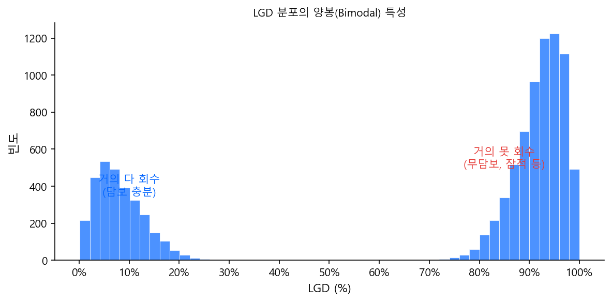

# LGD — Loss Given Default

PD가 "이 사람이 부도날 확률"이라면,
LGD는 **"부도가 났을 때 얼마를 못 받는가"** — 부도 시 손실률입니다.

$$
\text{LGD} = 1 - \text{회수율(Recovery Rate)}
$$

---

## PD와 LGD의 근본적 차이

PD와 LGD는 같은 EL 산식의 구성 요소이지만, **만들어지는 방식과 쓰이는 방식이 완전히 다릅니다.**

| | PD | LGD |
|---|---|---|
| **질문** | 부도가 날까? | 부도 나면 얼마나 잃을까? |
| **대상** | 모든 차주 (부도 전) | **부도가 난 차주만** (부도 후) |
| **결정 요인** | 차주의 신용도 | **담보, 채권 순위, 회수 프로세스** |
| **산출** | 모형 개발 (로지스틱, GBM 등) | 과거 부도 건 회수 실적 집계 |
| **적용** | 차주별 모형 스코어링 | **상품·담보 유형별 테이블 룩업** |
| **개별화** | 차주마다 다른 값 | 같은 상품·담보면 같은 값 |

핵심은 이것입니다:

- PD는 **예측 모형** — 신규 차주가 오면 모형을 돌려서 개별 값을 산출
- LGD는 대부분 **테이블 룩업** — 상품·담보 유형에 따라 미리 정해진 값을 가져다 씀

같은 사람이라도 주택담보대출과 신용대출의 LGD는 완전히 다릅니다.
차주(사람)보다 **거래(deal)**의 특성이 LGD를 지배하기 때문입니다.

---

## 1. 관측 LGD (Workout LGD) — 회수 실적에서 산출

### 회수율과 LGD

10만 명의 차주에게 대출이 나갔고, 이 중 10%(1만 명)가 부도를 냈다고 합시다.
이 1만 건 각각에 대해, 부도 이후 실제로 얼마를 회수했는지를 추적합니다.

$$
\text{회수율} = \frac{\text{순회수액(총회수 − 비용)}}{\text{부도 시점 대출 잔액(EAD)}}
$$

$$
\text{LGD} = 1 - \text{회수율}
$$

분모는 부도 시점에 빌려준 잔액(EAD), 분자는 비용을 제외하고 순수하게 들어온 금액입니다.
이 비율이 **회수율**이고, 그 반대편이 **LGD**입니다.

### 한 건의 예시

```
차주 A — 주택담보대출:
  부도 시점 잔액(EAD):    5,000만 원
  담보 매각:             3,000만 원
  추심 회수:               500만 원
  회수 비용(법률, 경매):   −300만 원
  ───────────────────────────────
  순회수액:              3,200만 원
  회수율:                 64%
  LGD:                   36%
```

### 회수는 한 번에 끝나지 않는다

부도가 발생하면 회수가 수개월~수년에 걸쳐 진행됩니다.

```
부도 시점(t=0):  EAD = 5,000만 원

t = 3개월:   담보 매각 착수
t = 6개월:   담보 매각 완료 → 3,000만 원 회수
t = 12개월:  추심으로 300만 원 추가 회수
t = 18개월:  추심으로 200만 원 추가 회수
t = 24개월:  회수 종결 (최종 상각 처리)
```

시간이 지나서 받은 돈은 현재 가치가 떨어지므로,
실무에서는 회수 현금흐름을 **부도 시점 기준으로 할인**합니다.

$$
\text{Workout LGD} = 1 - \frac{\displaystyle\sum_{t} \frac{R_t}{(1+r)^t}}{\text{EAD}}
$$

- \(R_t\): 시점 \(t\)에서의 회수 금액 (비용 차감 후)
- \(r\): 할인율 (계약금리 또는 실효금리)

할인하면 회수액의 현재가치가 줄어드니 LGD가 올라갑니다.
회수가 오래 걸릴수록 더 올라가고요.

### LGD 분포의 특수성 — 양봉(Bimodal)

PD는 대부분 낮은 값에 몰려 있지만,
LGD는 **"거의 다 회수"와 "거의 못 회수"** 양쪽에 몰리는 양봉 분포가 흔합니다.



담보가 있으면 LGD가 낮고(왼쪽 봉), 없으면 높습니다(오른쪽 봉).
이 양봉 특성 때문에 평균값 하나로 대표하기 어렵고,
LGD 모형화가 PD보다 까다로운 이유이기도 합니다.

---

## 2. LGD 테이블 — 실무에서의 적용

### 테이블 구축

과거 5~7년간의 부도 건 회수 실적을 **상품·담보 유형별**로 집계합니다.

| 상품 유형 | 담보 유형 | 채권 순위 | 관측 LGD (평균) |
|---|---|---|:---:|
| 주택담보대출 | 부동산 | 선순위 | 25% |
| 자동차 할부 | 차량 | 선순위 | 40% |
| 개인 신용대출 | 없음 | 선순위 | 70% |
| 기업대출 | 부동산 | 선순위 | 30% |
| 기업대출 | 없음 | 선순위 | 65% |
| 기업대출 | 없음 | 후순위 | 85% |

PD가 **등급별**로 묶인다면, LGD는 **상품·담보 유형별**로 묶입니다.

### 신규 대출에 적용

```
김철수 — 주택담보대출 신청:
  PD:  모형 돌려서 3등급 → PD = 1.5%
  LGD: 테이블에서 "주택담보 + 선순위" → 25%
  EAD: 대출 잔액 2억
  EL = 1.5% × 25% × 2억 = 75만 원

박영희 — 신용대출 신청:
  PD:  모형 돌려서 5등급 → PD = 4.0%
  LGD: 테이블에서 "무담보 + 선순위" → 70%
  EAD: 대출 잔액 3,000만 원
  EL = 4.0% × 70% × 3,000만 = 84만 원
```

PD는 차주마다 모형을 돌려서 다른 값이 나오지만,
LGD는 같은 상품·담보 유형이면 같은 값을 씁니다.

---

## 3. LGD의 층위 — 목적에 따라 다른 값

PD에 등급별 PD / TtC PD / PiT PD가 있었듯이,
LGD도 목적에 따라 다른 버전이 존재합니다.

### Downturn LGD — Basel이 요구하는 것

PD에서 Basel은 장기 평균(TtC)을 요구했지만,
LGD에서는 **평균이 아니라 경기 악화 시의 LGD**를 요구합니다.

이유는 **PD와 LGD가 동시에 올라가기 때문**입니다.

2008년 금융위기:

- PD 급등 → 부도 건수 폭증
- 동시에 부동산 가격 급락 → 담보 매각해도 회수율 하락
- 부실채권이 시장에 쏟아짐 → NPL 매각가도 하락

부도가 몰리는 시기에 담보 가치도 동시에 떨어지는 것 — PD와 LGD의 **양의 상관관계** —
을 평균 LGD로는 포착할 수 없습니다.

```
평시 (2015~2019):   담보대출 평균 LGD = 25%
불황기 (2008~2009): 담보대출 평균 LGD = 42%  ← Downturn LGD
```

### PiT LGD — IFRS 9가 요구하는 것

PiT PD와 동일한 구조입니다. 현재 경기를 반영합니다.

$$
\text{PiT LGD} \approx \text{기본 LGD} \times g(\text{부동산 가격지수},\; \text{GDP},\; \ldots)
$$

특히 담보대출의 경우 **부동산 가격지수**가 직접적 영향을 줍니다.
부동산이 빠지면 담보 매각 회수액이 줄어드니까요.

### Foundation IRB 규제값

Basel은 자체 LGD 추정이 어려운 은행을 위해 **고정값**을 제공합니다.

| 구분 | 규제 LGD |
|---|:---:|
| 선순위, 무담보 | **45%** |
| 후순위, 무담보 | **75%** |
| 담보 인정 시 | 담보 유형별 차등 |

자체 추정(Advanced IRB)을 하려면 최소 **7년** 이상의 회수 이력 데이터가 필요하며,
기업 포트폴리오에서는 부도 건 자체가 적어 데이터 확보가 매우 어렵습니다.

### 층위 종합

| | 관측 LGD | Downturn LGD | PiT LGD | FIRB 규제값 |
|---|---|---|---|---|
| **기준** | 회수 실적 | 경기 악화 시 | 현재 경기 반영 | 감독당국 고정 |
| **성격** | 사실 기록 | 보수적 (높게) | 시점 변동 | 일률적 |
| **용도** | 모형 개발·검증 | Basel 자기자본 | IFRS 9 충당금 | Basel FIRB |

---

## 4. LGD 모델링 — PD 모형과 무엇이 다른가

### 문제 구조의 차이

PD 모형은 **이진 분류**(부도 0/1)이지만, LGD는 **회귀** 문제입니다.

| | PD 모형 | LGD 모형 |
|---|---|---|
| **대상** | 모든 차주 (10만 명) | 부도난 차주만 (1만 명) |
| **타겟** | 부도 여부 (0 or 1) | 손실률 (0% ~ 100%, 연속값) |
| **문제 유형** | 이진 분류 | 회귀 |
| **분포** | 불균형이지만 단봉 | **양봉** (0% 근처 + 100% 근처) |

### 변수의 차이

**쓰는 변수가 다릅니다.** PD는 사람 변수, LGD는 거래·담보 변수가 지배적입니다.

| | PD 모형 | LGD 모형 |
|---|---|---|
| **차주 정보** | 핵심 (소득, 연체이력, 부채비율) | 보조적 |
| **담보 정보** | 보조적 (담보 유무 정도) | **핵심** (담보 유형, LTV, 감정가) |
| **채권 정보** | 거의 안 씀 | **핵심** (선순위/후순위, 익스포저 규모) |
| **거시경제** | PiT 조정 시 사용 | **중요** (부동산 가격, 경기) |
| **회수 관련** | 해당 없음 | 과거 Cure 이력, 회수 소요 기간 |

### 모델링 접근법

#### 접근 1: 풀 평균 (가장 흔함)

모형을 만들지 않습니다. 상품·담보 유형별로 과거 회수 실적의 평균을 씁니다.

```
세그먼트별 평균 LGD:
  주택담보 + LTV 60% 이하:  15%
  주택담보 + LTV 60~80%:   25%
  주택담보 + LTV 80% 초과:  35%
  신용대출:                  72%
```

단순하고 설명이 쉽습니다. FIRB 은행이나 데이터가 부족한 기관은 이 방식이거나
Basel 규제값(무담보 선순위 45% 등)을 그대로 사용합니다.

#### 접근 2: 2단계 모형 (Two-Stage Model)

양봉 분포를 정면으로 다루는 가장 대표적인 방법입니다.

**1단계 — Cure 모형 (이진 분류)**

부도난 차주 중 일부는 연체를 해소하고 정상으로 돌아옵니다(Cure).
Cure되면 LGD ≈ 0%이므로, 먼저 Cure 여부를 분류합니다.

- 타겟: Cure 여부 (0 or 1) — PD 모형과 동일한 구조
- 방법론: 로지스틱 회귀
- 변수: 연체 금액, 연체 기간, 과거 Cure 이력, 담보 유무 등

**2단계 — Loss 모형 (회귀)**

Non-Cure 건에 대해서만 실제 손실률을 예측합니다.

- 대상: Non-Cure 건만
- 타겟: LGD (0~1 연속값)
- 방법론: Beta 회귀, OLS, 트리 기반 회귀

**최종 결합:**

$$
\text{LGD} = (1 - P(\text{Cure})) \times \text{E}[\text{LGD} \mid \text{Non-Cure}]
$$

Cure 확률이 40%, Non-Cure 시 평균 LGD가 65%라면:

$$
\text{LGD} = 0.6 \times 0.65 = 39\%
$$

#### 접근 3: Beta 회귀

LGD가 0~1 사이 값이므로, 0~1 구간을 자연스럽게 다루는 Beta 분포를 사용합니다.
일반 OLS는 예측값이 0 미만이나 1 초과가 나올 수 있지만,
Beta 회귀는 이 범위를 구조적으로 보장합니다.

#### 접근 4: 트리 기반 회귀

PD에서 GBM Classifier를 쓰듯, LGD에서는 **GBM Regressor**를 씁니다.
분포 가정이 없어 양봉이든 유연하게 다룰 수 있지만,
해석 가능성 문제는 PD 모형과 동일합니다.

### 현실적 채택 현황

| 접근법 | 복잡도 | 실무 채택 | 비고 |
|---|:---:|:---:|---|
| 풀 평균 / 규제값 | 낮음 | **가장 흔함** | FIRB, 데이터 부족 기관 |
| 2단계 모형 | 중간 | AIRB 은행 | Cure + Loss 분리가 직관적 |
| Beta 회귀 | 중간 | 학계·일부 실무 | 0~1 범위 보장 |
| 트리 기반 회귀 | 높음 | 시도 중 | 해석 가능성 이슈 |

PD 모형은 거의 모든 금융기관이 자체 개발하지만,
LGD 모형을 자체 개발하는 곳은 상대적으로 적습니다.
데이터 확보가 어렵고, 풀 평균이나 규제값으로도 규제 요건을 충족할 수 있기 때문입니다.

---

## 5. LGD 모형화가 PD보다 어려운 이유 — 요약

| 문제 | 설명 |
|---|---|
| **데이터 부족** | 부도 건만 대상이므로 PD 모형보다 표본이 훨씬 적음 |
| **양봉 분포** | 0%와 100% 근처에 몰림 → 일반 회귀 모형 적합 어려움 |
| **회수 미완료 (Censoring)** | 아직 회수 진행 중인 건 → 최종 LGD를 아직 모름 |
| **회수 기간** | 담보 매각에 2~3년, 법적 절차까지 5년+ → 데이터 완성에 시간 소요 |
| **경기 의존성** | 같은 담보라도 매각 시점 경기에 따라 회수율이 크게 다름 |

!!! info "Censoring과 생존분석"
    회수 미완료 건(censored observation)을 처리하기 위해
    생존분석(survival analysis)의 아이디어를 차용하는 연구가 있습니다.
    회수 현금흐름을 시간 축으로 모형화하거나,
    정상화(cure) 여부를 먼저 분류한 뒤 손실률을 추정하는
    mixture cure model 등이 대표적입니다.
    다만 실무 적용은 AIRB 승인 대형 은행 위주이며,
    감독당국 검증 부담이 있어 보편적이지는 않습니다.
