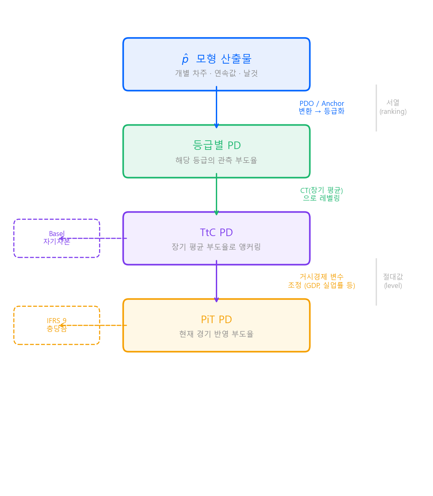
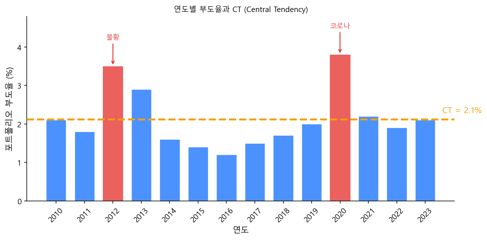
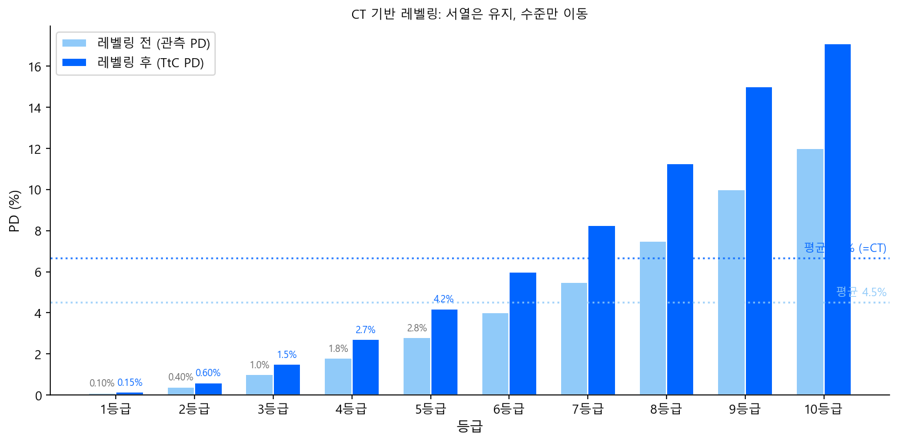

# PD — Probability of Default

"PD"는 여신 프로세스의 거의 모든 단계에서 등장하지만,
**맥락에 따라 가리키는 대상이 다르다.**
이 페이지에서는 "PD"라는 단어가 실무에서 어떤 층위로 쓰이는지 정리한다.

---

## PD의 네 가지 층위

---

## 1. 모형 산출물 p̂

모형이 log-odds 공간에서 학습한 결과를 sigmoid 함수를 통해
\([0, 1]\) 확률 공간으로 변환한 **날것의 확률값**이다.

$$
\hat{p} = \frac{1}{1 + e^{-(\beta_0 + \beta_1 x_1 + \cdots + \beta_k x_k)}}
$$

- 로지스틱 회귀든 GBM이든, 모형이 개별 차주에 대해 뱉는 연속값
- 이 단계에서는 아직 "PD"라고 부르기보다 **p̂(피햇)**이 정확한 표현
- 관심사는 **서열(ranking)** — 누가 더 위험한지 줄을 잘 세우는 것

!!! note "가이드북에서의 위치"
    [스코어카드 Part 2 — Logit 변환](../../scorecard/part2_theory/logit-transform.md)에서
    log-odds → sigmoid → p̂ 변환 과정을 다루고 있다.

---

## 2. 등급별 PD — 관측 부도율

p̂을 실무에서 바로 쓰지는 않는다. 두 단계의 변환을 거친다.

### 평점(Score) 변환

p̂을 PDO(Points to Double the Odds)와 Anchor Score 개념으로
사람이 읽기 편한 **정수 점수**로 변환한다.

$$
\text{Score} = A - B \times \ln(\text{Odds})
$$

여기서 \(A\)는 Anchor Score, \(B = \frac{\text{PDO}}{\ln 2}\) 이다.

!!! note "가이드북에서의 위치"
    [스코어카드 Part 5 — 스코어카드 변환 & 등급화](../../scorecard/part5_scorecard/scorecard-and-rating.md)에서
    PDO 변환과 등급화 과정을 다루고 있다.

### 등급화

평점 분포를 구간으로 나누어 1~10등급(또는 기관별 등급 체계)으로 매핑한다.
Beta 분포 시뮬레이션 등을 활용하여 등급 경계를 설정하며,
각 등급에 속한 차주들의 **관측 부도율**이 곧 **등급별 PD**가 된다.

| 등급 | 평점 구간 | 해당 등급 관측 부도율 |
|:---:|:---:|:---:|
| 1등급 | 850 ~ 1000 | 0.1% |
| 2등급 | 750 ~ 849 | 0.4% |
| 3등급 | 650 ~ 749 | 1.2% |
| ⋮ | ⋮ | ⋮ |
| 10등급 | ~ 299 | 15.0% |

이 "등급별 PD"는 **모형 개발 대상자**(개발 표본)에서 관측한 부도율이거나,
이후 운영 시 **back rating**을 통해 산출한 해당 집단의 부도율이다.

### 한계

등급별 PD는 **관측 시점의 경기 상황이 그대로 묻어 있다.**

- 호황기에 관측하면 PD가 낮게 나옴
- 불황기에 관측하면 PD가 높게 나옴

이 한계를 보정하는 것이 아래의 TtC PD와 PiT PD이다.

---

## 3. TtC PD — Through-the-Cycle PD

### 왜 필요한가

Basel 내부등급법(IRB)은 이렇게 요구한다:

> "경기 한 사이클을 평균낸 **장기 부도율**을 PD로 써라."

규제자본의 목적이 **어떤 경기 국면이든 버틸 수 있는 완충 장치**이기 때문이다.

- 호황기: 실제 부도율 1% → TtC PD는 2.5% → 자본을 넉넉히 쌓아둠
- 불황기: 실제 부도율 5% → TtC PD는 여전히 2.5% → 자본을 급격히 늘리지 않아도 됨

PD가 경기에 따라 출렁이면, 불황에 자본을 더 쌓아야 하고 → 대출을 줄이고 → 경기가 더 나빠지는
**경기순응성(procyclicality)** 문제가 생긴다. TtC PD는 이를 완화한다.

### CT (Central Tendency)

TtC PD의 기준점이 되는 **장기 평균 부도율**을 CT라고 한다.

- **CT**: 경기 순환 주기(Through-the-Cycle) 전체를 아우르는 장기 평균 부도율
- **CT 셋**: CT를 계산하기 위해 구축한 10년 이상의 장기 시계열 데이터셋

!!! info "기업 모형에서 CT가 특히 중요한 이유"
    개인(Retail)과 달리 기업(Corporate) 데이터는 두 가지 특수성이 있다.

    1. **부도가 드물다** (Low Default Portfolio) — 1~2년 치로는 부도율 추정이 어려움
    2. **경기를 많이 탄다** — 업종에 따라 호황 0% ↔ 불황 10% 수준의 변동

    호황기 데이터만으로 모형을 만들면 PD를 과소평가하는 위험이 발생한다.
    리테일은 부도 건수가 충분하여 CT를 명시적으로 세팅하지 않는 경우도 있지만,
    Basel IRB가 TtC를 요구하는 것은 기업·리테일 공통이다.

### 레벨링 (Calibration)

모형 개발은 최근 3~5년 데이터로 하되, **PD 수준은 CT에 맞추는** 과정이다.

> **변별력(Ranking)은 최근 데이터로, 레벨(Level)은 장기 데이터(CT)로.**

로지스틱 회귀의 경우 **상수항(intercept)만 조정**하여 평균 PD가 CT에 맞도록 한다.

$$
\text{조정 전: } \ln\frac{p}{1-p} = \beta_0 + \beta_1 x_1 + \cdots \quad \Rightarrow \quad \text{평균 PD} = 1.4\%
$$

$$
\text{조정 후: } \ln\frac{p}{1-p} = \beta_0' + \beta_1 x_1 + \cdots \quad \Rightarrow \quad \text{평균 PD} = 2.1\% \;(= \text{CT})
$$

변수 계수(\(\beta_1, \beta_2, \ldots\))는 건드리지 않으므로 **서열은 그대로, 수준만 이동**한다.

!!! tip "ML 모형의 레벨링"
    GBM 같은 ML 모형은 로지스틱 회귀처럼 상수항을 조정하는 구조가 아니다.
    대신 실무에서는 **등급 매핑 단계에서 보정**하는 방식이 가장 흔하다.

    - ML 모형의 p̂으로 **서열**을 만들고
    - 등급별 PD를 붙일 때 **CT 기준 테이블**을 사용

    즉 모형 자체는 안 건드리고, 등급별 PD 숫자만 CT로 교체한다.
    모형이 LR이든 GBM이든 **서열만 잘 매기면 되고, 레벨은 등급 테이블에서 잡는다**는
    구조는 동일하다.

레벨링 후 각 등급의 PD가 CT 기준으로 재산출되며, 이것이 **TtC PD**이다.

---

## 4. PiT PD — Point-in-Time PD

### 왜 필요한가

IFRS 9 (2018년~)는 TtC PD와 **반대 방향**의 요구를 한다:

> "지금 경기 상황을 반영한 PD를 써라."

배경은 2008년 금융위기이다.
이전 회계기준(IAS 39)은 **발생 손실(Incurred Loss)** — 부도가 실제로 터져야 충당금을 잡는 구조였다.
결과적으로 손실이 한꺼번에 인식되어 재무제표가 급락했고, 시장 패닉을 가속했다.

IFRS 9는 이를 뒤집어서 **기대신용손실(Expected Credit Loss, ECL)** —
아직 터지지 않았어도 터질 것 같으면 미리 충당금을 잡도록 했다.

TtC PD는 경기 중립적이므로 경기가 나빠져도 PD가 안 움직인다.
하지만 IFRS 9는 "경기가 나빠지면 충당금을 더 쌓아라"를 원하므로, **현재 경기를 반영하는 PiT PD**가 필요하다.

### 산출 방식

TtC PD를 출발점으로, **거시경제 변수를 반영하여 조정**한다.

$$
\text{PiT PD} \approx \text{TtC PD} \times f(\text{GDP 성장률},\; \text{실업률},\; \text{금리},\; \ldots)
$$

| 경기 국면 | 3등급 TtC PD | 조정 계수 | PiT PD | 충당금 |
|---|:---:|:---:|:---:|---|
| 호황기 | 1.5% | × 0.7 | 1.05% | 적게 |
| 평시 | 1.5% | × 1.0 | 1.50% | 보통 |
| 불황기 | 1.5% | × 1.8 | 2.70% | 많이 |

### IFRS 9 Stage 분류

PiT PD가 산출되면, 대출 건별로 Stage를 분류한다.

| Stage | 조건 | 충당금 범위 |
|---|---|---|
| Stage 1 | 최초 인식 후 신용 악화 없음 | 향후 **12개월** ECL |
| Stage 2 | 신용 **유의적 악화** | 전체 만기 **Lifetime ECL** |
| Stage 3 | 부도 발생 (90일+ 연체 등) | Lifetime ECL (개별 평가) |

Stage 1 → 2 전환의 핵심 기준이 **PD 변동**이다:

> "이 차주의 PD가 대출 실행 시점 대비 유의적으로 증가했는가?"

Stage 2로 넘어가면 12개월이 아닌 **전체 만기**에 대한 ECL을 잡아야 하므로
충당금이 크게 뛰며, PiT PD의 민감도가 매우 높은 지점이다.

### ECL 계산

$$
\text{ECL} = \sum_{t} \text{PD}_t \times \text{LGD}_t \times \text{EAD}_t \times \text{DF}_t
$$

- \(\text{PD}_t\): 기간 \(t\)의 PiT PD
- \(\text{LGD}_t\): 기간 \(t\)의 부도 시 손실률
- \(\text{EAD}_t\): 기간 \(t\)의 부도 시 익스포저
- \(\text{DF}_t\): 할인 계수 (미래 손실을 현재가치로 환산)
- Stage 1이면 \(t\) = 12개월까지, Stage 2·3이면 만기까지

---

## 종합 비교

| | 등급별 PD | TtC PD | PiT PD |
|---|---|---|---|
| **기준** | 관측 부도율 (특정 기간) | CT (장기 평균) | TtC + 거시경제 조정 |
| **경기 반영** | 관측 시점에 종속 | 중립 (안정적) | 반영 (출렁임) |
| **용도** | 모형 개발·검증 | Basel 자기자본 | IFRS 9 충당금 |
| **요구하는 곳** | 모형 개발팀 | 감독당국 (Basel) | 회계기준 (IFRS 9) |
| **목적** | 모형 성능 확인 | 경기순응성 완화 | 재무제표의 현실 반영 |

같은 등급 체계(서열)를 기반으로 하되,
**붙이는 PD 숫자가 목적에 따라 달라지는** 구조이다.
