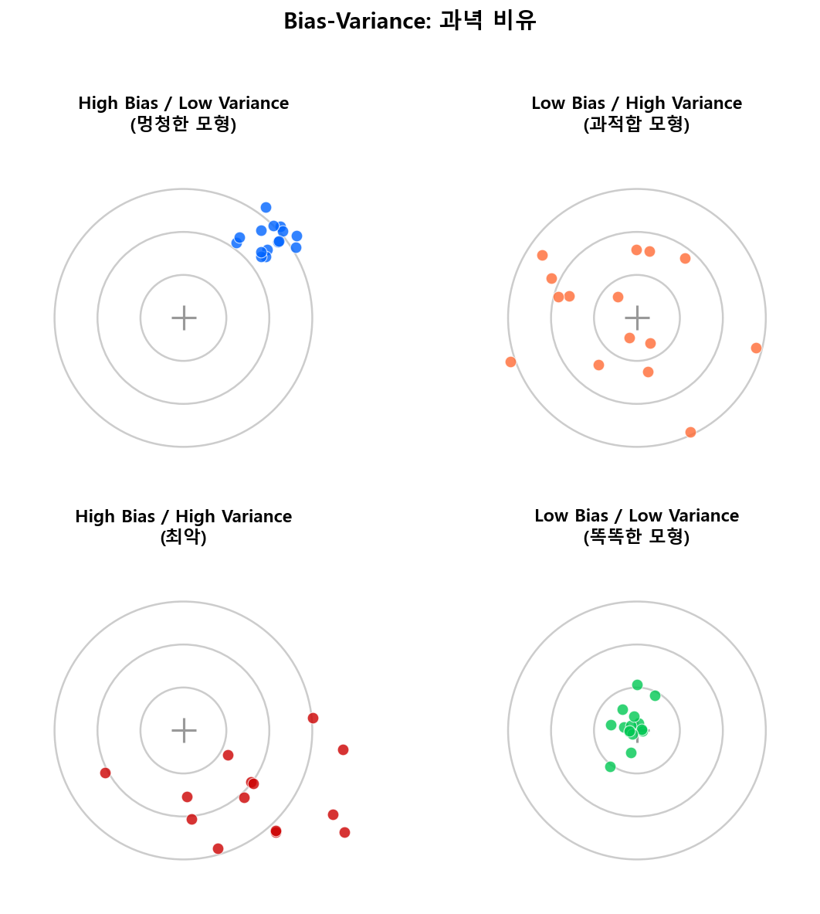
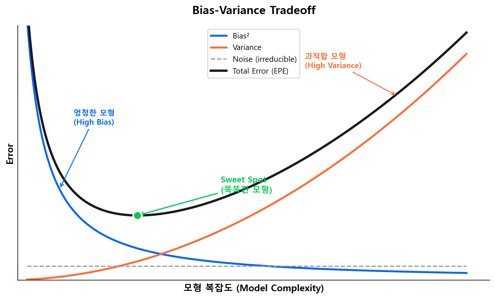

# Bias-Variance Tradeoff

## 2.1 왜 이 개념이 먼저인가

머신러닝의 모든 모형 설계 — 트리 깊이를 몇으로 할지, 앙상블을 몇 라운드 돌릴지, 정규화를 얼마나 줄지 — 는 결국 하나의 질문으로 수렴한다.

> **"이 모형이 학습 데이터에만 잘 맞는 건 아닌가?"**

이 질문에 수학적 프레임을 제공하는 것이 **Bias-Variance Tradeoff**다. 트리 기반 모델로 넘어가기 전에, 이 개념을 먼저 잡아야 이후 모든 하이퍼파라미터 선택에 근거가 생긴다.

## 2.2 예측 오차의 분해

모형 \(\hat{f}(x)\)가 참 함수 \(f(x)\)를 추정할 때, 새로운 데이터에 대한 기대 예측 오차(Expected Prediction Error)는 세 가지 성분으로 분해된다.

$$
\text{EPE}(x) = \underbrace{\text{Bias}^2[\hat{f}(x)]}_{\text{편향}^2} + \underbrace{\text{Var}[\hat{f}(x)]}_{\text{분산}} + \underbrace{\sigma^2_\epsilon}_{\text{노이즈}}
\tag{1}
$$

| 성분 | 의미 | 비유 |
|------|------|------|
| **Bias\(^2\)** | 모형 구조가 현실을 얼마나 **못 담는가** | 과녁의 중심에서 얼마나 벗어났는가 |
| **Variance** | 학습 데이터가 바뀔 때 예측이 얼마나 **흔들리는가** | 같은 사격수가 쏜 탄착군이 얼마나 퍼져 있는가 |
| **Noise** (\(\sigma^2_\epsilon\)) | 데이터 자체에 내재된 **불가피한 오차** | 바람 같은 외부 요인, 모형으로 줄일 수 없음 |

!!! info "핵심 직관"
    Noise는 어떤 모형을 쓰든 줄일 수 없다. 따라서 모형이 통제할 수 있는 것은 오직 **Bias**와 **Variance** 뿐이다 — 그리고 이 둘은 서로 반대 방향으로 움직인다.



---

## 2.3 멍청한 모형과 똑똑한 모형

위 과녁 그림의 4사분면을 보자. **똑똑한 모형은 우하단 딱 하나뿐**이다. 나머지 셋은 멍청한 이유만 다를 뿐, 실전에서 못 쓰는 건 똑같다.

### 멍청한 모형 ① — High Bias, Low Variance

모형이 너무 단순해서 데이터의 패턴을 **제대로 학습하지 못하는** 상태다.

- Tree Ensemble에서 `max_depth=1` (stump) — 한 번의 split으로 뭘 배우겠는가
- Train 성능 자체가 낮음 → Valid/Test도 당연히 낮음
- **Train ≈ Valid ≈ Test, 그런데 셋 다 나쁨**

$$
\text{High Bias} \implies \hat{f}(x) \text{가 } f(x)\text{의 복잡한 패턴을 포착하지 못함}
$$

!!! example "신용평가 예시"
    연체 이력, 부채비율, 소득 수준 등 수십 개 변수가 있는데 depth=1 트리 하나로 Good/Bad를 가르려는 상황. "연체 있다/없다" 한 가지 기준만으로 전체 포트폴리오를 나누는 셈이다. 나머지 변수의 정보는 전부 무시된다.

!!! tip "개선 방향: 복잡도를 올린다"
    - `max_depth` 증가, `n_estimators` 증가, `learning_rate` 하향 + 라운드 증가
    - 변수 추가 또는 피처 엔지니어링으로 정보량 확대
    - 핵심: **모형에게 배울 기회를 더 준다**

### 멍청한 모형 ② — Low Bias, High Variance (과적합)

모형이 학습 데이터의 **노이즈까지 외워버린** 상태다.

- `max_depth=None`, `n_estimators=10000`, 정규화 없음
- Train 성능은 완벽에 가까움 → Valid/Test에서 급격히 떨어짐
- **Train ≫ Valid/Test — 이 갭이 과적합의 신호**

$$
\text{High Variance} \implies \text{학습 데이터가 조금만 바뀌어도 } \hat{f}(x) \text{가 크게 달라짐}
$$

!!! example "신용평가 예시"
    학습 데이터에서 "A지역, 30대, 특정 직군"인 차주 5명이 우연히 전부 Bad였다. 과적합 모형은 이 패턴을 그대로 외워서, 같은 조건의 새로운 차주를 무조건 Bad로 예측한다. 그러나 이건 5명의 우연일 뿐, 모집단의 패턴이 아니다.

!!! tip "개선 방향: 복잡도를 낮추고 제약을 건다"
    - `max_depth` 제한, `min_samples_leaf` 증가, Early Stopping 적용
    - 정규화 강화: `reg_alpha`, `reg_lambda` 증가
    - `subsample`, `colsample_bytree`로 학습 데이터/변수에 랜덤성 부여
    - 핵심: **모형이 외우지 못하게 방해한다**

### 멍청한 모형 ③ — High Bias, High Variance (최악)

과녁 비유에서 좌하단에 해당하는, **가장 피해야 할 상태**다. 중심에서도 벗어나 있고 탄착군도 퍼져 있다.

- 학습도 제대로 못 하면서, 그마저도 불안정
- 이런 모형은 데이터나 모형 구조 자체에 근본적 문제가 있음을 시사

!!! example "신용평가 예시"
    변수 전처리가 잘못되어 결측치가 무작위로 채워진 상태에서, 정규화 없이 깊은 트리를 학습한 경우. 잘못된 입력 데이터 위에 과적합까지 겹쳐, 학습 데이터에서도 패턴을 못 잡고 새 데이터에서는 더 심하게 흔들린다.

!!! tip "개선 방향: 모형 튜닝 전에 데이터를 점검한다"
    - 데이터 품질 재점검: 결측치 처리, 이상치, 레이블 오류
    - 변수 선택 재검토: 노이즈 변수가 과도하게 포함되어 있지 않은지
    - 모형 구조 자체를 재설계 — 하이퍼파라미터 미세 조정으로는 해결되지 않는 경우가 많다
    - 핵심: **데이터가 깨끗해야 모형이 배울 수 있다**

---

### 똑똑한 모형 (Sweet Spot) — Low Bias, Low Variance

과녁 4사분면 중 **유일하게 실전에서 쓸 수 있는** 모형이다.

- Bias가 충분히 낮아 패턴을 잘 포착하고
- Variance가 충분히 낮아 새 데이터에서도 성능이 유지됨
- **Train, Valid, Test 성능이 안정적이면서 동시에 높음**
- 이 지점이 모형 복잡도의 **최적점(Sweet Spot)**

> 모형을 만드는 일의 본질은, 이 Sweet Spot을 찾는 것이다.

!!! warning "4사분면 중 3개가 멍청하다"
    과녁 그림을 다시 보자. 똑똑한 모형은 4사분면 중 **딱 하나**뿐이다. 나머지 셋은 멍청한 이유가 다를 뿐 — "배울 능력이 없어서(①)", "노이즈를 외워서(②)", "둘 다 문제라서(③)" — 실전에서 못 쓰는 건 동일하다. 그리고 각각의 **처방이 다르기 때문에** 진단이 중요하다.

---

## 2.4 모형 복잡도와 Tradeoff

모형 복잡도를 높이면 Bias는 줄고 Variance는 늘어난다. 반대로 복잡도를 낮추면 Variance는 줄고 Bias가 늘어난다. 이 두 극단을 각각 **Underfitting(과소적합)**과 **Overfitting(과적합)**이라 부른다.

!!! note "Underfitting과 Overfitting"
    - **Underfitting (과소적합):** 모형이 너무 단순하여 데이터의 패턴을 충분히 학습하지 못한 상태. "멍청한 모형 ①"에 해당한다.
    - **Overfitting (과적합):** 모형이 너무 복잡하여 학습 데이터의 노이즈까지 외워버린 상태. "멍청한 모형 ②"에 해당한다.
    - 머신러닝에서 가장 많이 쓰이는 두 용어이며, Bias-Variance Tradeoff의 양 극단을 지칭한다.

| | Underfitting (복잡도 낮음) | | Overfitting (복잡도 높음) |
|---|:---:|:---:|:---:|
| **Bias** | 높음 | → | 낮음 |
| **Variance** | 낮음 | → | 높음 |
| **Train Error** | 높음 | → | 낮음 (→ 0에 수렴) |
| **Test Error** | 높음 | ↘↗ | 높음 (U자 곡선) |



왼쪽 영역은 Bias가 지배하고(Underfitting, 멍청한 모형), 오른쪽 영역은 Variance가 지배한다(Overfitting, 과적합 모형). **Total Error의 U자 바닥이 최적 복잡도**이며, 우리가 찾는 "똑똑한 모형"이 여기에 있다.

### 트리 구조로 보는 복잡도의 차이

Decision Tree에서 복잡도는 곧 **트리의 깊이(depth)**와 **리프 노드 수**다. 같은 데이터에 대해 복잡도를 달리 하면 트리 구조가 극적으로 달라진다.

**Underfitting — `max_depth=1` (Stump)**

```
         [연체 여부]
        /          \
   Bad 15%        Bad 8%
   (n=3000)      (n=7000)
```

분기 1회. 변수 1개의 정보만 사용. 나머지 수십 개 변수는 완전히 무시된다. 예측 확률이 **2가지 값**뿐이므로, 동점자가 전체의 100%다.

**Sweet Spot — `max_depth=5`**

```
             [연체 여부]
            /          \
      [부채비율]       [부채비율]
       /     \         /     \
    [업력]  [소득]   [업력]  [소득]
     ...     ...     ...     ...
    (32개 리프 노드 — 다양한 리스크 수준 표현)
```

적절한 깊이. 주요 변수들의 상호작용을 포착하면서도 각 리프에 충분한 샘플이 남아 있어 안정적이다. 예측 확률이 **수십 가지**로 다양해진다.

**Overfitting — `max_depth=None` (제한 없음)**

```
                    [연체 여부]
                   /          \
             [부채비율]       [부채비율]
              /     \         /     \
           ...      ...     ...     ...
          (수백~수천 개 리프, 리프당 1~2건)
```

극단적 깊이. 리프 하나에 고객 1~2명만 남아, 개별 고객의 특이한 패턴(노이즈)까지 학습해버린다. Train에서는 완벽하지만 새 데이터에서 성능이 급락한다.

!!! tip "다음 섹션"
    Bias-Variance 개념을 잡았으니, 다음으로 [정규화(Regularization)](regularization.md)에서 과적합을 막는 가장 수학적인 도구 — Ridge, Lasso, Shrinkage — 의 원리를 다룬다.
