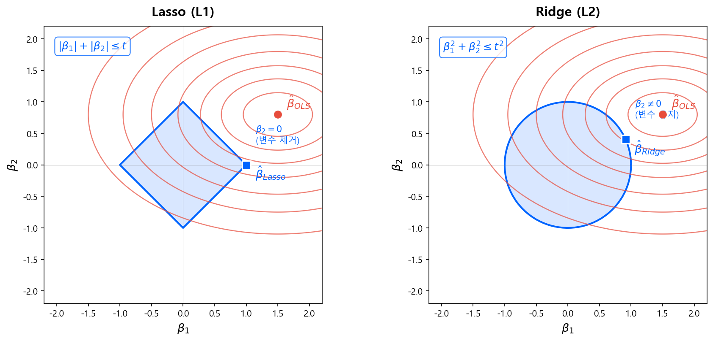
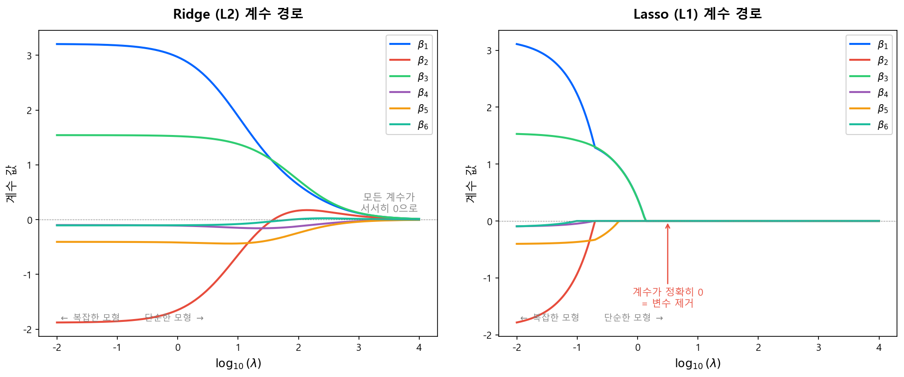

# 정규화 (Regularization)

!!! quote "핵심 질문"
    Bias-Variance Tradeoff에서 과적합(High Variance)이 문제라는 것을 배웠다. 그렇다면 **과적합을 어떻게 막는가?** 가장 고전적이면서도 강력한 답이 **정규화(Regularization)** — 모형의 계수를 0 방향으로 끌어당겨 복잡도를 제한하는 것이다.

    이 개념은 이 가이드북 전반에 걸쳐 반복 등장한다. 뉴럴넷의 **Weight Decay**, XGBoost의 **정규화된 목적함수 \(\Omega(f)\)**, 심지어 전통 스코어카드에서 변수를 줄이는 행위까지 — 모두 정규화의 변주다.

---

## 3.1 왜 정규화가 필요한가

### OLS의 문제: 자유로운 계수

일반 최소제곱법(OLS)이나 정규화 없는 MLE는, 학습 데이터의 손실을 최소화하는 데만 집중한다.

$$
\hat{\boldsymbol{\beta}}_{\text{OLS}} = \arg\min_{\boldsymbol{\beta}} \sum_{i=1}^{N} \left(y_i - \mathbf{x}_i^\top \boldsymbol{\beta}\right)^2
\tag{1}
$$

이때 계수 \(\boldsymbol{\beta}\)에는 **아무런 제약이 없다**. 변수가 많거나 상관이 높으면, 계수가 극단적으로 커지면서 학습 데이터의 노이즈까지 외워버린다 — 전형적인 **과적합**이다.

### 정규화의 아이디어: 계수에 벌칙을 부과한다

$$
\hat{\boldsymbol{\beta}}_{\text{reg}} = \arg\min_{\boldsymbol{\beta}} \underbrace{\sum_{i=1}^{N} L(y_i, \hat{y}_i)}_{\text{손실 함수}} + \underbrace{\lambda \cdot P(\boldsymbol{\beta})}_{\text{페널티}}
\tag{2}
$$

- **손실 함수**: 데이터에 얼마나 잘 맞는가 (적합도)
- **페널티 \(P(\boldsymbol{\beta})\)**: 계수가 커지면 벌칙을 부과 (복잡도 제한)
- **\(\lambda\)**: 두 항의 균형을 조절하는 **정규화 강도** 하이퍼파라미터

\(\lambda = 0\)이면 OLS와 동일하고, \(\lambda \to \infty\)이면 모든 계수가 0으로 수렴한다.

!!! info "Bias-Variance 관점"
    페널티를 부과하면 Bias가 약간 늘어나는 대신 Variance가 크게 줄어든다. 직전 장에서 다룬 Bias-Variance Tradeoff의 **Sweet Spot**을 찾는 가장 수학적인 도구가 바로 정규화다.

---

## 3.2 Ridge 회귀 (L2 정규화)

### 수식

**Ridge 회귀**(Hoerl & Kennard, 1970)는 계수의 **제곱합**에 페널티를 부과한다.

$$
\hat{\boldsymbol{\beta}}_{\text{Ridge}} = \arg\min_{\boldsymbol{\beta}} \sum_{i=1}^{N} \left(y_i - \mathbf{x}_i^\top \boldsymbol{\beta}\right)^2 + \lambda \sum_{j=1}^{p} \beta_j^2
\tag{3}
$$

- \(\sum \beta_j^2 = \|\boldsymbol{\beta}\|_2^2\) — L2 노름의 제곱
- 계수를 **0 방향으로 수축(shrink)**시키되, 정확히 0으로 만들지는 않는다
- **닫힌 형태(closed-form)**의 해가 존재한다:

$$
\hat{\boldsymbol{\beta}}_{\text{Ridge}} = (\mathbf{X}^\top \mathbf{X} + \lambda \mathbf{I})^{-1} \mathbf{X}^\top \mathbf{y}
\tag{4}
$$

\(\lambda \mathbf{I}\)가 대각선에 더해지면서, \(\mathbf{X}^\top \mathbf{X}\)의 조건수(condition number)가 개선된다. 다중공선성 문제에서 특히 효과적인 이유다.

### 특성

| 특성 | 설명 |
|------|------|
| **계수 수축** | 모든 계수를 0 방향으로 줄이되, 0이 되지는 않음 |
| **다중공선성** | 상관 높은 변수들의 계수를 함께 줄여 안정화 |
| **변수 선택** | 하지 않음 — 모든 변수가 모형에 남음 |
| **해석** | 상관 높은 변수군의 영향력을 **균등하게 분산** |

---

## 3.3 Lasso 회귀 (L1 정규화)

### 수식

**Lasso**(Tibshirani, 1996)는 계수의 **절대값 합**에 페널티를 부과한다.

$$
\hat{\boldsymbol{\beta}}_{\text{Lasso}} = \arg\min_{\boldsymbol{\beta}} \sum_{i=1}^{N} \left(y_i - \mathbf{x}_i^\top \boldsymbol{\beta}\right)^2 + \lambda \sum_{j=1}^{p} |\beta_j|
\tag{5}
$$

- \(\sum |\beta_j| = \|\boldsymbol{\beta}\|_1\) — L1 노름
- L1 페널티의 **비미분 가능한 꼭짓점**(절대값 함수의 원점) 때문에, 일부 계수가 **정확히 0**이 된다
- 닫힌 형태의 해가 없으며, 반복적 수치 최적화가 필요하다

### 특성

| 특성 | 설명 |
|------|------|
| **계수 수축** | 0 방향으로 줄이면서, 일부는 **정확히 0**이 됨 |
| **변수 선택** | \(\lambda\)가 커질수록 더 많은 계수가 0이 됨 → **자동 변수 선택** |
| **Sparse Solution** | 최종 모형에 소수의 변수만 남김 |
| **해석** | 중요한 변수만 남기므로 **해석이 쉬움** |

!!! tip "왜 L1은 변수 선택을 하고 L2는 못 하는가?"
    아래 기하학적 해석을 보면 직관적으로 이해된다. L1의 제약 영역은 **다이아몬드(마름모)** 모양이라 꼭짓점이 축 위에 놓여 있고, 등고선이 이 꼭짓점에서 접할 확률이 높다. 꼭짓점에서 접한다는 것은 하나 이상의 계수가 정확히 0이 된다는 뜻이다.

---

## 3.4 기하학적 해석: 왜 L1은 Sparse한가

정규화 문제는 **제약 조건 하의 최적화**로도 해석할 수 있다.

$$
\min_{\boldsymbol{\beta}} \sum_{i=1}^{N} L(y_i, \hat{y}_i) \quad \text{subject to} \quad \|\boldsymbol{\beta}\|_q \leq t
$$

- \(q = 1\)이면 Lasso, \(q = 2\)이면 Ridge
- 정규화 강도 \(\lambda\)는 제약의 크기 \(t\)와 역수 관계

<figure markdown="span">
  
  <figcaption>Ridge(L2)의 제약 영역은 원, Lasso(L1)의 제약 영역은 다이아몬드 형태다. 손실 함수의 등고선이 L1의 꼭짓점에서 접하면 해당 축의 계수가 정확히 0이 된다. Hastie et al. (2009) <em>The Elements of Statistical Learning</em> Figure 3.11에서 영감을 받아 재구성.</figcaption>
</figure>

**왜 다이아몬드의 꼭짓점에서 접하는가?**

2차원에서 생각하면:

- **L2 (원)**: 등고선(타원)이 원의 **어디서든** 접할 수 있다. 축 위에서 접할 특별한 이유가 없으므로 두 계수 모두 0이 아닌 값을 가진다.
- **L1 (다이아몬드)**: 꼭짓점이 축 위에 돌출되어 있다. 등고선이 접하는 지점이 이 꼭짓점일 가능성이 높고, 꼭짓점에서는 한 축의 좌표가 정확히 0이다.

고차원에서는 이 효과가 더 극적이다 — 변수가 많을수록 더 많은 축의 꼭짓점에서 접하게 되어, Lasso가 자동으로 많은 변수를 제거한다.

---

## 3.5 Elastic Net: L1 + L2의 결합

실무에서는 **L1과 L2를 동시에 적용**하는 **Elastic Net**(Zou & Hastie, 2005)이 자주 쓰인다.

$$
P(\boldsymbol{\beta}) = \alpha \sum_{j=1}^{p} |\beta_j| + \frac{(1 - \alpha)}{2} \sum_{j=1}^{p} \beta_j^2
\tag{6}
$$

- \(\alpha = 1\): 순수 Lasso
- \(\alpha = 0\): 순수 Ridge
- \(0 < \alpha < 1\): **변수 선택(L1) + 그룹 수축(L2)**

!!! info "Elastic Net이 필요한 이유"
    Lasso는 상관이 높은 변수 그룹에서 **하나만 선택**하고 나머지를 버린다. 이것이 불안정할 수 있다 — 어떤 변수가 선택될지 데이터에 따라 달라지기 때문이다. Elastic Net은 L2 항 덕분에 상관 높은 변수들을 **함께 선택**하면서도, L1 항으로 불필요한 변수는 제거한다.

---

## 3.6 Shrinkage Path: \(\lambda\)에 따른 계수 변화

\(\lambda\)를 0에서 점점 키우면 각 계수가 어떻게 변하는지를 시각화한 것이 **계수 경로(coefficient path)**다.

<figure markdown="span">
  
  <figcaption>λ가 증가하면 Ridge는 모든 계수를 서서히 0에 수렴시키고, Lasso는 일부 계수를 특정 λ에서 정확히 0으로 만든다. 합성 데이터로 시각화.</figcaption>
</figure>

| | Ridge (L2) | Lasso (L1) |
|---|---|---|
| **\(\lambda \to 0\)** | OLS와 동일 | OLS와 동일 |
| **\(\lambda\) 증가** | 모든 계수가 서서히 감소 | 영향력 작은 계수부터 순차적으로 0이 됨 |
| **\(\lambda \to \infty\)** | 모든 계수 → 0 (수렴) | 모든 계수 = 0 (특정 \(\lambda\)에서 갑자기) |
| **경로 형태** | 부드러운 곡선 | 꺾이는 지점(kink)이 있는 경로 |

---

## 3.7 정규화의 확장: 뉴럴넷과 트리 모형

Ridge/Lasso는 선형 모형에서 시작했지만, 정규화 **개념 자체**는 거의 모든 모형에 적용된다. 이 가이드북에서 다루는 두 가지 확장을 미리 정리한다.

### 뉴럴넷: Weight Decay

뉴럴넷에서 L2 정규화를 적용하면 **Weight Decay**라 부른다. 손실 함수에 가중치의 L2 노름을 추가한다.

$$
L_{\text{reg}} = L_{\text{data}} + \frac{\lambda}{2} \sum_{l} \|\mathbf{W}^{[l]}\|_F^2
\tag{7}
$$

- \(\|\mathbf{W}^{[l]}\|_F^2\): \(l\)번째 층 가중치 행렬의 Frobenius 노름 제곱 (= 모든 원소의 제곱합)
- 경사하강법에서 가중치 업데이트 시 \(\mathbf{W} \leftarrow (1 - \alpha\lambda)\mathbf{W} - \alpha \nabla L\) 형태가 되어, 매 스텝마다 가중치가 **약간씩 감소(decay)**한다

!!! note "뉴럴넷의 다른 정규화 기법들"
    뉴럴넷에서는 L2 외에도 과적합을 막는 다양한 기법이 쓰인다.

    | 기법 | 원리 |
    |------|------|
    | **Dropout** | 학습 시 뉴런을 랜덤하게 비활성화 → 특정 뉴런에 의존 방지 |
    | **Early Stopping** | Validation 성능이 악화되면 학습 중단 |
    | **Batch Normalization** | 층별 입력을 정규화하여 내부 공변량 이동 완화 |
    | **Data Augmentation** | 학습 데이터를 변형하여 다양성 확보 (이미지 분야) |

    이 중 **Early Stopping**은 암묵적으로 L2 정규화와 유사한 효과를 낸다(Goodfellow et al., 2016, Ch.7). 학습 초기에는 모든 가중치가 0 근처에서 출발하므로, 학습을 일찍 멈추면 가중치가 크게 벗어나지 못한다 — Ridge가 계수를 0 방향으로 끌어당기는 것과 동일한 효과다.

### 트리 앙상블: XGBoost의 \(\Omega(f)\)

XGBoost는 트리 모형에 L1/L2 정규화를 적용한 대표적 사례다.

$$
\Omega(f) = \gamma T + \frac{1}{2}\lambda \sum_{j=1}^{T} w_j^2 + \alpha \sum_{j=1}^{T} |w_j|
$$

| 항 | 역할 | 대응 |
|---|---|---|
| \(\gamma T\) | Leaf 수에 페널티 → 트리 구조 단순화 | (트리 고유의 정규화) |
| \(\frac{1}{2}\lambda \sum w_j^2\) | Leaf 예측값의 L2 페널티 → 극단적 예측 억제 | **Ridge와 동일** |
| \(\alpha \sum \|w_j\|\) | Leaf 예측값의 L1 페널티 → 예측값 sparsity | **Lasso와 동일** |

기존 GBM은 `max_depth`나 `learning_rate` 같은 **간접적** 수단으로만 과적합을 제어했다. XGBoost가 목적함수에 정규화를 **내장**한 것은, Ridge/Lasso의 아이디어를 트리 세계로 가져온 것이다.

상세한 내용은 [XGBoost와 LightGBM](../part3_tree_ensemble/xgb_lgbm.md) 장에서 다룬다.

---

## 3.8 신용평가에서의 정규화

전통 스코어카드 개발에서도 정규화의 **사상**은 이미 작동하고 있었다 — 다만 수학적 페널티가 아닌 **사람의 판단**으로 수행했을 뿐이다.

| 전통 스코어카드 | ML 정규화 | 공통 원리 |
|----------------|----------|----------|
| Stepwise로 변수 제거 | Lasso (L1) | 불필요한 변수를 제거하여 모형 단순화 |
| 상관 높은 변수 수동 제거 | Ridge (L2) | 다중공선성 완화 |
| WoE 구간 병합 (Coarse Classing) | (트리의 Pruning) | 과도한 세분화 방지 |
| 변수 수 20개 내외 관행 | \(\lambda\) 튜닝 | 모형 복잡도 제한 |

ML에서는 이 과정을 \(\lambda\) 하나로 **자동화**한다. Cross-Validation으로 최적 \(\lambda\)를 찾으면, 어떤 변수를 남기고 얼마나 수축할지를 데이터가 결정한다.

---

## 참고 자료

- Hastie, Tibshirani & Friedman, *The Elements of Statistical Learning*, 2nd ed., Springer, 2009. — Chapter 3 (Linear Methods for Regression)이 Ridge/Lasso의 수학적 기초를 다룸
- Tibshirani, R., "Regression Shrinkage and Selection via the Lasso", *JRSS-B*, 1996. — Lasso 원논문
- Hoerl & Kennard, "Ridge Regression: Biased Estimation for Nonorthogonal Problems", *Technometrics*, 1970. — Ridge 원논문
- Zou & Hastie, "Regularization and Variable Selection via the Elastic Net", *JRSS-B*, 2005. — Elastic Net 원논문
- Goodfellow, Bengio & Courville, *Deep Learning*, MIT Press, 2016. — Chapter 7 (Regularization for Deep Learning)

!!! tip "다음 섹션"
    정규화의 이론을 잡았으니, 다음으로 [Baseline 워크플로우](baseline_workflow.md)에서 실제 모형 적합의 첫 단계를 다룬다.
