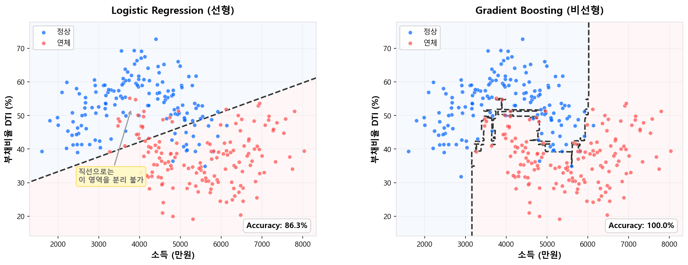

# 왜 ML인가

## 1.1 전통 스코어카드가 잘한 것

머신러닝을 이야기하기 전에, 먼저 전통 스코어카드가 **왜 수십 년간 살아남았는지**를 인정해야 한다.

| 강점 | 설명 |
|------|------|
| **완벽한 해석 가능성** | WoE × β = 점수. 점수표 한 장으로 "왜 이 고객이 이 등급인지" 즉시 설명 가능 |
| **규제 수용성** | 금감원·바젤 프레임워크가 요구하는 투명성·감사 추적을 자연스럽게 충족 |
| **운영 안정성** | 모형 구조가 단순하여 배포·모니터링·재개발이 쉬움 |
| **실무자 이해도** | 현업 심사역이 점수표를 보고 판단 근거를 이해할 수 있음 |

로지스틱 회귀 + WoE 조합은 신용평가의 **기본 문법**이다. 이것이 나쁜 모형이어서 ML로 가는 것이 아니다.

> 전통 스코어카드는 "나쁜 모형"이 아니라, **"더 잘할 수 있는 여지"가 있는 모형**이다.

---

## 1.2 그런데 왜 부족한가

전통 스코어카드의 구조적 한계는 세 가지로 압축된다.

### 한계 ① — 선형 관계만 포착한다

로지스틱 회귀는 log-odds를 입력 변수의 **선형 결합**으로 모형화한다.

$$
\ln\frac{p}{1-p} = \beta_0 + \beta_1 \cdot \text{WoE}_1 + \beta_2 \cdot \text{WoE}_2 + \cdots
$$

WoE 변환이 비선형성을 **간접적으로** 반영하긴 하지만, 그것은 변수 하나 안에서의 이야기다. 변수들이 결합되는 방식은 여전히 선형이므로, 복잡한 비선형 패턴은 구조적으로 포착할 수 없다.

<figure markdown="span">
  { width="100%" }
  <figcaption>같은 데이터에 대해 Logistic Regression은 직선 하나로만 나눌 수 있지만, Gradient Boosting은 비선형 경계를 자동으로 학습한다.</figcaption>
</figure>

!!! example "예시: 부채비율(DTI)의 비선형 효과"
    DTI 30% 이하에서는 연체율 차이가 거의 없다가, 40%를 넘기면 급격히 상승하고, 80% 이상에서는 다시 둔화되는 — **S자 형태**의 패턴이 있다고 하자. WoE 구간화로 이를 **근사**할 수는 있지만, 구간 경계의 선택에 따라 정보 손실이 발생하고, 변수가 수십 개일 때 각각을 최적 구간화하는 것은 현실적으로 어렵다.

### 한계 ② — 변수 간 상호작용을 반영하지 못한다

현실의 신용 리스크는 변수 하나로 결정되지 않는다.

- **소득이 높고** 부채비율이 낮으면 → 안전
- **소득이 높지만** 부채비율도 높으면 → 위험할 수 있음
- **소득이 낮지만** 부채비율도 낮으면 → 보수적이지만 안정적

이런 **교호작용(interaction)**은 두 변수의 조합에서 나오는 패턴인데, 로지스틱 회귀의 선형 결합 구조에서는 각 변수의 효과가 독립적으로 합산될 뿐, 조합에 따른 차별적 효과를 자동으로 학습하지 못한다.

물론 \(\beta_3 \cdot X_1 \cdot X_2\) 같은 교호작용 항을 수동으로 추가할 수는 있다. 그러나 변수가 50개일 때 2차 교호작용만 해도 \(\binom{50}{2} = 1{,}225\)개 — 이것을 사람이 일일이 탐색하고 선별하는 것은 비현실적이다.

### 한계 ③ — 수작업 WoE Classing의 비효율

전통 스코어카드 개발 과정에서 가장 시간이 많이 소요되는 단계가 **Fine Classing → Coarse Classing → WoE 변환**이다.

1. 변수마다 구간을 나누고
2. 단조성(monotonicity)을 검증하고
3. 구간 수를 조정하며
4. IV 기준으로 변수를 선별한다

이 과정을 수십 개 변수에 대해 반복한다. OptBinning 같은 자동화 도구가 있지만, 최종 검토와 조정은 여전히 사람의 판단에 의존한다.

트리 기반 모형은 이 전처리 과정이 **구조적으로 불필요**하다. 트리의 분할(split) 자체가 최적의 구간을 자동으로 찾아주기 때문이다.

---

## 1.3 ML이 가져온 변화

위 세 가지 한계를 트리 기반 ML 모형이 어떻게 해결하는지 대응시켜 보자.

| 전통 스코어카드의 한계 | 트리 앙상블의 해법 |
|----------------------|-------------------|
| 선형 관계만 포착 | 트리의 재귀적 분할로 **임의의 비선형 패턴** 자동 학습 |
| 교호작용 불가 | 트리 깊이 ≥ 2이면 **자동으로 교호작용 포착** |
| 수작업 WoE Classing | 트리 split이 **최적 구간을 자동 탐색** — 전처리 부담 대폭 감소 |

### 비선형 패턴의 자동 학습

트리는 변수의 값을 기준점(threshold)에서 나누는 구조이므로, 계단 함수(piecewise-constant)를 자연스럽게 만든다. 앙상블로 수백 개의 트리를 합치면, 이 계단 함수들이 중첩되어 **사실상 임의의 비선형 곡선**을 근사할 수 있다.

WoE 구간화도 결국 같은 원리(piecewise-constant 변환)이지만, 트리 앙상블은 이것을 **모든 변수에 대해 동시에, 자동으로** 수행한다는 차이가 있다.

### 교호작용의 자동 포착

트리에서 depth ≥ 2이면, 첫 번째 분할의 결과에 따라 두 번째 분할이 달라진다. 이것이 곧 교호작용이다.

```
         [소득 > 5000만?]
          /            \
   [DTI > 40%?]     [DTI > 60%?]
    /       \         /       \
 Bad 8%   Bad 2%   Bad 15%  Bad 5%
```

소득이 높은 그룹에서는 DTI 60%가 기준이고, 낮은 그룹에서는 DTI 40%가 기준이다. 같은 DTI 변수에 대해 **소득 수준에 따라 다른 임계값**이 적용되는 것 — 이것이 사람이 수동으로 만들어야 했던 교호작용을 트리가 자동으로 학습한 결과다.

!!! info "Depth = 1이면 교호작용이 사라진다"
    Depth = 1인 트리(stump)를 사용하면 각 트리가 변수 하나만 사용하므로 교호작용이 구조적으로 불가능하다. 이 특성에 대해서는 [해석 가능한 ML: 1-Depth GBM과 EBM](../part4_evaluation/depth1_gbm.md)에서 다룬다.

### 변수 전처리의 간소화

| 전처리 단계 | 전통 스코어카드 | 트리 앙상블 |
|------------|---------------|------------|
| 결측치 처리 | 별도 구간화 필요 | XGBoost/LightGBM이 자체 처리 |
| 이상치 처리 | 구간 경계 조정 필요 | 트리 split이 자연스럽게 분리 |
| 구간화 (Classing) | 수작업 Fine/Coarse Classing | **불필요** — split이 자동 수행 |
| 단조성 검증 | 수동 확인 필수 | 모형이 자동 학습 (또는 monotone constraint 설정) |
| 변수 선택 | IV 기준 수작업 선별 | Feature Importance / SHAP 기반 자동화 |

---

## 1.4 왜 하필 트리 앙상블인가

ML 알고리즘은 SVM, 신경망, 커널 방법 등 다양하다. 그런데 왜 **신용평가를 포함한 tabular 데이터 영역**에서는 트리 앙상블(특히 Boosting)이 압도적인 선택인가?

이 질문에 대한 학술적 답변은 2022년 이후 일련의 대규모 벤치마크 연구에서 나왔다.

### Grinsztajn et al. (NeurIPS 2022)

> *"Why do tree-based models still outperform deep learning on tabular data?"*

45개 tabular 데이터셋에서 트리 기반 모델과 딥러닝 모델을 체계적으로 비교한 이 논문은, 트리가 우세한 **세 가지 구조적 이유**를 실험적으로 규명했다.

| 이유 | 설명 |
|------|------|
| **Irregular한 타겟 함수** | Tabular 데이터의 타겟 함수는 부드럽게 연결되지 않고, 특정 임계점에서 급격히 변하는 패턴이 흔하다. 트리는 piecewise-constant 경계를 자연스럽게 만들지만, 신경망은 smooth 함수를 선호하는 사전 가정(Inductive Bias)이 있어 이런 불규칙한 패턴에 불리하다 |
| **노이즈 변수에 강건** | 트리의 split은 변별력이 없는 변수를 자연스럽게 무시한다. 반면 신경망은 모든 입력을 가중합하므로, 노이즈 변수에 쉽게 과적합된다 |
| **변수 단위 분할에 유리** | Tabular 데이터의 각 컬럼은 독립적인 비즈니스 의미를 가진다(소득, 연체 횟수, 부채비율 등). 트리는 "소득 > 3000만?" 처럼 **변수 하나의 기준점**으로 분할하므로 이 구조에 딱 맞지만, 신경망은 모든 변수를 섞어서 가중합하기 때문에 개별 변수의 의미를 직접 활용하지 못한다 |

### 후속 연구들의 합의

| 논문 | 핵심 결론 |
|------|----------|
| **Shwartz-Ziv & Armon (2022)** | XGBoost가 대부분의 DL 모델을 이기거나 대등 |
| **Kadra et al. (NeurIPS 2021)** | 13가지 정규화 조합으로 MLP를 최적화해도 GBDT에 *근접*할 뿐 — 튜닝 비용이 비현실적 |
| **McElfresh et al. (NeurIPS 2023)** | 176개 데이터셋 메타분석, GBDT가 평균적으로 여전히 우세 |
| **Borisov et al. (2022)** | "GBDT is the gold standard for tabular data" — IEEE TNNLS |

!!! warning "딥러닝이 나쁘다는 뜻이 아니다"
    이미지, 텍스트, 음성 같은 **비정형 데이터**에서는 딥러닝이 압도적이다. 위 결론은 tabular(정형) 데이터에 한정된 이야기다. Tabular 데이터의 특성 — 이질적 피처 타입, 축 정렬 구조, 상대적으로 작은 데이터 크기 — 이 트리 앙상블에 유리하게 작용하는 것이다.

### 신용평가 데이터는 전형적인 Tabular

신용평가 데이터는 위 논문들이 말하는 "트리에 유리한 조건"을 거의 완벽하게 충족한다.

- **다양한 변수 타입**: 연속형(소득, 부채비율), 범주형(대출 목적, 금융기관 유형), 여부 변수(연체 유무)가 혼재
- **변수 단위 분할에 적합**: 각 컬럼이 독립적 의미를 가져, 트리의 "변수 하나씩 자르기"와 잘 맞음
- **Irregular한 타겟**: 연체율이 특정 임계점(부채비율 40%, 연체 이력 유무 등)에서 급변
- **노이즈 피처 다수**: 수백 개 후보 변수 중 실제 유효한 것은 일부
- **중소규모 데이터**: 수만~수십만 건 (딥러닝의 데이터 효율성이 떨어지는 구간)

---

## 1.5 규제 환경과 현실적 제약

ML의 예측 성능이 아무리 뛰어나도, **규제 기관이 수용하지 않으면** 실전에 투입할 수 없다.

### 금감원의 모형 규제 프레임워크

한국에서 신용평가모형(CSS)은 금융감독원의 **신용조회업 감독규정**과 **모형검증 가이드라인**의 적용을 받는다. 핵심 요건은 다음과 같다:

| 요건 | 내용 | ML 관점에서의 도전 |
|------|------|-------------------|
| **모형 투명성** | 모형의 구조와 작동 원리를 설명할 수 있어야 함 | 수백 개 트리의 합산은 직접 설명이 불가 |
| **거절 사유 제공** | 신용평가 결과에 대해 소비자에게 주요 사유를 제시해야 함 | SHAP 등 사후 해석 도구 필요 |
| **차별 금지** | 성별, 연령 등 민감 변수에 의한 차별적 결과 방지 | Proxy 변수를 통한 간접 차별 모니터링 필요 |
| **모형 검증** | 정기적 성능 모니터링 및 재개발 기준 충족 | PSI/CSI 모니터링은 전통 모형과 동일 |

### 현재의 현실: 하이브리드 접근

이러한 규제 환경 때문에, 국내 CB사 및 금융기관에서는 다음과 같은 **점진적 도입** 전략을 취하고 있다.

**전통 스코어카드가 여전히 주력인 영역:**

- 금감원 검사 대상인 **규제모형** — CB사의 개인신용평점, 금융기관의 내부 심사모형 등
- 소비자 대면 심사 — 거절 사유 설명 의무가 있는 영역

**ML이 활발히 적용되는 영역:**

- **전략모형(Strategy Model)** — 규제모형(CSS/BSS)의 등급과 ML 모형의 스코어를 **Cross Matrix**로 결합하여, 심사·한도·금리 등 의사결정을 오버라이드하는 용도. 규제모형 자체를 대체하지 않으면서 ML의 예측력을 활용하는 가장 현실적인 방법이다
- 사기 탐지(FDS) — 패턴의 복잡성이 높고, 해석보다 탐지 정확도가 우선
- 마케팅 타겟팅 — 규제 요건이 상대적으로 낮음
- 내부 리스크 관리 — 규제모형 외 보조적 의사결정
- 조기경보 시스템 — 연체 전조를 포착하는 모니터링용

!!! example "Cross Matrix 오버라이드 예시"
    규제모형(CSS) 등급과 ML 스코어를 2차원으로 교차시켜, 셀별로 차별화된 의사결정을 적용한다.

    | | ML 상위 (Low Risk) | ML 중위 | ML 하위 (High Risk) |
    |---|:---:|:---:|:---:|
    | **CSS 1~3등급** | 자동 승인 | 자동 승인 | 서류 심사 |
    | **CSS 4~6등급** | 한도 상향 | 기본 한도 | 한도 하향 |
    | **CSS 7~10등급** | 재심사 | 거절 | 거절 |

    CSS만으로는 동일 등급 내 리스크 차이를 구분할 수 없지만, ML 스코어를 교차하면 **같은 등급 안에서도** 승인/거절/한도를 세분화할 수 있다. 규제모형의 프레임은 유지하면서 ML의 변별력을 얹는 구조다.

**전통 + ML 하이브리드:**

- 전통 스코어카드의 변수 선정 단계에서 SHAP/Feature Importance 활용
- 전통 모형을 주 모형, ML을 챌린저 모형(challenger model)으로 병행 운영

!!! tip "흐름은 ML 쪽으로"
    규제가 ML을 막는 것은 아니다 — **해석 가능한 형태**로 도입하라는 것이다. SHAP 등 사후 해석 도구의 발전으로, 규제모형에서도 ML 도입의 문턱은 점차 낮아지고 있다.

---

## 1.6 이 섹션의 로드맵

이 머신러닝 섹션은 전통 스코어카드를 이해한 독자가, 트리 기반 ML 모형을 **이론부터 실전까지** 따라갈 수 있도록 구성했다.

| 파트 | 주제 | 핵심 내용 |
|:---:|------|----------|
| **1. 개요** | [왜 ML인가](why_ml.md) (현재 페이지) | 전통 → ML 전환의 동기와 맥락 |
| | [Bias-Variance Tradeoff](bias_variance.md) | 모형 설계의 근본 원리 |
| | [정규화](regularization.md) | Ridge, Lasso, Shrinkage — 과적합 제어의 수학적 도구 |
| | [Baseline 워크플로우](baseline_workflow.md) | LR·RF로 성능 하한/상한 파악 |
| | [데이터 분리 전략](data_splitting.md) | OOS, 층화추출, CV |
| | [피처 전처리](feature_preprocessing.md) · [피처 선택](feature_selection.md) | WoE 없는 변수 처리, SHAP/Boruta 선택 |
| **2. 뉴럴넷** | [신경망 기초](../part2_neural_net/nn_basics.md) · [LR = 단일 뉴런](../part2_neural_net/lr_as_nn.md) | 퍼셉트론, LR과 NN의 연결 |
| | [TabNet](../part2_neural_net/tabnet.md) | Tabular 특화 신경망 |
| **3. 트리 앙상블** | [CART](../part3_tree_ensemble/tree_models.md) → [RF](../part3_tree_ensemble/ensemble.md) → [Boosting](../part3_tree_ensemble/boosting_fundamentals.md) → [XGBoost/LightGBM](../part3_tree_ensemble/xgb_lgbm.md) | 트리에서 실무 표준 도구까지 |
| **4. 해석과 설명** | [해석 가능성](../part4_evaluation/interpretability.md) | SHAP, PDP, TreeSHAP |
| | [1-Depth GBM과 EBM](../part4_evaluation/depth1_gbm.md) | 전통과 ML의 접점 |
| **5. 모델 검증** | [모델 검증](../part5_validation/validation.md) · [규제 프레임워크](../part5_validation/regulatory.md) | KS/PSI, OOT, 규제 대응 |

!!! tip "다음 섹션"
    이 섹션의 여정은 [Bias-Variance Tradeoff](bias_variance.md)에서 시작한다. "멍청한 모형"과 "똑똑한 모형"의 차이가 무엇인지, 그리고 모형 튜닝의 본질이 무엇인지를 먼저 잡아야 이후 모든 알고리즘이 제자리에 놓인다.
