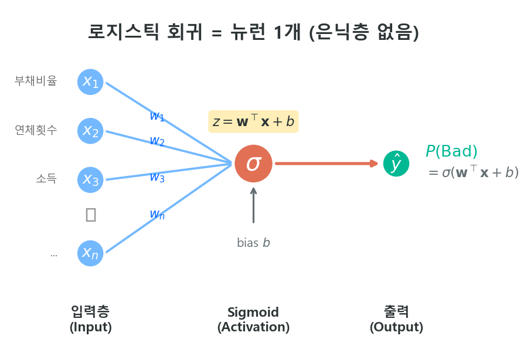

# LR = 단일 뉴런

> 로지스틱 회귀는 가장 단순한 형태의 Fully Connected Neural Network다.

!!! quote "연결의 핵심"
    스코어카드 탭에서 다룬 로지스틱 회귀와, 이 ML 탭에서 다루는 신경망은 **별개의 모형이 아니다**. 로지스틱 회귀는 은닉층이 0개인 신경망이고, 은닉층을 추가하면 MLP가 된다. 전통 스코어카드의 WoE 변환은 사람이 직접 수행하는 "수동 은닉층"으로 볼 수 있다.

---

## 2.1 로지스틱 회귀의 신경망 표현

[앞 장](nn_basics.md)에서 본 퍼셉트론 구조를 떠올려 보자. 입력 \(\mathbf{x}\)에 가중치 \(\mathbf{w}\)를 곱하고 편향 \(b\)를 더한 뒤, 활성함수를 씌우면 출력이 나온다.

$$
\hat{y} = \sigma(\mathbf{w}^\top \mathbf{x} + b) = \frac{1}{1 + e^{-(\mathbf{w}^\top \mathbf{x} + b)}}
\tag{1}
$$

이것이 로지스틱 회귀의 전부다. 신경망 용어로 표현하면:

| 신경망 구성 요소 | 로지스틱 회귀 | 비고 |
|---|---|---|
| 입력층 | \(x_1, x_2, \ldots, x_n\) | 원시 변수 (비닝 없음) |
| 은닉층 | 없음 (0개) | |
| 출력 뉴런 | 1개 | |
| 활성함수 | Sigmoid | |
| 손실함수 | Binary Cross-Entropy | = Negative Log-Likelihood |
| 최적화 | Gradient Descent | = MLE 수치해법 (IRLS 등) |



> *"Logistic regression is a very small neural network."*
> — Andrew Ng, Deep Learning Specialization, Course 1, Week 2[^1]

Andrew Ng 교수는 Coursera 강의에서 신경망을 설명할 때 **로지스틱 회귀부터 시작**한다. 뉴런 1개로 Forward Propagation과 Backward Propagation의 전체 흐름을 보여준 뒤, 은닉층을 하나씩 추가하며 다층 신경망으로 확장한다. 이 접근법이 효과적인 이유는, 로지스틱 회귀를 이미 아는 사람이라면 **신경망의 절반은 이미 알고 있는 셈**이기 때문이다.

---

## 2.2 WoE 변환 = 수동 은닉층

전통 스코어카드와 ML 신경망의 근본적 차이는 **변수를 어떻게 변환하느냐**에 있다.

### 전통 스코어카드의 파이프라인

```
원시 변수 → [Fine Classing] → [Coarse Classing] → [WoE 변환] → LR 적합
```

이 파이프라인에서 Fine Classing → Coarse Classing → WoE 변환은 **사람이 직접 설계한 비선형 변환**이다. 연속형 변수를 구간별로 나누고, 각 구간에 WoE 값을 부여하는 것은 — 신경망 관점에서 보면 — **수동으로 만든 은닉층**과 같은 역할을 한다.

### ML 신경망의 파이프라인

```
원시 변수 → [Normalization] → NN 적합 (은닉층이 자동으로 변환 학습)
```

은닉층의 뉴런들이 데이터로부터 **스스로 최적의 비선형 변환**을 학습한다. 사람이 구간을 나누거나 WoE를 계산할 필요가 없다.

### 대응 관계

| 전통 스코어카드 | MLP (신경망) |
|---|---|
| Fine/Coarse Classing으로 구간 분할 | 은닉층 뉴런이 입력 공간을 자동 분할 |
| WoE로 단조 변환 | 활성함수(ReLU 등)로 비선형 변환 |
| 도메인 전문가가 구간 수·경계 결정 | 학습 알고리즘이 뉴런 수·가중치 결정 |
| 변환 과정이 투명 (해석 가능) | 변환 과정이 불투명 (블랙박스) |
| 단변량 변환 (교호작용 불가) | 다변량 조합 (교호작용 자동 포착) |

!!! tip "핵심 통찰"
    WoE 변환은 **"사람이 경험과 도메인 지식으로 설계한 Feature Engineering"**이다. 신경망의 은닉층은 같은 일을 **데이터로부터 자동으로** 수행한다. 전통 스코어카드가 "수동 뉴럴넷"인 셈이다.

---

## 2.3 그런데 왜 Tabular에서는 트리인가?

로지스틱 회귀가 단일 뉴런이고, 은닉층을 추가하면 MLP가 된다면 — 신용평가에서 MLP를 쓰면 되지 않을까?

이론적으로는 맞지만, 실전에서는 **트리 기반 앙상블(XGBoost, LightGBM)**이 Tabular 데이터에서 일관되게 더 좋은 성능을 보인다. 그 이유는 [1장 개요](../part1_overview/why_ml.md)에서 다뤘고, [3장 트리 앙상블](../part3_tree_ensemble/index.md)에서 본격적으로 다룬다.

여기서는 핵심만 짚는다:

| | MLP | 트리 앙상블 |
|---|---|---|
| **결측치** | 별도 전처리 필수 | 네이티브 처리 |
| **범주형 변수** | One-hot 또는 Entity Embedding 필요 | 네이티브 또는 Target Encoding |
| **교호작용** | 학습 가능하나 데이터 효율 낮음 | Split 구조로 자연스럽게 포착 |
| **샘플 효율** | 대규모 데이터 필요 | 수만~수십만 건으로 충분 |
| **재현성** | GPU 비결정성 이슈 | 시드 고정으로 완벽 재현 |

!!! note "MLP가 유리한 경우"
    Entity Embedding으로 고차원 범주형 변수(예: 업종 코드 수백 개)를 저차원 밀집 벡터로 변환하는 데는 MLP가 유리하다. 또한 TabNet처럼 Tabular 특화 아키텍처는 트리와 경쟁적인 성능을 보이기도 한다 — 이는 [다음 장](tabnet.md)에서 다룬다.

---

## 2.4 정리: 스코어카드에서 딥러닝까지의 스펙트럼

```
 [LR (뉴런 1개)]  →  [MLP (은닉층 추가)]  →  [Deep NN (층 깊게)]
       ↑                    ↑                       ↑
   해석 가능            교호작용 학습            복잡한 패턴
   단순 명쾌            중간 복잡도              블랙박스
   스코어카드용          Tabular 실험용           이미지·텍스트용
```

신용평가 실무에서의 위치:

- **전통 스코어카드**: LR + 수동 WoE 변환 → 규제 환경에서 해석 가능성 확보
- **ML 모형**: 트리 앙상블 (XGBoost/LightGBM) → Tabular 최강. MLP보다 실전적
- **딥러닝**: CNN, RNN, Transformer → 이미지·텍스트·시계열에는 강하나, 정형 데이터에서는 과잉

!!! info "이 가이드북의 흐름"
    스코어카드 탭에서 LR의 수학적 기초를 다졌고, 이 ML 탭에서 그것이 신경망의 특수한 경우임을 확인했다. 다음 단계인 [트리 앙상블](../part3_tree_ensemble/index.md)에서는 Tabular 데이터에서 왜 트리가 신경망보다 실전적인지를 본격적으로 다룬다.

---

## 참고 자료

[^1]: Andrew Ng, *Neural Networks and Deep Learning* (Course 1 of Deep Learning Specialization), Coursera / deeplearning.ai, 2017. [coursera.org/learn/neural-networks-deep-learning](https://www.coursera.org/learn/neural-networks-deep-learning)

- Andrew Ng, *Machine Learning Specialization*, Coursera / Stanford, 2022. — Course 2 "Advanced Learning Algorithms"에서 LR → NN 확장을 단계별로 설명[^2]
- Cheng et al., "Wide & Deep Learning for Recommender Systems", 2016. — LR(Wide)과 NN(Deep)을 결합한 구조로, 두 접근법의 보완 관계를 잘 보여줌

[^2]: [coursera.org/specializations/machine-learning-introduction](https://www.coursera.org/specializations/machine-learning-introduction)

!!! tip "다음 섹션"
    LR과 신경망의 관계를 이해했다면, [TabNet](tabnet.md)에서 Tabular 데이터에 특화된 Attention 기반 신경망 아키텍처를 살펴본다.
