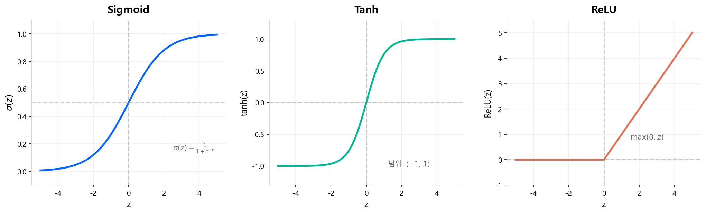
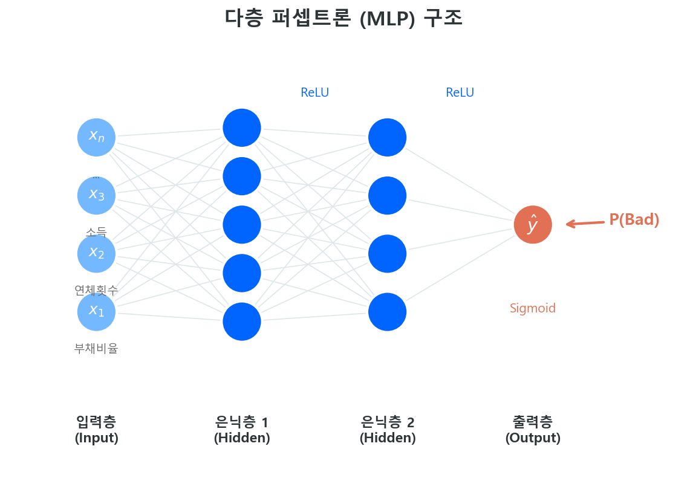

# 신경망 기초

> 퍼셉트론에서 다층 신경망까지 — 딥러닝의 기본 구성 요소를 다룬다.

!!! quote "이 장의 핵심"
    로지스틱 회귀는 **뉴런 1개짜리 신경망**이다. 비닝(Classing)도 WoE 변환도 없이, 원시 변수를 그대로 넣고 Sigmoid를 씌운 것 — 그것이 가장 단순한 형태의 신경망이다. 이 장에서는 그 "뉴런 1개"가 어떻게 작동하는지부터 시작하여, 여러 개를 쌓으면 무엇이 달라지는지까지 다룬다.

---

## 1.1 퍼셉트론 (Perceptron)

### 생물학적 뉴런에서 수학적 모형으로

1943년 McCulloch & Pitts가 제안한 수학적 뉴런 모형이 시작점이다. 생물학적 뉴런이 여러 입력 신호를 받아 역치를 넘으면 발화(fire)하는 것처럼, 수학적 뉴런도 동일한 구조를 따른다.

1. **입력(Input):** 여러 신호 \(x_1, x_2, \ldots, x_n\)을 받는다
2. **가중합(Weighted Sum):** 각 입력에 가중치 \(w_i\)를 곱하고 편향 \(b\)를 더한다
3. **활성함수(Activation):** 가중합을 활성함수에 통과시켜 출력을 결정한다

$$
z = \sum_{i=1}^{n} w_i x_i + b = \mathbf{w}^\top \mathbf{x} + b
\tag{1}
$$

$$
\hat{y} = \sigma(z)
\tag{2}
$$

여기서 \(\sigma\)는 활성함수다. 원래 퍼셉트론(Rosenblatt, 1958)은 계단 함수(step function)를 사용했다 — 역치를 넘으면 1, 아니면 0.

!!! info "퍼셉트론의 한계"
    단일 퍼셉트론은 **선형 분리 가능한(linearly separable)** 문제만 풀 수 있다. Minsky & Papert(1969)가 XOR 문제를 풀 수 없음을 증명하면서 첫 번째 AI 겨울이 찾아왔다. 이 한계를 극복하려면 **다층 구조**와 **비선형 활성함수**가 필요하다.

!!! example "신용평가 비유"
    퍼셉트론 하나는 "부채비율 × 가중치₁ + 연체횟수 × 가중치₂ + 편향 > 0이면 Bad"라는 **직선 하나**로 Good/Bad를 나누는 것과 같다. 현실의 신용 리스크가 직선 하나로 나뉠 리가 없으므로, 단일 퍼셉트론만으로는 부족하다.

!!! tip "로지스틱 회귀 = 뉴런 1개"
    활성함수를 Sigmoid로 놓으면, 퍼셉트론의 수식은 로지스틱 회귀와 완전히 동일하다. 이 연결에 대한 상세한 설명과 다이어그램은 [다음 장: LR = 단일 뉴런](lr_as_nn.md)에서 다룬다.

---

## 1.2 활성함수 (Activation Function)

활성함수는 가중합 \(z\)를 **비선형 변환**하여 신경망이 복잡한 패턴을 학습할 수 있게 만든다. 활성함수가 없으면(또는 항등함수를 쓰면) 아무리 많은 층을 쌓아도 결과는 **단순 선형 변환**에 불과하다.

### 주요 활성함수 비교

| 함수 | 수식 | 범위 | 특징 |
|------|------|------|------|
| **Sigmoid** | \(\sigma(z) = \dfrac{1}{1+e^{-z}}\) | (0, 1) | 확률 해석 가능, 출력층에서 이진분류에 사용 |
| **Tanh** | \(\tanh(z) = \dfrac{e^z - e^{-z}}{e^z + e^{-z}}\) | (−1, 1) | 0 중심, Sigmoid보다 학습이 빠른 경우 있음 |
| **ReLU** | \(\text{ReLU}(z) = \max(0, z)\) | [0, ∞) | 계산 빠름, 현대 딥러닝의 기본 활성함수 |

### Sigmoid — 로지스틱 회귀와의 연결

Sigmoid는 이 가이드북의 [Part 2 이론편](../../scorecard/part2_theory/logit-transform.md)에서 이미 만났다. 로지스틱 회귀의 출력 함수가 바로 Sigmoid다.

$$
\sigma(z) = \frac{1}{1 + e^{-z}}, \quad \sigma'(z) = \sigma(z)(1 - \sigma(z))
\tag{3}
$$

도함수가 자기 자신으로 표현된다는 성질 덕분에, 역전파 시 그래디언트 계산이 깔끔하다.

!!! warning "Vanishing Gradient 문제"
    Sigmoid와 Tanh는 \(|z|\)가 커지면 도함수가 **0에 수렴**한다. 층이 깊어질수록 그래디언트가 소멸하여 앞쪽 층의 가중치가 거의 업데이트되지 않는다. 이것이 **Vanishing Gradient Problem**으로, 딥러닝 발전을 가로막았던 핵심 장애물이다.

### ReLU — 현대 딥러닝의 기본

ReLU(Rectified Linear Unit)는 Vanishing Gradient 문제를 크게 완화한다.

- 양수 영역에서 도함수가 항상 1 → 그래디언트가 소멸하지 않음
- 계산이 단순(`max(0, z)`) → GPU 병렬 처리에 유리
- 2012년 AlexNet 이후 사실상 **표준 활성함수**로 자리잡음

!!! note "Dead Neuron 문제"
    ReLU는 \(z < 0\)이면 출력과 그래디언트가 모두 0이다. 학습 과정에서 특정 뉴런이 영구적으로 비활성화될 수 있는데, 이를 **Dead Neuron**이라 한다. 이를 완화하기 위해 Leaky ReLU(\(\max(0.01z, z)\))나 ELU 같은 변형이 제안되었다.

---

## 1.3 다층 퍼셉트론 (MLP)

단일 퍼셉트론의 한계를 극복하는 방법은 간단하다 — **뉴런을 여러 층으로 쌓는 것**이다.

### 구조

다층 퍼셉트론(Multi-Layer Perceptron)은 세 가지 층으로 구성된다.

| 층 | 역할 | 신용평가 비유 |
|---|------|-------------|
| **입력층 (Input Layer)** | 원시 변수를 받아들임 | 부채비율, 연체횟수, 소득, … |
| **은닉층 (Hidden Layer)** | 비선형 특징을 추출 | 변수 간 상호작용 패턴을 자동으로 학습 |
| **출력층 (Output Layer)** | 최종 예측 출력 | Sigmoid → 부도 확률 P(Bad) |

각 층의 계산은 행렬 연산으로 표현된다.

$$
\mathbf{a}^{[l]} = \sigma\!\left(\mathbf{W}^{[l]} \mathbf{a}^{[l-1]} + \mathbf{b}^{[l]}\right)
\tag{4}
$$

여기서 \(\mathbf{a}^{[0]} = \mathbf{x}\)(입력), \(\mathbf{W}^{[l]}\)은 \(l\)번째 층의 가중치 행렬, \(\mathbf{b}^{[l]}\)은 편향 벡터다.

### 은닉층이 하는 일

은닉층의 각 뉴런은 입력 변수의 **서로 다른 조합**에 반응하도록 학습된다. 전통 스코어카드에서 사람이 직접 수행하던 **변수 변환과 교호작용 탐색**을, 신경망은 데이터로부터 자동으로 학습한다.

!!! tip "전통 스코어카드와의 대비"
    | | 전통 스코어카드 | MLP |
    |---|---|---|
    | **변수 변환** | 사람이 Fine/Coarse Classing → WoE | 은닉층이 자동으로 비선형 변환 학습 |
    | **교호작용** | 원칙적으로 반영 불가 (WoE는 단변량) | 은닉층 뉴런이 변수 간 조합 패턴 포착 |
    | **해석 가능성** | 높음 (WoE, 회귀계수 직접 확인) | 낮음 (가중치 행렬 직접 해석 어려움) |

### Universal Approximation Theorem

은닉층이 하나만 있어도, 뉴런 수가 충분하면 어떤 연속함수든 원하는 정밀도로 근사할 수 있다(Cybenko, 1989; Hornik, 1991). 이것이 **만능 근사 정리(Universal Approximation Theorem)**다.

단, "근사할 수 있다"와 "실제로 학습이 잘 된다"는 별개의 문제다. 실전에서는 은닉층을 깊게 쌓는 것이 넓게 펼치는 것보다 효율적인 경우가 많다 — 이것이 **"Deep" Learning**이라는 이름의 근거다.

---

## 1.4 역전파 (Backpropagation)

### 핵심 질문: 가중치를 어떻게 업데이트하는가?

신경망의 학습은 결국 **손실함수 \(L\)을 최소화하는 가중치 \(\mathbf{W}\)를 찾는 것**이다. 이진분류에서는 Binary Cross-Entropy를 손실함수로 사용한다.

$$
L = -\frac{1}{m}\sum_{i=1}^{m}\left[y^{(i)}\log\hat{y}^{(i)} + (1-y^{(i)})\log(1-\hat{y}^{(i)})\right]
\tag{5}
$$

이 손실함수는 로지스틱 회귀의 **음의 로그 우도(Negative Log-Likelihood)**와 동일하다 — [Part 2 MLE](../../scorecard/part2_theory/mle.md)에서 이미 유도한 바 있다.

### Chain Rule — 그래디언트의 전파

역전파(Backpropagation, Rumelhart et al., 1986)의 핵심은 **미적분학의 연쇄법칙(Chain Rule)**이다.

출력층에서 계산한 손실의 그래디언트를, 체인 룰을 따라 앞쪽 층까지 **역방향으로 전파**한다.

$$
\frac{\partial L}{\partial w^{[l]}} = \frac{\partial L}{\partial a^{[L]}} \cdot \frac{\partial a^{[L]}}{\partial a^{[L-1]}} \cdots \frac{\partial a^{[l+1]}}{\partial a^{[l]}} \cdot \frac{\partial a^{[l]}}{\partial w^{[l]}}
\tag{6}
$$

> **Forward Pass**: 입력 → 은닉층 → 출력 → 손실 계산
>
> **Backward Pass**: 손실 → 출력층 그래디언트 → 은닉층 그래디언트 → 가중치 업데이트

!!! info "Computation Graph로 이해하기"
    Andrew Ng의 Deep Learning Specialization[^1]에서는 역전파를 **Computation Graph(계산 그래프)**로 설명한다. 각 연산(덧셈, 곱셈, 활성함수)을 노드로 표현하고, Forward Pass에서 값을 계산한 뒤 Backward Pass에서 각 노드의 **local gradient**를 곱해가며 전파한다. 복잡한 수식을 외우는 것보다, 계산 그래프를 그려보는 것이 직관적이다.

---

## 1.5 경사하강법 (Gradient Descent)

역전파로 그래디언트를 구했으면, 이제 그 방향으로 가중치를 **조금씩 업데이트**한다. 이것이 경사하강법이다.

$$
\mathbf{W} \leftarrow \mathbf{W} - \alpha \frac{\partial L}{\partial \mathbf{W}}
\tag{7}
$$

\(\alpha\)는 **학습률(Learning Rate)** — 한 번에 얼마나 큰 보폭으로 이동할지를 결정한다.

### 변형들

| 방식 | 배치 크기 | 특징 |
|------|----------|------|
| **Batch GD** | 전체 데이터 | 안정적이지만 느림, 메모리 부담 |
| **Stochastic GD (SGD)** | 1건 | 빠르지만 노이즈가 큼, 수렴 불안정 |
| **Mini-batch GD** | 32~256건 | 실전 표준. 속도와 안정성의 균형 |

### Adam — 실전의 기본 옵티마이저

Adam(Adaptive Moment Estimation, Kingma & Ba, 2015)은 두 가지 아이디어를 결합한다.

1. **Momentum**: 과거 그래디언트의 **이동 평균**을 추적하여 진동을 줄임
2. **RMSProp**: 그래디언트의 **제곱 이동 평균**으로 변수별 학습률을 자동 조절

$$
m_t = \beta_1 m_{t-1} + (1-\beta_1) g_t, \quad v_t = \beta_2 v_{t-1} + (1-\beta_2) g_t^2
$$

$$
\mathbf{W} \leftarrow \mathbf{W} - \alpha \frac{\hat{m}_t}{\sqrt{\hat{v}_t} + \epsilon}
\tag{8}
$$

!!! note "왜 Adam이 기본인가"
    학습률 하나만 잘 설정하면 대부분의 경우 합리적으로 수렴한다. 변수별로 학습률을 자동 조절하므로, SGD처럼 학습률 스케줄링에 민감하지 않다. 딥러닝 실무에서 "일단 Adam으로 시작"이 관행이 된 이유다.

### 과적합 방지: Weight Decay와 정규화

경사하강법으로 손실을 최소화하면 학습 데이터에 과적합될 위험이 있다. 뉴럴넷에서 이를 막는 가장 기본적인 방법이 **Weight Decay** — 손실 함수에 가중치의 L2 페널티를 추가하는 것이다.

$$
L_{\text{reg}} = L_{\text{data}} + \frac{\lambda}{2} \sum_{l} \|\mathbf{W}^{[l]}\|_F^2
$$

이것은 통계학의 **Ridge 회귀(L2 정규화)**와 정확히 동일한 원리다. 계수(가중치)가 커지면 벌칙을 부과하여, 모형이 학습 데이터의 노이즈를 외우는 것을 방지한다.

이 외에도 **Dropout**(뉴런을 랜덤하게 비활성화), **Early Stopping**(Validation 성능 악화 시 학습 중단), **Batch Normalization** 등 다양한 정규화 기법이 뉴럴넷에서 사용된다.

Ridge/Lasso의 수학적 원리와 기하학적 해석은 [정규화 이론](../part1_overview/regularization.md)에서 상세히 다룬다. 이 개념은 이후 XGBoost의 정규화된 목적함수에서도 동일하게 등장한다.

---

## 1.6 로지스틱 회귀 = 뉴런 1개

이 장의 모든 구성 요소를 조합하면, **로지스틱 회귀가 가장 단순한 신경망**임이 자명해진다.

| 신경망 구성 요소 | 로지스틱 회귀에서의 대응 |
|-----------------|----------------------|
| 입력층 | 원시 변수 \(x_1, \ldots, x_n\) (비닝 없음) |
| 은닉층 | **없음** (0개) |
| 출력 뉴런 | 1개 |
| 활성함수 | Sigmoid |
| 손실함수 | Binary Cross-Entropy = Negative Log-Likelihood |
| 최적화 | Gradient Descent (= MLE의 반복 수치해법) |

$$
\hat{y} = \sigma(\mathbf{w}^\top \mathbf{x} + b)
$$

이것은 **은닉층이 0개인 Fully Connected Neural Network**다. 전통 스코어카드에서 WoE 변환 후 로지스틱 회귀를 적합하는 것과 달리, 여기서는 변수를 **있는 그대로** 넣는다. 비닝과 WoE가 수행하던 비선형 변환을, 은닉층을 추가하면 신경망이 **스스로 학습**한다.

!!! quote "Andrew Ng"
    *"Logistic regression is a very small neural network."*

    — Andrew Ng, *Deep Learning Specialization*, Course 1: Neural Networks and Deep Learning, Week 2[^1]

    Ng 교수는 Coursera 강의에서 로지스틱 회귀를 신경망의 출발점으로 삼는다. 뉴런 1개로 시작해 Forward/Backward Propagation을 설명한 뒤, 은닉층을 추가하며 MLP로 확장하는 흐름이다. 신경망을 "로지스틱 회귀의 일반화"로 보는 이 시각이, 이 가이드북에서 스코어카드(LR)와 ML(NN)을 연결하는 다리가 된다.

> 다음 페이지 [LR = 단일 뉴런](lr_as_nn.md)에서 이 관계를 더 깊이 파고든다 — 스코어카드의 WoE 변환이 신경망의 은닉층과 어떻게 대응하는지, 그리고 왜 Tabular 데이터에서는 트리가 더 효과적인지까지.

---

## 실무 회고: TensorFlow 1.x에서 2.0까지

!!! tip "저자 경험"
    2018년경 초기 뉴럴넷 적합 작업은 **TensorFlow 1.x** 환경에서 이루어졌다.
    당시에는 `tf.placeholder`로 입력을 정의하고, 세션(`tf.Session`)을 열어
    가중치 업데이트를 직접 제어하는 — 지금 기준으로 보면 상당한 노가다 — 코드를 작성했다.
    경사하강법(Gradient Descent)도 직접 구현해 보며 동작 원리를 체득했다.

    TensorFlow **2.0** 이후 Keras가 공식 통합되면서 모델 정의와 학습이 크게 간소화되었다.
    Fully Connected Network 형태의 코드 구현은 다 해두었지만,
    실무에서는 **대부분의 Tabular 과제에서 트리 기반 모형(XGBoost, LightGBM)으로 충분**했기 때문에
    뉴럴넷을 본격적으로 투입할 일은 많지 않았다.
    이후 분석실 공용 모듈을 생성할 때 정도가 뉴럴넷을 다시 들여다본 마지막이었다.

### GPU 학습과 재현성(Reproducibility) 이슈

뉴럴넷 학습은 **GPU**를 사용해야 실질적인 속도를 얻을 수 있다.
당시 회사에서 **RTX 2080**을 지원받아 사용했는데, CPU 대비 학습 속도 차이는 압도적이었다.

그러나 GPU 학습에는 심각한 부작용이 있었다 — **재현성(Reproducibility)** 문제다.

!!! warning "GPU 비결정성(Non-determinism)"
    GPU의 부동소수점 연산은 병렬 처리 순서에 따라 미세한 수치 차이가 발생할 수 있다.
    동일한 코드, 동일한 데이터, 동일한 시드를 사용해도 실행할 때마다 **미세하게 다른 모델**이 만들어졌다.

    - `tf.reduce_sum` 등의 reduction 연산에서 병렬 스레드의 합산 순서가 비결정적
    - cuDNN의 convolution/pooling 알고리즘 중 일부가 비결정적
    - 이 미세한 차이가 역전파를 거치며 누적

이것이 왜 문제인가? 신용평가 모형 개발에서는 **모델링 로그**를 남기며 단계별로 결과를 기록한다.
"어제 학습한 모형"과 "오늘 동일 조건으로 재학습한 모형"이 다르면,
변수 교체나 하이퍼파라미터 튜닝의 효과를 정확히 비교할 수 없다.
**재현 불가능한 실험은 신뢰할 수 없는 실험**이다.

이러한 이유로 당시에는 GPU 뉴럴넷 학습을 적극적으로 활용하기 어려웠다.

!!! note "현재는?"
    TensorFlow 2.x와 PyTorch 모두 결정적(deterministic) 모드를 제공한다.

    - **PyTorch**: `torch.use_deterministic_algorithms(True)` + `CUBLAS_WORKSPACE_CONFIG` 환경변수 설정
    - **TensorFlow**: `tf.config.experimental.enable_op_determinism()` (TF 2.9+)

    다만 결정적 모드를 켜면 일부 연산에서 **성능 저하**가 발생할 수 있으며,
    지원되지 않는 연산이 있을 경우 런타임 에러가 발생한다.
    완벽한 해결이라기보다는 **트레이드오프**에 가깝다.

    반면 트리 기반 모형(XGBoost, LightGBM)은 시드만 고정하면 CPU/GPU 모두에서 완벽히 재현되므로,
    이 점도 Tabular 데이터에서 트리 모형이 선호되는 실무적 이유 중 하나다.

---

## 참고 자료

[^1]: Andrew Ng, *Neural Networks and Deep Learning* (Course 1 of Deep Learning Specialization), Coursera / deeplearning.ai, 2017. [coursera.org/learn/neural-networks-deep-learning](https://www.coursera.org/learn/neural-networks-deep-learning). 로지스틱 회귀를 단일 뉴런으로 소개한 뒤, 다층 신경망으로 확장하는 구성이다.

- Andrew Ng, *Machine Learning Specialization*, Coursera / Stanford, 2022.[^2] — 퍼셉트론, 경사하강법, 신경망 기초를 직관적으로 설명하는 입문 강좌
- Ian Goodfellow, Yoshua Bengio, Aaron Courville, *Deep Learning*, MIT Press, 2016. — Chapter 6 (Deep Feedforward Networks)이 MLP의 수학적 기초를 다룸
- Rumelhart, Hinton & Williams, "Learning representations by back-propagating errors", *Nature*, 1986. — 역전파 알고리즘의 원 논문

[^2]: [coursera.org/specializations/machine-learning-introduction](https://www.coursera.org/specializations/machine-learning-introduction)

!!! tip "다음 섹션"
    신경망 기초를 이해했다면, [LR = 단일 뉴런](lr_as_nn.md)에서 로지스틱 회귀가 가장 단순한 형태의 신경망임을 확인하고, 스코어카드의 WoE 변환과 신경망의 은닉층 관계를 살펴본다.
