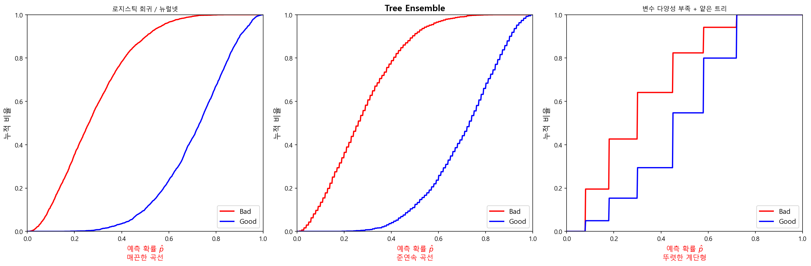

# 트리에서의 Bias-Variance

[Bias-Variance Tradeoff](../part1_overview/bias_variance.md)의 개념은 트리 기반 모델에서 구체적으로 체감된다. 각 하이퍼파라미터가 **트리의 물리적 구조를 어떻게 바꾸는지** 이해하면, Bias-Variance에 미치는 영향이 직관적으로 와닿는다.

---

## 3.1 하이퍼파라미터별 영향

### `max_depth` -- 트리의 깊이 제한

트리가 몇 층까지 분기할 수 있는지를 결정한다.

- **깊이가 깊으면**: 분기가 많아져 세밀한 패턴을 포착 → **Bias ↓**, 하지만 리프 노드당 샘플이 줄어 노이즈에 민감 → **Variance ↑**
- **깊이가 얕으면**: 큰 패턴만 포착, 세부 정보 무시 → **Bias ↑**, 하지만 리프 노드당 샘플이 충분해 안정적 → **Variance ↓**
- [트리 기반 모델](tree_models.md) 1.5절의 트리 구조 예시에서 depth=1(Stump)이 Underfitting, depth=None이 Overfitting이었던 이유가 바로 이것이다

### `n_estimators` -- 앙상블의 트리 개수

Boosting에서 순차적으로 쌓는 트리의 총 수. 라운드가 늘어날수록 이전 트리의 실수를 보정한다.

- **라운드가 많으면**: 잔차를 계속 보정하므로 패턴을 더 잘 포착 → **Bias ↓**, 하지만 학습 데이터의 미세한 노이즈까지 보정하기 시작 → **Variance ↑**
- **라운드가 적으면**: 보정이 부족해 패턴을 다 못 잡음 → **Bias ↑**, 하지만 노이즈 보정까지는 못 가므로 안정적 → **Variance ↓**
- **Early Stopping**이 이 파라미터를 자동으로 제어하는 핵심 기법이다

### `learning_rate` -- 각 트리의 기여 비중

각 트리의 예측값에 곱하는 축소 계수(shrinkage). 0.1이면 각 트리의 보정을 10%만 반영한다.

- **낮으면** (예: 0.01): 한 트리가 조금씩만 기여 → 개별 트리의 과적합이 희석되어 **Variance ↓**, 하지만 같은 성능을 내려면 훨씬 많은 라운드가 필요 → n_estimators와 함께 조정
- **높으면** (예: 0.3): 각 트리가 크게 기여 → 빠르게 학습하지만 노이즈에도 과민 반응 → **Variance ↑**
- 실무에서는 **learning_rate를 낮추고 n_estimators를 늘리는 조합**이 안정적인 성능을 낸다

### `min_samples_leaf` -- 리프 노드의 최소 샘플 수

리프(최종 노드)에 최소 몇 건의 데이터가 남아야 하는지를 제한한다.

- **크면** (예: 100): 리프당 샘플이 충분해 안정적 → **Variance ↓**, 하지만 세밀한 분기를 하지 못함 → **Bias ↑**
- **작으면** (예: 1): 극단적으로 세밀한 분기 허용 → 리프에 1~2건만 남아 개별 고객의 노이즈를 학습 → **Variance ↑**
- 신용평가에서는 "리프 노드에 Bad가 최소 몇 건" 있어야 통계적으로 의미 있는 추정이 가능한지를 고려한다

### `subsample`, `colsample_bytree` -- 랜덤성 주입

각 트리를 학습할 때 전체 데이터/변수의 일부만 사용한다.

- **비율이 낮으면** (예: 0.5): 각 트리가 다른 데이터/변수를 보므로 트리 간 다양성 증가 → **Variance ↓**, 하지만 정보량이 줄어 개별 트리가 약해짐 → **Bias ↑**
- **비율이 높으면** (예: 1.0): 모든 트리가 같은 데이터를 보므로 비슷한 실수를 반복 → **Variance ↑**
- 이것이 Random Forest의 핵심 아이디어이기도 하다 — "다양한 시각을 가진 트리들의 평균이 한 트리보다 낫다"

### `reg_alpha`, `reg_lambda` -- 정규화 (L1/L2)

리프 노드의 가중치(예측값)가 극단적인 값을 갖지 못하도록 페널티를 부과한다.

- **크면**: 극단적 예측을 억제 → 보수적이지만 안정적 → **Variance ↓, Bias ↑**
- **작으면**: 자유로운 예측 허용 → 데이터에 밀착하지만 흔들림 → **Variance ↑**
- L1(`reg_alpha`)은 불필요한 분기를 제거(pruning 효과), L2(`reg_lambda`)는 극단값을 완화

---

## 3.2 요약 테이블

| 하이퍼파라미터 | 트리에 하는 일 | Bias | Variance |
|---------------|-------------|:----:|:--------:|
| `max_depth` ↑ | 더 깊이 분기 허용 | ↓ | **↑** |
| `n_estimators` ↑ | 더 많은 트리로 보정 | ↓ | ↑ (Boosting) |
| `learning_rate` ↓ | 각 트리의 기여를 축소 | ↑ | **↓** |
| `min_samples_leaf` ↑ | 리프에 최소 샘플 보장 | ↑ | **↓** |
| `subsample` ↓ | 각 트리에 다른 데이터 | ↑ | **↓** |
| `reg_alpha`, `reg_lambda` ↑ | 극단적 예측에 페널티 | ↑ | **↓** |

!!! info "Bagging vs Boosting의 전략 차이"
    - **Bagging** (Random Forest): 개별 트리를 깊게 키워 Bias를 낮추고, **평균화**로 Variance를 줄임
    - **Boosting** (GBM, XGBoost): 얕은 트리(weak learner)로 시작해 Variance를 낮게 유지하고, **순차 학습**으로 Bias를 줄여나감

    두 앙상블 전략 모두 Bias-Variance Tradeoff를 다루는 방식이지만, 접근 방향이 정반대다.

---

## 3.3 요약

$$
\boxed{\text{EPE} = \text{Bias}^2 + \text{Variance} + \text{Noise}}
$$

- **멍청한 모형 (1)**: High Bias — 패턴을 못 잡음 → 복잡도를 올려야 함
- **멍청한 모형 (2)**: High Variance — 노이즈를 외움 → 정규화·제약이 필요함
- **멍청한 모형 (3)**: Both Bad — 데이터·구조 자체에 문제 → 데이터 품질부터 재점검
- **똑똑한 모형**: 4사분면 중 유일한 Sweet Spot — Train/Valid/Test 성능이 안정적이고 높음
- 모형 튜닝의 본질은 이 **Tradeoff의 최적점**을 찾는 것

---

## 3.4 KS Plot으로 모형 복잡도 진단

위 요약 테이블의 성능 지표만으로는 놓치기 쉬운 문제가 있다. **예측 확률 분포의 형태**를 보면 모형의 복잡도 부족을 더 직접적으로 체감할 수 있다.

**로지스틱 회귀**는 연속형 \(\hat{p}\) 값을 산출하므로, KS Plot(누적 분포 비교)이나 ROC 곡선이 **매끈한 포물선** 형태를 띤다. 반면 **트리 기반 모형**은 리프 노드의 수가 곧 예측 확률의 종류 수다. 트리의 분기가 적으면 예측 확률이 몇 가지 값에 집중된다.

| 모형 상태 | 예측 확률 분포 | KS/ROC 곡선 형태 |
|----------|-------------|----------------|
| 로지스틱 회귀 / 뉴럴넷 | 연속적 — 고객마다 다른 \(\hat{p}\) | 매끈한 곡선 |
| Tree Ensemble | 준연속적 — 리프 수가 충분히 많아 \(\hat{p}\)가 다양 | 곡선에 가까움 |
| **변수 다양성 부족 + 얕은 트리** | **이산적** — 몇 개의 \(\hat{p}\)에 집중 | **계단형, 꺾이는 지점이 뚜렷** |

!!! warning "depth가 얕다고 반드시 멍청한 것은 아니다"
    `max_depth=2~3` 정도의 얕은 트리라도 **n_estimators가 충분하고 변수 다양성이 확보**되면 좋은 성능을 낼 수 있다. 합산 예측값이 준연속적으로 분포하여 매끈한 KS 곡선이 나온다. 문제는 depth 자체가 아니라 **변수 다양성이 부족할 때**다 — 같은 변수의 같은 지점에서만 반복 분기되면 500그루를 쌓아도 예측 확률은 소수의 값에 몰린다. 이때 KS Plot은 **뚜렷한 계단 형태**를 보이며, 이는 모형이 데이터의 미세한 리스크 차이를 구분하지 못하고 있다는 신호다.

!!! tip "실무 진단법"
    모형 적합 후 KS Plot을 그려보자.

    - **곡선이 매끈하면** → 모형이 충분히 다양한 리스크 수준을 표현하고 있다
    - **계단이 뚜렷하면** → 동점자(tied scores)가 많다는 뜻. `max_depth` 증가, 변수 다양성 확보, 또는 `max_leaves` 조정을 검토
    - 동점자가 전체의 30% 이상이면 **등급화(Rating Grade) 시 분해능이 부족**하여, 특정 등급에 고객이 과도하게 몰리는 문제가 발생한다

!!! tip "다음 섹션"
    Bias-Variance 관점에서 트리의 하이퍼파라미터를 정리했으니, 다음에서는 [Boosting 기초](boosting_fundamentals.md)로 넘어가 AdaBoost에서 Gradient Boosting까지의 핵심 아이디어를 학습한다.
