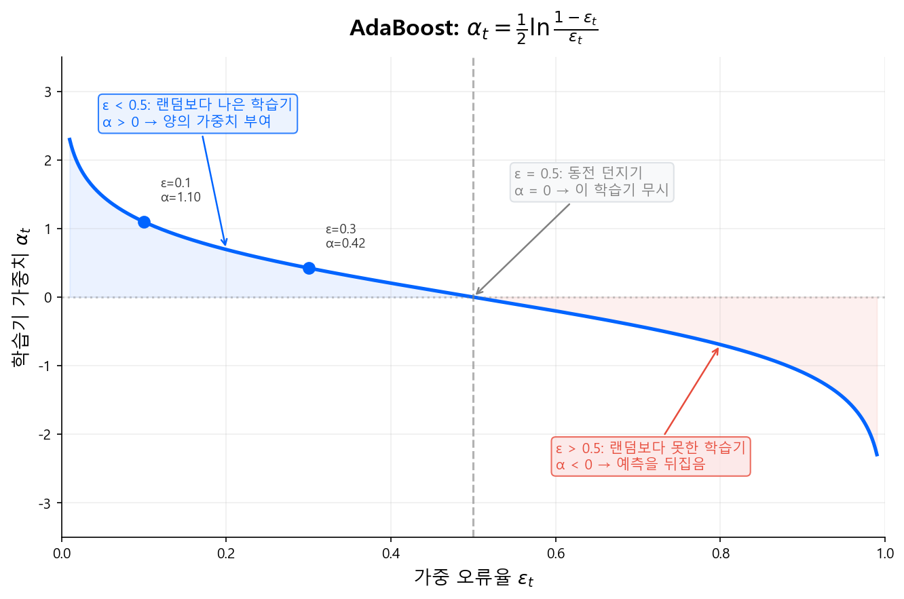
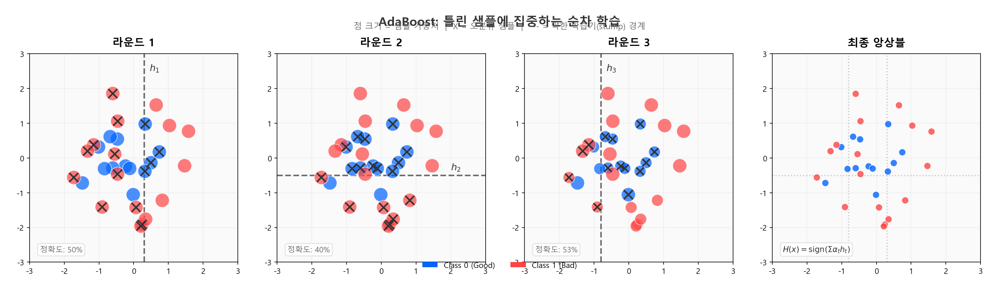
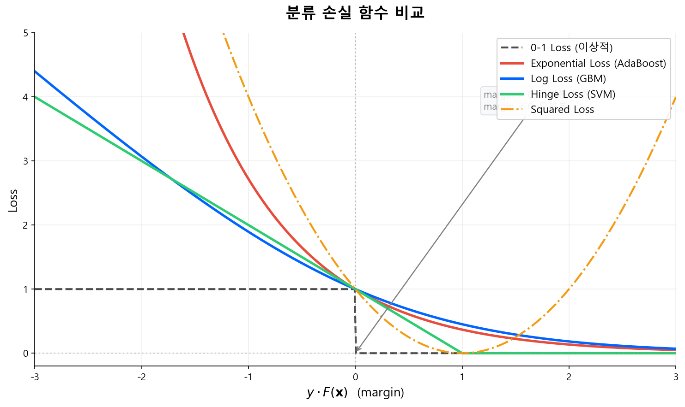
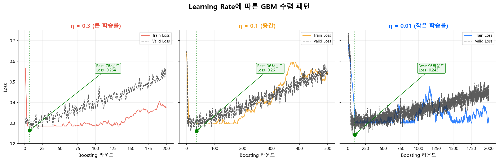
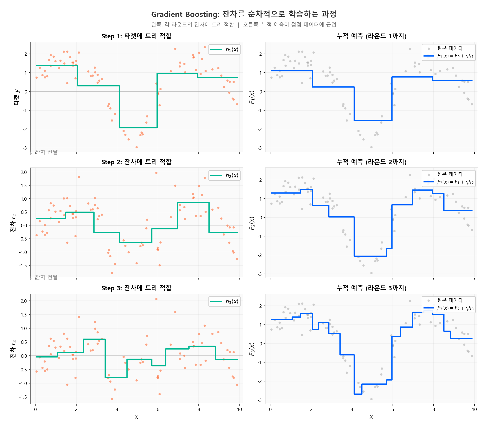

# Boosting 기초

!!! quote "설계 사상"
    Bagging과 Random Forest는 **"다양한 트리들의 평균"**으로 Variance를 잡는 전략이었다. Boosting은 완전히 다른 질문에서 출발한다 — **"아주 약한 학습기(weak learner)를 순서대로 쌓으면, 결국 강한 학습기가 될 수 있을까?"**

    1990년대 초 Kearns & Valiant가 이 질문을 이론적으로 제기했고, Freund & Schapire(1997)의 AdaBoost가 첫 실용적 답을 내놓았다. 핵심은 **"이전 모형이 틀린 샘플에 가중치를 올려서, 다음 모형이 그 실수를 집중적으로 보정한다"**는 것이다.

    Bagging이 "다양한 멍청한 트리의 평균"이라면, Boosting은 **"멍청한 트리를 하나씩 쌓아 점점 똑똑하게 만드는 과정"**이다. 전자는 Variance를 줄이고, 후자는 Bias를 줄인다. 접근 방향이 정반대지만, 둘 다 Bias-Variance Tradeoff를 다루는 방법이다.

---

## 4.1 Boosting의 핵심 아이디어

Bagging이 "여러 트리를 독립적으로 만들어 평균 내는" 전략이었다면, Boosting은 정반대다.

> **이전 모형이 틀린 부분을 다음 모형이 집중적으로 보정한다.**

| | Bagging | Boosting |
|---|---|---|
| 학습 방식 | 병렬 (독립) | **순차적** (직렬) |
| 개별 트리 | 깊은 트리 (강한 학습기) | **얕은 트리** (약한 학습기) |
| Bias-Variance | Variance ↓ | **Bias ↓** |
| 과적합 위험 | 낮음 | 상대적으로 높음 (제어 필요) |

Bagging은 멍청하지 않은 트리들의 평균으로 흔들림을 잡았고, Boosting은 멍청한 트리들을 하나씩 쌓아 점점 똑똑하게 만든다.

---

## 4.2 AdaBoost (Adaptive Boosting)

Freund & Schapire (1997)가 제안한 최초의 실용적 Boosting 알고리즘이다. Gradient Boosting의 직관을 이해하기 위한 출발점이다.

### 핵심 원리: 틀린 샘플에 가중치를 올린다

1. 전체 샘플에 동일한 가중치 \(w_i = \frac{1}{N}\) 부여
2. 약한 학습기(stump 등)를 학습
3. **틀린 샘플의 가중치를 올리고**, 맞힌 샘플의 가중치를 낮춤
4. 다음 학습기는 가중치가 높은(이전에 틀린) 샘플에 집중
5. 이를 \(T\)회 반복

### 수식

\(t\)번째 학습기의 가중 오류율:

$$
\epsilon_t = \frac{\sum_{i: h_t(x_i) \neq y_i} w_i}{\sum_i w_i}
\tag{1}
$$

학습기의 영향력(가중치):

$$
\alpha_t = \frac{1}{2} \ln \frac{1 - \epsilon_t}{\epsilon_t}
\tag{2}
$$

- \(\epsilon_t < 0.5\)이면 \(\alpha_t > 0\) → 랜덤보다 나은 학습기에 양의 가중치
- \(\epsilon_t\)가 작을수록(잘 맞힐수록) \(\alpha_t\)가 커짐

Freund & Schapire (1997), "A Decision-Theoretic Generalization of On-Line Learning and an Application to Boosting" 기반 시각화

샘플 가중치 업데이트:

$$
w_i^{(t+1)} = w_i^{(t)} \cdot \exp\bigl(-\alpha_t \cdot y_i \cdot h_t(x_i)\bigr)
\tag{3}
$$

- 틀린 샘플: \(y_i \cdot h_t(x_i) < 0\) → 가중치 증가
- 맞힌 샘플: \(y_i \cdot h_t(x_i) > 0\) → 가중치 감소

최종 예측:

$$
H(x) = \text{sign}\left(\sum_{t=1}^{T} \alpha_t \cdot h_t(x)\right)
\tag{4}
$$

!!! info "AdaBoost의 직관"
    1라운드에서 "연체 이력"으로 대부분을 맞히지만, 연체 이력 없이 부도난 차주를 틀린다. 2라운드에서는 이 틀린 차주들의 가중치가 올라가므로, "부채비율"이나 "소득 변동" 같은 다른 변수가 이들을 포착하게 된다. 라운드를 거듭할수록 어려운 케이스를 점점 더 잘 잡아낸다.

Geron, A. (2019). "Hands-On Machine Learning with Scikit-Learn, Keras, and TensorFlow" Ch.7 스타일 재구성. 원리: Freund & Schapire (1997), "A Decision-Theoretic Generalization of On-Line Learning and an Application to Boosting."

---

## 4.3 AdaBoost에서 Gradient Boosting으로

AdaBoost는 "틀린 샘플의 가중치를 올린다"는 직관적인 방식이었다. 그런데 이것을 더 일반적으로 표현할 수 있다.

### 관점의 전환: 손실 함수 최적화

AdaBoost는 사실 **Exponential Loss**를 최소화하는 Forward Stagewise Additive Model과 동치임이 밝혀졌다 (Friedman, Hastie, Tibshirani, 2000).

$$
L(y, F(x)) = \exp(-y \cdot F(x))
$$

이 발견이 중요한 이유는, **손실 함수를 바꾸면 다른 문제에도 같은 프레임워크를 적용**할 수 있기 때문이다.

| 손실 함수 | 용도 |
|----------|------|
| Exponential Loss | AdaBoost (분류) |
| Log Loss (Cross-Entropy) | 로지스틱 분류 |
| MSE (Squared Error) | 회귀 |
| MAE (Absolute Error) | 이상치에 강건한 회귀 |

> "어떤 손실 함수든, 그 gradient 방향으로 모형을 업데이트하면 된다" — 이것이 **Gradient Boosting**의 아이디어다.

Hastie, Tibshirani & Friedman (2009). "The Elements of Statistical Learning" Figure 10.4 스타일 재구성

Exponential Loss는 margin이 음수일 때 **기하급수적으로** 증가한다. 이는 AdaBoost가 이상치(outlier)에 민감한 이유다. Log Loss는 선형적으로 증가하여 이상치에 더 강건하며, 이것이 실무에서 GBM(Log Loss)이 AdaBoost(Exp Loss)를 대체한 핵심 이유이기도 하다.

---

## 4.4 Gradient Boosting Machine (GBM)

Friedman (2001)이 제안한 Gradient Boosting은 Boosting을 **함수 공간에서의 Gradient Descent**로 일반화한 것이다.

### 핵심 아이디어

일반적인 Gradient Descent는 파라미터 공간에서 손실을 줄인다:

$$
\theta_{t+1} = \theta_t - \eta \cdot \nabla_\theta L
$$

Gradient Boosting은 **함수 공간**에서 손실을 줄인다:

$$
F_{t+1}(x) = F_t(x) + \eta \cdot h_t(x)
$$

여기서 \(h_t(x)\)는 \(t\)번째 트리로, **현재 모형의 잔차(negative gradient)**를 학습한다.

### 알고리즘 (Regression 기준)

**초기화:**

$$
F_0(x) = \arg\min_c \sum_{i=1}^{N} L(y_i, c) = \bar{y}
\tag{5}
$$

**\(t = 1, 2, \ldots, T\) 반복:**

**Step 1.** 현재 모형의 **Negative Gradient (의사 잔차)** 계산:

$$
r_{it} = -\left[\frac{\partial L(y_i, F(x_i))}{\partial F(x_i)}\right]_{F=F_{t-1}}
\tag{6}
$$

MSE 손실의 경우, 이것은 단순 잔차 \(r_{it} = y_i - F_{t-1}(x_i)\)가 된다.

**Step 2.** \(r_{it}\)를 타겟으로 Regression Tree \(h_t(x)\)를 적합

**Step 3.** 모형 업데이트:

$$
F_t(x) = F_{t-1}(x) + \eta \cdot h_t(x)
\tag{7}
$$

- \(\eta\): Learning Rate (0 < \(\eta\) ≤ 1)

### Learning Rate의 역할

$$
F_T(x) = F_0(x) + \eta \sum_{t=1}^{T} h_t(x)
\tag{8}
$$

- \(\eta\)가 작으면: 한 번에 조금씩 보정 → 더 많은 라운드 필요하지만 **과적합에 강함**
- \(\eta\)가 크면: 한 번에 크게 보정 → 빠르지만 **과적합 위험**
- 실무 범위: \(\eta = 0.001 \sim 0.1\), \(T = 500 \sim 10{,}000\) (XGBoost 기본값은 0.3)
- 저자 선호: \(\eta = 10^{-4} \sim 10^{-3}\)으로 극도로 작게 설정하고, 트리를 더 많이 생성하는 방식을 선호한다. 각 트리의 기여를 최소화하면 과적합에 훨씬 강건해진다.

!!! tip "Learning Rate와 n_estimators의 트레이드오프"
    \(\eta\)를 줄이면 \(T\)를 늘려야 동일 성능에 도달한다. 일반적으로 **\(\eta\)를 작게, \(T\)를 크게** 설정하는 것이 성능이 좋다. 대신 학습 시간이 길어진다. 이것이 "Graduate Student Descent" — 사람이 노가다로 최적점을 찾는 — 영역이기도 하다.

시뮬레이션 기반 개념도. η가 작을수록 과적합 시점이 늦춰지고, 최종 성능이 향상되는 패턴을 보여준다.

Geron, A. (2019). "Hands-On Machine Learning" Ch.7 스타일 재구성. 원리: Friedman, J. H. (2001). "Greedy Function Approximation: A Gradient Boosting Machine." Annals of Statistics, 29(5), 1189-1232.

---

## 4.5 분류 문제에서의 Gradient Boosting

신용평가는 **분류 문제**다. Regression GBM의 프레임워크에서 손실 함수만 바꾸면 된다.

### Log Loss (Binary Cross-Entropy)

$$
L(y, F(x)) = -\left[y \cdot \log p + (1-y) \cdot \log(1-p)\right]
\tag{9}
$$

여기서 \(p = \sigma(F(x)) = \frac{1}{1+e^{-F(x)}}\) (시그모이드 함수)

Negative Gradient:

$$
r_{it} = y_i - p_i = y_i - \sigma(F_{t-1}(x_i))
\tag{10}
$$

이것은 **"실제 라벨 - 현재 예측 확률"**이다. 직관적으로:

- Bad(\(y=1\))인데 \(p=0.2\)로 예측 → \(r = 0.8\) (큰 양수) → "Bad 방향으로 더 밀어라"
- Good(\(y=0\))인데 \(p=0.8\)로 예측 → \(r = -0.8\) (큰 음수) → "Good 방향으로 더 밀어라"

다음 트리는 이 잔차를 타겟으로 학습하여, 현재 모형이 틀리고 있는 방향을 보정한다.

!!! info "로지스틱 회귀와의 연결"
    Part 2에서 다룬 로지스틱 회귀도 Log Loss를 최소화한다. 차이는 **가설 공간**이다. 로지스틱 회귀는 \(F(x) = \beta_0 + \beta^\top x\) (선형)으로 제한하지만, GBM은 \(F(x) = \sum h_t(x)\) (트리의 합)으로 비선형 패턴까지 포착한다.

!!! tip "다음 섹션"
    Gradient Boosting의 기초를 이해했으니, 다음에서는 [Boosting 심화](boosting_advanced.md)에서 GBM의 Bias-Variance 관점과 트리 깊이가 교호작용에 미치는 영향을 학습한다.
