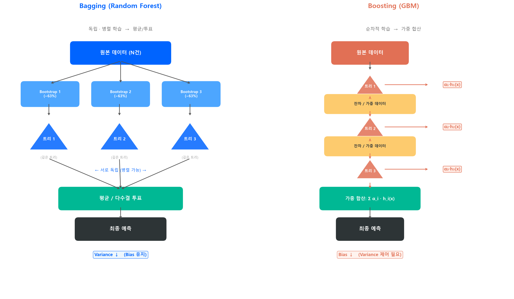
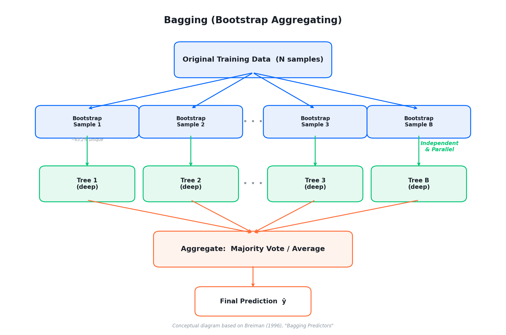
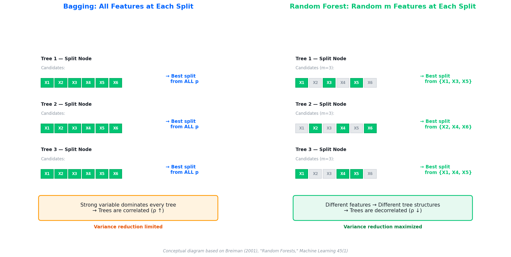
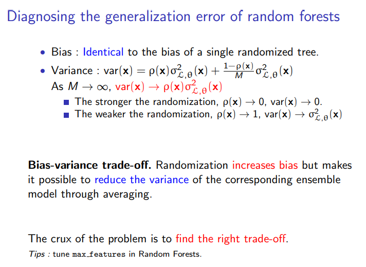

# 앙상블 -- Bagging과 Random Forest

!!! quote "설계 사상"
    단일 트리는 비선형 패턴을 잘 잡지만, 학습 데이터가 조금만 바뀌면 트리 구조가 완전히 달라진다 — **High Variance** 문제다. Bagging(Breiman, 1996)은 이 약점에 대한 첫 번째 답이었다. "불안정한 트리를 여러 개 만들어 평균 내면, 개별 트리의 흔들림이 상쇄되지 않을까?"

    그런데 같은 데이터에서 Bootstrap하면 강한 변수가 매번 Root에 올라와서, 트리들이 서로 비슷해진다. 상관관계가 높은 트리들의 평균은 **분산이 잘 줄지 않는다**. Random Forest(Breiman, 2001)는 이 문제를 정면으로 해결했다 — 각 분기마다 변수를 **랜덤하게 일부만** 후보로 올려서, 트리마다 다른 시각을 갖도록 강제한다. 개별 트리는 최적이 아닐 수 있지만, 앙상블 전체는 더 다양해지고 더 강해진다.

    핵심 통찰은 이것이다: **"너무 똑똑한 트리 하나보다, 적당히 멍청하지만 서로 다른 트리 수백 개의 평균이 낫다."**

---

## 2.1 앙상블의 핵심 아이디어

단일 트리는 **불안정(High Variance)**하다. 학습 데이터가 조금만 바뀌면 트리 구조가 완전히 달라진다. 그렇다면 역으로 생각해보자 — **불안정한 트리를 여러 개 만들어서 평균 내면?**

이것이 앙상블의 핵심이다. 개별 모형은 멍청해도, 다수의 의견을 모으면 똑똑해진다.

!!! info "Wisdom of Crowds (대중의 지혜)"
    1906년 Francis Galton이 소의 무게 맞추기 대회를 관찰했다. 개별 참가자의 추정은 편차가 컸지만, 787명의 추정값 중앙값은 실제 무게와 거의 정확히 일치했다. 앙상블은 이 원리를 모형에 적용한 것이다.

앙상블의 두 가지 큰 줄기:

| | **Bagging** | **Boosting** |
|---|---|---|
| **전략** | 독립적으로 여러 모형을 만들어 **평균/투표** | 순차적으로 모형을 쌓아 **이전 오차를 보정** |
| **Bias-Variance** | Variance ↓ (Bias 유지) | Bias ↓ (Variance 약간 ↑) |
| **대표 알고리즘** | Random Forest | AdaBoost, GBM, XGBoost, LightGBM |
| **개별 트리** | 깊은 트리 (Low Bias, High Variance) | 얕은 트리 (High Bias, Low Variance) |

이번 장에서는 **Bagging과 Random Forest**를 다룬다. Boosting은 다음 장에서 별도로 다룬다.

Hastie, Tibshirani & Friedman, "The Elements of Statistical Learning" (2009), Ch. 8 & 10 기반 개념도

---

## 2.2 Bagging (Bootstrap Aggregating)

Leo Breiman이 1996년에 제안한 기법으로, 이름 그대로 **Bootstrap으로 여러 데이터셋을 만들고(Bootstrap), 각각에 모형을 학습한 뒤 합친다(Aggregating)**.

### Bootstrap Sampling

원본 데이터 \(N\)건에서 **복원 추출(with replacement)**로 \(N\)건을 뽑는다. 같은 샘플이 여러 번 뽑힐 수도 있고, 한 번도 안 뽑히는 샘플도 있다.

$$
P(\text{특정 샘플이 한 번도 안 뽑힐 확률}) = \left(1 - \frac{1}{N}\right)^N \approx e^{-1} \approx 0.368
\tag{1}
$$

즉, 각 Bootstrap 샘플에는 원본의 약 **63.2%** 데이터만 포함되고, 나머지 **36.8%**는 빠진다. 이 빠진 데이터를 **OOB (Out-of-Bag)** 샘플이라 부른다.

### Bagging 절차

1. 원본 데이터에서 Bootstrap 샘플 \(B\)개를 생성
2. 각 Bootstrap 샘플로 독립적인 트리를 학습 (제약 없이 깊게)
3. 예측 시 \(B\)개 트리의 결과를 집계:
    - **분류**: 다수결 투표 (Majority Voting)
    - **회귀**: 평균 (Average)

$$
\hat{f}_{\text{bag}}(x) = \frac{1}{B}\sum_{b=1}^{B} \hat{f}_b(x)
\tag{2}
$$

Breiman (1996), "Bagging Predictors," Machine Learning 24(2) 기반 개념도

### 왜 Variance가 줄어드는가

독립인 확률변수 \(B\)개의 평균에 대한 분산은:

$$
\text{Var}\left(\frac{1}{B}\sum_{b=1}^{B} X_b\right) = \frac{\sigma^2}{B}
\tag{3}
$$

트리 \(B\)개가 완전히 독립이라면, 분산이 \(\frac{1}{B}\)로 줄어든다. 실제로는 같은 데이터에서 Bootstrap한 것이므로 트리 간 상관관계가 있어 이만큼 극적으로 줄지는 않지만, 그래도 **단일 트리 대비 Variance가 크게 감소**한다.

### 왜 Bias는 변하지 않는가

Bias는 **기댓값과 참값의 차이**이다. Bagging 예측의 기댓값을 구해보면:

$$
\text{Bias}\!\left[\hat{f}_{\text{bag}}(x)\right]
= \mathbb{E}\!\left[\hat{f}_{\text{bag}}(x)\right] - f(x)
= \mathbb{E}\!\left[\frac{1}{B}\sum_{b=1}^{B}\hat{f}_b(x)\right] - f(x)
\tag{4}
$$

기댓값의 선형성에 의해 합과 기댓값의 순서를 바꿀 수 있다:

$$
= \frac{1}{B}\sum_{b=1}^{B}\mathbb{E}\!\left[\hat{f}_b(x)\right] - f(x)
$$

각 트리 \(\hat{f}_b\)는 동일한 Bootstrap 과정으로 만들어지므로 **같은 기댓값**을 가진다. 즉 \(\mathbb{E}[\hat{f}_b(x)] = \mathbb{E}[\hat{f}_1(x)]\) 이므로:

$$
= \frac{1}{B} \cdot B \cdot \mathbb{E}\!\left[\hat{f}_1(x)\right] - f(x)
= \mathbb{E}\!\left[\hat{f}_1(x)\right] - f(x)
= \text{Bias}\!\left[\hat{f}_1(x)\right]
$$

**평균화는 개별 트리의 Bias를 그대로 물려받는다.** 줄어드는 것은 오직 Variance뿐이다.

!!! tip "Bagging의 전략"
    그래서 Bagging에서는 개별 트리를 **깊게 키워(Low Bias)** Variance가 높은 상태를 만들고, 평균화로 Variance를 잡는 전략을 쓴다.

### OOB (Out-of-Bag) Error

각 트리에서 사용하지 않은 ~36.8%의 OOB 샘플로 해당 트리의 성능을 평가할 수 있다. 전체 OOB 예측을 모으면 **별도의 Validation Set 없이** 모형의 일반화 성능을 추정할 수 있다.

$$
\text{OOB Error} \approx \text{Cross-Validation Error}
$$

!!! info "OOB의 실무적 가치"
    데이터가 부족하여 별도 Validation Set을 떼어놓기 어려울 때, OOB Error는 매우 유용한 대안이다. 추가 비용 없이 CV와 유사한 성능 추정치를 얻는다.

---

## 2.3 Random Forest

Random Forest는 Bagging에 **변수 랜덤 선택**을 추가한 것이다. Breiman이 2001년에 제안했다.

### Bagging의 한계: 트리 간 상관관계

Bagging의 분산 감소 효과는 트리들이 **독립**일 때 최대다. 그런데 같은 원본 데이터에서 Bootstrap한 것이므로, 강한 변수가 있으면 모든 트리가 그 변수를 Root에서 사용한다. 결과적으로 \(B\)개의 트리가 서로 비슷해지고(높은 상관관계), 분산 감소 효과가 반감된다.

실제 상관 있는 확률변수의 평균 분산은:

$$
\text{Var}\left(\frac{1}{B}\sum_{b=1}^{B} X_b\right) = \rho\sigma^2 + \frac{1-\rho}{B}\sigma^2
\tag{5}
$$

- \(\rho\): 트리 간 평균 상관계수
- \(B \to \infty\)여도 \(\rho\sigma^2\) 만큼은 줄일 수 없다

**\(\rho\)를 줄이는 것이 핵심**이다.

### 변수 랜덤 선택 (Feature Subsampling)

Random Forest는 각 노드의 분할 시, 전체 \(p\)개 변수 중 **\(m\)개만 랜덤으로 선택**하여 최적 분할을 찾는다.

| 문제 유형 | 권장 \(m\) |
|---------|---------|
| **분류** | \(m = \lfloor\sqrt{p}\rfloor\) |
| **회귀** | \(m = \lfloor p/3 \rfloor\) |

강한 변수가 있어도, 해당 변수가 후보에서 빠지는 분할이 생기므로 다른 변수가 활용될 기회가 만들어진다. 이를 통해 트리 간 상관관계 \(\rho\)가 줄어들고, 앙상블의 분산 감소 효과가 극대화된다.

Breiman (2001), "Random Forests," Machine Learning 45(1) 기반 개념도

> Bagging에 변수 랜덤 선택을 더한 것 = **Random Forest**

---

## 2.4 RF의 Bias-Variance 분해

Random Forest의 일반화 오차는 다음과 같이 분해된다:

- **Bias**: 단일 트리의 Bias와 동일 — 앙상블(평균)은 Bias를 바꾸지 않음
- **Variance**: \(\rho\sigma^2 + \frac{1-\rho}{B}\sigma^2\) — 트리 간 상관관계 \(\rho\)가 작을수록, 트리 수 \(B\)가 많을수록 줄어듦

> "Randomization은 Bias를 키우지만, Variance를 줄여 전체 오차를 감소시킨다." 핵심은 **적당히 멍청한, 적당히 똑똑한 트리**를 만드는 것이다. 이것이 Bias-Variance Tradeoff의 실전 적용이다.

Louppe, G. (2014). "Understanding Random Forests: From Theory to Practice." PhD thesis, University of Liège.

---

## 2.5 Random Forest의 주요 하이퍼파라미터

| 파라미터 | 설명 | 기본값 (sklearn) | 튜닝 방향 |
|---------|------|:---:|------|
| `n_estimators` | 트리 개수 | 100 | 많을수록 안정적. 보통 300~1000 |
| `max_features` | 노드 분할 시 후보 변수 수 | \(\sqrt{p}\) | 핵심 파라미터. 줄이면 \(\rho\) ↓ |
| `max_depth` | 트리 최대 깊이 | None (무제한) | RF는 깊게 키우는 것이 기본 |
| `min_samples_leaf` | Leaf 최소 샘플 수 | 1 | 올리면 Variance ↓, Bias ↑ |
| `oob_score` | OOB Error 계산 여부 | False | True로 설정 권장 |

!!! tip "RF의 실전 튜닝 팁"
    RF는 다양한 하이퍼파라미터가 존재하지만, 다음 **5가지 조합만으로 훌륭한 모형**을 만들 수 있다:

    1. `n_estimators` — 200개 이상 권장, 많을수록 안정적
    2. `max_depth` (또는 `max_leaf_nodes`) — **둘 중 하나만 선택**. `max_depth`가 bias↑/variance↓이므로 권장. 3~8 범위
    3. `max_features` — 적을수록 Variance ↓. 트리·depth가 많아질수록 영향력 감소
    4. `max_samples` — Bootstrap 복원추출 크기. 작을수록 Variance↓이지만 성능 영향은 적음
    5. 나머지(`min_samples_split` 등)는 기본값으로 충분

    Fine-tuning 단계에서 `min_samples_split`을 추가하면 정규화 효과가 생기므로, `max_depth`를 좀 더 키워서 적합해볼 수 있다.

---

## 2.6 Feature Importance

Random Forest는 변수 중요도를 자연스럽게 계산할 수 있다. 두 가지 방식이 있다.

### MDI (Mean Decrease in Impurity)

각 변수가 트리 전체에서 불순도를 얼마나 감소시켰는지의 합산.

- 장점: 빠른 계산, sklearn의 `feature_importances_`가 이 방식
- 단점: **High Cardinality 변수에 편향** — 범주가 많은 변수일수록 분할 기회가 많아 중요도가 과대평가됨

### Permutation Importance

특정 변수의 값을 무작위로 섞은(permute) 후 성능 하락량을 측정.

- 장점: MDI의 편향 문제 없음, OOB 또는 Validation 데이터에서 계산 가능
- 단점: 계산 비용이 MDI보다 높음

!!! warning "MDI의 함정"
    신용평가에서 고객 ID, 접수번호 같은 High Cardinality 변수를 실수로 넣으면, MDI 기반 중요도에서 1위를 차지할 수 있다. 이것은 실제 예측력이 아니라 분할 기회의 많음이다. 반드시 **Permutation Importance로 교차 검증**하거나, 사전에 이런 변수를 제거해야 한다.

---

## 2.7 Random Forest의 장단점

### 장점

- **과적합에 강함** — 트리를 깊게 키워도 앙상블 평균화가 Variance를 잡아줌
- **튜닝 부담 적음** — 기본값으로도 안정적 성능
- **병렬 학습** — 각 트리가 독립이므로 병렬 처리에 완벽히 적합
- **결측치/이상치 강건** — 트리 기반 특성상 스케일링 불필요, 이상치에 덜 민감
- **OOB로 자체 검증** — 별도 Validation Set 없이 성능 추정 가능

### 한계

- **편향 감소 능력 제한** — Bagging은 Variance만 줄임. 개별 트리가 못 잡는 패턴은 평균 내도 못 잡음
- **예측력 한계** — 동일 조건에서 잘 튜닝된 Boosting 대비 성능이 낮은 경우가 많음
- **메모리/속도** — 수천 개의 깊은 트리를 메모리에 올려야 함

> RF는 **안정적이지만 천장이 있는** 알고리즘이다. "더 높은 성능"을 원하면 Boosting으로 넘어가야 한다.

---

## 2.8 왜 RF가 첫 번째 참조 모형인가

실무에서 ML 기반 신용평가 모형을 개발할 때, 변수 선정이 끝나면 가장 먼저 하는 일이 **로지스틱 회귀(LR)와 Random Forest를 적합**해보는 것이다. 이 두 모형은 각각 다른 역할을 한다:

| | 로지스틱 회귀 | Random Forest |
|---|---|---|
| **역할** | 성능의 **하한선(floor)** | 성능의 **상한 근사치(ceiling proxy)** |
| **특성** | 선형 관계만 포착 | 비선형 + 상호작용까지 포착 |
| **튜닝 부담** | 거의 없음 | 거의 없음 (기본값으로 충분) |

RF가 상한 근사치 역할을 할 수 있는 이유는 앞서 본 장단점과 직결된다:

- **튜닝 없이도 안정적** — `n_estimators=500`, 나머지 기본값만으로 합리적인 성능
- **비선형 포착** — 트리 기반이므로 변수 간 상호작용과 비선형 패턴을 자연스럽게 학습
- **과적합에 강건** — 깊은 트리를 평균화하므로, 별도 정규화 없이도 일반화 성능이 안정적

이 두 baseline 사이의 성능 갭이 곧 **해당 데이터에서 비선형성이 얼마나 존재하는지**를 알려주는 지표다. 갭이 크면 Boosting 등 더 복잡한 모형의 투자 가치가 있고, 갭이 작으면 데이터 자체가 선형에 가까워 LR로도 충분할 수 있다.

> 자세한 워크플로우는 [Baseline 워크플로우](../part1_overview/baseline_workflow.md)에서 다룬다.

!!! tip "다음 섹션"
    Random Forest의 핵심을 이해했다면, 다음에서는 트리 기반 모델의 하이퍼파라미터가 [Bias-Variance에 미치는 영향](bias_variance_trees.md)을 정리한다.
