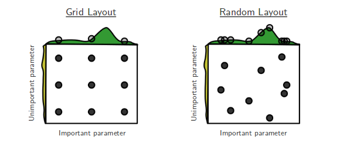
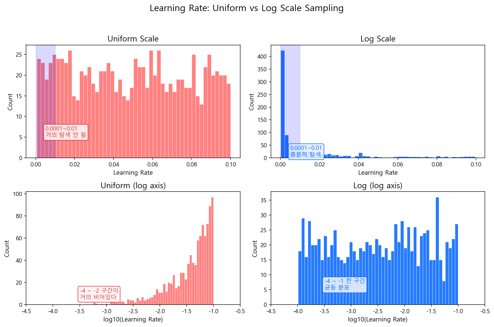

# 하이퍼파라미터 튜닝

## 7.1 핵심 하이퍼파라미터

### 공통 파라미터

| 파라미터 | XGBoost | LightGBM | 역할 | 권장 범위 |
|---------|---------|----------|------|----------|
| 학습률 | `learning_rate` | `learning_rate` | 각 트리의 기여도 | 0.01 ~ 0.1 |
| 트리 수 | `n_estimators` | `n_estimators` | 부스팅 라운드 수 | Early Stopping으로 결정 |
| 트리 깊이 | `max_depth` | `max_depth` | 개별 트리 복잡도 | 3 ~ 8 |
| Leaf 수 | `max_leaves` | `num_leaves` | Leaf 노드 최대 수 | 31 (LightGBM 기본) |
| 최소 Leaf 샘플 | `min_child_weight` | `min_child_samples` | 작은 Leaf 방지 | 20 ~ 100 |
| 행 샘플링 | `subsample` | `bagging_fraction` | 각 트리에 사용할 데이터 비율 | 0.7 ~ 0.9 |
| 열 샘플링 | `colsample_bytree` | `feature_fraction` | 각 트리에 사용할 변수 비율 | 0.6 ~ 0.9 |
| L1 정규화 | `reg_alpha` | `reg_alpha` | Leaf 가중치 L1 페널티 | 0 ~ 10 |
| L2 정규화 | `reg_lambda` | `reg_lambda` | Leaf 가중치 L2 페널티 | 0 ~ 10 |

### Early Stopping

가장 중요한 과적합 방지 전략이다.

- Validation Set의 성능을 매 라운드 모니터링
- 일정 라운드(`early_stopping_rounds`) 동안 개선이 없으면 학습 중단
- 최적 라운드의 모형을 최종 모형으로 사용

!!! tip "실무 팁 — n_estimators는 크게, Early Stopping으로 멈춰라"
    저자가 선호하는 방식이다. `n_estimators`를 처음부터 정확히 맞출 필요 없다. 넉넉하게(3000~5000) 설정하고 Early Stopping에 맡기는 것이 효율적이다. Learning Rate를 낮추면 최적 라운드가 늘어나지만, 성능은 대체로 좋아진다. 다만 이것이 유일한 정답은 아니며, 팀이나 프로젝트에 따라 n_estimators를 직접 CV로 탐색하는 방식도 흔하다.

!!! info "커스텀 Early Stopping: KS 기반 — 저자의 접근"
    라이브러리 기본 Early Stopping은 Loss(Log Loss, AUC 등)를 모니터링한다. 아래는 저자가 실무에서 사용한 방식으로, **KS 통계량 기반**으로 커스텀 조기 종료를 구현한 예시다:

    ```python
    if n_tree > warm_n:
        if ks_train > ks_min and abs(ks_train - ks_valid) > ks_diff_limit:
            break  # 과적합 감지 → 조기 종료
    ```

    - `warm_n`: 초기 학습 구간 (이 구간에서는 조기 종료 안 함)
    - `ks_min`: 최소 KS 임계값 (이보다 낮으면 학습 부족)
    - `ks_diff_limit`: Train-Valid KS 차이 한계 (이 갭이 크면 과적합)

---

## 7.2 하이퍼파라미터 튜닝 전략

### Grid Search vs Random Search



**Grid Search**는 모든 조합을 격자로 탐색한다. 조합이 폭발적으로 늘어나고, 중요하지 않은 파라미터에도 동일한 탐색 비용을 쓴다. **Random Search**는 동일 횟수 대비 중요한 파라미터의 탐색 범위를 더 넓게 커버한다 (Bergstra & Bengio, 2012). 실무에서는 Random Search 또는 Bayesian Optimization을 사용한다.

### 왜 Log Scale인가?

어떤 파라미터는 **자릿수(order of magnitude)가 성능을 결정**한다. Learning Rate 0.001과 0.01은 10배 차이로 모형 행동이 크게 달라지지만, 0.091과 0.1은 거의 같다. 이런 파라미터를 균등 간격으로 탐색하면 **작은 값 영역은 거의 건너뛰고, 큰 값 영역에 샘플이 몰린다.**



위 그림에서 왼쪽(Uniform)은 0.0001~0.01 구간에 샘플이 거의 없다. 오른쪽(Log Scale)은 모든 자릿수를 골고루 탐색한다. **로그 스케일 = "각 자릿수에 동일한 탐색 예산을 배분"**하는 것이다.

```python
# 로그 스케일 탐색
learning_rate = 10 ** random.uniform(-4, -1)  # 0.0001 ~ 0.1
```

반면 `max_depth` 같은 파라미터는 3→4→5가 모두 의미 있는 변화다. 이런 파라미터는 **균등 스케일(정수)**로 탐색하면 된다.

!!! tip "핵심 원칙"
    **"0.001 → 0.01이 의미 있는 변화인가?"** Yes → Log Scale. **"3 → 4가 의미 있는 변화인가?"** Yes → 균등/정수 Scale.

### 파라미터별 탐색 스케일 가이드

**Tree 모형 (XGBoost / LightGBM)**

| 파라미터 | 스케일 | 범위 예시 | 이유 |
|---------|--------|----------|------|
| `learning_rate` | **Log** | \(10^{-3}\) ~ \(10^{-1}\) | 자릿수가 수렴 행동을 결정 |
| `reg_alpha` (L1) | **Log** | \(10^{-3}\) ~ 10 | 0.001과 0.01, 0.1과 1이 각각 다른 효과 |
| `reg_lambda` (L2) | **Log** | \(10^{-3}\) ~ 10 | 위와 동일 |
| `max_depth` | 정수 | 3 ~ 8 | 한 단계마다 복잡도 2배 증가, 균등 탐색 적합 |
| `num_leaves` | 정수 | 15 ~ 127 | 위와 동일 |
| `min_child_weight` | 정수/균등 | 10 ~ 100 | 구간 내 선형적 효과 |
| `subsample` | 균등 | 0.6 ~ 1.0 | 비율이므로 균등 간격 |
| `colsample_bytree` | 균등 | 0.5 ~ 1.0 | 비율이므로 균등 간격 |

**Neural Network**

| 파라미터 | 스케일 | 범위 예시 | 이유 |
|---------|--------|----------|------|
| `learning_rate` | **Log** | \(10^{-5}\) ~ \(10^{-2}\) | Tree보다 더 넓은 범위, 로그 필수 |
| `weight_decay` | **Log** | \(10^{-5}\) ~ \(10^{-2}\) | 정규화 강도, 자릿수가 핵심 |
| `dropout` | 균등 | 0.0 ~ 0.5 | 비율이므로 균등 간격 |
| `batch_size` | **이산 Log** | 32, 64, 128, 256, 512 | 2의 거듭제곱으로 탐색 |
| `hidden_dim` | **이산 Log** | 32, 64, 128, 256 | 위와 동일 |
| `n_layers` | 정수 | 1 ~ 5 | 한 층씩 추가가 의미 있는 변화 |
| `warmup_steps` | 균등/정수 | 100 ~ 2000 | 선형적 효과 |

### 단계적 접근

한 번에 모든 파라미터를 동시에 탐색하면 조합이 폭발한다. 실무에서는 단계적으로 접근한다.

**1단계: 기본값으로 Baseline 확보**

```python
params = {
    'learning_rate': 0.1,
    'max_depth': 5,
    'n_estimators': 1000,
    'early_stopping_rounds': 50
}
```

**2단계: 트리 구조 파라미터 조정**

- `max_depth` (또는 `num_leaves`): 3 → 4 → 5 → 6 → 7 → 8
- `min_child_weight` (또는 `min_child_samples`): 10, 20, 50, 100

**3단계: 샘플링 파라미터**

- `subsample` / `bagging_fraction`: 0.7, 0.8, 0.9
- `colsample_bytree` / `feature_fraction`: 0.6, 0.7, 0.8, 0.9

**4단계: 정규화**

- `reg_alpha`: 0, 0.1, 1, 5, 10
- `reg_lambda`: 0, 0.1, 1, 5, 10

**5단계: Learning Rate 낮추고 라운드 늘리기**

- `learning_rate`: 0.1 → 0.05 → 0.01
- `n_estimators`: Early Stopping으로 자동 결정

??? note "참고: 자동 탐색 — Optuna"
    수동 탐색 대신 **베이지안 최적화**로 탐색을 자동화하는 프레임워크도 있다. 이전 시도 결과를 바탕으로 "성능이 좋을 것 같은 영역"을 추정하여 다음 시도 지점을 선택하는 방식이다. Grid Search가 격자를 전부 돌려보는 것이라면, 베이지안은 몇 번 찍어보고 유망한 곳만 집중 탐색한다.

    ```python
    import optuna

    def objective(trial):
        params = {
            'max_depth': trial.suggest_int('max_depth', 3, 8),
            'learning_rate': trial.suggest_float('learning_rate', 0.01, 0.1, log=True),
            'subsample': trial.suggest_float('subsample', 0.6, 0.9),
            'colsample_bytree': trial.suggest_float('colsample_bytree', 0.6, 0.9),
            'reg_alpha': trial.suggest_float('reg_alpha', 1e-3, 10, log=True),
            'reg_lambda': trial.suggest_float('reg_lambda', 1e-3, 10, log=True),
        }
        # CV 평가 후 score 반환
        return cv_score

    study = optuna.create_study(direction='maximize')
    study.optimize(objective, n_trials=100)
    ```

    > **저자의 말** — 이러한 자동 탐색 방법론이 있다는 것은 알고 있지만, 신용평가 모형에서 도입할 필요성은 느끼지 못했다. 탐색할 파라미터가 6~7개에 범위도 좁아서, 위의 수동 단계로 충분히 커버된다.

!!! info "Graduate Student Descent"
    ML 커뮤니티에서는 하이퍼파라미터 튜닝을 "Graduate Student Descent"라 부른다 — Gradient Descent의 패러디로, 결국 사람이 노가다로 찾는다는 뜻이다.

---

## 7.3 요약

| | XGBoost | LightGBM |
|---|---|---|
| **핵심 혁신** | 정규화 목적함수 + 2차 근사 | GOSS + EFB + Leaf-wise |
| **강점** | 안정성, 범용성 | 속도, 대규모 데이터 |
| **신용평가 적합성** | 높음 | 높음 |

실무에서 중요한 것은 알고리즘 선택보다 **하이퍼파라미터 튜닝과 검증 프로세스**다. 잘 튜닝된 XGBoost와 잘 튜닝된 LightGBM의 성능 차이는 대부분 미미하다. 기본값으로 못 되는 모형이 튜닝으로 된다기보다, **좋은 변수가 좋은 모형을 만든다.**

!!! tip "다음 섹션"
    모형의 성능이 확보되었다면, 다음 질문은 "이 모형이 **왜** 이렇게 예측했는가?"다. [해석과 설명](../part4_interpretation/index.md) 섹션에서 SHAP, 1-Depth GBM, EBM 등 모형 해석 기법을 다룬다.
