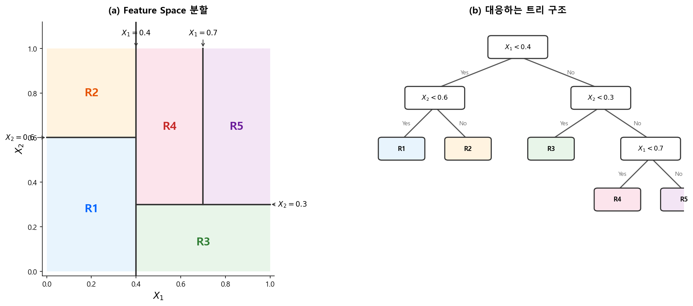
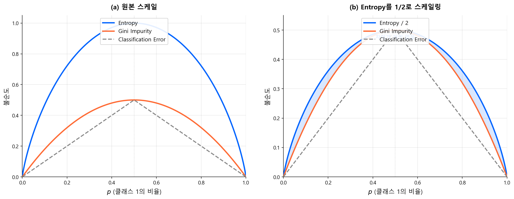
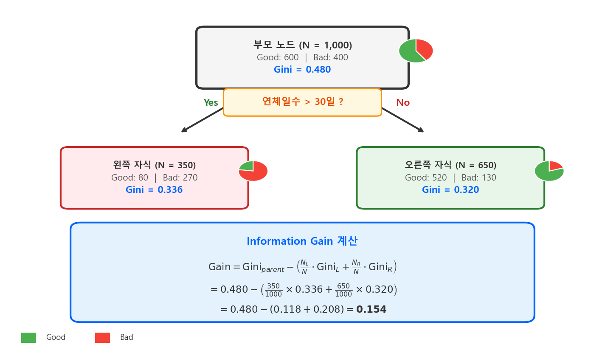
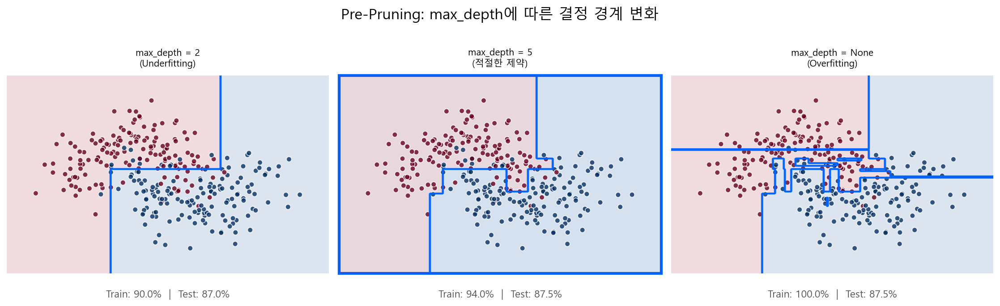
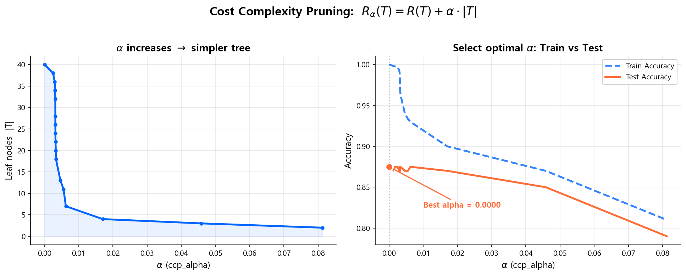
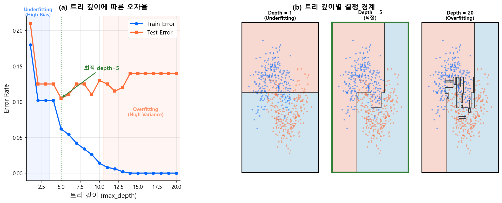

# 트리 기반 모델

!!! quote "설계 사상"
    로지스틱 회귀는 변수들의 **선형 결합**만 학습할 수 있다. 현실의 신용 리스크가 직선 하나로 나뉠 리가 없으므로, WoE 변환이라는 수동 비선형화가 필요했다. Decision Tree는 이 한계에 대한 가장 직관적인 답이다 — **"변수 X가 임계점 t보다 큰가?"**라는 질문을 반복하면, 어떤 비선형 관계든 자동으로 포착할 수 있다.

    게다가 단일 트리는 **사람이 읽을 수 있다**. 분기 조건을 위에서 아래로 따라가면, "왜 이 고객이 Bad인가"를 설명할 수 있다. 비선형성과 해석 가능성을 동시에 가진 유일한 구조다. 다만 그 대가로 **불안정성(High Variance)**이라는 치명적 약점을 안고 있고, 이것이 다음 장의 앙상블로 이어지는 출발점이 된다.

---

## 1.1 CART (Classification And Regression Trees)

Decision Tree 알고리즘 중 가장 대표적인 것이 **CART**다. Leo Breiman이 1984년에 제안했으며, 이후 Bagging, Random Forest, Boosting 등 모든 트리 기반 앙상블의 기초가 된다.

### 트리의 구조

CART는 **재귀적 이진 분할(Recursive Binary Splitting)**로 Feature Space를 직사각형 영역들로 나눈다. 아래 그림은 2차원 공간에서의 분할과 대응하는 트리 구조를 보여준다.

<figure markdown="span">
  
  <figcaption>Feature Space의 축 정렬(axis-aligned) 분할과 대응하는 트리 구조. Hastie et al. (2009) <em>The Elements of Statistical Learning</em> Figure 9.2에서 영감을 받아 재구성.</figcaption>
</figure>

| 용어 | 의미 |
|------|------|
| **Root Node** | 최상단 노드. 전체 데이터에서 첫 번째 분할 |
| **Internal Node** | 중간 노드. 조건에 따라 데이터를 좌/우로 분할 |
| **Leaf (Terminal Node)** | 끝 노드. 최종 예측값을 출력 |
| **Branch** | 노드 간 연결. 분할 조건의 Yes/No 경로 |
| **Depth** | Root에서 Leaf까지의 경로 길이 |

### 분할의 원리: "어떤 변수를, 어디서 자를 것인가"

CART는 입력 변수 중 하나를 골라 특정 기준점(threshold)에서 데이터를 둘로 나눈다. 이 과정을 재귀적으로 반복한다.

핵심 질문은 두 가지다:

1. **어떤 변수**를 선택할 것인가?
2. **어디서** 자를 것인가?

답은 간단하다 — **나눈 후 자식 노드들이 가장 "순수"해지는** 분할을 선택한다. "순수하다"는 것은 한 노드 안에 같은 클래스(Good 또는 Bad)만 모여 있는 상태를 말한다.

---

## 1.2 불순도 측정: Gini vs Entropy

노드의 "순수함"을 수치화하는 두 가지 대표 지표가 있다.

### Gini Impurity (지니 불순도)

$$
\text{Gini}(t) = 1 - \sum_{k=1}^{K} p_k^2
\tag{1}
$$

- \(p_k\): 노드 \(t\)에서 클래스 \(k\)의 비율
- 이진 분류에서: \(\text{Gini}(t) = 1 - p^2 - (1-p)^2 = 2p(1-p)\)
- **범위**: 0 (완전 순수) ~ 0.5 (이진 분류에서 최대 불순)
- 해석: 노드에서 임의로 두 샘플을 뽑았을 때, **다른 클래스일 확률**

### Entropy (엔트로피)

$$
\text{Entropy}(t) = -\sum_{k=1}^{K} p_k \log_2 p_k
\tag{2}
$$

- **범위**: 0 (완전 순수) ~ 1 (이진 분류에서 최대 불순)
- 정보이론에서 온 개념: 노드의 **불확실성(정보량)**을 측정

### Gini vs Entropy: 실무적 차이

| | Gini Impurity | Entropy |
|---|---|---|
| **범위** (이진) | 0 ~ 0.5 | 0 ~ 1.0 |
| **계산** | 곱셈만 | 로그 연산 포함 |
| **XGBoost/LightGBM 기본값** | - | - |
| **scikit-learn 기본값** | Gini | - |
| **실무 차이** | 거의 없음 | 거의 없음 |

아래 그림에서 세 지표를 비교하면, Gini와 Entropy가 거의 같은 형태임을 확인할 수 있다.

<figure markdown="span">
  
  <figcaption>세 가지 불순도 지표 비교. (b)에서 Entropy를 1/2로 스케일링하면 Gini와 거의 겹친다. James et al. (2021) <em>An Introduction to Statistical Learning</em> Figure 8.6에서 영감을 받아 재구성.</figcaption>
</figure>

!!! info "결론: 어느 것을 쓰든 결과는 거의 같다"
    Gini와 Entropy는 곡선의 형태가 매우 유사하여, 실제로 동일한 분할을 선택하는 경우가 대부분이다. scikit-learn의 기본값은 Gini이며, 이를 바꿔야 할 이유는 거의 없다.

---

## 1.3 Information Gain (정보 이득)

최적 분할은 **분할 전후의 불순도 감소량**이 최대인 분할이다. 이것을 **Information Gain**이라 부른다.

$$
\text{Gain}(t, \text{split}) = \text{Impurity}(t) - \sum_{c \in \{L,R\}} \frac{N_c}{N_t} \cdot \text{Impurity}(c)
\tag{3}
$$

- \(t\): 부모 노드
- \(L, R\): 분할 후 왼쪽/오른쪽 자식 노드
- \(\frac{N_c}{N_t}\): 자식 노드의 샘플 비율 (가중치)

CART는 모든 변수의 모든 가능한 분할점에 대해 Gain을 계산하고, **Gain이 최대인 (변수, 분할점)** 조합을 선택한다.

<figure markdown="span">
  
  <figcaption>Information Gain 계산 예시. 부모 노드의 불순도에서 자식 노드들의 가중 불순도를 뺀 값이 정보 이득이다. Mitchell (1997) <em>Machine Learning</em> Ch.3의 표현 방식을 참고하여 신용평가 맥락으로 재구성.</figcaption>
</figure>

!!! example "신용평가 예시"
    "연체일수 > 30일"로 나누면 왼쪽(30일 이하)은 Bad 5%, 오른쪽(30일 초과)은 Bad 40%로 분리된다. "소득 > 5000만원"으로 나누면 양쪽 모두 Bad 15% 내외로 비슷하다. 전자의 Information Gain이 훨씬 크므로, 트리는 연체일수를 먼저 선택한다.

---

## 1.4 Regression Tree

분류(Classification)가 아닌 **회귀(Regression)** 문제에서도 트리를 사용할 수 있다. 구조는 동일하되, 분할 기준과 예측값이 다르다.

| | Classification Tree | Regression Tree |
|---|---|---|
| **타겟** | 범주형 (Good/Bad) | 연속형 (금액, 비율 등) |
| **Leaf 예측값** | 다수결 클래스 (또는 확률) | 해당 노드 샘플의 **평균값** |
| **불순도 측정** | Gini / Entropy | **MSE** (Mean Squared Error) |
| **분할 기준** | Information Gain 최대화 | **MSE 감소량** 최대화 |

Regression Tree의 분할 기준:

$$
\text{MSE}(t) = \frac{1}{N_t} \sum_{i \in t} (y_i - \bar{y}_t)^2
\tag{4}
$$

분할 후 좌/우 자식의 가중 MSE 합이 최소가 되는 (변수, 분할점)을 선택한다.

!!! info "Boosting에서의 Regression Tree"
    이후 다룰 Gradient Boosting에서는, 분류 문제임에도 **Regression Tree**를 사용한다. Boosting은 각 라운드에서 **잔차(residual)**를 예측하는데, 잔차는 연속값이기 때문이다. 이 점을 미리 알아두면 GBM 이해가 훨씬 수월하다.

---

## 1.5 Pruning (가지치기): 과적합 제어

트리를 제약 없이 키우면, 모든 Leaf가 순수해질 때까지 — 극단적으로는 Leaf 하나에 샘플 1개가 될 때까지 — 분할을 계속한다. 이것이 전형적인 **과적합(High Variance)** 상태다. Bias-Variance Tradeoff에서 다룬 바로 그 "과적합 모형"이다.

### Pre-Pruning (사전 가지치기)

트리를 키우는 **도중에** 조건을 걸어 분할을 멈추는 방식이다.

| 파라미터 | 역할 | 효과 |
|---------|------|------|
| `max_depth` | 트리의 최대 깊이 제한 | 가장 직관적이고 강력한 제약 |
| `min_samples_split` | 분할에 필요한 최소 샘플 수 | 작은 노드의 추가 분할 방지 |
| `min_samples_leaf` | Leaf의 최소 샘플 수 | 극단적으로 작은 Leaf 방지 |
| `max_leaf_nodes` | Leaf 노드의 최대 개수 | 트리 전체 복잡도 직접 제어 |
| `min_impurity_decrease` | 분할로 인한 최소 불순도 감소 | Gain이 너무 작으면 분할 안 함 |

<figure markdown="span">
  
  <figcaption>max_depth가 너무 작으면 Underfitting, 제약이 없으면 Overfitting. 적절한 깊이 제한이 일반화 성능을 높인다. 합성 데이터(make_moons)로 시각화.</figcaption>
</figure>

### Post-Pruning (사후 가지치기)

트리를 **최대한 키운 후**, 성능에 기여하지 않는 가지를 잘라내는 방식이다.

**Cost Complexity Pruning** (CART의 기본 방식):

$$
R_\alpha(T) = R(T) + \alpha \cdot |T|
\tag{5}
$$

- \(R(T)\): 트리 \(T\)의 학습 오차 (불순도 합)
- \(|T|\): Leaf 노드 수 (트리의 복잡도)
- \(\alpha\): 페널티 계수 — 클수록 단순한 트리를 선호

\(\alpha\)를 0에서 점차 키우면, 트리가 점점 잘려나간다. Cross-Validation으로 최적 \(\alpha\)를 선택한다.

<figure markdown="span">
  
  <figcaption>α를 키울수록 Leaf 수가 줄어들고(좌), Test Accuracy가 최적점을 지나면 하락한다(우). 합성 데이터(make_moons)로 시각화.</figcaption>
</figure>

!!! tip "Pre vs Post Pruning"
    실무에서는 **Pre-Pruning이 압도적으로 많이 사용**된다. 특히 앙상블(RF, XGBoost, LightGBM)에서는 `max_depth`, `min_samples_leaf` 등 Pre-Pruning 파라미터가 핵심 튜닝 대상이다. Post-Pruning은 단일 트리에서 주로 쓰이며, 앙상블에서는 거의 사용하지 않는다.

아래 그림은 트리 깊이에 따른 과적합 양상을 보여준다. Train Error는 깊이가 깊어질수록 계속 감소하지만, Test Error는 일정 깊이 이후 오히려 증가한다.

<figure markdown="span">
  
  <figcaption>트리 깊이에 따른 Train/Test Error 곡선과 결정 경계 변화. James et al. (2021) <em>ISLR</em> Figures 8.4–8.5에서 영감을 받아 합성 데이터(make_moons)로 재구성.</figcaption>
</figure>

---

## 1.6 단일 트리의 한계

CART 단일 트리는 직관적이고 해석이 쉽다는 장점이 있지만, 실전에서는 **성능이 부족**하다.

| 한계 | 설명 |
|------|------|
| **High Variance** | 학습 데이터가 조금만 바뀌어도 트리 구조가 완전히 달라짐 |
| **Greedy 알고리즘** | 매 분할에서 최적을 선택하지만, 전역 최적이 아닐 수 있음 |
| **계단 함수** | 예측값이 Leaf 단위 상수 → 연속적 관계를 부드럽게 포착 못 함 |
| **성능 한계** | 단일 트리로는 복잡한 패턴을 충분히 학습하기 어려움 |

> 단일 트리의 장점(해석 용이)과 단점(불안정, 성능 한계)을 동시에 해결하는 것이 **앙상블 기법**이다.

그러나 "성능이 부족하다"는 평가가 곧 "쓸모없다"를 의미하지는 않는다. **단순함 자체가 목적**인 영역에서는 단일 트리가 여전히 강력한 도구다.

---

## 1.7 단일 트리의 실무 활용: 룰 기반 시스템

### 왜 단일 트리가 여전히 쓰이는가

앙상블이 성능에서는 압도적이지만, 신용평가 실무에서는 **"모형"이 아닌 "룰"**이 필요한 영역이 존재한다. 얕은 트리(`max_depth=2~3`)는 사람이 읽을 수 있는 if-else 구조로 직접 변환할 수 있다는 점에서 독보적이다.

```
# max_depth=2 트리 → 사람이 읽을 수 있는 룰
if 연체일수 > 90:
    if 부채비율 > 300%:
        → 자동 거절 (Bad Rate 72%)
    else:
        → 심사역 검토 (Bad Rate 35%)
else:
    if 소득 < 1500만원 and 신용카드_이용건수 == 0:
        → 추가 서류 요청
    else:
        → 스코어카드 심사 진행
```

이러한 룰은 감사(audit) 시 "왜 이 고객을 거절했는가"를 **한 줄로** 설명할 수 있다. XGBoost 500그루의 앙상블로는 이것이 불가능하다.

### 활용 영역

| 용도 | 설명 | 트리 특성 |
|------|------|----------|
| **사전 필터링 룰** | 스코어카드 진입 전 자동 거절/승인 기준 | `max_depth=2~3`, 해석 필수 |
| **정책 룰 (Policy Rules)** | 규제 요건이나 리스크 정책의 명시적 구현 | 분기 조건 = 비즈니스 룰 |
| **고객 세분화 (Segmentation)** | 세그먼트별 스코어카드 적용 시 분류 기준 도출 | CHAID/CART, 세그먼트 수 3~5개 |
| **Champion-Challenger 오버라이드** | 스코어카드 결과에 대한 보정 룰 | 기존 모형의 약점 보완 |
| **FDS(이상거래탐지) 룰** | 실시간 거래 차단 기준 | 속도 중요, 단순 조건 |

### 사전 필터링 룰: 스코어카드 진입 전 게이트

가장 대표적인 활용이 **Application Screening**이다. 스코어카드는 정교한 확률 추정 모형이지만, 명백히 고위험인 고객까지 스코어링할 필요는 없다. 단일 트리로 도출한 룰이 **첫 번째 관문** 역할을 한다.

> **필터링 룰** → 통과 → **스코어카드** → 스코어 산출 → **등급 부여** → 승인/거절

!!! tip "룰 vs 모형의 역할 분담"
    - **룰**: 극단적 고위험/저위험 고객을 빠르게 걸러냄. 해석 가능성과 감사 추적(audit trail)이 핵심.
    - **모형(스코어카드/ML)**: 나머지 "회색 지대" 고객의 리스크를 정밀하게 서열화. 성능(KS/Gini)이 핵심.

    둘은 **경쟁이 아니라 보완** 관계다. 단일 트리의 한계(성능 부족)는 모형이 보완하고, 모형의 한계(해석 어려움)는 룰이 보완한다.

### 고객 세분화: 세그먼트별 스코어카드의 출발점

포트폴리오 전체에 하나의 스코어카드를 적용하는 것보다, **리스크 특성이 다른 세그먼트별로 별도 스코어카드**를 만드는 것이 성능이 좋은 경우가 많다. 이때 세그먼트 분류 기준을 단일 트리로 도출한다.

```
# 세그먼트 트리 (max_depth=2)
if 기존고객 여부 == True:
    if 거래기간 > 2년:
        → Segment A: 장기 기존고객 (전용 스코어카드 A)
    else:
        → Segment B: 신규 기존고객 (전용 스코어카드 B)
else:
    → Segment C: 신규고객 (전용 스코어카드 C)
```

CHAID(Chi-squared Automatic Interaction Detector)는 이 용도에 특화된 트리 알고리즘으로, 카이제곱 검정 기반으로 통계적으로 유의한 분할만 수행하여 **과도한 세분화를 자동으로 방지**한다.

!!! info "CART vs CHAID"
    | | CART | CHAID |
    |---|---|---|
    | **분할 방식** | 이진 분할 | 다진 분할(Multi-way) 가능 |
    | **분할 기준** | Gini / Entropy | 카이제곱 검정 (p-value) |
    | **정지 조건** | Pre/Post Pruning | 유의하지 않으면 자동 정지 |
    | **주 용도** | 예측 모형, 앙상블 기초 | **세분화**, 탐색적 분석 |

    세분화 목적에서는 CHAID의 다진 분할이 더 자연스러운 경우가 많다 — "지역"이라는 변수를 이진 분할하면 {서울 vs 나머지}처럼 인위적으로 나눠야 하지만, CHAID는 {수도권, 광역시, 기타}처럼 의미 있는 그룹을 직접 만들 수 있다.

!!! tip "다음 섹션"
    단일 트리의 한계를 극복하기 위해, 다음에서는 여러 트리를 결합하는 [앙상블 기법](ensemble.md) — Bagging(Random Forest)과 Boosting의 원리를 학습한다.
