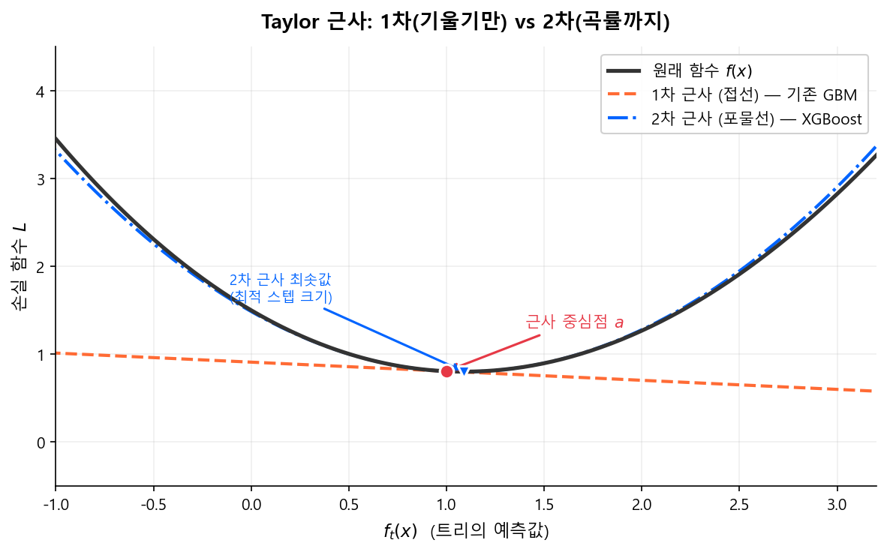
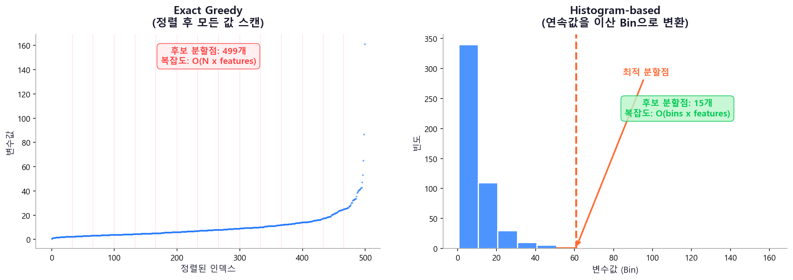
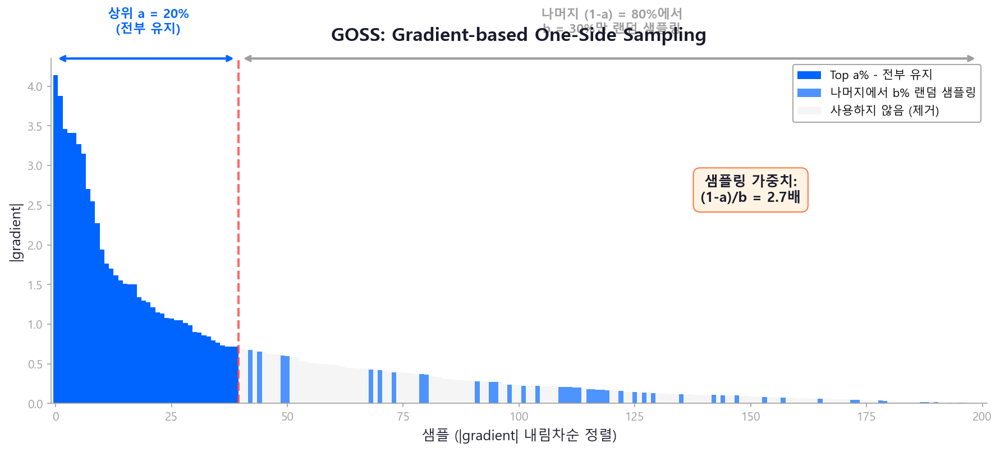
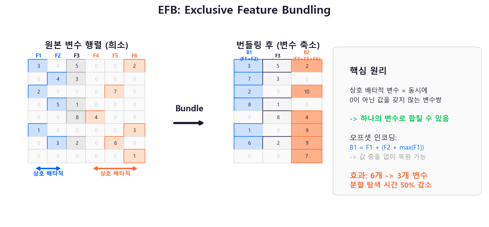
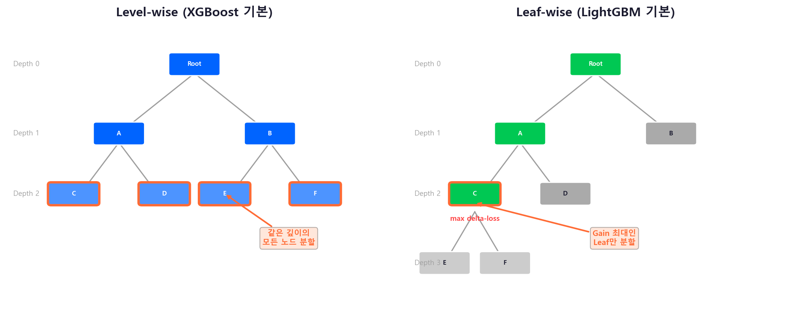

# XGBoost와 LightGBM

## 6.1 왜 XGBoost/LightGBM인가

Gradient Boosting(GBM)의 원리는 2001년에 확립되었지만, 실무에서 폭발적으로 쓰이게 된 것은 **구현의 혁신** 덕분이다.

| | 기존 GBM (sklearn) | **XGBoost** (2014) | **LightGBM** (2017) |
|---|---|---|---|
| 개발 | Friedman 원논문 기반 | Tianqi Chen (U. Washington) | Microsoft Research |
| 속도 | 느림 | **빠름** (Histogram 모드 추가) | **빠름** (GOSS + EFB) |
| 정규화 | 없음 | L1/L2 정규화 내장 | L1/L2 정규화 내장 |
| 결측치 | 사전 처리 필요 | **자동 처리** | **자동 처리** |
| 대규모 데이터 | 한계 | GPU 지원 + 분산 학습 | GPU 지원 + GOSS 샘플링 |
| 튜닝 난이도 | 단순 | **직관적** (`max_depth` 1차원 제어) | `num_leaves` × `max_depth` 2차원 제어 |
| 안정성 | 높음 (보수적) | **높음** (Level-wise 기본) | Leaf-wise 특성상 튜닝 주의 |
| 생태계 | 기본 | **가장 넓음** (산업 표준급) | 넓음 (빠르게 성장) |

!!! info "2018년이나 2025년이나"
    신용평가 ML 모형의 실무 표준은 여전히 XGBoost 또는 LightGBM이다. 매년 새로운 딥러닝 아키텍처가 제안되지만, tabular 데이터에서 이 둘을 안정적으로 이기는 방법론은 아직 등장하지 않았다 (Grinsztajn et al., NeurIPS 2022).

---

## 6.2 XGBoost의 핵심 혁신

### 정규화된 목적함수

기존 GBM은 손실 함수만 최소화했다. XGBoost는 **트리의 복잡도에 페널티**를 부과하는 정규화 항을 추가했다.

$$
\text{Obj}^{(t)} = \sum_{i=1}^{N} L(y_i, \hat{y}_i^{(t)}) + \sum_{k=1}^{t} \Omega(f_k)
\tag{1}
$$

$$
\Omega(f) = \gamma T + \frac{1}{2}\lambda \sum_{j=1}^{T} w_j^2
\tag{2}
$$

- \(T\): Leaf 노드 수 — \(\gamma\)가 크면 Leaf가 적은(단순한) 트리를 선호
- \(w_j\): Leaf \(j\)의 예측값 — \(\lambda\)가 크면 극단적 예측을 억제
- 추가로 L1 정규화 \(\alpha |w_j|\)도 지원

!!! info "정규화의 효과"
    기존 GBM에서는 과적합을 막으려면 `max_depth`나 `learning_rate`로만 제어했다. XGBoost는 목적함수 자체에 페널티를 내장하여, 트리 구조와 예측값 모두에 대해 **수학적으로 과적합을 제어**한다.

    여기서 \(\frac{1}{2}\lambda \sum w_j^2\)는 [정규화 이론](../part1_overview/regularization.md)에서 다룬 **Ridge(L2) 페널티**와 동일한 원리이고, \(\alpha \sum |w_j|\)는 **Lasso(L1) 페널티**다. 선형 모형에서 계수를 수축시키던 아이디어를, 트리의 Leaf 예측값에 적용한 것이다.

### 2차 Taylor 근사

!!! note "Taylor 근사란?"
    복잡한 함수 \(f(x)\)를 어떤 점 \(a\) 근처에서 **다항식으로 근사**하는 기법이다. 미적분학의 가장 강력한 도구 중 하나로, 함수의 도함수 정보를 이용해 함수 모양을 흉내 낸다.

    $$
    f(x) \approx f(a) + f'(a)(x - a) + \frac{1}{2}f''(a)(x - a)^2 + \cdots
    $$

    - **1차 근사**(선형): 접선으로 근사 — 기존 GBM이 사용하는 방식
    - **2차 근사**(이차): 포물선으로 근사 — XGBoost가 사용하는 방식

    1차 근사는 기울기(gradient)만 보고 "어느 방향으로 갈지"를 결정한다. 2차 근사는 곡률(hessian)까지 보고 **"얼마나 갈지"**까지 정밀하게 결정한다. Newton's method가 gradient descent보다 빠르게 수렴하는 이유와 동일한 원리다.

<figure markdown="span">
  { width="100%" }
  <figcaption>1차 근사(주황 접선)는 방향만 알려주지만, 2차 근사(파란 포물선)는 최적 스텝 크기까지 정밀하게 결정한다. XGBoost가 기존 GBM보다 빠르게 수렴하는 핵심 원리다.</figcaption>
</figure>

기존 GBM은 1차 미분(gradient)만 사용했다. XGBoost는 **2차 미분(hessian)**까지 활용하여 최적 분할과 Leaf 가중치를 더 정밀하게 계산한다.

손실 함수의 2차 근사:

$$
\text{Obj}^{(t)} \approx \sum_{i=1}^{N} \left[ g_i f_t(x_i) + \frac{1}{2} h_i f_t^2(x_i) \right] + \Omega(f_t)
\tag{3}
$$

- \(g_i = \frac{\partial L}{\partial \hat{y}^{(t-1)}}\): 1차 미분 (gradient)
- \(h_i = \frac{\partial^2 L}{\partial (\hat{y}^{(t-1)})^2}\): 2차 미분 (hessian)

최적 Leaf 가중치:

$$
w_j^* = -\frac{\sum_{i \in I_j} g_i}{\sum_{i \in I_j} h_i + \lambda}
\tag{4}
$$

최적 분할의 Gain:

$$
\text{Gain} = \frac{1}{2}\left[\frac{(\sum_{i \in I_L} g_i)^2}{\sum_{i \in I_L} h_i + \lambda} + \frac{(\sum_{i \in I_R} g_i)^2}{\sum_{i \in I_R} h_i + \lambda} - \frac{(\sum_{i \in I} g_i)^2}{\sum_{i \in I} h_i + \lambda}\right] - \gamma
\tag{5}
$$

- Gain이 음수면 분할하지 않음 → \(\gamma\)가 **자연스러운 Pre-Pruning** 역할

### 결측치 자동 처리

XGBoost는 결측치가 있는 샘플을 **왼쪽과 오른쪽 모두에 보내보고**, Gain이 더 높은 방향을 학습한다. 별도의 결측치 대체(imputation) 없이 원본 그대로 입력하면 된다.

!!! tip "실무 팁"
    결측치를 -999 같은 임의 값으로 채우는 것보다, XGBoost/LightGBM에 그대로 넘기는 것이 대부분 더 좋은 성능을 낸다. 트리가 결측 자체를 하나의 정보로 활용할 수 있기 때문이다.

!!! warning "현실은 녹록지 않다 -- Special Value 처리"
    이론적으로는 "NaN으로 넘기면 된다"이지만, **금융 실무의 전문(API) 데이터에서는 그게 쉽지 않다.**

    CB사 ↔ 금융기관 간 전문에서 결측치는 보통 `9999999`, `99999999` 같은 **Special Value**로 채워져 온다. 전문 필드가 고정 길이(Fixed-length)이고, NULL 표현이 없는 레거시 시스템이 많기 때문이다.

    **문제는 이 Special Value가 변수마다 다를 수 있다는 점이다:**

    - 금액 필드: `9999999999` (10자리)
    - 건수 필드: `999` (3자리)
    - 비율 필드: `99.99`
    - 날짜 필드: `99999999`

    따라서 모형 학습 전에 **후처리(Preprocessing) 단계에서 각 변수별 Special Value를 식별하고 NaN으로 변환**하는 작업이 필수다. 이 매핑 테이블을 관리하는 것 자체가 하나의 업무가 된다.

---

## 6.3 LightGBM의 핵심 혁신

LightGBM은 XGBoost의 원리를 공유하면서, **학습 속도**를 극적으로 개선한 세 가지 기법을 도입했다.

### Histogram-based Splitting

기존 Exact Greedy 방식은 모든 변수값을 정렬한 뒤 하나씩 스캔하여 최적 분할점을 찾는다. LightGBM은 연속값을 **이산 Bin(히스토그램)**으로 변환하여, 탐색 복잡도를 \(O(N)\)에서 \(O(\text{bins})\)로 대폭 줄인다.

그림 재구성 출처: Chen, T. & Guestrin, C. (2016). "XGBoost: A Scalable Tree Boosting System." KDD 2016, Section 3.2 Approximate Algorithm. 원본: <a href="https://doi.org/10.1145/2939672.2939785">ACM Digital Library</a>; LightGBM은 히스토그램 기반을 기본값으로 채택.

!!! info "히스토그램의 부수 효과"
    Bin 수가 제한되므로(기본 255) 메모리 사용량도 크게 줄어든다. 또한 부모 노드의 히스토그램에서 한쪽 자식을 빼면 다른 자식의 히스토그램을 바로 구할 수 있어(**Histogram Subtraction**), 계산량이 추가로 절반 감소한다.

### GOSS (Gradient-based One-Side Sampling)

모든 샘플이 동등하게 중요한 것은 아니다. Gradient가 큰 샘플(=현재 모형이 크게 틀리고 있는 샘플)이 정보 이득에 더 큰 기여를 한다.

그림 재구성 출처: Ke, G. et al. (2017). "LightGBM: A Highly Efficient Gradient Boosting Decision Tree." NeurIPS 2017, Section 3.1. 원본: <a href="https://papers.nips.cc/paper/2017/hash/6449f44a102fde848669bdd9eb6b76fa-Abstract.html">NeurIPS Proceedings</a>

- **Gradient가 큰 상위 \(a\)%** 샘플은 전부 유지
- 나머지 **\((1-a)\)%**에서 \(b\)%만 랜덤 샘플링
- 샘플링된 데이터의 gradient에 \(\frac{1-a}{b}\) 가중치를 곱해 분포 보정

결과: 데이터 양은 크게 줄이면서, Information Gain 추정의 정확도는 유지.

### EFB (Exclusive Feature Bundling)

고차원 데이터에서 많은 변수가 **상호 배타적**(동시에 0이 아닌 값을 가지지 않음)인 경우가 많다. 예: One-Hot 인코딩된 범주형 변수들.

EFB는 이런 배타적 변수들을 하나의 변수로 묶어(bundle) **변수 차원을 축소**한다. 이를 통해 분할 후보 탐색 시간이 크게 줄어든다.

그림 재구성 출처: Ke, G. et al. (2017). "LightGBM: A Highly Efficient Gradient Boosting Decision Tree." NeurIPS 2017, Section 3.2. 원본: <a href="https://papers.nips.cc/paper/2017/hash/6449f44a102fde848669bdd9eb6b76fa-Abstract.html">NeurIPS Proceedings</a>

### Leaf-wise vs Level-wise 성장

그림 재구성 출처: Ke, G. et al. (2017). "LightGBM: A Highly Efficient Gradient Boosting Decision Tree." NeurIPS 2017, Figure 1. 원본: <a href="https://papers.nips.cc/paper/2017/hash/6449f44a102fde848669bdd9eb6b76fa-Abstract.html">NeurIPS Proceedings</a>

| | XGBoost (Level-wise) | LightGBM (Leaf-wise) |
|---|---|---|
| 방식 | 같은 깊이의 모든 노드를 분할 | **Gain이 최대인 Leaf만** 분할 |
| 장점 | 균형 잡힌 트리, 과적합 제어 쉬움 | 같은 Leaf 수 대비 **오차 감소가 큼** |
| 단점 | 불필요한 분할도 수행 | 불균형 트리 → 과적합 가능성 |

!!! warning "Leaf-wise의 과적합 위험"
    LightGBM의 Leaf-wise 성장은 데이터가 적을 때 과적합에 취약하다. `num_leaves`를 `max_depth` 환산값(\(2^{\text{depth}}\))보다 작게 설정하여 제어한다. 예: `max_depth=6`이면 `num_leaves`는 \(2^6 = 64\)보다 작은 31~50 정도.

---

## 6.4 XGBoost vs LightGBM 비교

| 항목 | XGBoost | LightGBM |
|------|---------|----------|
| **트리 성장** | Level-wise (안정적) | Leaf-wise (공격적) |
| **속도** | 빠름 (`tree_method='hist'`로 격차 축소) | 빠름 (대규모 데이터에서 우위) |
| **메모리** | 보통 | **적음** (히스토그램 기반) |
| **튜닝 난이도** | `max_depth` 하나로 복잡도 제어 (1차원) | `num_leaves` × `max_depth` 두 축을 동시 제어 (2차원) |
| **범주형 변수** | 사전 인코딩 필요 | **네이티브 지원** |
| **결측치** | 자동 처리 | 자동 처리 |
| **GPU** | 지원 | 지원 |
| **과적합 제어** | **안정적** (Level-wise + 강한 정규화) | Leaf-wise 특성상 `num_leaves` 제어 필요 |
| **산업 채택** | **금융·의료 등 규제 산업에서 주류** | Kaggle·대규모 데이터 중심 |

!!! tip "실무 선택 기준"
    - **데이터 < 50만 행**: 속도 차이 거의 없음. XGBoost의 `max_depth` 단일 축 제어가 튜닝 진입장벽을 낮춤
    - **데이터 > 100만 행**: LightGBM이 GOSS/EFB 덕분에 학습 속도 우위
    - **범주형 변수가 많을 때**: LightGBM의 네이티브 범주형 지원이 전처리 부담을 줄임
    - **Kaggle/대회**: LightGBM이 주류, 그러나 XGBoost와 앙상블하면 더 좋은 경우도 많음
    - **신용평가 실무**: XGBoost를 표준으로 쓰는 조직이 여전히 많다. Level-wise의 안정성, 넓은 생태계, `max_depth` 중심의 직관적 튜닝이 규제 산업에서 선호되는 이유

!!! info "속도 격차, 아직도 크다?"
    LightGBM 출시 당시(2017) XGBoost는 Exact Greedy가 기본이라 **5~10배** 차이가 났다. 그러나 XGBoost 2.0(2023.09)부터 `tree_method='hist'`가 기본값이 되면서 격차가 크게 줄었다.

    | 데이터 규모 | 현재 속도 격차 | 실무 영향 |
    |---|---|---|
    | < 50만 행 | 거의 동일 | 없음 |
    | 50만 ~ 500만 행 | LightGBM **1.3~2×** | 하이퍼파라미터 탐색(수백 회 반복) 시 체감 |
    | > 500만 행 | LightGBM **1.5~2×** | GOSS + EFB의 구조적 이점 |

    신용평가 데이터(보통 20만~200만 행)에서는 단일 학습 속도 차이가 사실상 의미 없다. 대규모 탐색을 돌릴 때만 차이가 누적된다.

!!! tip "다음 섹션"
    XGBoost와 LightGBM의 알고리즘 혁신을 이해했으니, 다음에서는 이들의 [하이퍼파라미터 튜닝](hyperparameter_tuning.md) 전략을 학습한다.
