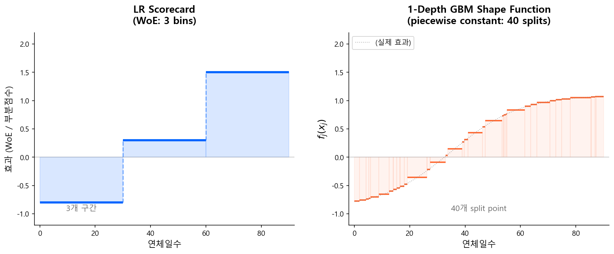

# 1-Depth GBM 스코어카드

## 3.1 변수별 효과 곡선 — Shape Function

1-Depth GBM 스코어카드의 결과물부터 보자.

전통 스코어카드에서는 각 변수의 효과가 WoE 구간별 상수 — **굵은 계단 함수**였다:

```
연체일수:  0~30일 → WoE -0.8
          30~60일 → WoE 0.3
          60일+   → WoE 1.5
```

1-Depth GBM에서는 수백 개의 stump가 합산되면서, 같은 변수의 효과가 **촘촘한 계단 함수(piecewise constant)**로 나타난다:

```
연체일수:  0일 → -0.9
          15일 → -0.5
          30일 → 0.1
          45일 → 0.6
          60일 → 1.2
          90일 → 1.8
```

수학적으로는 여전히 계단 함수이지만, split point가 촘촘하기 때문에 **사실상 곡선처럼** 보인다. 전통 스코어카드의 3~5개 구간 계단과 비교하면 해상도 차이가 극적이다.



핵심은 이것이다: **ML의 비선형 학습 능력은 그대로 살리면서, 각 변수의 효과를 독립적인 곡선 한 줄로 읽을 수 있다.** 전통 스코어카드처럼 "이 변수가 이 값이면 모형이 어떻게 반응하는가"를 일관되게 말할 수 있다는 뜻이다.

왜 이것이 가능한가? 비밀은 **depth = 1**이라는 제약에 있다.

---

## 3.2 왜 가능한가 — depth = 1이면 교호작용이 사라진다

Depth = 1인 트리는 **stump** — 단 하나의 변수로 한 번만 분할하는 트리다.

```
      [변수 A > 30?]
       /          \
  [Leaf: -0.3]  [Leaf: +0.5]
```

이 stump를 Boosting으로 수백~수천 개 쌓는 것이 1-Depth GBM이다. 각 트리가 **정확히 하나의 변수만** 사용하므로:

$$
F(\mathbf{x}) = F_0 + \sum_{t=1}^{T} h_t(x_{j(t)})
\tag{1}
$$

- 각 \(h_t\)는 하나의 변수 \(x_{j(t)}\)에만 의존
- 변수 간 교호작용(interaction)이 **구조적으로 불가능**

같은 변수를 사용한 stump들을 모아 합산하면, 최종 모형은 **Generalized Additive Model (GAM)**과 동치가 된다:

$$
F(\mathbf{x}) = F_0 + f_1(x_1) + f_2(x_2) + \cdots + f_p(x_p)
\tag{2}
$$

각 \(f_j\)가 바로 앞에서 본 shape function이다. 교호작용이 없기 때문에, 한 변수의 효과가 다른 변수의 값에 따라 달라지지 않는다. **globally 일관된 해석**이 가능한 이유다.

!!! info "이론적 근거: Friedman (2001)"
    이 아이디어는 새로운 것이 아니다. Friedman이 Gradient Boosting Machine을 처음 제안한 논문에서 이미 명시적으로 언급했다: "Decision stump를 base learner로 사용하면, 결과 모형은 additive model이 된다."

    <div class="source-ref">
    출처: Friedman, J.H. (2001). "Greedy Function Approximation: A Gradient Boosting Machine." <em>Annals of Statistics</em>, 29(5):1189-1232.
    <a href="https://projecteuclid.org/journals/annals-of-statistics/volume-29/issue-5/Greedy-function-approximation-A-gradient-boosting-machine/10.1214/aos/1013203451.full" target="_blank">논문 링크</a>
    </div>

### 주의: 단조성(Monotonicity)은 자동 보장이 아니다

1-Depth GBM이 교호작용을 원천 차단한다는 점에서, "변수별 효과도 자동으로 단조적이지 않을까?"라고 오해하기 쉽다. **그렇지 않다.**

개별 stump은 leaf가 2개뿐이므로 당연히 단조적이다. 하지만 같은 변수에 대해 여러 stump이 **서로 다른 split point**에서 잘리면, 앙상블의 누적 효과는 비단조(non-monotonic)가 될 수 있다:

```
Tree  12:  연체일수 < 30 → -0.2,  ≥ 30 → +0.1
Tree  85:  연체일수 < 50 → +0.3,  ≥ 50 → -0.1
Tree 241:  연체일수 < 30 → +0.15, ≥ 30 → -0.05
```

이 stump들의 합산 결과, 연체일수의 shape function이 올라갔다 내려갔다 할 수 있다. 이것은 버그가 아니라, stump 합산이 **piecewise constant function을 자유롭게 근사**하기 때문에 나타나는 자연스러운 현상이다 — GAM의 유연성이란 곧 비단조적 곡선도 학습할 수 있다는 뜻이다.

스코어카드에서 이것이 문제가 되는 이유는 명확하다. "연체일수가 늘었는데 오히려 리스크가 낮아진다"는 구간이 존재하면, 심사 담당자에게도 감독기관에게도 설명할 수 없다.

**해법은 `monotone_constraints` 파라미터다.**

```python
params = {
    'max_depth': 1,
    'monotone_constraints': [1, -1, 0, ...],  # 변수별 방향 지정
}
```

- `+1`: 변수 값이 증가하면 예측값도 증가 (양의 단조)
- `-1`: 변수 값이 증가하면 예측값은 감소 (음의 단조)
- `0`: 제약 없음 (비단조 허용)

XGBoost, LightGBM, CatBoost 모두 이 파라미터를 지원하며, 규제 환경의 스코어카드라면 이는 선택이 아니라 **필수**다.

!!! warning "WoE 변환 입력에도 제약이 필요하다"
    WoE 변환을 거친 변수를 넣으면 이미 단조 순서로 정렬되어 있지만, XGBoost가 WoE 값의 중간에서 split하면서 비단조를 만들 수 있다. WoE 입력이라도 monotonic constraint를 거는 것이 안전하다. 다만 WoE 변수는 방향이 이미 정해져 있으므로, constraint 방향 설정이 단순해지는 장점이 있다 (전부 같은 방향).

---

## 3.3 전통 LR vs 1-Depth GBM vs Full GBM 비교

| 항목 | 전통 LR (WoE) | **1-Depth GBM** | Full GBM (depth=5~6) |
|------|:---:|:---:|:---:|
| **비선형 포착** | WoE 구간화로 간접 | **자동** (stump 합산) | 자동 |
| **교호작용** | 없음 | **없음** | 있음 |
| **해석 가능성** | 점수표 | **변수별 효과 곡선** | SHAP 필요 |
| **예측 성능** | 기준 | **LR < 1-Depth < Full** | 최고 |
| **변수 처리** | Classing + WoE 필수 | Raw 입력 가능 | Raw 입력 가능 |
| **규제 수용성** | 매우 높음 | **높음 (GAM 해석)** | 제한적 |

### 성능 비교의 직관

전통 LR이 성능에서 뒤지는 주요 원인 두 가지:

1. **Classing의 정보 손실**: 연속형 변수를 수동으로 5~10개 구간으로 자르면서 세밀한 패턴이 사라짐
2. **구간 내 선형 가정**: WoE 변환 후 로지스틱 회귀가 선형 결합을 하므로, 구간 내 비선형성을 포착하지 못함

1-Depth GBM은 이 두 문제를 해결한다:

- Classing 없이 원본 변수를 직접 사용
- stump들이 자동으로 최적 분할점을 찾고, 누적하여 비선형 곡선을 형성

그러나 교호작용이 없기 때문에, 변수 간 시너지를 활용하는 Full GBM보다는 성능이 낮다.

### 성능 격차의 일반적 경향

- **전통 LR → 1-Depth GBM**: 수동 구간화의 정보 손실을 회복하면서 성능이 향상되는 경향이 있다. 비선형 패턴이 복잡한 데이터일수록 격차가 커진다.
- **1-Depth GBM → Full GBM**: 교호작용을 포착하는 만큼 추가 성능 향상이 가능하지만, 신용평가 데이터에서는 main effect가 지배적이어서 격차가 크지 않은 경우가 많다.
- **EBM (GA\(^2\)M 모드) → Full GBM**: 선택적 2-way 교호작용만으로도 Full GBM과의 격차가 상당히 줄어든다.

!!! note "성능 격차는 데이터에 따라 다르다"
    교호작용이 중요한 데이터(예: 소득 × 부채비율)에서는 Full GBM과의 격차가 크고, 각 변수가 독립적으로 작용하는 데이터에서는 격차가 거의 없다.

!!! example "업계 사례: Moody's Analytics의 비교 연구"
    Moody's Analytics는 제약이 걸린 로지스틱 회귀(supervised binning + 단조 제약) 스코어카드와 비제약 ML 모형(decision tree, random forest, gradient boosting)을 비교하여, **해석 가능한 모형의 성능 손실이 크지 않다**고 보고했다. 이 연구의 비교 대상은 1-Depth GBM이 아닌 constrained LR이지만, "해석 가능성을 위한 제약이 성능을 크게 희생하지 않는다"는 메시지는 동일하다.

    <div class="source-ref">
    출처: Moody's Analytics. "Automating Interpretable Machine Learning Scorecards." Whitepaper.
    <a href="https://www.moodys.com/web/en/us/insights/resources/Automating-Interpretable-Scorecards.pdf" target="_blank">PDF</a>
    </div>

---

## 3.4 업계 적용 사례

### FICO의 접근: Transmutation

FICO의 Gerald Fahner가 제안한 **transmutation** 방법은:

1. **Tree Ensemble Model (TEM)으로 패턴 발견** — Full GBM으로 변수 간 비선형 관계를 탐색
2. **TEM의 인사이트를 제약 스코어카드로 변환** — 발견된 패턴을 단조성 제약이 있는 세분화된 스코어카드로 변환 (비선형 프로그래밍 사용)
3. **스코어카드를 배포** — 블랙박스 TEM이 아닌, 해석 가능한 스코어카드를 실전에 투입

이 접근은 "ML은 도구로만 사용하고, 최종 산출물은 전통 스코어카드"라는 실용적 전략이다. 이 논문은 Data Analytics 2018에서 **Best Paper Award**를 수상했다.

<div class="source-ref">
출처: Fahner, G. (2018). "Developing Transparent Credit Risk Scorecards More Effectively: An Explainable Artificial Intelligence Approach." <em>Data Analytics 2018</em>.
<a href="https://www.philadelphiafed.org/-/media/frbp/assets/events/2018/consumer-finance/fintech-2018/day-1/session_3_paper_3_fico_paper_gerald_fahner.pdf" target="_blank">PDF</a>
</div>

### KCB의 접근: 1-Depth GBM 특허 (2018)

한국에서도 이 아이디어가 독자적으로 발전했다. **코리아크레딧뷰로(KCB)**와 **서울대학교 산학협력단(김용대 교수 연구실)**이 공동 출원한 등록특허 **10-1851367** (2018)은, 1-Depth GBM을 스코어카드로 자동 변환하는 전체 파이프라인을 체계화한 것이다.

#### 특허가 지적하는 기존 방식(FICO/LR)의 한계

1. **시간 비용** — 후보 변수 300\~1,000개를 전문가가 일일이 분석·구간화해야 하므로, 개발에 많은 시간과 리소스가 소요
2. **단변량 구간화의 한계** — 변수를 독립적으로 구간화하면 다변량 모형에서는 최적 구간이 아닐 수 있음
3. **다중공선성에 의한 변수 제한** — 최종 변수가 10\~15개로 제한되어 정보 손실 발생
4. **전문가 개입에 의한 주관성** — 개발자에 따라 평가 결과가 달라질 수 있음

#### 4단계 자동 파이프라인

```
Training Data ──→ [S10] 1차 모형 ──→ [S20] 최적 모형 ──→ [S30] 신용평가모형 ──→ [S40] 스코어카드
                  (t개 스텀프)      (k개 선택)          (변수별 그룹핑)        (PDO·BASE 변환)
```

**S10 — 1차 모형 모델링**: depth=1 의사결정나무(스텀프) t개를 순차 학습. 변수별 모노톤 제약을 지정하여 도메인 지식을 반영.

**S20 — 최적 모형 선택**: 누적 변별력 지표(AUROC, K-S, AR, IV)로 오버피팅 직전인 k개 나무까지만 채택.

**S30 — 신용평가모형 변환**: 동일 변수의 스텀프들을 그룹핑, 각 split point를 구간 경계로 변환. 본질적으로 **GAM의 shape function을 구간별 상수(계단 함수)로 이산화**하는 것이며, 전통 WoE 스코어카드와 동일한 형태의 점수표가 된다.

**S40 — 스코어카드 생성**: PDO(Points to Double Odds)와 BASE를 반영하여 최종 점수 스케일로 변환.

!!! tip "이 특허가 의미하는 것"
    핵심은 새로운 알고리즘의 발명이 아니라, **1-Depth GBM → 해석 가능한 스코어카드**로의 자동 변환 파이프라인을 산업적으로 체계화한 데 있다. **한국의 주요 CB가 이 방법론을 특허로 보호할 만큼 실전적 가치를 인정했다**는 점이 중요하다.

<div class="source-ref">
출처: 강신형, 김용대. "신용도를 평가하는 방법, 장치 및 컴퓨터 판독 가능한 기록 매체." 등록특허 10-1851367 (2018). 특허권자: 코리아크레딧뷰로(주), 서울대학교 산학협력단.
</div>

---

## 3.5 SHAP과의 관계

1-Depth GBM에서는 교호작용이 없으므로:

- **SHAP value** = 해당 변수의 **shape function 값** (mean-centered)
- SHAP dependence plot = shape function plot
- SHAP interaction value = **항상 0** (교호작용 자체가 없으므로)

이것은 Full GBM과의 결정적 차이다. Full GBM에서 SHAP은 Shapley value를 근사하는 복잡한 계산이지만, 1-Depth GBM에서는 shape function을 직접 읽는 것과 같다.

!!! tip "다음 페이지"
    [EBM (GA²M)](ebm.md) --- GA\(^2\)M을 실용적으로 구현한 EBM의 설계 철학과 학습 구조를 다룬다.
