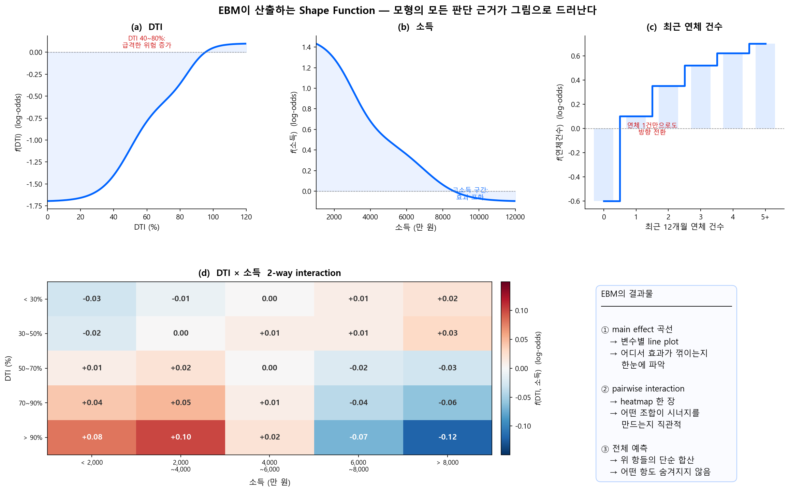

# EBM (GA²M) — Explainable Boosting Machine

## 4.1 핵심 사상 — "개별 먼저, 조합은 최소한으로"

EBM의 설계 철학은 명확하다: **변수 하나하나의 효과를 철저히 학습한 뒤, 그것만으로 설명되지 않는 잔차에서만 2변수 조합 효과를 추가한다.** 3변수 이상의 교호작용은 아예 고려하지 않는다. GA\(^2\)M의 "²"이 바로 이 제한을 뜻한다.

$$
F(\mathbf{x}) = F_0 + \underbrace{\sum_{j} f_j(x_j)}_{\text{1단계: main effects}} + \underbrace{\sum_{j < k} f_{jk}(x_j, x_k)}_{\text{2단계: pairwise interactions}}
\tag{1}
$$

왜 2-way까지만? **사람이 그림 한 장으로 이해할 수 있는 한계가 2차원**이기 때문이다. 2-way interaction은 heatmap(행 × 열에 색상) 한 장으로 직관적으로 보여줄 수 있다. 3-way부터는 4차원이 되어, 한 장의 그림으로는 표현할 수 없다. 해석 가능성을 위한 **의도적 제한**이다.

이러한 설계를 **ante-hoc**(라틴어 "사전에") 해석이라 부른다. 모형의 구조 자체가 Functional ANOVA 분해 형태로 학습되도록 제약을 거는 것이다. 이미 학습이 끝난 블랙박스 모형에 SHAP, PDP 등 외부 도구를 적용하는 **post-hoc**(라틴어 "사후에") 해석과 대비된다.

| | **ante-hoc** ("사전에") | **post-hoc** ("사후에") |
|---|---|---|
| **시점** | 모형 설계·학습 단계 | 학습 완료 후 |
| **방식** | 구조적 제약으로 해석 가능성 **내장** | 외부 도구로 해석 **추출** |
| **예시** | EBM, 1-Depth GBM, 로지스틱 회귀 | SHAP, PDP, Surrogate, Purification |

그래서 EBM을 돌리면 무엇이 나오는가? 아래 그림이 그 답이다.

<figure markdown="span">
  { width="900" }
  <figcaption>EBM의 결과물: 각 변수의 main effect는 곡선 하나로, 2-way interaction은 heatmap 한 장으로 표현된다. 모형의 전체 예측은 이 항들의 단순 합산이므로, 어떤 판단 근거도 숨겨지지 않는다.</figcaption>
</figure>

main effect 곡선 (a~c)을 보면, **각 변수가 모형의 예측에 미치는 영향을 한눈에 읽을 수** 있다. DTI는 40~80%에서 급등하고, 소득은 고소득 구간에서 포화되며, 연체는 1건만으로도 방향이 전환된다. 이것이 변수마다 독립적인 shape function \(f_j(x_j)\)다.

2-way interaction heatmap (d)은 main effect만으로 설명되지 않는 **조합 효과**를 보여준다. 고DTI + 저소득 구간에서 시너지로 위험이 추가 증가하는 패턴이 격자의 색상으로 드러난다.

---

## 4.2 EBM vs 일반 GBM

EBM은 일반적인 gradient boosting과 근본적으로 다른 방식으로 학습한다.

| | 일반 GBM | EBM |
|---|---|---|
| **변수 선택** | 매 스텝에서 최적 변수 선택 | **Round-robin**: 변수를 순서대로 돌아가며 학습 |
| **Bagging** | 단일 또는 외부 bagging | **Inner bagging + Outer bagging** (각 25+회) |
| **결과** | 변수 간 효과가 섞일 수 있음 | 각 변수의 효과가 깔끔하게 분리됨 |
| **교호작용** | 트리 깊이에 따라 자동 | 선택적으로 2-way만 추가 (FAST 알고리즘) |

Round-robin 방식은 각 변수의 shape function \(f_j\)를 더 안정적이고 깔끔하게 만든다. 이것이 EBM이 단순 1-Depth XGBoost보다 **해석 품질이 높은** 이유다.

출처: Nori, H., Jenkins, S., Koch, P., and Caruana, R. (2019). "InterpretML: A Unified Framework for Machine Learning Interpretability." arXiv:1909.09223.
<a href="https://arxiv.org/abs/1909.09223" target="_blank">arXiv</a> ·
<a href="https://github.com/interpretml/interpret" target="_blank">GitHub</a>

---

## 4.3 학술적 계보: Lou-Caruana 연구 (Microsoft Research)

EBM의 현대적 기반은 Microsoft Research의 **Rich Caruana** 그룹이 만들었다.

### Lou et al. (2012) --- 최적 GAM 적합법 비교

Lou, Caruana, Gehrke는 다양한 GAM 적합 방법(spline, tree 등)을 대규모로 비교하고, **adaptive number of leaves를 가진 bagged tree + gradient boosting** 기반의 새로운 방법을 제안하여 기존 GAM 적합법을 일관되게 능가함을 실증했다. 이것이 1-Depth GBM을 GAM의 핵심 엔진으로 자리잡게 한 논문이다.

출처: Lou, Y., Caruana, R., and Gehrke, J. (2012). "Intelligible Models for Classification and Regression." <em>KDD 2012</em>.
<a href="https://www.cs.cornell.edu/~yinlou/papers/lou-kdd12.pdf" target="_blank">PDF</a>

### Lou et al. (2013) --- GA\(^2\)M: 2-way 교호작용 추가

순수 GAM(1-Depth)은 교호작용을 포착하지 못한다. Lou et al.은 **GA\(^2\)M** (GAM + pairwise interactions)을 제안하여, 선택된 2-way 교호작용만 추가하면 블랙박스 모형과의 성능 격차를 상당 부분 줄일 수 있음을 보였다.

$$
F(\mathbf{x}) = F_0 + \sum_{j} f_j(x_j) + \sum_{j < k} f_{jk}(x_j, x_k)
\tag{2}
$$

출처: Lou, Y., Caruana, R., Gehrke, J., and Hooker, G. (2013). "Accurate Intelligible Models with Pairwise Interactions." <em>KDD 2013</em>.
<a href="https://dl.acm.org/doi/10.1145/2487575.2487579" target="_blank">논문 링크</a>

### Caruana et al. (2015) --- "해석 가능한 모형이 생명을 구한다"

이 논문은 해석 가능한 ML의 필요성을 가장 강력하게 보여준 사례로 널리 인용된다.

폐렴 위험 예측에 GA\(^2\)M을 적용한 결과, 모형이 **"천식 환자의 폐렴 사망 위험이 낮다"**는 패턴을 학습했다. 이는 실제로는 천식 환자가 더 적극적인 치료를 받았기 때문에 나타난 데이터 편향이었다. 블랙박스 모형은 이 위험한 패턴을 숨기지만, GAM 구조 덕분에 임상의가 즉시 식별하고 교정할 수 있었다.

!!! warning "신용평가에서도 같은 위험이 존재한다"
    예컨대, 기존 대출 거절 데이터로 학습한 모형이 "특정 직업군은 부도율이 낮다"고 학습할 수 있지만, 이는 해당 직업군이 이미 심사에서 걸러졌기 때문일 수 있다. 해석 가능한 모형만이 이런 **selection bias**를 사전에 발견할 수 있다.

출처: Caruana, R., Lou, Y., Gehrke, J., Koch, P., Sturm, M., and Elhadad, N. (2015). "Intelligible Models for HealthCare." <em>KDD 2015</em>.
<a href="https://dl.acm.org/doi/10.1145/2783258.2788613" target="_blank">논문 링크</a>

---

## 4.4 2-Stage 학습

### 1단계 — 변수 하나씩, 철저하게

변수를 하나씩 순환(round-robin)하면서, 각 변수에 대해 **단일 변수만 사용하는 shallow tree(stump)**를 잔차에 적합한다:

- \(X_1\)으로 stump → \(X_2\)로 stump → ... → \(X_p\)로 stump → 다시 \(X_1\)부터
- **매우 낮은 learning rate**(0.01 수준)로 한 번에 조금씩만 학습한다. 변수 순서가 결과에 미치는 영향을 최소화하기 위한 것이다
- 이것을 수천~수만 라운드 반복한다

각 트리가 변수 1개만 분할하므로, 이 단계에서 학습된 함수는 구조적으로 GAM(\(f_0 + \sum f_i(x_i)\))이다. 여기까지는 교호작용이 **원천적으로 불가능**하다.

### 2단계 — 효과 큰 변수 쌍만 빠르게 골라서 (FAST)

1단계 예측으로 설명되지 않은 잔차에서, 이번에는 **2변수 조합**의 교호작용을 학습한다. 그런데 변수가 20개면 가능한 쌍이 \(\binom{20}{2} = 190\)개다. 이것을 전부 학습하면 해석력이 사라지므로, **효과가 큰 쌍만 선별**해야 한다.

이때 쓰이는 것이 **FAST 알고리즘**(Lou et al., KDD 2013)이다:

1. 190개 쌍 전부에 대해, 각 변수를 1번씩만 split하는 **2×2 격자(4칸짜리 모델)**를 잔차에 적합
2. 이 4칸 모델은 학습이 거의 즉시 끝나므로 190개를 빠르게 훑을 수 있음
3. 각 쌍의 RSS(잔차제곱합) 감소량으로 interaction 강도를 랭킹
4. **상위 K개만 선택**해서 본격적으로 2변수 shallow tree로 학습

---

## 4.5 효과 누출과 Purification

### 그래도 누출은 발생한다

EBM의 2-stage 설계 덕분에 일반 XGBoost depth-2보다는 누출이 적다. 그러나 **완전히 없지는 않다:**

- 1단계가 유한 라운드에서 끝나므로, main effect가 100% 학습되지 않을 수 있다. 학습되지 못한 main effect는 잔차에 남는다
- 2단계 tree가 그 잔차를 학습할 때, 남은 main effect와 순수 교호작용을 **구분하지 않고** 함께 흡수한다

Lengerich et al. (2020)의 **MIMIC-III 실험**에서 이를 확인했다: BUN(혈중요소질소) 변수가 다수의 interaction에 참여하고 있었는데, purification 전후로 main effect shape function이 **크게 변했다.** 논문의 표현을 빌리면:

> "even though the GA2M algorithm was designed to estimate interactions based only on residuals after estimating main effects, the interaction terms still capture some main effects."

### Purification으로 잔여 누출 보정

이 잔여 누출을 보정하려면, 학습 후 **purification**을 적용하면 된다.

- **InterpretML (EBM)**: 학습 후 purification이 자동 적용되지 않는다. `interpret.utils.purify()`를 **명시적으로 호출**해야 정화된 shape function을 얻을 수 있다
- [GAM Purification](https://github.com/LengerichLab/gam_purification) 별도 라이브러리로도 적용 가능

purification 후 각 \(f_j\)는 순수 주효과를, 각 \(f_{jk}\)는 순수 교호작용만 포함하며, 모형의 전체 예측값은 변하지 않는다.

출처: Lengerich, B., Tan, S., Chang, C.-H., Hooker, G., and Caruana, R. (2020). "Purifying Interaction Effects with the Functional ANOVA." <em>AISTATS 2020</em>.
<a href="https://arxiv.org/abs/1911.04974" target="_blank">arXiv</a>

!!! abstract "Purification 알고리즘 상세"
    Purification이 구체적으로 어떻게 작동하는지 — Mass-Moving 알고리즘, 수렴 정리, 비균등 가중 예시 등은 [부록 A: SHAP과 Functional ANOVA](../appendix/shap-fanova/index.md)에서 다룬다.

!!! tip "다음 페이지"
    [fANOVA 개념과 Purification](fanova_concepts.md) --- 분배(SHAP) vs 분리(fANOVA), Variance Decomposition, Purification 직관을 다룬다.
