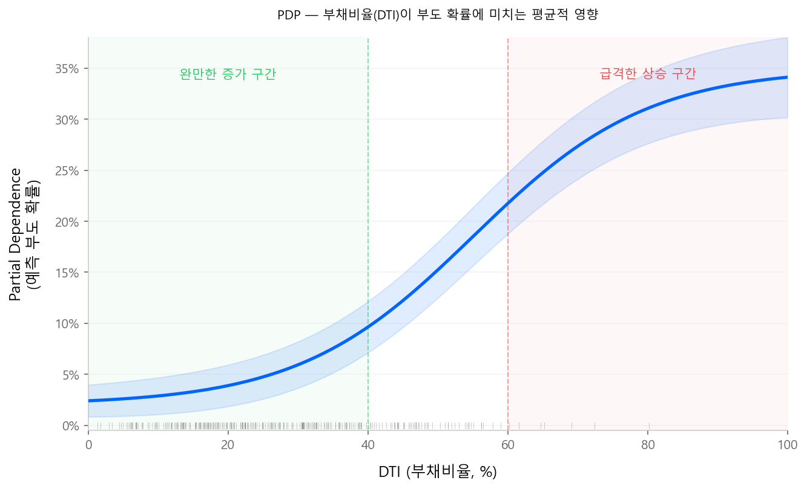
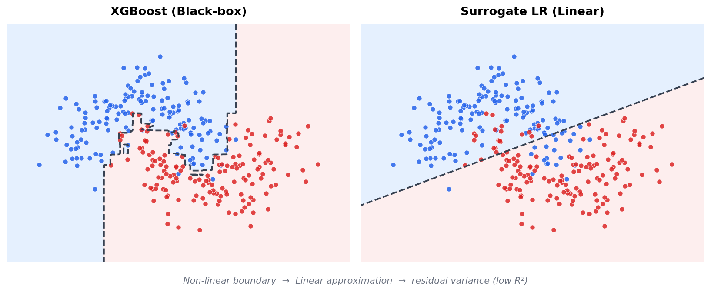
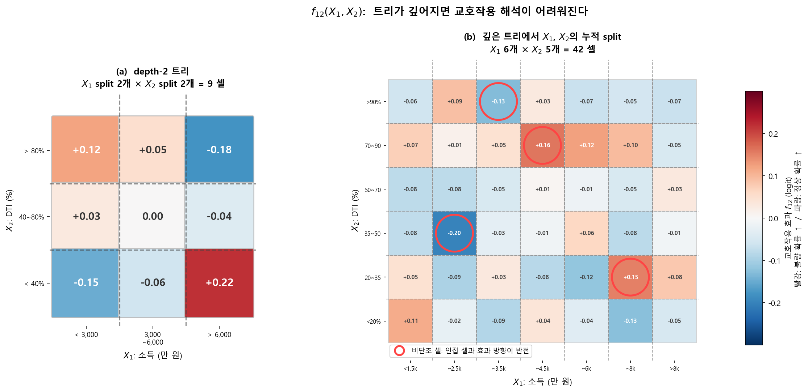
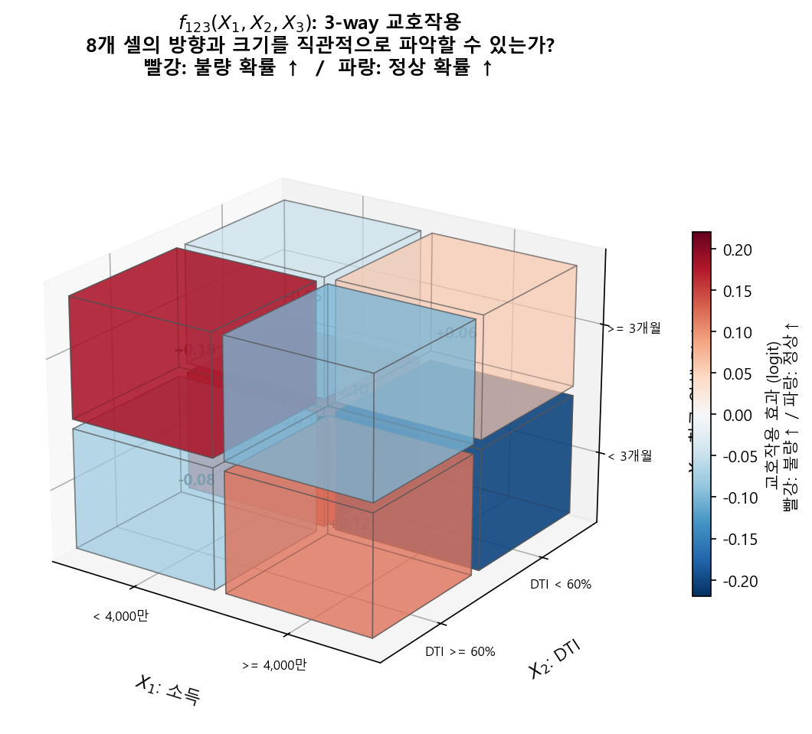

# 해석 가능성 (Interpretability)

!!! quote "저자 노트"
    해석 가능성(Interpretable ML)은 그 자체로 하나의 분야다. 이 페이지에서는 신용평가 실무에 필요한 **핵심 개념과 도구**만 간결하게 다룬다. 더 깊은 이해가 필요하다면 Christoph Molnar의 **[Interpretable Machine Learning](https://christophm.github.io/interpretable-ml-book/)**을 강력히 추천한다. 저자 본인도 이 책으로 많은 공부를 했으며, ML 해석 가능성에 관한 가장 체계적이고 접근하기 쉬운 자료라고 생각한다.

---

## 1.1 XAI란 무엇인가

**XAI(eXplainable Artificial Intelligence)**는 AI 모형의 의사결정 과정을 사람이 이해할 수 있도록 만드는 기술과 방법론의 총칭이다. 블랙박스 모형이 "무엇을" 예측했는지뿐 아니라, **"왜" 그렇게 예측했는지**를 설명하는 것이 핵심이다.

### 용어 정리

실무에서 혼용되지만, 학술적으로는 구분되는 개념들이 있다.

| 용어 | 영문 | 의미 |
|------|------|------|
| **해석 가능성** | Interpretability | 모형의 작동 원리를 사람이 직접 이해할 수 있는 정도. 로지스틱 회귀, 의사결정나무 등 **모형 자체가 투명**한 경우 |
| **설명 가능성** | Explainability | 블랙박스 모형에 **사후적으로 설명을 부여**하는 것. SHAP, LIME 등 별도의 설명 도구를 사용 |
| **투명성** | Transparency | 모형의 학습 과정, 데이터, 의사결정 로직이 공개되어 있는 정도 |
| **공정성** | Fairness | 모형이 특정 집단(성별, 인종 등)에 대해 체계적 차별을 하지 않는 성질 |

!!! note "Interpretability vs Explainability"
    **해석 가능한(Interpretable)** 모형은 별도 도구 없이 구조 자체로 이해된다 — 스코어카드가 대표적이다.
    **설명 가능한(Explainable)** 모형은 그 자체로는 이해하기 어렵지만, SHAP 등 외부 도구로 사후 설명이 가능하다.
    XAI는 이 두 가지를 모두 포괄하는 상위 개념이다.

### 모형 복잡도와 해석 가능성의 트레이드오프

```
해석 가능성  높음 ◀━━━━━━━━━━━━━━━━━━━━━━━━━━▶ 낮음
                │          │            │           │
            선형 회귀    의사결정나무    Random     Deep
            스코어카드                  Forest     Learning
                │          │            │           │
예측 성능    낮음 ◀━━━━━━━━━━━━━━━━━━━━━━━━━━▶ 높음
```

전통 스코어카드(로지스틱 회귀)는 **Interpretable by design**이다. 반면 트리 앙상블이나 딥러닝은 성능은 높지만 자체 해석이 어려워, **XAI 기법이 필수**가 된다.

---

## 1.2 왜 해석이 필요한가

전통 로지스틱 회귀 스코어카드는 태생적으로 해석이 쉽다. 각 변수의 WoE × β가 곧 점수이고, 점수표 한 장으로 "왜 이 고객이 이 등급인지" 설명할 수 있다.

트리 앙상블(XGBoost, LightGBM)은 수백~수천 개의 트리를 합산한 결과이므로, **모형 내부를 직접 들여다보는 것이 불가능**하다. 그러나 해석의 필요성은 사라지지 않는다.

| 이해관계자 | 요구 |
|-----------|------|
| **규제 기관** | "이 모형이 차주를 차별하지 않는다"는 근거 |
| **심사 담당자** | "왜 이 고객이 거절되었는가"에 대한 사유 |
| **모형 개발자** | 모형이 합리적인 패턴을 학습했는지 검증 |
| **경영진** | 모형 도입의 근거와 리스크 |

---

## 1.3 해석의 범위 — Global과 Local

ML 해석 도구는 **범위(scope)**에 따라 두 축으로 나뉜다 (Molnar, 2022).

| | **Global** | **Local** |
|---|---|---|
| **질문** | "모형은 전체적으로 어떻게 작동하는가?" | "이 고객은 왜 이 점수를 받았는가?" |
| **대상** | 모형 전체 | 개별 예측 건 |
| **용도** | 모형 검증, 변수 중요도, 감독기관 보고 | 거절 사유, 심사 설명, 민원 대응 |
| **대표 도구** | Feature Importance, PDP, Surrogate, mean(\|SHAP\|) | ICE, LIME, SHAP Waterfall |

신용평가에서는 두 축이 모두 필요하다. **Global 해석**은 "이 모형이 합리적인 패턴을 학습했는가"를 검증하고, **Local 해석**은 "이 고객이 거절된 이유"를 설명한다.

---

!!! info "Global 해석 — 모형 전체의 행동을 이해한다"
    모형이 **전체적으로** 어떤 변수를 중요하게 보고, 어떤 패턴을 학습했는지 파악한다.

#### Feature Importance (Split / Gain)

트리 앙상블에 내장된 가장 기본적인 변수 중요도 지표다.

- **Split Importance**: 각 변수가 트리 분할에 사용된 **횟수**
- **Gain Importance**: 각 변수가 분할 시 획득한 **불순도 감소(gain)의 합**

Gain이 더 정보적이지만, 카디널리티가 높은 변수(범주 수가 많은 변수)에 편향되는 경향이 있다. 빠른 개요용으로 유용하나, 변수의 **방향(양/음)**이나 효과 크기를 알 수 없다는 한계가 있다.

#### Permutation Importance

변수 하나의 값을 무작위로 셔플한 뒤, 모형 성능(KS, AR 등)의 **하락 폭**으로 중요도를 측정하는 방법이다.

- **Model-agnostic**: 어떤 모형에든 적용 가능
- Feature Importance와 달리 **모형 성능 기준**이므로, 실제 예측에 대한 기여를 더 직접적으로 반영
- 변수 간 상관이 높으면 중요도가 분산되는 문제가 있다

<div class="source-ref">
출처: Breiman, L. (2001). "Random Forests." <em>Machine Learning</em>, 45:5-32. Permutation Importance 개념을 최초로 제안.
</div>

#### PDP (Partial Dependence Plot)

**특정 변수가 예측에 미치는 평균적 영향**을 시각화하는 도구다.

변수 \(x_s\)의 Partial Dependence:

$$
\hat{f}_s(x_s) = \frac{1}{N} \sum_{i=1}^{N} \hat{f}(x_s, x_{C}^{(i)})
\tag{1}
$$

- \(x_s\): 관심 변수 (고정할 값을 바꿔가며)
- \(x_C^{(i)}\): 나머지 변수 (데이터의 실제 값 그대로)
- 모든 샘플에 대해 관심 변수만 바꾸고, 예측값의 평균을 구함

!!! example "신용평가 예시"
    "부채비율(DTI)"의 PDP를 그리면, DTI가 증가함에 따라 예측 부도 확률이 어떻게 변하는지 평균적 경향을 볼 수 있다. DTI 40%까지는 완만하게 증가하다가 60%를 넘으면 급격히 상승하는 패턴이 보인다면, 모형이 합리적인 관계를 학습했다고 판단할 수 있다.

<figure markdown="span">
  { width="720" }
  <figcaption>DTI 40%까지는 완만하게 증가하다가 60%를 넘으면 급격히 상승하는 전형적인 PDP 패턴. 파란 음영은 95% 신뢰 구간, 하단 rug plot은 DTI 분포를 나타낸다.</figcaption>
</figure>

**PDP의 한계:**

- **변수 간 상호작용을 무시**: 다른 변수를 고정한 상태의 평균이므로, 교호작용 효과가 상쇄됨
- **상관된 변수 문제**: DTI와 소득이 강하게 상관되어 있을 때, DTI를 극단값으로 설정하면서 소득은 원본 그대로 유지하는 비현실적 조합이 발생

#### Surrogate Model (대리 모형)

블랙박스 ML 모형의 예측값을 종속변수로 놓고, **해석 가능한 모형(로지스틱 회귀 등)으로 근사**하여 설명하는 전략이다. ML의 성능은 유지하면서, 설명은 전통적 스코어카드 형태로 제공한다.

> **ML 모형 학습** → **\(\hat{p}\) 산출** → **스코어 변환** → **스코어를 종속변수로 LR 적합** → **스코어카드 생성**

<figure markdown="span">
  { width="680" }
  <figcaption>XGBoost는 비선형 결정 경계를 포착하지만, Surrogate LR은 직선 하나로만 근사한다. 두 경계 사이의 괴리가 곧 낮은 R²의 원인이다.</figcaption>
</figure>

대리 모형의 \(R^2\)가 낮은 것은 결함이 아니라 **구조적 한계**다. XGBoost가 잡아내는 비선형 교호작용과 고차 분기 효과를 가법 선형 구조로 재현하는 것은 원리적으로 불가능하기 때문이다.

$$
\underbrace{\text{Score}_{\text{ML}}}_{\text{비선형 + 교호작용}} \approx \underbrace{\beta_0 + \sum_j \beta_j \cdot \text{WoE}_j}_{\text{가법 선형 구조}} + \underbrace{\epsilon}_{\text{설명 불가 잔차}}
$$

이 접근에 대해서는 **찬반 논쟁**이 있다. 규제 프레임워크(SR 11-7, EBA 가이드라인)에 부합하는 익숙한 포맷이라는 장점이 있지만, Sudjianto & Zhang (2021, Wells Fargo)은 본질적 딜레마를 지적한다 — 대리 모형이 원래 모형을 **잘 근사하면** "그냥 그 모형을 쓰면 되고", **못 근사하면** 설명이 misleading이 된다. 이들은 대안으로 **내재적으로 해석 가능한 ML**(1-Depth GBM, EBM 등)을 옹호한다.

!!! note "참고 자료"
    - **[Dumitrescu et al. (2022, EJOR)](https://www.sciencedirect.com/science/article/abs/pii/S0377221721005695)** — PLTR: 트리 규칙 + 페널티 LR 하이브리드
    - **[Sudjianto & Zhang (2021)](https://www.semanticscholar.org/paper/Designing-Inherently-Interpretable-Machine-Learning-Sudjianto-Zhang/90409ae91767248e9ea88b7d6ab44e18f0e1a9be)** — 내재적 해석 가능 ML 옹호 (Wells Fargo)
    - **[xbooster](https://github.com/deburky/boosting-scorecards)** — XGBoost 리프 노드 → 스코어카드 포인트 직접 변환

#### mean(|SHAP|)

각 변수의 SHAP value에 절댓값을 취하고 전체 샘플에 대해 평균을 내면, **globally 해석 가능한 변수 중요도**가 된다.

$$
\text{Importance}_j = \frac{1}{n} \sum_{i=1}^{n} |\phi_j^{(i)}|
$$

절댓값을 취하므로 변수가 예측을 높이는지 낮추는지(방향)는 알 수 없고, **양의 방향이든 음의 방향이든 해당 변수가 예측에 얼마나 영향을 미치는지(크기)**만 측정한다. 방향까지 보려면 Beeswarm(Summary Plot)을 함께 확인해야 한다.

<figure markdown="span">
  { width="560" }
  <figcaption>mean(|SHAP|) Bar Plot — California Housing 데이터 예시. 변수별 |SHAP value|의 평균을 내림차순으로 정렬한 것으로, Global 변수 중요도의 가장 기본적인 시각화다.<br>
  <span style="font-size:0.85em; color:#888;">출처: <a href="https://github.com/shap/shap" target="_blank">SHAP GitHub</a> (MIT License)</span></figcaption>
</figure>

---

!!! info "Local 해석 — 개별 예측을 설명한다"
    **특정 고객 한 명**의 예측이 왜 이 값인지, 어떤 변수가 기여했는지 설명한다.

#### ICE (Individual Conditional Expectation)

PDP의 **개별 버전**이다. PDP가 전체 샘플의 평균 효과를 하나의 곡선으로 보여준다면, ICE는 **각 샘플의 개별 곡선**을 모두 그린다. PDP 곡선 위에 ICE를 겹쳐 그리면, 변수 효과의 이질성(heterogeneity)을 시각적으로 확인할 수 있다 — ICE 곡선들이 서로 교차하면 **교호작용이 존재한다는 신호**다.

<div class="source-ref">
출처: Goldstein, A., Kapelner, A., Bleich, J., and Pitkin, E. (2015). "Peeking Inside the Black Box." <em>JCGS</em>, 24(1):44-65.
</div>

#### LIME (Local Interpretable Model-agnostic Explanations)

개별 예측 주변의 데이터를 **섭동(perturbation)**하여 해석 가능한 대리 모형을 적합하고, 해당 예측에 가장 영향을 미친 변수를 식별하는 방법이다. Model-agnostic이라는 장점이 있지만, 섭동 방식과 이웃(neighborhood) 정의에 따라 결과가 달라지는 **안정성 문제**가 지적된다.

<div class="source-ref">
출처: Ribeiro, M.T., Singh, S., and Guestrin, C. (2016). "Why Should I Trust You?" <em>KDD 2016</em>.
<a href="https://arxiv.org/abs/1602.04938" target="_blank">arXiv</a>
</div>

#### SHAP Waterfall

개별 차주의 예측을 **base value**(전체 평균)에서 시작하여, 각 변수의 기여를 순차적으로 누적하는 시각화다. 하나의 예측이 "왜 이 값인지"를 변수별로 분해하여 보여주므로, **거절 사유 설명**에 가장 직관적인 도구다.

!!! tip "SHAP 시각화 상세"
    Waterfall Plot의 실제 예시와 함께, Bar Plot · Beeswarm · Force Plot · Dependence Plot 등 SHAP의 주요 시각화를 [SHAP 이론 — 2.4 SHAP 시각화](shap_theory.md#24-shap-시각화)에서 상세히 다룬다.

---

## 1.4 해석 가능한 ML 모형의 실무적 조건

### 두 가지 활용 경로

머신러닝 모형을 신용평가에 도입할 때, 해석 요구 수준에 따라 경로가 갈린다.

**경로 1 — 성능 극대화 (전략모형)**

비선형성을 충분히 반영한 모형(예: max depth 7 이상의 GBM)은 KS, AR 등 변별력 지표가 극대화된다. 이 모형은 기존 스코어카드 위에 얹어서 승인/거절 경계를 보정하는 **override 용도**로 활용할 수 있다. 개별 변수의 효과를 설명할 필요 없이, "이 고객의 최종 스코어가 몇 점인가"만 중요한 맥락이다. 이 경우에도 SHAP value를 통한 **local interpretation은 가능**하므로, 거절 사유 제공 등 규제 대응에 활용할 수 있다.

**경로 2 — 해석 충실 (평점모형)**

모형의 **global structure** — 각 변수의 효과 방향, 교호작용의 존재와 크기 — 를 사람이 직접 검토하고 납득할 수 있어야 하는 경우다. 심사역이 shape function을 보고 "이 변수는 이런 방향으로 작용한다"고 확인할 수 있어야 한다. 이 경우 아래 세 가지 조건이 필요하다.

!!! info "조건 1 — 변수당 bin 수를 제한한다 (≤ 5)"
    bin이 많아질수록 interaction heatmap의 셀 수가 폭발하여 사람이 패턴을 읽을 수 없다.

각 feature를 **5개 이하**의 구간으로 binning해야 한다.

왜 5개인가? 2차 교호작용을 고려하면 답이 나온다. 변수 2개가 각각 5구간이면, interaction heatmap은 5×5 = 25칸이다. 25칸 정도면 사람이 패턴을 눈으로 읽을 수 있다. 10구간이면 100칸, 20구간이면 400칸 — 이론적으로는 purification이 되지만, **사람이 heatmap 한 장을 보고 패턴을 파악하기란 사실상 불가능**하다.

!!! info "조건 2 — 교호작용을 2차원으로 한정한다"
    2-way까지는 heatmap 한 장으로 보여줄 수 있지만, 3-way부터는 불가능하다.

interaction term의 차수를 **최대 2-way**로 제한해야 한다.

- **2-way interaction**: heatmap(행 × 열 + 색상) 한 장으로 표현 가능
- **3-way interaction**: 큐브(행 × 열 × 깊이 + 색상) — 4차원이 되어 한 장의 그림으로 표현 불가

<figure markdown="span">
  { width="780" }
  <figcaption>2-way interaction은 heatmap 한 장으로 패턴이 보인다. 왼쪽(depth-2)은 9칸으로 명쾌하지만, 오른쪽(depth-5+)은 42칸으로 비단조 구간이 발생하며 해석이 어려워진다.</figcaption>
</figure>

<figure markdown="span">
  { width="480" }
  <figcaption>3-way interaction은 3차원 큐브가 된다. 8개 셀의 방향과 크기를 직관적으로 파악하기 어렵다.</figcaption>
</figure>

EBM(GA²M)이 의도적으로 2-way까지만 허용하는 것도 이 이유다.

!!! info "조건 3 — 단조성 (Monotonicity)"
    비단조 패턴이 과적합인지 실제인지 판단하기 어렵다. 단조 제약으로 해석력과 안정성을 확보한다.

트리가 자유롭게 학습하면 "소득 3,000만 이하에서는 부도율 증가, 3,000~5,000만에서 감소, 5,000만 이상에서 다시 증가" 같은 비단조 패턴이 나올 수 있다. 이것이 과적합인지 실제 패턴인지를 심사역이 판단해야 하는데, bin이 많아질수록 비단조 패턴의 가짓수가 폭발한다.

`monotone_constraints` 파라미터로 단조 제약을 거는 것은 해석력과 안정성을 동시에 확보하는 방법이다. 상세는 [1-Depth GBM 스코어카드](depth1_gbm.md)를 참조한다.

### 왜 트리 모형인가

이 세 조건을 거치면, 신용평가에서 **트리 기반 모형을 선호할 수밖에 없는 이유**가 명확해진다:

- **해석의 용이성**: shape function, feature importance, interaction heatmap 등 해석 도구가 자연스럽게 따라온다
- **Post-hoc 처리의 간결함**: 트리의 leaf를 bin으로 취급해서 텐서를 만들고, 가중평균을 빼는 것만으로 fANOVA 분해(purification)가 완성된다
- **자동 구간화**: 연속 변수를 discretize하는 과정을 트리가 자동으로 해주므로, 별도의 binning 없이 바로 purification에 넘길 수 있다

신경망이나 다른 비선형 모형에서 같은 수준의 post-hoc 해석을 하려면, 먼저 함수를 piecewise-constant로 근사하는 추가 단계가 필요하다. 트리는 이것이 **구조적으로 이미 되어 있다.**

!!! tip "다음 페이지"
    [SHAP 이론](shap_theory.md) --- Shapley Value의 수학적 배경과 TreeSHAP 알고리즘을 다룬다.
