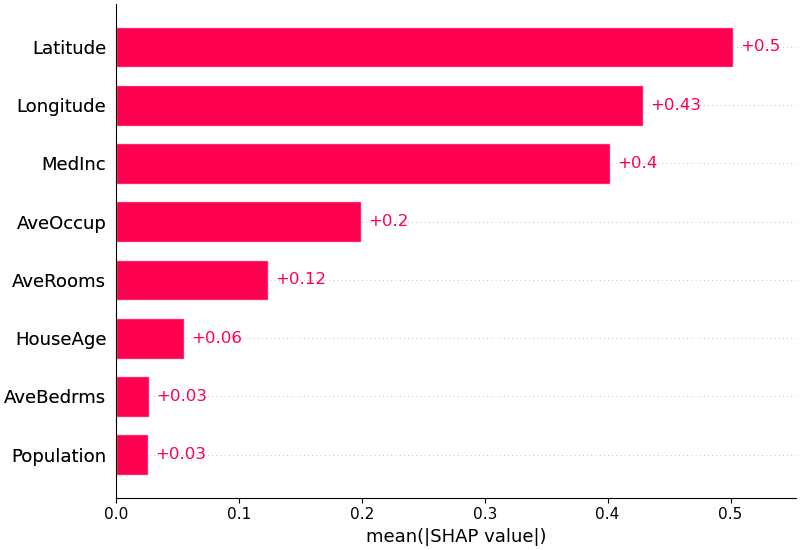
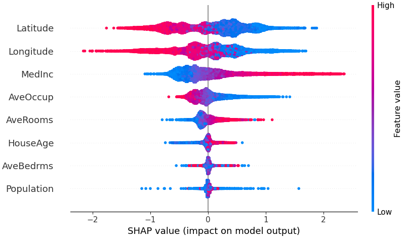
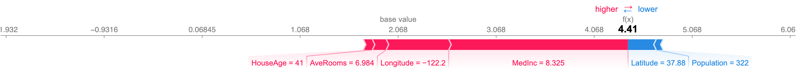
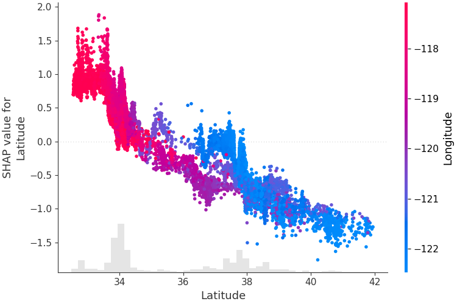

# SHAP 이론

[Lundberg & Lee (2017)](https://arxiv.org/abs/1705.07874)가 제안한 SHAP(SHapley Additive exPlanations)은 현재 **ML 해석의 사실상 표준**이다. 게임이론의 Shapley Value를 ML에 적용하여, 개별 예측값을 변수별 기여분으로 정확히 분해한다.

---

## 2.1 Shapley Value의 직관

> "각 변수가 예측에 기여한 공정한 몫은 얼마인가?"

5명이 팀 프로젝트를 했는데 최종 점수가 90점이다. 각자의 기여도를 공정하게 분배하고 싶다면?

Shapley Value의 방법: **모든 가능한 팀 조합에서, 해당 멤버가 참여할 때와 참여하지 않을 때의 점수 차이를 평균**낸다.

변수 \(j\)의 SHAP value:

$$
\phi_j = \sum_{S \subseteq \{1,...,p\} \setminus \{j\}} \frac{|S|!(p-|S|-1)!}{p!} \left[\hat{f}(S \cup \{j\}) - \hat{f}(S)\right]
\tag{1}
$$

- \(S\): 변수 \(j\)를 제외한 변수들의 부분집합
- \(\hat{f}(S)\): 집합 \(S\)에 포함된 변수만 "참여"했을 때의 모형 기대값
- 가중치 \(\frac{|S|!(p-|S|-1)!}{p!}\)는 해당 조합이 나타날 확률 — 모든 순열에서 균등하게 가중

!!! example "신용평가 직관"
    차주 A의 부도 확률 예측이 15%이고, 전체 평균이 5%라면, 10%p 차이를 만든 "공범"은 누구인가? SHAP은 DTI가 +4%p, 연체일수가 +3%p, 소득이 +2%p, 나머지 변수가 +1%p 기여했다는 식으로, **각 변수의 몫을 공정하게 분배**한다.

---

## 2.2 SHAP의 핵심 성질

Shapley Value는 다음 4가지 공리를 **유일하게** 만족하는 분배 방법이다.

| 성질 | 의미 |
|------|------|
| **Efficiency** (효율성) | 모든 변수의 SHAP 합 = 예측값 - 기대값 |
| **Symmetry** (대칭성) | 기여가 동일한 변수는 같은 SHAP 값 |
| **Dummy** (무관 변수) | 예측에 영향 없는 변수의 SHAP = 0 |
| **Additivity** (가산성) | 앙상블의 SHAP = 개별 모형 SHAP의 평균 |

### Efficiency가 특히 중요하다

$$
\hat{f}(x) = \underbrace{E[\hat{f}(X)]}_{\text{base value}} + \sum_{j=1}^{p} \phi_j(x)
\tag{2}
$$

개별 예측값이 **기대값(base value) + 각 변수의 기여분**으로 정확히 분해된다. 남거나 빠지는 것이 없다. 이것이 SHAP을 단순 변수 중요도 이상의 도구로 만드는 성질이다.

여기서 \(E[\hat{f}(X)]\)는 **학습 데이터(training set) 전체에 대한 모형 예측의 평균**이다[^base_value]. 모든 관측치의 "출발점"이 이 평균이고, SHAP value는 **각 관측치가 평균에서 얼마나, 왜 벗어나는가**를 변수별로 분해한 것이다.

[^base_value]: 엄밀히는, TreeSHAP의 기본 모드(`tree_path_dependent`)에서는 트리 내부의 node sample count를 기반으로 기대값을 계산하므로, bootstrap sampling 등의 영향으로 `model.predict(X_train).mean()`과 미세하게 다를 수 있다. 정확히 일치시키려면 `feature_perturbation="interventional"` 모드를 사용한다.

### 숫자 예시 — SHAP value가 예측을 분해하는 과정

DTI, 연체일수, 소득 3개 변수를 사용하는 부도 예측 모형을 생각하자. 학습 데이터 전체의 평균 부도확률이 5%라면, log-odds 공간에서:

$$
E[\hat{f}(X)] = \ln\!\left(\frac{0.05}{0.95}\right) \approx -2.94
$$

이제 3명의 차주에 대해 SHAP value를 계산하면, 다음과 같은 **SHAP value matrix**가 산출된다:

| 차주 | \(\phi_{\text{DTI}}\) | \(\phi_{\text{연체}}\) | \(\phi_{\text{소득}}\) | SHAP 합계 | \(E[\hat{f}]+\sum\phi\) | 부도확률 |
|:---:|---:|---:|---:|---:|---:|---:|
| A | +0.8 | +1.2 | +0.3 | **+2.3** | -0.64 | **34.5%** |
| B | -0.3 | +0.1 | -0.5 | **-0.7** | -3.64 | **2.6%** |
| C | +0.2 | -0.1 | +0.0 | **+0.1** | -2.84 | **5.5%** |

**읽는 법:**

- **차주 A**: 평균(-2.94)에서 DTI가 +0.8, 연체가 +1.2, 소득이 +0.3을 밀어올려 최종 -0.64(부도확률 34.5%)에 도달. "연체일수가 가장 큰 위험 요인"
- **차주 B**: DTI가 -0.3, 소득이 -0.5로 끌어내려 -3.64(부도확률 2.6%). "소득이 높아서 안전"
- **차주 C**: 평균과 거의 동일. 어떤 변수도 크게 밀어내지 않음

시각화하면 이 과정이 더 명확해진다. 차주 A를 예시로:

```
                     평균
  E[f̂(X)] = -2.94   │
                     │  DTI      +0.8
                     ├──────────→ -2.14
                     │  연체일수  +1.2
                     ├──────────────────→ -0.94
                     │  소득      +0.3
                     ├────────→ -0.64  = f̂(x_A)
                                        ↓
                                  부도확률 34.5%
```

**모든 관측치가 같은 출발점(평균)에서 시작하고, 각자의 변수값에 따라 다른 방향으로 이동하여 최종 예측에 도달한다.** 이 이동량의 합이 정확히 예측값 - 평균이 되는 것이 Efficiency 성질이다.

!!! note "4가지 공리의 유일성"
    이 4가지 공리를 동시에 만족하는 분배 방법은 Shapley Value뿐이다 (Shapley, 1953). 즉, "공정한 분배"를 이 4가지 조건으로 정의하면, SHAP은 **유일한 해**다.

---

## 2.3 왜 트리에서는 SHAP이 정확히 계산되는가

### 일반 모형의 문제 — KernelSHAP

Shapley Value 식 (1)을 정직하게 계산하려면, 변수 \(p\)개에 대해 **\(2^p\)개의 부분집합**을 전부 평가해야 한다. 변수가 20개면 약 100만 개, 50개면 약 \(10^{15}\)개 — 현실적으로 불가능하다.

KernelSHAP(Lundberg & Lee, 2017)은 이 문제를 **샘플링 + 가중 선형회귀**로 근사한다. 전체 \(2^p\)개 조합 중 일부만 뽑아서, 가중치를 준 선형 모형으로 SHAP을 추정한다. 어떤 모형이든 적용할 수 있다는 장점이 있지만:

- **느리다**: 관측치 하나당 수천~수만 회의 모형 호출이 필요
- **근사다**: 샘플링에 기반하므로 매번 결과가 약간 달라진다
- 변수가 많을수록 정확도가 떨어진다

### 트리의 특수한 구조 — TreeSHAP

**TreeSHAP** ([Lundberg et al., 2020](https://www.nature.com/articles/s42256-019-0138-9))은 트리 구조를 활용하여 \(2^p\)개 조합을 **전부 평가하지 않고도 정확한 값을 계산**한다. 왜 가능한가?

트리 모형에서 "변수 \(j\)가 참여하지 않는다"는 것은, 해당 변수의 분기점을 만났을 때 **양쪽 자식으로 다 내려가되, 각 자식의 데이터 비율로 가중 평균**을 취하는 것과 같다. 즉, 변수를 "빼는" 연산이 트리의 경로를 따라가면서 자연스럽게 정의된다.

```
         DTI < 40?
        /          \
      소득 < 300?    leaf: 0.02
      /       \
  leaf: 0.15  leaf: 0.08
```

이 트리에서 "DTI를 빼고 소득만 참여"시키려면:

- DTI 분기를 만나면 → 양쪽으로 다 내려감 (왼쪽 70%, 오른쪽 30%)
- 소득 분기를 만나면 → 실제 소득값에 따라 한쪽만 감

핵심은, 이 "양쪽으로 다 내려가면서 가중 평균" 연산이 **트리의 root에서 leaf까지 한 번만 순회**하면 모든 부분집합에 대해 동시에 계산된다는 것이다. \(2^p\)개를 하나씩 계산하는 대신, 트리 경로를 재귀적으로 순회하면서 **모든 조합의 기여분을 동시에 누적**한다.

결과적으로 복잡도는:

$$O(TLD^2)$$

- \(T\): 트리 수, \(L\): 평균 리프 수, \(D\): 트리 깊이

변수 수 \(p\)가 아니라 **트리 깊이 \(D\)**에만 의존하므로, 변수가 수백 개여도 빠르게 정확한 값을 얻는다.

### KernelSHAP vs TreeSHAP 비교

| | KernelSHAP | TreeSHAP |
|---|---|---|
| **적용 대상** | 어떤 모형이든 (model-agnostic) | 트리 기반 모형만 |
| **계산** | 샘플링 + 가중 선형회귀(WLS) (**근사**) | 트리 순회 (**정확**) |
| **속도** | 느림 (관측치당 수천 회 호출) | 빠름 (\(O(TLD^2)\)) |
| **결과 재현성** | 매번 미세하게 다름 | 항상 동일 |

### 실무적 의미

- XGBoost, LightGBM, CatBoost에 **내장**되어 있어 별도 근사 없이 정확한 값을 계산 가능
- 트리 기반 모형을 사용하는 신용평가에서는 사실상 TreeSHAP이 표준
- DNN 등 비트리 모형에서는 KernelSHAP이나 DeepSHAP을 사용해야 한다 — 이것이 트리 모형의 해석 측면에서의 또 하나의 이점이다

<div class="source-ref">
출처: Lundberg, S.M., Erion, G., Chen, H., et al. (2020). "From local explanations to global understanding with explainable AI for trees." <em>Nature Machine Intelligence</em>, 2:56-67.
<a href="https://www.nature.com/articles/s42256-019-0138-9" target="_blank">논문 링크</a>
</div>

---

## 2.4 SHAP 시각화

SHAP 라이브러리는 다양한 시각화를 제공한다. 각각의 용도가 다르다.

### Bar Plot — mean(|SHAP|)

**Global 변수 중요도**를 가장 간결하게 보여주는 시각화다. 각 변수의 |SHAP value|를 전체 샘플에 대해 평균내어 내림차순으로 정렬한다.

<figure markdown="span">
  { width="560" }
  <figcaption>Bar Plot — California Housing 데이터 예시. Latitude, Longitude, MedInc 순으로 모형 예측에 대한 기여가 크다.<br>
  <span style="font-size:0.85em; color:#888;">출처: <a href="https://github.com/shap/shap" target="_blank">SHAP GitHub</a> (MIT License)</span></figcaption>
</figure>

- 방향(양/음)은 알 수 없고, **절대적 기여 크기**만 보여준다
- 빠른 개요용으로 가장 많이 사용되며, 보고서의 "변수 중요도" 시각화에 적합

### Summary Plot (Beeswarm)

**Global 변수 중요도 + 방향**을 한 장에 보여주는 가장 대표적인 시각화다. 각 점은 하나의 샘플이며, x축은 SHAP value, 색상은 변수값의 크기를 나타낸다.

<figure markdown="span">
  { width="600" }
  <figcaption>Beeswarm Plot — California Housing 데이터 예시. 각 점이 하나의 관측치이며, x축이 SHAP value, 색상이 변수값(빨강=높음, 파랑=낮음)이다.<br>
  <span style="font-size:0.85em; color:#888;">출처: <a href="https://github.com/shap/shap" target="_blank">SHAP GitHub</a> (MIT License)</span></figcaption>
</figure>

- 변수 중요도 순서 (위에서 아래)
- 각 변수가 예측을 높이는지 낮추는지 (좌우 방향)
- 변수값과 기여도의 관계 (색상 패턴)

예를 들어, 위 그림에서 MedInc(중위소득)은 **값이 높을수록**(빨간 점) SHAP value가 양수(오른쪽)에 분포한다 — "소득이 높으면 주택 가격 예측이 올라간다"는 해석이 한눈에 드러난다.

### Waterfall Plot

**개별 예측 건**의 분해를 보여준다. base value(\(E[\hat{f}(X)]\))에서 출발하여 각 변수의 기여가 순차적으로 누적되어 최종 예측값에 도달하는 과정을 시각화한다.

<figure markdown="span">
  { width="500" }
  <figcaption>Waterfall Plot — 동일 데이터의 한 관측치에 대한 분해. base value 2.068에서 출발하여, MedInc가 +1.83, Longitude가 +0.64를 기여하여 최종 예측 4.413에 도달한다.<br>
  <span style="font-size:0.85em; color:#888;">출처: <a href="https://github.com/shap/shap" target="_blank">SHAP GitHub</a> (MIT License)</span></figcaption>
</figure>

- 거절 사유 설명에 가장 직관적
- 상위 N개 변수만 표시하고 나머지는 합산 가능

### Force Plot

Waterfall과 **같은 정보를 가로 레이아웃**으로 표현한 것이다. 빨간 화살표(예측을 높이는 변수)와 파란 화살표(낮추는 변수)가 base value에서 출발하여 양쪽에서 밀어붙이는 "힘겨루기"를 시각화한다.

<figure markdown="span">
  { width="700" }
  <figcaption>Force Plot — 위의 Waterfall과 동일한 관측치. base value 2.068에서 빨강(MedInc, Longitude 등)이 오른쪽으로 밀고, 파랑(Latitude, Population)이 왼쪽으로 밀어 최종 4.41에 도달한다.<br>
  <span style="font-size:0.85em; color:#888;">출처: <a href="https://github.com/shap/shap" target="_blank">SHAP GitHub</a> (MIT License)</span></figcaption>
</figure>

- Waterfall보다 직관적이지만, 변수가 많으면 가독성이 떨어진다
- 여러 관측치를 세로로 쌓아 **전체 데이터의 패턴**을 보는 것도 가능

### Dependence Plot

특정 변수의 **값(x축) vs SHAP value(y축)** 산점도다.

- 변수의 비선형 효과를 시각화
- 색상으로 교호작용 변수를 표시하면, 같은 변수값에서도 SHAP이 달라지는 원인을 확인 가능
- 1-Depth GBM에서는 이것이 곧 **shape function**과 동치

<figure markdown="span">
  { width="560" }
  <figcaption>Dependence Plot — Latitude의 SHAP value(y축) vs Latitude 값(x축). 색상은 교호작용 변수(Longitude)를 나타낸다. 같은 Latitude에서도 Longitude에 따라 SHAP이 달라지는 것이 교호작용의 증거다.<br>
  <span style="font-size:0.85em; color:#888;">출처: <a href="https://github.com/shap/shap" target="_blank">SHAP GitHub</a> (MIT License)</span></figcaption>
</figure>

!!! info "SHAP과 교호작용"
    Dependence Plot에서 점들이 하나의 곡선에 모이지 않고 퍼져 있다면, 교호작용이 존재한다는 신호다. SHAP은 이 교호작용을 각 변수에 **분배**한다 — 이것이 "같은 변수, 같은 값인데 차주마다 SHAP이 다른" 현상의 원인이다. 교호작용을 분배하지 않고 **분리**하는 접근(Functional ANOVA)에 대해서는 [fANOVA 개념과 Purification](fanova_concepts.md)에서 다룬다.

---

## 2.5 참고 자료

| 자료 | 유형 | 내용 |
|------|------|------|
| **[Lundberg & Lee (2017)](https://arxiv.org/abs/1705.07874)** | 논문 (NeurIPS) | SHAP 최초 제안. Shapley Value + ML 해석 통합 |
| **[Lundberg et al. (2020)](https://www.nature.com/articles/s42256-019-0138-9)** | 논문 (Nature MI) | TreeSHAP, SHAP interaction values |
| **[SHAP GitHub](https://github.com/shap/shap)** | 라이브러리 | 이론 설명과 시각화 예시가 잘 정리되어 있다 |
| **[Molnar — Interpretable ML](https://christophm.github.io/interpretable-ml-book/shap.html)** | 온라인 서적 | SHAP 이론의 가장 접근하기 쉬운 설명 |

!!! tip "다음 페이지"
    [1-Depth GBM 스코어카드](depth1_gbm.md) --- depth=1 제약으로 교호작용을 제거하여, ML의 비선형 학습과 전통 스코어카드의 해석 가능성을 동시에 달성하는 방법을 다룬다.
