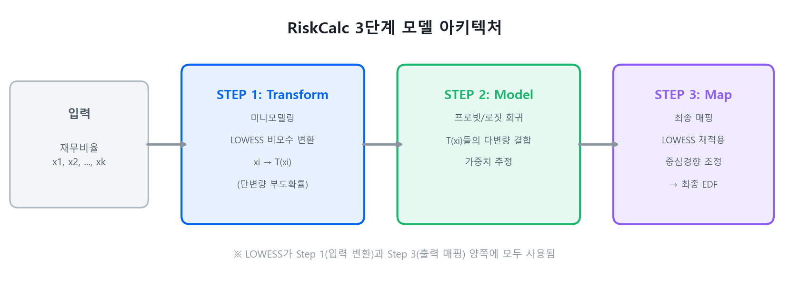

# 3단계 모델 아키텍처: Transform → Model → Map

미니모델링은 RiskCalc 전체 아키텍처의 **첫 번째 단계**에 해당한다. 전체 구조는 변환(Transformation), 모델링(Modeling), 매핑(Mapping)의 3단계로 구성된다.

---

## 3.1 전체 흐름



> **STEP 1 · Transform (미니모델링)** — 각 재무비율 \(x_i\)를 단변량 부도확률 \(T(x_i)\)로 변환. LOWESS 등 비모수 기법 사용.
>
> → **STEP 2 · Model (프로빗 추정)** — 변환된 \(T(x_i)\)들을 프로빗(Probit) 또는 로짓 모형에 투입. 다변량 가중치 추정.
>
> → **STEP 3 · Map (최종 매핑)** — 프로빗 출력을 실제 부도확률(EDF)로 비모수적 매핑. 중심경향(central tendency) 조정.

!!! example "예시 — 차주 1명이 EDF까지 가는 흐름"
    가상의 외감기업 A가 EDF 산출을 받는다고 하자. 이 차주의 5개 재무비율과 각 변수의 산업 percentile, 그리고 [직관적 이해 페이지](intuition.md)에서 다룬 합성 lookup이 반환한 \(T(x)\) 값은 다음과 같다 (가상 수치).

    **STEP 1 · Transform** — 5개 변수 각각의 lookup table 조회

    | 변수 | raw 값 | 산업 percentile | \(T(x_i)\) (단변량 PD) |
    |---|:---:|:---:|:---:|
    | 부채비율 | 50% | 30 | 0.021 |
    | ROA | 8% | 75 | 0.012 |
    | 유동비율 | 1.8 | 60 | 0.018 |
    | 이자보상배율 | 4.5 | 65 | 0.015 |
    | 영업이익률 | 12% | 80 | 0.010 |

    부채비율 \(T = 0.021\)은 [정의 페이지](index.md)의 "한 평가점에서 LOWESS가 굴러가는 모습 — 숫자로 따라가기" 절에서 step-by-step으로 계산해본 그 값이다.

    **STEP 2 · Model (Probit)** — 변환된 5개 \(T(x_i)\)를 다변량 Probit에 투입

    가상의 추정된 계수 \(\beta_0 = -2.5\), \((\beta_1, \ldots, \beta_5) = (15, 20, 12, 18, 10)\)을 적용하면:

    $$
    \begin{aligned}
    \eta &= \beta_0 + \sum_k \beta_k \, T(x_k) \\
        &= -2.5 + 15(0.021) + 20(0.012) + 12(0.018) + 18(0.015) + 10(0.010) \\
        &= -2.5 + 0.315 + 0.240 + 0.216 + 0.270 + 0.100 \\
        &\approx -1.36
    \end{aligned}
    $$

    Probit 출력 \(\Phi(\eta)\)로 변환:

    $$
    \Phi(-1.36) \approx 0.087
    $$

    즉 다변량 Probit이 추정한 차주의 부도확률은 약 **8.7%**다.

    **STEP 3 · Map (최종 매핑)** — 실제 모집단 부도율과의 calibration 보정

    Probit 출력 0.087은 학습 표본에서 체계적 편향(예: tail 과대추정)이 있을 수 있어, LOWESS 기반 calibration 매핑으로 한 번 더 보정한다. 매핑이 0.087 → 0.082로 약간 낮춰준다고 가정하면, 차주 A의 최종 **EDF = 0.082** (약 8.2%)다.

    **요약 — raw 5개 변수 → EDF 한 줄로 압축하면**

    ```
    raw (50%, 8%, 1.8, 4.5, 12%)
        │  [STEP 1] 5개 lookup table 조회
        ▼
    T = (0.021, 0.012, 0.018, 0.015, 0.010)
        │  [STEP 2] β와 결합 → Probit
        ▼
    η = -1.36  →  Φ(η) = 0.087
        │  [STEP 3] LOWESS calibration 매핑
        ▼
    EDF = 0.082  (외감기업 A의 최종 부도확률 8.2%)
    ```

    운영 시점에 이 흐름은 **단순 lookup 5회 + 행렬곱 1회 + 정규 CDF 1회 + lookup 1회**로 끝난다 — LOWESS 회귀는 개발 단계에서만 돌고, 운영은 이 5단계 표 조회와 산술 연산으로 구성된다.

---

## 3.2 Step 1: Transform (미니모델링)

[정의와 LOWESS 기초](index.md) 및 [RiskCalc 프로세스와 사상](riskcalc.md)에서 상세히 다뤘다. 각 재무비율을 개별적으로 단변량 부도확률로 변환하는 단계다.

---

## 3.3 Step 2: 프로빗 모형

변환된 \(T(x_i)\)들을 프로빗 모형에 투입한다:

$$
y = \Phi\!\left(f(\mathbf{x}, \boldsymbol{\beta})\right) \tag{B.5}
$$

선형 부분:

$$
f(\mathbf{x}, \boldsymbol{\beta}) = \beta_0 + \beta_1 \cdot T(x_1) + \beta_2 \cdot T(x_2) + \cdots + \beta_k \cdot T(x_k) \tag{B.6}
$$

여기서:

- \(\Phi\) = 정규 누적분포함수 (프로빗 모형)
- \(T(x_i)\) = 미니모델링으로 변환된 각 재무비율
- \(\beta_i\) = 각 변환비율의 가중치 (양수이며 유의해야 포함)

이 구조는 **일반화 가법 모형(Generalized Additive Model)**과 밀접하게 관련되어 있으며, Moody's는 이를 비선형 문제를 포착하되 투명성을 유지하는 강건한 모형 형태로 평가한다.

!!! note "왜 프로빗인가?"
    본 가이드북에서 다룬 소매 CSS는 **로짓(logit)**, RiskCalc는 **프로빗(probit)**을 사용한다. 두 모형은 공통 구조 \(g(p_i) = \eta_i,\; \eta_i = \beta_0 + \sum_k \beta_k x_{ki}\)를 공유하며, 차이는 link function \(g(\cdot)\) 하나뿐이다.

    **로짓 link** — odds의 자연로그를 \(\eta\)에 매핑한다:

    $$
    \text{logit}(p_i) = \log\!\frac{p_i}{1 - p_i} = \eta_i \quad\Longleftrightarrow\quad p_i = \frac{1}{1 + e^{-\eta_i}}
    $$

    **프로빗 link** — 정규 CDF의 역함수를 \(\eta\)에 매핑한다:

    $$
    \text{probit}(p_i) = \Phi^{-1}(p_i) = \eta_i \quad\Longleftrightarrow\quad p_i = \Phi(\eta_i)
    $$

    두 곡선은 \(p\)가 0 또는 1에 가까운 극단부에서만 미세한 차이를 보이며, 실무 성능은 사실상 동일하다.

    RiskCalc가 프로빗을 채택한 배경에는 **Moody's KMV의 구조모형(Merton model) 전통**이 있다. Merton 모형에서 기업 자산가치는 정규분포를 따르고, 자산가치가 부채 이하로 떨어지면 부도로 정의한다. 이 프레임워크에서 부도확률은 자연스럽게 \(\Phi\)(정규 CDF)로 표현되며, RiskCalc도 같은 Moody's KMV 계열에서 출발했으므로 **정규분포 기반 프레임워크와의 정합성**을 위해 프로빗을 선택한 것으로 보인다.

    반면 소매 CSS는 **통계적 판별/스코어링** 전통에서 출발하여, odds ratio 해석이 직관적인 로짓이 표준이 되었다 — 계수 \(\beta_k\)가 그대로 "\(x_k\) 한 단위 증가 시 log-odds 변화"로 읽히기 때문이다.

---

## 3.4 Step 3: 최종 매핑

프로빗 모형의 출력은 참 부도확률을 **과대 또는 과소 추정**하는 경향이 있다. 이를 교정하기 위해 모형 출력과 실제 표본 부도확률 간의 관계를 **비모수적으로 추정**하는 최종 매핑 단계가 적용된다.

!!! info "동일 알고리즘의 재활용"
    Moody's에 따르면, 이 매핑은 미니모델링의 입력 변환과 **동일한 smoothing 알고리즘(LOWESS)**을 사용하여 수행된다. 즉 LOWESS가 입력 단계(Step 1)와 출력 단계(Step 3) 모두에서 활용되는 셈이다.

### 소매 CSS와의 구조 비교

| 단계 | RiskCalc (기업) | 소매 CSS (본 가이드북) |
|------|----------------|-------------------|
| **Step 1: 변환** | LOWESS → 단변량 EDF | WoE 변환 (구간화 + 로그 Odds) |
| **Step 2: 모형** | 프로빗 회귀 | 로지스틱 회귀 |
| **Step 3: 교정** | LOWESS 매핑 → 최종 EDF | 스코어 변환 → 등급 매핑 |
| **산출물** | EDF (Expected Default Frequency) | 스코어 → 등급 → PD |

두 접근법은 **"변환 → 결합 → 교정"이라는 동일한 3단계 구조**를 공유하며, 기법의 선택만 다르다.
