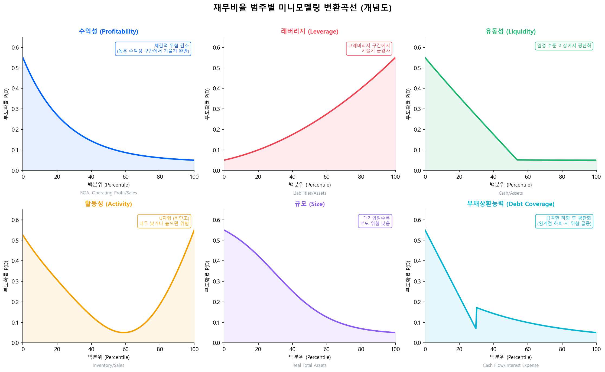

# 미니모델링의 실증적 근거와 비율별 변환 특성

## 2.1 5가지 효과

### 효과 1 — 비선형성 포착

재무비율의 원시 수준(raw level)을 그대로 선형 모형에 투입하면, 비율과 부도 간의 체감·체증적 관계가 무시된다. 미니모델링은 이 관계를 데이터로부터 직접 추정하여, 비율의 특정 구간에서 급격한 위험 변화가 발생하는 **임계 영역(threshold region)**을 정확히 반영한다.

### 효과 2 — 입력 정규화(Normalization)

서로 다른 단위와 분포를 가진 재무비율들(예: ROA는 −20%~+30%, 부채비율은 0%~500%)이 모두 **0~1 범위의 부도확률**로 변환된다. 이후 다변량 프로빗 모형에서 각 변수의 기여를 직접 비교할 수 있게 된다.

### 효과 3 — 이상치 통제(Outlier Control)

극단적 재무비율(예: 자본잠식 기업의 음수 자기자본비율)이 모형 전체를 왜곡하는 문제를 원천적으로 차단한다. **백분위 변환 + LOWESS**의 조합은 극단값이 smoothing 곡선 위에서 자연스럽게 수렴하도록 만든다.

### 효과 4 — 한계효과 모니터링

각 비율의 변환곡선을 독립적으로 관찰함으로써, 특정 비율이 부도 예측에 기여하는 방식을 투명하게 파악할 수 있다. 이는 **모형 검증(validation)**과 **감독당국 설명(regulatory explanation)** 양 측면에서 핵심 이점이다.

### 효과 5 — 표본 외 강건성(Out-of-Sample Robustness)

Falkenstein et al.(2000)의 Compustat 데이터 검증에서, 다양한 변환 방식을 비교한 결과가 보고되었다. 모든 비교 모형은 1995년 이전에 추정되어 표본 외 검증 조건을 충족했다.

| 변환 방식 | 방법 | 표본 내 성능 | 표본 외 강건성 |
|-----------|------|:----------:|:----------:|
| 백분위(Percentile) | 비율의 순위를 0~1로 변환 | 중간 | 중간 |
| 백분위 + 제곱 | 순위 + 순위² | 높음 (표본 내 거의 최적) | 상대적 열위 |
| 비율 수준 절단 | 2%/98% 지점에서 winsorize | 중간 | 중간 |
| **단변량 부도빈도 변환 (미니모델링)** | **LOWESS 등 비모수 추정** | **높음** | **유의하게 우월** |

출처: Falkenstein et al. (2000), "RiskCalc for Private Companies: Moody's Default Model"

!!! tip "소매 CSS 실무자를 위한 대응"
    위 비교는 소매 CSS에서 "원시 비율 투입 vs WoE 변환 투입"의 성능 차이와 본질적으로 같은 논점이다. WoE 변환도 비모수적 단변량 부도빈도 변환의 일종이며, 구간화(classing)를 통해 이상치와 비선형성을 동시에 처리한다.

---

## 2.2 재무비율 범주별 변환 특성

RiskCalc 모델은 재무비율을 수익성, 레버리지, 유동성, 활동성, 규모, 부채상환능력 등의 범주로 구분하며, 각 범주의 비율은 부도확률과 서로 다른 형태의 비선형 관계를 보인다.

위 그림은 각 범주별 LOWESS 변환곡선의 전형적인 형태를 개념적으로 보여준다. 가로축은 해당 비율의 백분위, 세로축은 단변량 부도확률 추정값이다.

-   📈 **수익성 (Profitability)**

    ---

    ROA (Net Income / Assets), Operating Profit / Sales

    _변환 특성:_ 하향 기울기, 높은 수익성 구간에서 기울기 완만해짐 → **체감적 위험 감소**

-   ⚖️ **레버리지 (Leverage)**

    ---

    Liabilities / Assets, Retained Earnings / Current Liabilities

    _변환 특성:_ 상향 기울기(단조 증가), 고레버리지 구간에서 **기울기 급경사**

-   💧 **유동성 (Liquidity)**

    ---

    Cash & Marketable Securities / Assets

    _변환 특성:_ 하향 기울기, 일정 수준 이상에서 **평탄화**

-   🔄 **활동성 (Activity)**

    ---

    Inventory / Sales, Change in AR Turnover, Current Liabilities / Sales

    _변환 특성:_ **비단조(non-monotonic)** 가능, 산업별 차이 큼

-   🏢 **규모 (Size)**

    ---

    Real Total Assets (실질 총자산)

    _변환 특성:_ 하향 기울기 — **대기업일수록 부도 위험 낮음**

-   🛡️ **부채상환능력 (Debt Coverage)**

    ---

    Cash Flow / Interest Expense, Change in ROA

    _변환 특성:_ **급격한 하향 후 평탄화** — 임계 수준 하회 시 위험 급증

출처: RiskCalc v3.1 USA (Dwyer et al., 2004), RiskCalc 4.0 France (Moody's Analytics, 2015)

!!! note "비단조 변환의 의미"
    활동성 비율의 비단조(non-monotonic) 패턴은 특히 주목할 만하다. 예를 들어, 재고/매출 비율이 너무 낮으면 공급 부족 위험, 너무 높으면 재고 부실 위험이 있어 **U자형 관계**가 나타날 수 있다. 이런 패턴은 선형 모형이나 단조 WoE로는 포착이 불가능하며, LOWESS의 비모수적 유연성이 빛을 발하는 영역이다.

---

## 2.3 단조성을 보장하지 않는다 — 의도된 비단조 vs 잡음 역전

LOWESS의 **비모수적 유연성**은 양날의 검이다. 활동성 비율처럼 진짜 U자형 관계가 있다면 그것을 반영해주지만, **데이터의 우연한 변동까지 그대로 따라가** 단조였어야 할 변수에서도 작은 역전(reversal)을 만들어낼 수 있다.

### 두 종류의 단조성 위반을 구별해야 한다

| 유형 | 원인 | 처리 방향 |
|---|---|---|
| **신호로서의 비단조** | 경제적 의미가 있는 진짜 U자/역U자 (활동성, 일부 성장률) | **유지 + 문서화** |
| **잡음으로서의 역전** | tail 구간의 관측치 부족, bad 표본 희소 | **제거 또는 평탄화** |

차이를 구분하는 핵심은 **expected direction**이다. 변수마다 경제 논리상 기대되는 방향을 사전에 정의해두어야 한다 — 부채비율은 증가, 수익성은 감소, 활동성은 비단조 가능 등.

### 단조성 진단 항목

LOWESS 곡선을 그린 뒤 다음을 점검한다:

- **위반 횟수(violation count)**: expected direction과 어긋나는 구간 수
- **최대 역전 폭(max reversal size)**: 단일 구간에서 \(T(x_{j+1}) - T(x_j)\)가 반대 방향으로 가장 크게 튄 크기
- **누적 역전 폭(total reversal size)**: 모든 위반의 합
- **tail jump**: 양 끝 구간에서의 급격한 점프 — 관측치 부족의 가장 흔한 증상
- **경제적 설명 가능성**: 위반 구간이 사후적으로 산업 사이클, 회계 이슈 등으로 설명되는지

### 처리 정책의 4단계

위반이 잡음으로 판정되면, 가벼운 순서부터 점진적으로 적용한다:

1. **허용 + 기록** — 위반 폭이 무의미하게 작으면 그대로 두고 검증 보고서에 기록
2. **bandwidth 확대** — \(f\)를 키워 smoothing을 더 강하게 → tail 잡음 흡수
3. **구간 수 축소** — percentile 구간을 더 굵게 잡아 표본 부족 자체를 해소
4. **Isotonic regression 후처리** — 위 셋으로 안 풀리면 단조 보정을 강제 적용

!!! tip "단조 보정이 필요한 경우의 적용 순서"
    단조 후처리를 적용한다면 **순서가 중요하다**. 권장 순서는 다음과 같다:

    $$
    \text{LOWESS } \hat{y} \;\rightarrow\; \text{clip}([0,1]) \;\rightarrow\; \text{monotonic projection} \;\rightarrow\; \text{final clip}
    $$

    먼저 cap으로 확률 범위를 잡고, 그 위에서 단조 투영을 수행한 뒤, 투영 결과가 다시 \([0, 1]\)을 벗어났을 가능성에 대비해 한 번 더 clip을 거는 방식이다. 순서를 바꾸면 — 예를 들어 단조 투영을 먼저 하고 clip을 나중에 하면 — clip이 단조성을 깰 수 있어 의미가 없어진다.

!!! warning "투명성 원칙과의 연결"
    [RiskCalc 사상 절](riskcalc.md)에서 다룬 Moody's의 **투명성(transparency) 원칙** — *"레버리지가 증가했는데 부도 위험이 감소하는 것은 직관에 반한다"* — 이 바로 단조성 검증을 요구하는 근거다. 비모수의 유연성은 사상의 일관성과 충돌할 수 있고, 이 충돌을 다루는 방법이 위 4단계 정책이다. 결국 미니모델링은 **데이터에 맡길 부분과 사상으로 통제할 부분을 명시적으로 분리**하는 작업이다.
