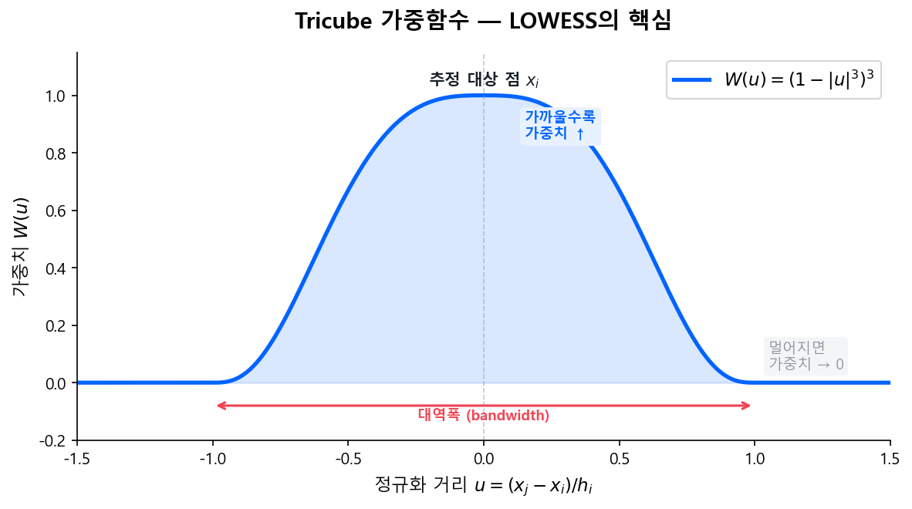
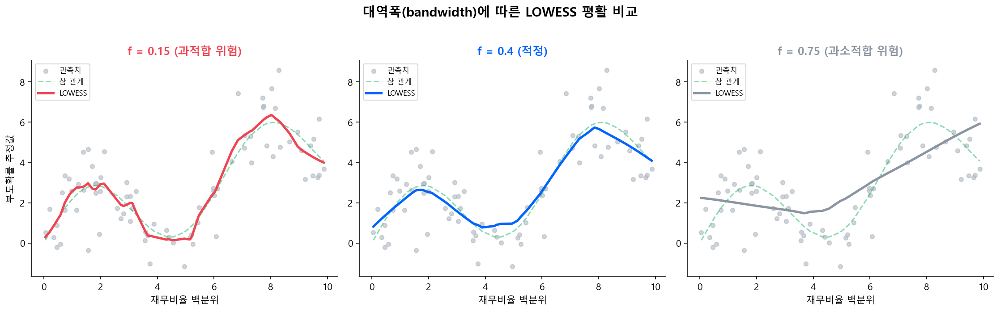

# 부록 C: LOWESS 기반 미니모델링 — 재무비율 변환과 기업 여신 신용평가

> Moody's RiskCalc 모델에서 활용되는 비모수적 재무비율 변환 기법의 방법론, 사상, 효과, 그리고 실무 적용 구조에 대한 기술 분석

!!! note "이 부록의 위치"
    단변량 로지스틱 회귀 섹션의 **소매 여신 관점**을 보완하여, **기업 여신(corporate lending)** 영역에서의 미니모델링 방법론을 다룬다. Moody's RiskCalc 모델 시리즈에서 공식 사용하는 LOWESS 기반 비모수적 변환 기법의 구조와 실무 적용을 정리한다.

!!! tip "소매 vs 기업 미니모델링"
    본 가이드북의 단변량 로지스틱 회귀 섹션에서 다룬 방식은 **소매 CSS**에서의 WoE 기반 방식입니다. 이 부록에서 다루는 LOWESS 기반 미니모델링은 **Moody's RiskCalc**가 기업 여신 부도 예측에 사용하는 방식으로, 접근 철학은 같지만 기법이 다릅니다.

## 이 부록에서 다루는 내용

| 섹션 | 제목 | 내용 |
|------|------|------|
| 1 | [RiskCalc 프로세스와 사상](riskcalc.md) | 변환 절차, 백분위 변환, 비모수적 접근의 사상(비선형성·투명성·간결성) |
| 2 | [실증적 근거와 비율별 변환](effects.md) | 5가지 효과(비선형성·정규화·이상치·한계효과·강건성), 재무비율 범주별 변환 특성 |
| 3 | [3단계 모델 아키텍처](architecture.md) | Transform → Model → Map 구조, 프로빗 모형, 최종 매핑 |
| 4 | [직관적 이해](intuition.md) | Weight & Smoothing 본질, KNN 비교, Lookup Table, Smoothing vs 실제 불량률 |
| 5 | [실무 활용과 한계](application.md) | 기업 여신 6대 활용 영역, 적용 조건, 국내 은행 접점, 한계와 고려사항 |

---

## 미니모델링의 정의와 LOWESS 통계 기초

### 미니모델링이란

"미니모델링(Mini-Modeling)"은 Moody's가 RiskCalc 모델 시리즈에서 공식적으로 사용하는 용어다. 각 재무비율을 해당 비율의 **단변량 부도확률(univariate default probability)**로 변환하는 과정을 지칭한다.

!!! quote "원문 정의"
    Moody's RiskCalc for U.S. Banks 방법론 문서에서: 각 재무비율을 해당 비율에 대응하는 단변량 부도확률로 대체하는 첫 번째 단계를, Moody's는 "미니모델링"이라 명명했다. 이 과정이 **비선형성의 상당 부분을 포착**하고, **입력값을 공통 척도로 정규화**하며, **이상치를 통제**하고, **단변량 부도 예측을 관찰함으로써 모델 내 한계효과를 모니터링**하는 데 도움을 준다고 서술하고 있다.

    
출처: Moody's RiskCalc™ Model for Privately-Held U.S. Banks, Enterprise Risk Management, July 2002

이 변환에 사용되는 핵심 기법이 **LOWESS**(Locally Weighted Scatterplot Smoothing)를 포함한 국소 회귀(local regression) 및 밀도 추정(density estimation) 기법들이다. Moody's RiskCalc v3.1 기술 문서에서는 변환 추정에 다양한 국소 회귀 및 밀도 추정 기법을 사용한다고 명시하고 있다.

---

### LOWESS — Locally Weighted Scatterplot Smoothing

!!! info "정의"
    William S. Cleveland(1979)가 제안한 **비모수적 회귀 기법**. 각 데이터 포인트에 대해 인근 데이터만을 사용하여 가중 최소자승 회귀를 수행하고, 이를 전체 데이터에 걸쳐 반복 적용함으로써 **사전에 함수형태를 가정하지 않고도** 변수 간 관계를 추정한다.

    
Cleveland, W.S. (1979). "Robust Locally Weighted Regression and Smoothing Scatterplots." JASA 74(368): 829-836.

### 알고리즘 구조

데이터 포인트 \((x_i, y_i)\)에 대해 smoothing 추정값 \(\hat{y}_i\)를 구하는 절차는 다음과 같다:

**1단계 — 대역폭(bandwidth) 결정**

전체 \(N\)개 중 \(f \times N\)개의 인근 포인트를 선택한다:

$$
k = \left\lfloor \frac{N \times f - 0.5}{2} \right\rfloor
$$

**2단계 — 삼차 가중함수(tricube weight function) 적용**

$$
W(u) = \begin{cases} (1 - |u|^3)^3 & \text{if } |u| < 1 \\ 0 & \text{otherwise} \end{cases} \tag{B.1}
$$

**3단계 — 각 고유 \(x\)값에 대해 가중 최소자승 회귀 수행**

$$
\hat{y}_i = \text{WLS}\left(x_j,\; y_j,\; W\!\left(\frac{x_j - x_i}{h_i}\right)\right) \tag{B.2}
$$

**4단계 — (선택) 강건성(robustness) 반복**

잔차 기반 bisquare 가중치를 재적용한다:

$$
r_i = y_i - \hat{y}_i
$$

$$
B(u) = (1 - u^2)^2 \quad \text{if } |u| < 1 \tag{B.3}
$$

### 대역폭에 따른 smoothing 결과 비교

대역폭(bandwidth) \(f\)는 LOWESS의 가장 중요한 파라미터다. 아래 그림은 동일한 산점도에 \(f\)를 다르게 적용한 결과를 보여준다:

- **\(f = 0.15\)** (왼쪽): 소수의 인근 점만 사용 → 노이즈까지 따라감 (과적합)
- **\(f = 0.4\)** (가운데): 적절한 범위 → 참 관계를 잘 포착
- **\(f = 0.75\)** (오른쪽): 대부분의 점을 사용 → 국소 패턴이 사라짐 (과소적합)

### 핵심 파라미터

| 파라미터 | 역할 | 영향 |
|----------|------|------|
| **\(f\) (bandwidth/span)** | 인근 데이터 비율 (\(0 < f \leq 1\)) | 작을수록 국소 패턴에 민감, 클수록 smooth |
| **Tricube weight** | 거리에 따른 가중치 감소 | 가까운 포인트에 높은 가중치 부여 |
| **Robustness iteration** | 이상치 영향 저감 | 잔차 큰 관측치의 가중치 하향 |

!!! tip "직관적 이해"
    위 수식과 절차의 직관적 의미 — bandwidth는 왜 필요한지, 회귀선은 몇 번 긋는지, 산출물은 결국 무엇인지 — 는 [4. 직관적 이해](intuition.md)에서 상세히 다룬다.

---

**참고 문헌**

- Falkenstein, E., Boral, A., & Carty, L. (2000). "RiskCalc for Private Companies: Moody's Default Model." Moody's Investors Service.
- Dwyer, D., Kocagil, A., & Stein, R. (2004). "The Moody's KMV EDF RiskCalc v3.1 Model." Moody's KMV.
- Moody's Analytics (2015). "RiskCalc 4.0 France." Modeling Methodology, Quantitative Research Group.
- Kocagil, A. et al. (2002). "Moody's RiskCalc Model for Privately-Held U.S. Banks." Moody's KMV.
- Cleveland, W.S. (1979). "Robust Locally Weighted Regression and Smoothing Scatterplots." JASA 74(368): 829-836.

