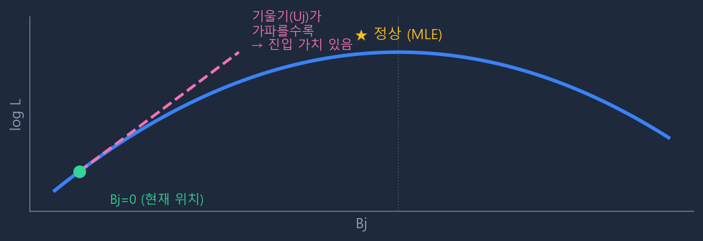
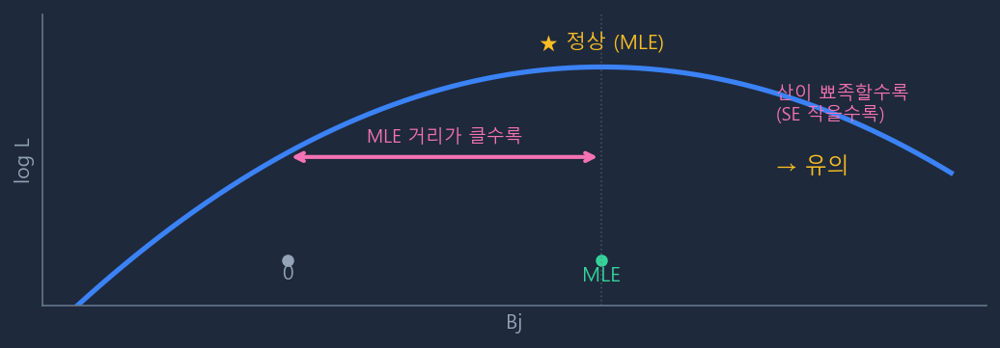
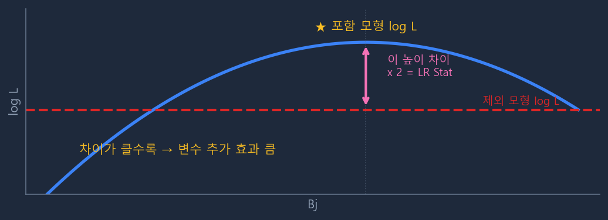
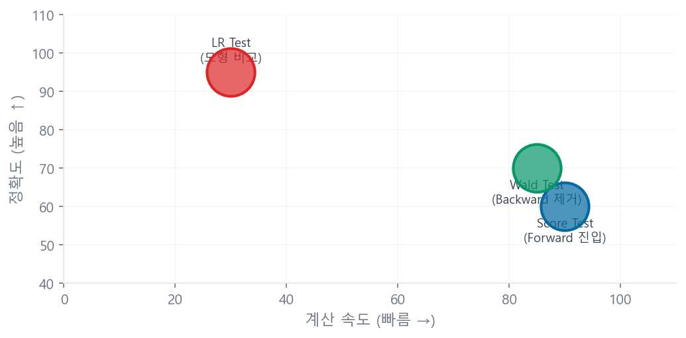

# 통계 검정 이론: Score · Wald · LR Test

## 5.1 배경: 로그우도함수와 MLE

로지스틱 회귀에서 최적 계수를 찾는 기준이 **로그우도(log-likelihood)**다.

$$
\log L(\beta) = \sum_{i=1}^{n} \left[ y_i \log p_i + (1-y_i) \log(1-p_i) \right] \tag{A.8}
$$

\(p_i\)는 모형이 예측한 불량 확률, \(y_i\)는 실제 불량 여부(0 or 1)다. \(\beta\)를 잘 추정할수록 \(\log L\)이 최대화된다. 이 최대화 지점이 MLE 추정값 \(\hat{\beta}\)다.

!!! tip "산 비유"
    \(\log L\)을 산이라고 생각하면, **정상(MLE \(\hat{\beta}\))에서 \(\log L\)이 최대**다. 세 검정은 모두 "\(\beta_j = 0\)인가?"라는 같은 질문을 하지만, 산의 어느 위치에서 어떤 정보를 보느냐가 다르다.

---

## 5.2 Score Test (Lagrange Multiplier Test)

**언제:** Stepwise Forward 진입 단계. 변수를 **아직 모형에 넣지 않은 상태**에서 사용.

**핵심 아이디어 — 한 줄 요약:** **"현재 모형이 설명하지 못한 잔차를, 새로운 변수 \(X_j\)가 얼마나 설명할 수 있는가?"**

현재 모형(변수 \(j\) 제외)의 잔차 \((y_i - \hat{p}_i^{(0)})\)가 있다. 새 변수 \(x_{ij}\)와 이 잔차의 상관관계가 높으면 → \(X_j\)를 추가하면 잔차를 줄일 수 있다 → 진입 가치 있음. 이 판단을 위해 \(X_j\)를 실제로 모형에 넣어 재적합할 필요가 없다. 잔차와 \(X_j\) 값만 있으면 바로 계산된다.

수식으로는 "\(\beta_j = 0\)으로 고정된 현재 위치에서 \(\log L\)의 기울기(1차 미분)"로 표현되며, 이 기울기가 가파를수록 진입 가치가 높다.

**수식:**

$$
U_j = \frac{\partial \log L}{\partial \beta_j}\bigg|_{\beta_j=0} = \sum_{i=1}^{n}(y_i - \hat{p}_i^{(0)}) \cdot x_{ij} \tag{A.9}
$$

$$
\text{Score Stat} = \frac{U_j^2}{I_j} = \frac{\left[\sum_i (y_i - \hat{p}_i^{(0)}) x_{ij}\right]^2}{\sum_i \hat{p}_i^{(0)}(1-\hat{p}_i^{(0)}) x_{ij}^2} \sim \chi^2(1) \tag{A.10}
$$

\((y_i - \hat{p}_i^{(0)})\)는 현재 모형의 **잔차**다. 즉 Score Test는 "현재 모형이 설명하지 못한 잔차와 변수 \(X_j\)의 상관관계"를 측정한다. 상관관계가 강할수록 \(X_j\)를 추가하면 잔차를 설명할 수 있다는 의미다.

\(I_j\)는 Fisher 정보행렬로 \(\log L\)의 2차 미분(곡률)의 기댓값이다. \(U_j\)를 \(I_j\)로 나누는 것은 변수 분산 차이를 표준화하기 위함이다 — t-검정에서 \(\bar{X}/\text{SE}\)로 나누는 것과 같은 원리.

!!! success "재적합이 필요 없는 이유"
    \(U_j\) 계산에 필요한 것은 세 가지뿐이다.

    1. \(y_i\): 실제 정답 → 데이터에 있음
    2. \(\hat{p}_i^{(0)}\): 현재 제외 모형의 예측값 → 이미 계산됨
    3. \(x_{ij}\): 후보 변수의 원본 값 → 데이터에 있음

    세 가지 모두 이미 손에 있는 값이다. 후보 변수가 100개여도 현재 모형 적합은 딱 1번만 하면 된다.

**더미 방식에서의 결합 Score Test:** "\(\gamma_1 = \gamma_2 = 0\)" 결합 제약 하에 벡터/행렬 형태로 확장된다.

$$
\text{Score Stat} = \mathbf{U}_{X1}^T \cdot \mathbf{I}_{X1}^{-1} \cdot \mathbf{U}_{X1} \sim \chi^2(\text{구간수}-1) \tag{A.11}
$$

---

## 5.3 Wald Test

**언제:** Stepwise Backward 제거 단계. 변수가 **이미 모형에 포함된 상태**에서 사용.

**핵심 아이디어:** 이미 추정된 \(\hat{\beta}_j\)가 0에서 얼마나 멀리 떨어져 있는지를 표준오차(불확실성)로 나눠서 평가한다. "추정값이 0과 유의하게 다른가?"

$$
W_j = \left(\frac{\hat{\beta}_j}{\text{SE}(\hat{\beta}_j)}\right)^2 \sim \chi^2(1), \quad \text{SE}(\hat{\beta}_j) = \sqrt{[I(\hat{\beta})^{-1}]_{jj}} \tag{A.12}
$$

모형 재적합이 필요 없으며, 이미 추정된 계수와 분산-공분산 행렬만으로 계산된다.

!!! warning "Hauck-Donner 현상"
    \(\hat{\beta}_j\)가 0에서 매우 크게 멀어지면 SE도 같이 커져서 Wald Stat이 오히려 줄어드는 현상이 발생할 수 있다. 완전 분리(Perfect Separation) 문제가 있는 데이터에서 주로 나타난다. 이때는 LR Test가 더 신뢰할 만하다.

**더미 방식에서의 결합 Wald Test:** \(\hat{\gamma}_1\), \(\hat{\gamma}_2\)의 공분산까지 반영한다.

$$
W_{X1} = \hat{\boldsymbol{\gamma}}_{X1}^T \cdot \mathbf{V}(\hat{\boldsymbol{\gamma}}_{X1})^{-1} \cdot \hat{\boldsymbol{\gamma}}_{X1} \sim \chi^2(\text{구간수}-1) \tag{A.13}
$$

---

## 5.4 LR Test (Likelihood Ratio Test)

**언제:** 모형 전체 성능 비교, 또는 Python Stepwise에서 Score Test 대신 사용.

**핵심 아이디어:** 변수를 포함한 모형과 제외한 모형, **2개를 실제로 적합한 후** 로그우도를 직접 비교한다. 가장 직접적이고 정확하다.

$$
LR = 2(\log L_{\text{포함}} - \log L_{\text{제외}}) \sim \chi^2(df) \tag{A.14}
$$

2를 곱하는 이유는 \(\chi^2\) 분포를 따르도록 스케일을 맞추기 위함이다. 자유도 \(df\)는 추가된 파라미터 수이므로, 더미 방식에서 구간수가 많으면 \(df\)가 커져 같은 LR 값에서 p-value가 커진다 — 이것이 **자유도 부담**의 본질이다.

!!! note "Python에서 LR Test를 Forward에 사용하는 이유"
    Score Test를 직접 구현하기 복잡하기 때문에, Python Stepwise 구현에서는 매 후보 변수마다 LR Test를 사용한다. 매번 2번 적합이 필요해 느리지만, 결과는 동등하게 신뢰할 수 있다.

---

## 5.5 세 검정 최종 비교

| | Score Test | Wald Test | LR Test |
|---|-----------|-----------|---------|
| **계산 시점** | 변수 추가 전 | 변수 추가 후 | 둘 다 적합 후 |
| **사용 정보** | 현재 모형 잔차 + 후보 변수 | 추정된 \(\hat{\beta}\)와 SE | 두 모형의 \(\log L\) |
| **재적합 필요** | 불필요 | 불필요 | 필요 (2번) |
| **속도** | 빠름 | 빠름 | 느림 |
| **정확도** | 근사 | 근사 | 가장 정확 |
| **약점** | 소표본 시 부정확 | Hauck-Donner 현상 | 계산 비용 |
| **Stepwise 사용처** | Forward 진입 | Backward 제거 | 모형 전체 비교 |
| **Python 구현 시** | LR Test로 대체 | pvalues 직접 사용 | Forward 진입 |

!!! info "세 검정의 점근적 동등성"
    표본이 충분히 크면 Score Test, Wald Test, LR Test 세 가지 모두 점근적으로 동일한 결과를 낸다. 표본이 작아질수록 차이가 벌어지며, 이때는 **LR Test가 가장 신뢰할 만하다.**

    Stepwise가 Forward에 Score Test, Backward에 Wald Test를 쓰는 것은 후보 변수가 많은 Forward는 속도 우선, 이미 포함된 변수를 정리하는 Backward는 현재 추정값 기반의 정확도 우선으로 설계된 것이다.

---

## 5.6 Fisher 정보행렬 — 로지스틱 회귀에서의 구체적 형태

위 세 검정에서 반복 등장하는 Fisher 정보행렬 \(I(\boldsymbol{\beta})\)의 로지스틱 회귀에서의 구체적 형태를 보인다.

로지스틱 회귀의 로그우도 \(\ell(\boldsymbol{\beta})\)를 두 번 미분하면:

$$
I(\boldsymbol{\beta}) = -E\!\left[\frac{\partial^2 \ell}{\partial \boldsymbol{\beta} \partial \boldsymbol{\beta}^\top}\right] = \mathbf{X}^\top \mathbf{W} \mathbf{X}
$$

여기서 \(\mathbf{W} = \text{diag}(p_1(1-p_1), \ldots, p_n(1-p_n))\)는 관측치별 가중치 행렬이다.

| 구성요소 | 의미 |
|---------|------|
| \(\mathbf{X}\) | \(n \times (k+1)\) 설계행렬 (절편 포함) |
| \(\mathbf{W}\) | \(n \times n\) 대각행렬. \(p_i(1-p_i)\)는 시그모이드의 분산 — \(p \approx 0.5\)에서 최대 |
| \(\mathbf{X}^\top \mathbf{W} \mathbf{X}\) | 가중 최소자승의 정규방정식과 동일한 구조. IRLS 알고리즘의 핵심 |

Wald Test의 표준오차는 이 행렬의 역행렬 대각 원소에서 산출된다: \(\text{SE}(\hat{\beta}_j) = \sqrt{[I(\hat{\boldsymbol{\beta}})^{-1}]_{jj}}\)

---

## 5.7 수치 계산 예시 — 3명 미니 데이터셋

개념 이해를 위한 최소 예시다. 변수 1개(\(X\)), 관측치 3명, 절편 포함.

| 고객 | \(X\) | \(y\) (Bad) | \(\hat{p}\) (수렴 후) |
|------|-------|------------|---------------------|
| A | 1.0 | 1 | 0.73 |
| B | 0.0 | 0 | 0.50 |
| C | −1.0 | 0 | 0.27 |

수렴 후 \(\hat{\beta}_0 = 0.0\), \(\hat{\beta}_1 = 1.0\)이라 가정하면:

**Wald Test (β₁에 대해):**

\(\mathbf{W} = \text{diag}(0.73 \times 0.27,\; 0.50 \times 0.50,\; 0.27 \times 0.73) = \text{diag}(0.197,\; 0.250,\; 0.197)\)

\(I_{11} = \sum_i w_i x_i^2 = 0.197 \times 1^2 + 0.250 \times 0^2 + 0.197 \times 1^2 = 0.394\)

\(\text{SE}(\hat{\beta}_1) = 1/\sqrt{0.394} \approx 1.59\)

\(W = (1.0 / 1.59)^2 = 0.396 \sim \chi^2(1)\), p ≈ 0.529 → 3명으로는 비유의 (표본 부족)

**LR Test:**

\(\ell(\text{Full}) = 1 \times \ln(0.73) + \ln(0.50) + \ln(0.73) = -0.314 - 0.693 - 0.314 = -1.321\)

\(\ell(\text{Null}) = 3 \times [1/3 \times \ln(1/3) + 2/3 \times \ln(2/3)] = -1.910\) (근사)

\(LR = -2 \times (-1.910 - (-1.321)) = 1.178 \sim \chi^2(1)\), p ≈ 0.278

!!! note "3명은 너무 적다"
    두 검정 모두 비유의하게 나온 것은 표본이 극히 적기 때문이다. 실무에서는 수천~수만 건의 데이터를 사용하며, 동일한 β = 1.0이라도 표본이 커지면 SE가 줄어 Wald 통계량이 급격히 증가한다. 이 예시는 **검정 통계량의 산출 절차를 이해하기 위한 것**이다.
