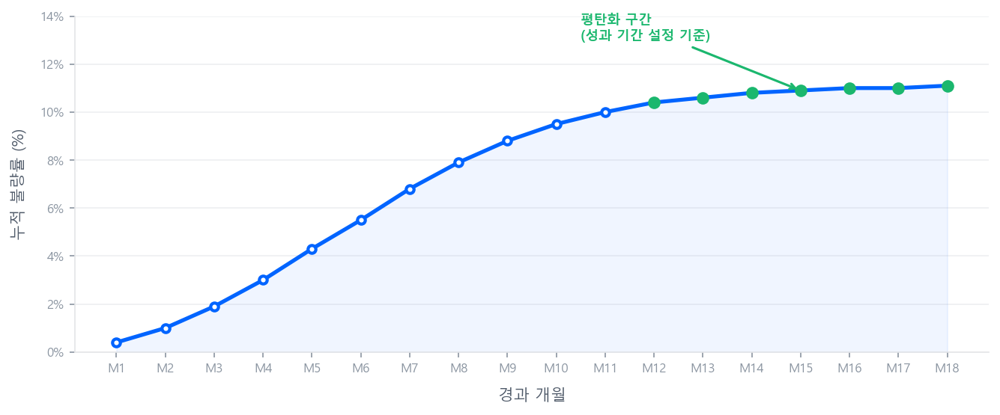
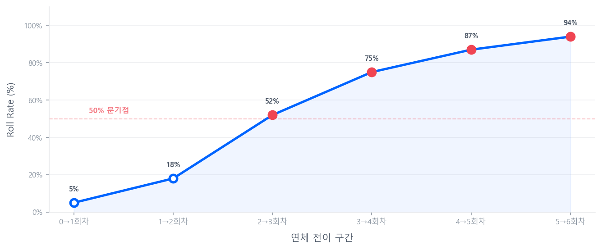

# 요건 정의

모형 개발의 출발점이다. **누구를 대상으로(모집단)**, **어떻게 나눌 것인지(세그먼트)**, **무엇을 예측할 것인지(Target)**, **어떤 기간을 볼 것인지(성과 기간)**를 확정한다.

## 3.1 모집단과 세그먼트

### 평가 대상 기준: 개인 vs 기업

CSS 모형은 평가 대상에 따라 **개인(Retail)**과 **기업(Corporate)**으로 크게 나뉘며, 각각의 세그먼트 구성과 모형 구조가 상이하다.

### 사전 제외 대상군

모집단을 정의하기에 앞서, 모형 개발 대상에서 **사전에 제외해야 할 대상**을 먼저 필터링한다. 이들은 신용평가의 대상이 아니거나, 이미 결과가 확정되어 모형이 판별할 필요가 없는 집단이다.

| 제외 사유 | 대상 예시 | 제외 근거 |
|------|------|------|
| **평가 부적격** | 미성년자, 사망자, 외국인(국내 전용 상품의 경우) | 법적·제도적으로 평가 대상이 아니거나, 일반 차주와 리스크 특성이 근본적으로 상이 |
| **기불량·채무불이행** | 현재 연체 중, 채무불이행 등록자, 회생·파산 진행 중 | 이미 부실이 확정된 대상으로, 신용 리스크 **예측**의 의미가 없음 |
| **정책 거절** | 내부 심사 기준 미달로 자동 거절된 건 | 모형 평가 이전에 정책적으로 차단된 건이므로 모집단에 포함 시 편향(bias) 발생 |
| **특수 거래** | 임직원 대출, 정부 보증·정책 대출, 극소액·테스트 건 | 일반 고객과 리스크 구조가 다르거나 데이터 노이즈에 해당 |

!!! warning "사전 제외와 모집단 편향"
    사전 제외 기준은 **명확하고 일관되게** 적용해야 한다. 제외 기준이 모호하면 모형 개발 표본이 실제 평가 대상 모집단을 대표하지 못하게 되어, 모형 적용 시 예측력이 저하될 수 있다.

**개인 신용평가**

개인 CSS는 기업 대비 모집단이 크고 데이터가 정형화되어 있어 단일 스코어카드로 개발하는 경우가 많으나, 세그먼트를 분리하면 예측력이 향상될 수 있다.

세그먼트를 나누는 근본적인 이유는 **모집단의 특성이 동질하지 않기 때문**이다. 서로 다른 성격의 차주를 하나의 모형으로 평가하면, 변수의 의미와 영향력이 집단마다 다르게 나타나 모형의 변별력이 희석된다. 예를 들어, Prime 고객에서 유의미한 변수가 Sub-Prime에서는 전혀 작동하지 않을 수 있고, Thick-File에서 강력한 예측력을 보이는 CB 변수가 Thin-File에서는 값 자체가 존재하지 않는다. 따라서 **동질한 집단끼리 묶어 각 집단의 리스크 특성에 맞는 모형을 개발**하는 것이 세그먼테이션의 핵심이다.

실무에서 가장 대표적인 세그먼트 기준은 다음과 같다.

**(1) 리스크 수준·신용이력 기준**

| 세그먼트 기준 | 구분 | 특성 | 모형 관점 | 대표 업권 |
|------|------|------|------|------|
| **리스크 수준** | **Prime** (우량) | CB 신용평점 상위, 연체 이력 없음. 불량률이 낮아 변별력 확보가 상대적으로 어려움. | 변수 구성·Bad 정의가 상이할 수 있어 별도 모형이 효과적. Prime은 미세한 리스크 차이를 포착하는 것이 핵심. | 시중은행 |
| | **Near-Prime** (중간) | Prime과 Sub-Prime의 경계 영역. 연체 가능성이 있으나 회복 여력도 존재. | Prime·Sub-Prime 어느 쪽에도 잘 맞지 않아 별도 모형이 유리할 수 있음. 승인/한도 전략에서 특히 중요한 구간. | 카드사, 인터넷전문은행 ^(*)^ |
| | **Sub-Prime** (비우량) | CB 신용평점 하위, 연체 경험 有. 불량률이 높고 변수 패턴이 Prime과 이질적. | Sub-Prime은 회복 가능성과 추가 부실 가능성을 구분하는 것이 핵심. | 저축은행, 캐피탈, 대부업체 |
| **신용이력** | **Thick-File** | CB 거래 이력이 풍부. 전통 변수만으로 충분한 변별력 확보 가능. | 표준적인 스코어카드 파이프라인 적용. | — |
| | **Thin-File** (신규·학생·주부 등) | CB 이력이 부족하거나 전무. 전통 변수만으로는 평가가 어려움. | 대안정보(금융결제원, 통신 등) 활용 또는 Generic/Pooled 모형으로 초기 평가. | — |
| **기존 관계** | **기존고객** | 내부 거래 이력(수신·여신·카드)이 풍부. | BS모형 활용 가능. 내부 변수의 변별력이 높음. | — |
| | **신규고객** | 내부 이력 없음. CB·신청서 등 외부 정보에 의존. | AS모형만 적용 가능. CB 변수 의존도가 높음. | — |

!!! note "(*) 인터넷전문은행의 세그먼트 분류"
    인터넷전문은행(카카오뱅크, 토스뱅크, 케이뱅크)은 실제로는 Prime~Near-Prime의 중간 세그먼트에 해당하나, 시중은행과 저축은행 사이의 **중금리 대출** 시장을 주요 타겟으로 설립된 업권이므로 Near-Prime으로 분류하였다.

**(2) 직업군·소득 특성 기준**

위 기준과 별개로, **차주의 직업군·소득 구조**에 따라 세그먼트를 분리하는 것도 실무에서 흔히 사용된다.

| 세그먼트 | 특성 | 모형 관점 |
|------|------|------|
| **급여소득자** | 소득 증빙이 용이(원천징수, 건강보험료). 고용 안정성이 상대적으로 높음. | 소득 대비 부채(DTI), 근속기간 등이 유효한 변수로 작용. |
| **자영업자** | 소득 변동성이 크고 증빙이 어려움. 사업 리스크가 개인 신용에 직결. | 카드매출, 사업자 업종·업력, 대안정보 활용 비중이 높아짐. |
| **전문직** (의사·변호사 등) | 소득 수준이 높으나 초기 부채(학자금 등)가 클 수 있음. 직업 안정성 높음. | 별도 세그먼트로 분리 시 직업군 특성을 반영한 모형 가능. |

!!! tip "세그먼트 분리의 판단 기준"
    세그먼트를 분리하면 각 그룹에 특화된 모형을 개발할 수 있어 예측력이 향상되지만, 그룹별 **표본 수가 충분해야** 한다. 일반적으로 세그먼트별 최소 수천 건 이상의 Bad 표본이 확보되어야 안정적인 모형 개발이 가능하다. 표본이 부족한 경우 무리한 세그먼트 분리보다는 통합 모형에서 해당 특성을 변수로 반영하는 것이 현실적이다. 위 기준들은 조합하여 적용할 수도 있다(예: 기존고객-Prime / 기존고객-Sub-Prime / 신규고객).

**기업 신용평가**

기업 CSS는 일반적으로 **재무모형 + 비재무모형 + 대표자모형**의 세 가지 하위 모형을 개발한 뒤, 이를 통합하여 최종 스코어를 산출하는 구조를 취한다.

> **재무모형** (재무비율·현금흐름) **+** **비재무모형** (업종·업력·거래이력) **+** **대표자모형** (대표자 개인 CB 정보) **→** **통합 스코어** (가중합산 또는 모형 통합)

기업 평가에서 핵심 세그먼트는 **재무제표의 가용성과 신뢰도**에 따라 구분된다.

| 세그먼트 | 특성 | 모형 구조 특징 |
|------|------|------|
| **외감기업** (외부감사 대상) | 감사받은 재무제표가 존재하여 **재무 데이터의 신뢰도가 높음**. 자산·매출 규모가 크고 데이터 품질이 양호. | 재무모형의 비중이 높음. 부채비율, 이자보상배율, 영업이익률 등 정교한 재무비율 분석 가능. |
| **비외감기업** (외부감사 비대상) | 재무제표가 있으나 **감사를 받지 않아 신뢰도가 상대적으로 낮음**. 중소기업이 대부분이며 재무 데이터의 품질 편차가 큼. | 재무모형의 비중을 줄이고 비재무(CB, 거래이력)와 대표자모형의 비중을 높이는 것이 일반적. |
| **개인사업자** | 별도의 재무제표가 없거나 간편장부 수준. **사업체와 대표자의 재무가 혼재**되는 특성. | 대표자 개인 CB 정보가 핵심 변수. 사업자등록 정보, 매출 추정(카드매출 등), 업종·업력 등 비재무 변수 중심. |

!!! example "CB사 기업평가 — 모형 구성 비중"
    실제 CB사의 기업 신용평가 모형에서 기업 규모별 재무/비재무/대표자 모형 반영 비중은 다음과 같다.

    | 기업 규모 | 재무 모형 | 비재무 + 대표자 모형 | 출처 |
    |------|------|------|------|
    | 외감기업 | 60~70% | 30~40% | NICE / KCB |
    | 비외감기업 | 40~60% | 40~60% | NICE / KCB |
    | 개인사업자 | — | 비재무 + 대표자 중심 | NICE / KCB |

    외감기업은 감사받은 재무제표의 신뢰도가 높아 재무모형 비중이 크고, 대표자모형을 별도로 두지 않는 것이 일반적이다. 비외감기업 이하에서는 재무 데이터의 신뢰성이 낮아지므로 대표자 개인의 CB 정보를 보완적으로 활용하며, 개인사업자의 경우 NICE평가정보는 *"대표자 개인신용평점(NICE CB)을 추가적으로 평가에 반영"*한다고 명시하고 있다. 각 모형의 구체적인 가중치(weight)는 금융기관마다 상이하다.

    

    출처: <a href="https://www.niceinfo.co.kr/creditrating/bi_score_1_3.nice" target="_blank">NICE평가정보 · 평가 요소별 비중 및 반영 기간</a>,
    <a href="https://www.bizground.co.kr/static-root/download/KCB_%EA%B8%B0%EC%97%85%EC%8B%A0%EC%9A%A9%ED%8F%89%EA%B0%80_%EC%8B%A0%EC%9A%A9%ED%8F%89%EA%B0%80%EC%B2%B4%EA%B3%84%EA%B3%B5%EC%8B%9C_2022%EB%85%843%EC%9B%94.pdf" target="_blank">KCB · 기업신용평가체계 공시 (2022.03)</a>
    

!!! note "기업 모형의 실무적 난제"
    비외감기업과 개인사업자는 재무 데이터의 신뢰성이 낮아 재무모형 단독으로는 충분한 변별력을 확보하기 어렵다. 이 때문에 대표자 개인의 신용 정보(CB 등급, 연체 이력 등)가 기업 신용평가에서 중요한 보완 역할을 한다.

## 3.2 Target(타겟 변수) 정의

### Good / Bad / Indeterminate

CSS 모형은 이진 분류(Binary Classification) 모형이다. 모형의 타겟 변수(Target)는 다음과 같이 정의된다.

| 구분 | 기호 | 정의 | 실무 예시 |
|------|------|------|------|
| **Good** (우량) | \(y = 0\) | 성과 기간 내 불량 미발생 | 연체 없이 정상 상환 |
| **Bad** (불량) | \(y = 1\) | 성과 기간 내 기준 이벤트 발생 | 90일 이상 연체, 부도, 회생·파산 등 |
| **Indeterminate** (판단미정) | 제외 | 우량 또는 불량으로 판단하기 애매한 영역 | 30일 이상~90일 미만 연체 |

!!! note "Indeterminate 처리"
    판단미정 차주는 모형 개발 표본에서 **제외**한다. 이를 통해 Good과 Bad 간의 경계가 명확해져 모형 예측력이 향상된다. 단, 판단미정의 구성비가 지나치게 크면(통상 **10% 이상**) 모집단 대표성이 훼손되므로 적정 범위 내에서 정의해야 한다. 조기 상환, 중도 해지 등 성과 기간 내 충분한 이력이 관찰되지 않은 차주도 마찬가지로 제외 대상이다.

!!! tip "실무 포인트"
    **Bad 정의(Bad Definition)**는 모형 개발 전 가장 먼저 확정해야 할 사항이다. 동일 데이터라도 Bad를 "30일 연체"로 보느냐 "90일 연체"로 보느냐에 따라 불량률, 변수 변별력, 모형 성능이 모두 달라진다. Bad 정의는 **업무 목적(AS / BS / Collection 모형)**과 **감독 규정(Basel, 금융감독원 지침)**을 모두 반영해야 한다.

!!! warning "Bad Odds와 스코어 방향"
    모형 개발 단계에서는 관심 이벤트인 **불량(Bad)을 \(y=1\)**로 놓고, **Bad Odds** \(p/(1-p)\)를 모델링한다. 로지스틱 회귀의 출력값이 클수록 불량 확률이 높다는 뜻이다.

    그런데 최종 **신용점수(Score)**는 "점수가 높을수록 우량"이라는 직관적 방향으로 전달된다. 즉, 모형이 추정한 Bad Odds를 **Good Odds** \((1-p)/p\)로 뒤집은 뒤 로그 변환·스케일링을 거쳐 점수로 환산한다. 이 과정이 **스코어 변환(Score Conversion)**이며, [스코어카드 변환](../part5_scorecard/scorecard-and-rating.md)에서 상세히 다룬다.

    따라서 스코어카드 변환 이전까지 Odds는 모두 **Bad Odds** \(p/(1-p)\)를 의미하고, 스코어카드 변환 단계에서 Good Odds로 전환된다는 점에 유의한다.

### Bad Definition 기준

Bad 정의는 불량 성향이 가장 강한 요건부터 우선순위를 부여하여, **불량 → 판단미정 → 우량** 순서로 결정한다. 일반적인 원칙은 다음과 같다.

| 분류 | 일반적 기준 | 비고 |
|------|------|------|
| **Bad** | 부도, 회생·파산, 90일 이상 연체 (내부 + CB) | Basel 부도 정의와 일치하는 것이 일반적 |
| **Indeterminate** | 30일 이상 ~ 90일 미만 연체 | 기관별로 구간 범위가 상이. 구성비 10% 이내 권장 |
| **Good** | 30일 미만 연체 또는 무연체 | 정상 상환 차주 |

실무에서는 내부 연체(자사 여신)와 CB 연체(타 금융기관)를 모두 고려한다. 차주가 타 금융기관에서 먼저 연체를 경험하는 경우도 불량 징후로 포착하기 위함이다. 구체적인 세부 기준(연체 일수 구간, 우선순위 등)은 기관·상품·규제 요건에 따라 상이하며, 모형 개발 착수 전 업무 부서·리스크 부서와 합의하여 확정한다.

!!! note "정의 순서의 원칙"
    한 차주가 복수의 조건에 해당할 수 있으므로, 불량 성향이 가장 강한 조건부터 먼저 적용하는 **워터폴(Waterfall) 방식**으로 분류한다. 예를 들어 90일 이상 연체이면서 동시에 부도인 차주는 "부도" 기준으로 Bad가 된다.

### 실무에서의 Bad 정의 변형

**"12개월 / 90일 이상 연체"**가 표준적인 Bad 정의이나, 모형의 목적과 상황에 따라 다양한 변형이 존재한다.

**(1) 단기 성과 기간 모형**

규제모형(PD 모형)이 아닌 **전략 모형**(승인/한도 전략, Collection 모형 등)에서는 의사결정의 시의성이 중요하므로, 성과 기간을 **6개월**로 짧게 가져가고 Bad 기준도 **30일 연체** 등으로 낮추는 경우가 있다. 모형을 더 자주 갱신할 수 있고 최신 데이터를 활용할 수 있다는 장점이 있다.

**(2) 12개월 / 60일 이상 연체 기준**

최종 Bad 정의는 90일 이상 연체이더라도, 모형 개발 시에는 **60일 이상 연체**를 Bad 기준으로 사용하는 관행이 존재한다. 주요 근거는 다음과 같다.

- **Bad 표본 확보:** 90일 이상 연체는 발생 건수가 적어 모형 학습에 충분한 Bad 표본이 부족할 수 있다. 60일 기준으로 확대하면 Bad 건수가 늘어나 통계적으로 안정적인 계수 추정이 가능하다.
- **조기 포착 효과:** Roll Rate 분석(3.3절 참조)에서 2→3회차 전이율이 60% 이상인 점을 감안하면, 60일 연체 차주는 90일로 진행될 가능성이 높다. 따라서 60일 기준은 "향후 90일 연체로 전이될 차주"를 조기에 식별하는 효과가 있다.
- **보수적 모형 설계:** Bad Rate가 높아져 모형이 더 보수적으로 작동하며, 리스크 관리 관점에서 선호될 수 있다.

## 3.3 성과 기간(Performance Window) 설정

### 관찰 기간 / 성과 기간

CSS 모형 개발에서 시간 축은 세 가지 기간으로 구성된다.

| 기간 유형 | 정의 | 실무 기준 |
|------|------|------|
| **관찰 기간** (Observation Window) | 차주 특성(X)을 측정하는 시점 | AS: 대출 신청일 / BS: 기준 월말 |
| **성과 기간** (Performance Window) | Bad 발생 여부(y)를 판단하는 기간 | 일반적으로 12~24개월. Basel PD 모형은 1년 기준 |

> **관찰 기간** (X 측정 시점) → **성과 기간** (y 판단, 12~24개월)

### Vintage 분석

**Vintage 분석**은 동일 시점(코호트)에 실행된 대출 집단의 경과 월별 누적 불량률 곡선(Vintage Curve)을 그려서, 성과 기간을 결정하는 방법이다.

전형적인 Vintage Curve는 다음과 같은 개형을 보인다.

- **초기(M1~M6):** 누적 불량률이 빠르게 증가한다. 대출 실행 직후 일정 기간 내에 불량이 집중적으로 발생하기 때문이다.
- **중기(M7~M12):** 증가 속도가 점차 둔화되며, 곡선의 기울기가 완만해진다.
- **후기(M12 이후):** 곡선이 거의 평탄(flatten)해지며, 추가 불량 발생이 미미해진다. 이 평탄화 시점을 성과 기간으로 설정하는 것이 원칙이다.

!!! warning "실무 참고"
    이론적으로는 Vintage Curve가 평탄해지는 시점을 성과 기간으로 정의한다. 그러나 실제로는 곡선이 지속적으로 우상향하여 명확한 안정화 시점을 찾기 어려운 경우가 많다. 이에 따라 최근 실무에서는 Basel II의 부도 정의(BCBS 128 문단 452: "90일 이상 연체 시 채무불이행으로 간주", 1년 기준 PD 추정)와의 일관성을 이유로 **성과 기간을 12개월로 고정하는 것이 일반적인 추세**이다.

### Roll Rate 분석

**Roll Rate 분석**은 현재 월(M0)의 연체 상태가 익월(M1)에 어떻게 전이되는지를 관찰하는 분석이다. 연체 회차 간 **전이 행렬(Transition Matrix)**을 구성하고, 각 단계에서 다음 단계로 진행되는 비율(Roll Rate)을 산출한다.

아래는 전형적인 전이 행렬의 개념 예시이다. 행(→)은 현재 월의 연체 상태, 열(↓)은 익월의 연체 상태를 나타낸다.

| 현재 월 \ 익월 | **정상** | **1회차** (1~30일) | **2회차** (31~60일) | **3회차** (61~90일) | **4회차+** (90일+) |
|------|:------:|:------:|:------:|:------:|:------:|
| **정상** | **97%** | 3% | – | – | – |
| **1회차** | 60% | 10% | **30%** | – | – |
| **2회차** | 20% | 10% | 10% | **60%** | – |
| **3회차** | 5% | 3% | 2% | 5% | **85%** |
| **4회차+** | 2% | 1% | 1% | 1% | **95%** |

!!! note "전이행렬(Transition Matrix) 해석"
    각 행의 합계는 100%이다. 예를 들어 2회차 연체 차주 중 **60%**가 익월 3회차로 진행(Roll)하고, 20%는 정상으로 회복(Cure)한다. 대각선 아래로 갈수록 전이율(볼드 수치)이 급격히 높아지는 것이 핵심 패턴이다.

이 전이 행렬에서 **각 행의 Roll Rate**(다음 단계로 진행하는 비율, 볼드 수치)만 추출하면 Roll Rate Curve가 된다.

- **정상→1회차 (3%):** 전이율이 매우 낮다. 대부분의 차주가 정상 상환을 유지한다.
- **1→2회차 (30%), 2→3회차 (60%):** 전이율이 급격히 상승한다. 특히 2→3회차 구간에서 전이율이 50%를 넘어서며, 이 지점이 **"회복 가능 영역"과 "불량 진행 영역"의 분기점**이 된다.
- **3회차 이후 (85~95%):** 전이율이 극도로 높아지며, 사실상 자력 회복이 어려운 상태다.

!!! success "Bad 정의와의 연결"
    Roll Rate가 급격히 상승하는 구간(통상 2→3회차, 즉 60일→90일 전이)을 기준으로, 해당 연체 수준 이상을 Bad로 정의하는 것이 통계적으로 타당하다. 이는 Basel의 90일 이상 연체 부도 기준과도 일치한다. 단, 실제 전이율 수치는 기관·상품·경기 상황에 따라 상이하므로 반드시 **자사 데이터에 기반한 분석**이 필요하다.

