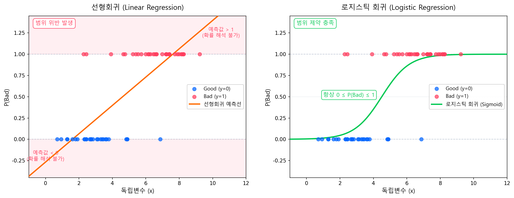

# 문제 정의: Binary Classification

## 1.1 수학적 문제 정의

개요에서 다룬 바와 같이, CSS 모형은 차주의 불량 여부를 예측하는 이진 분류 문제다. 본 파트에서는 이를 수학적으로 정식화한다.

| 구분 | 기호 | 정의 |
|------|------|------|
| **Good** | \(y = 0\) | 정상 (성과 기간 내 불량 미발생) |
| **Bad** | \(y = 1\) | 불량 (기준 이벤트 발생) |

모형의 목표는 차주의 특성 벡터 \(\mathbf{x} = (x_1, x_2, \ldots, x_k)\)가 주어졌을 때, 불량 발생 확률 \(P(y=1 \mid \mathbf{x})\)를 추정하는 것이다. **불량률(Bad Rate)**은 전체 관찰 대상 중 Bad로 분류된 비율이다.

$$
p = P(y=1) = \frac{N_{\text{Bad}}}{N_{\text{Total}}}, \quad 0 \leq p \leq 1
$$

!!! note "개요 참조"
    Bad/Good/Indeterminate 정의, 성과 기간 설정(Vintage·Roll Rate 분석) 등 모형 개발의 요건 정의에 관한 내용은 [개요](../part1_overview/index.md)에서 상세히 다루고 있다.

## 1.2 왜 선형회귀를 직접 쓸 수 없는가

선형회귀 모형 \(\hat{y} = \beta_0 + \beta_1 x_1 + \cdots + \beta_k x_k\)를 직접 이진 결과(0/1)에 적용하면 세 가지 구조적 문제가 발생한다.

---

**① 예측값이 확률 범위를 벗어난다**

선형회귀 예측값은 \((-\infty, +\infty)\) 범위를 가지지만, 확률은 반드시 \([0, 1]\) 안에 있어야 한다. 예측값이 음수이거나 1을 초과하면 확률로 해석할 수 없다.

---

**② 오차의 통계적 가정이 깨진다**

선형회귀(OLS)는 "모든 관측치의 오차 분산이 동일하고(등분산), 오차가 정규 분포를 따른다"는 가정 위에 성립한다. 그런데 결과값이 0 아니면 1뿐인 이진 변수에서는 이 가정이 **구조적으로 성립할 수 없다.**

- **이분산성**: 불량 확률이 50%인 차주는 예측 불확실성이 최대이고, 거의 확실한 Good/Bad 차주는 불확실성이 작다. 즉 차주마다 오차 분산이 다르다.
- **비정규 잔차**: 실제값이 0 또는 1 두 가지뿐이므로, 잔차도 두 덩어리로만 나뉘어 정규 분포가 될 수 없다.

이 때문에 OLS 계수 추정이 비효율적이 되고, \(t\)-검정·\(F\)-검정 등 통계적 추론도 신뢰할 수 없게 된다.

??? note "수학적 도출 — 왜 분산이 관측치마다 다른가"
    선형회귀(OLS)가 최적의 추정량(BLUE)이 되려면 **Gauss-Markov 정리**의 조건을 만족해야 한다:

    1. **등분산** — 모든 관측치의 오차 분산이 동일: \(\text{Var}(\epsilon_i) = \sigma^2\)
    2. **정규 잔차** — 오차가 정규 분포를 따름: \(\epsilon_i \sim N(0, \sigma^2)\)
    3. **선형성** — 종속변수가 독립변수의 선형 결합으로 표현됨

    \(y_i \in \{0,1\}\)은 베르누이 분포를 따르므로:

    $$
    E[y_i] = p_i, \quad \text{Var}(y_i) = p_i(1-p_i)
    $$

    **도출:** \(E[y_i^2] = 0^2 \cdot (1-p_i) + 1^2 \cdot p_i = p_i\)이므로, \(\text{Var}(y_i) = E[y_i^2] - (E[y_i])^2 = p_i - p_i^2 = p_i(1-p_i)\).

    분산이 \(p_i\)에 의존하므로 관측치마다 달라진다. 구체적인 수치를 보면:

    | \(p_i\) | \(\text{Var}(y_i) = p_i(1-p_i)\) | 의미 |
    |---------|----------------------------------|------|
    | 0.05 | 0.048 | 거의 확실한 Good → 분산 작음 |
    | 0.20 | 0.160 | 불량률 중간 |
    | 0.50 | **0.250** | 분산 최대 — 불확실성이 가장 큼 |
    | 0.80 | 0.160 | 불량률 높음 |
    | 0.95 | 0.048 | 거의 확실한 Bad → 분산 작음 |

    \(p=0.5\)에서 분산이 최대이고, 0이나 1에 가까울수록 분산이 줄어든다. 이것이 등분산 가정 위반(이분산성)의 수학적 근거다.

---

!!! warning "결론 — Logit 변환이 왜 이 문제를 해결하는가"
    위 문제의 근본 원인은 **확률 \(p \in [0,1]\)이라는 제한된 범위**의 값을 선형회귀로 직접 모델링하려 했기 때문이다.

    Logit 변환은 확률 \(p\)를 **Log Odds**로 바꾼다:

    $$
    \text{logit}(p) = \ln\!\left(\frac{p}{1-p}\right) \in (-\infty, +\infty)
    $$

    이 변환을 거치면:

    - **범위 문제 해소** — 변환된 값이 \((-\infty, +\infty)\)이므로, 선형회귀의 예측값 범위와 일치한다.
    - **회귀 프레임워크 적용 가능** — "Log Odds = \(\beta_0 + \beta_1 x_1 + \cdots\)" 형태로, 익숙한 선형 결합 구조를 그대로 쓸 수 있다.
    - **추정 방식 전환** — OLS 대신 **MLE(최대우도추정)**를 사용하므로, 등분산·정규 잔차 가정이 애초에 필요하지 않다.

    즉 Logit 변환은 "확률을 직접 예측"하는 대신 "Log Odds를 예측"하는 문제로 바꿔서, 선형회귀의 구조적 한계를 우회한다. 이것이 **로지스틱 회귀**의 출발점이다.

!!! success "로지스틱 회귀의 주요 가정 — OLS와 비교"
    위에서 선형회귀(OLS)가 등분산·정규 잔차·선형성이라는 엄격한 가정을 요구함을 보았다. 로지스틱 회귀는 MLE를 사용하므로 **등분산과 정규 잔차 가정이 필요 없다.** 대신 아래 조건을 충족해야 한다.

    | OLS 가정 | 로지스틱 회귀에서는? |
    |----------|---------------------|
    | 등분산 (\(\text{Var}(\epsilon_i) = \sigma^2\)) | **불필요** — MLE가 이분산성을 자체 처리 |
    | 정규 잔차 (\(\epsilon_i \sim N\)) | **불필요** — 베르누이 분포를 직접 모형화 |
    | 선형성 | **Log-odds와 독립변수 간 선형 관계**로 전환 |

    추가로 필요한 가정:

    - **반응변수의 이진성:** \(y \in \{0, 1\}\)로 이진 분류여야 한다.
    - **관측치 간 독립성:** 각 관측치 \((y_i, \mathbf{x}_i)\)는 서로 독립이어야 한다.
    - **Log-odds와 독립변수 간 선형 관계:** \(\text{logit}(p) = \beta_0 + \boldsymbol{\beta}^\top\mathbf{x}\)가 성립해야 한다. 이 가정이 WoE(Weight of Evidence) 변환의 이론적 근거이며, [Classing](../part3_variable_selection/classing/index.md)에서 상세히 다룬다.
    - **다중공선성이 심하지 않을 것:** 독립변수 간 높은 상관관계는 계수 추정을 불안정하게 만든다.
    - **완전분리(Complete Separation) 부재:** 특정 변수 조합이 Good/Bad를 완벽히 분리하면 MLE가 수렴하지 않는다.
