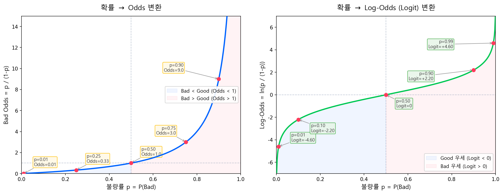
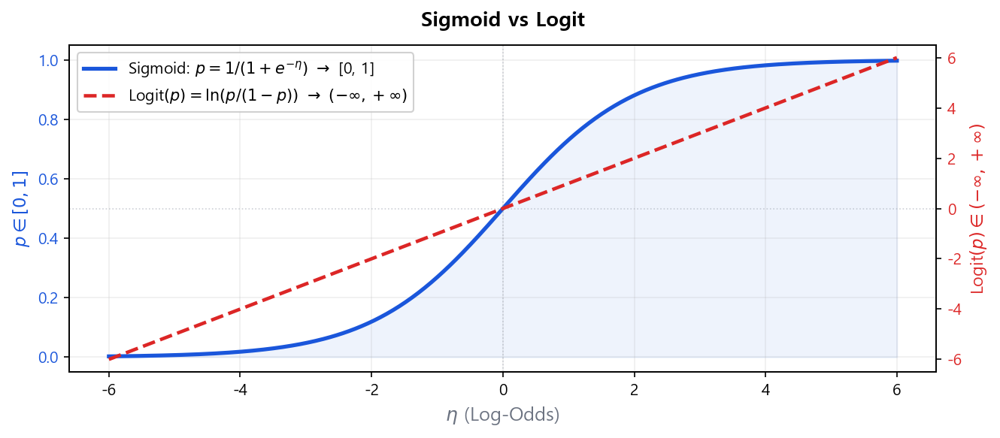

# Logit 변환: 확률 공간 → 실수 공간

## 2.1 Odds: 첫 번째 변환

확률 \(p\)는 \([0,1]\) 범위로 제한되어 있다. 첫 번째 변환으로 **Odds**(오즈)를 도입한다.

$$
\text{Odds} = \frac{p}{1-p} \tag{1}
$$

식 (1)에서 Odds는 범위가 \((0, +\infty)\)로 확장된다. \(p=0.5\)이면 Odds = 1(Bad와 Good이 동등), \(p \to 1\)이면 Odds \(\to \infty\), \(p \to 0\)이면 Odds \(\to 0\)이다.

!!! warning "Odds 방향 — Bad Odds vs Good Odds"
    본 문서에서 \(p = P(y=1) = P(\text{Bad})\)이므로, \(\text{Odds} = p/(1-p)\)는 **Bad Odds**(불량 오즈) 기준이다. 이는 로지스틱 회귀에서 Bad를 타겟(\(y=1\))으로 모형링하는 표준 관례를 따른 것이다.

    반면 스코어카드 실무에서는 점수가 높을수록 우량해야 직관적이므로, 점수 변환(PDO) 시 **Good Odds \(= (1-p)/p\)**로 방향을 뒤집어 사용한다. 이 전환은 [스코어카드 변환](../part5_scorecard/scorecard-and-rating.md)에서 상세히 다룬다.

    | 단계 | Odds 기준 | 이유 |
    |------|-----------|------|
    | 모형 적합 (개요~단변량 LR) | Bad Odds = \(p/(1-p)\) | Bad를 타겟(\(y=1\))으로 모형링 |
    | 스코어카드 변환 | Good Odds = \((1-p)/p\) | 점수 ↑ = 우량, 직관적 해석 |

!!! tip "직관적 이해"
    불량률(Bad Odds 관점)이 25%라면 Bad Odds = \(\frac{0.25}{0.75} = \frac{1}{3} \approx 0.333\), 즉 Good 3건당 Bad 1건이다. Bad Odds가 1보다 크면 Bad가 Good보다 더 많다는 의미다.

    참고: 경마에서 "3 대 1 배당"은 Good Odds(= Good/Bad = 3) 관점이다. 같은 상황을 Bad Odds로 표현하면 1/3이 된다.

| 불량률 \(p\) | Odds \(= p/(1-p)\) | 해석 |
|-------------|---------------------|------|
| 0.01 (1%) | 0.0101 | Bad 1건 : Good 99건 |
| 0.05 (5%) | 0.0526 | Bad 1건 : Good 19건 |
| 0.25 (25%) | 0.333 | Bad 1건 : Good 3건 |
| 0.50 (50%) | 1.000 | Bad = Good |
| 0.90 (90%) | 9.000 | Bad 9건 : Good 1건 |

아래 그래프는 확률 \(p\)가 Odds와 Log-Odds(Logit)로 어떻게 변환되는지를 보여준다. 왼쪽은 Odds 변환(\([0,1] \to (0,+\infty)\)), 오른쪽은 여기에 로그를 취한 Logit 변환(\([0,1] \to (-\infty,+\infty)\))이다.



## 2.2 Log-Odds (Logit 변환): 두 번째 변환

Odds에 자연로그를 적용하면 범위가 \((-\infty, +\infty)\)로 완전히 확장된다.

$$
\text{Logit}(p) = \ln\left(\frac{p}{1-p}\right) \tag{2}
$$

식 (2)에 의해 이제 선형회귀 구조를 적용할 수 있다.

$$
\ln\left(\frac{p}{1-p}\right) = \beta_0 + \beta_1 x_1 + \beta_2 x_2 + \cdots + \beta_k x_k \tag{3}
$$

| 불량률 \(p\) | Odds | Log-Odds \(= \ln(\text{Odds})\) |
|-------------|------|-------------------------------|
| 0.01 | 0.0101 | −4.60 |
| 0.05 | 0.0526 | −2.94 |
| 0.25 | 0.333 | −1.10 |
| 0.50 | 1.000 | 0.00 |
| 0.75 | 3.000 | +1.10 |
| 0.99 | 99.0 | +4.60 |

??? note "자연로그(ln)를 사용하는 이유"
    Odds에 로그를 취할 때 굳이 자연로그(ln)를 쓰는 데에는 세 가지 실질적 이유가 있다.

    **(1) 역변환(확률 복원)의 편의성**

    식 (2)의 Logit 변환 \(\eta = \ln\!\left(\frac{p}{1-p}\right)\)의 역함수를 풀면 확률 \(p\)를 깔끔하게 복원할 수 있다.

    $$
    p_i = \frac{1}{1 + e^{-(\beta_0 + \boldsymbol{\beta}^\top \mathbf{x}_i)}} \tag{4}
    $$

    이 함수를 **시그모이드(Sigmoid) 함수**라 한다. 자연로그 덕분에 지수함수와 로그함수가 서로 상쇄되어 역변환이 단순하게 표현된다.

    **(2) 미분의 단순성**

    \(\dfrac{d}{dx}\ln(x) = \dfrac{1}{x}\)로 최적화 연산이 효율적이다. MLE에서 Log-Likelihood를 \(\boldsymbol{\beta}\)에 대해 미분할 때 깔끔한 닫힌 형태의 Gradient가 도출된다 (상세 도출은 [MLE 3.3절](mle.md) 참고).

    $$
    \frac{\partial \ell}{\partial \boldsymbol{\beta}} = \sum_{i=1}^{n}(y_i - p_i)\mathbf{x}_i
    $$

    Logit 함수 자체의 미분도 깔끔한 형태를 갖는다:

    $$
    \frac{d}{dp}\ln\!\left(\frac{p}{1-p}\right) = \frac{1}{p(1-p)}
    $$

    **도출:** \(\ln\!\left(\frac{p}{1-p}\right) = \ln p - \ln(1-p)\)이므로, 미분하면 \(\frac{1}{p} + \frac{1}{1-p} = \frac{1}{p(1-p)}\).

    이 결과의 의미: \(p \approx 0.5\)에서 미분값이 최대(\(=4\))이고, \(p\)가 0이나 1에 가까울수록 미분값이 커진다. 즉 **불확실성이 가장 큰 구간(\(p \approx 0.5\))에서 Logit의 변화 감도가 가장 높으며**, MLE 최적화 시 이 구간의 관측치에 학습이 집중된다.

    **(3) 수치 안정성 및 최적화 보장**

    - **단조증가(monotone increasing):** 순서 보존 — log-odds가 클수록 확률도 크다. 직관적 해석이 유지된다.
    - **Log-Likelihood 함수가 오목(concave)**하여 전역 최적해 수렴 보장 — 아래 [3.3절](mle.md)에서 상세 설명
    - **확률값 직접 곱 대신 로그 합산 →** 수치 **Underflow 방지** (예: \(p_i = 0.001\)을 1,000번 곱하면 컴퓨터에서 0으로 수렴)

## 2.3 로지스틱 함수: 역방향 변환

식 (3)의 Log-Odds \(\eta = \beta_0 + \boldsymbol{\beta}^\top \mathbf{x}\)로부터 확률 \(p\)로 되돌아가는 역변환이 **로지스틱 함수(Sigmoid)**이다.

$$
p = P(y=1 \mid \mathbf{x}) = \frac{1}{1 + e^{-\eta}} = \frac{e^\eta}{1 + e^\eta} \tag{5}
$$

Sigmoid와 Logit은 서로 **역함수 관계**다. 실무에서 자주 쓰이는 역변환 예시:

| Log-Odds \(\eta\) | 확률 \(p = 1/(1+e^{-\eta})\) | 실무 해석 |
|-------------------|------------------------------|----------|
| −3.0 | 0.047 (4.7%) | 불량 확률 낮음. 우량 구간 |
| −1.0 | 0.269 (26.9%) | 중간~위험 구간 |
| 0.0 | 0.500 (50.0%) | Bad/Good 동등. 기준점 |
| 0.5 | 0.622 (62.2%) | 불량 확률 높음 |
| 2.0 | 0.881 (88.1%) | 매우 고위험 |

예를 들어 "이 차주의 log-odds가 0.5이면 불량 확률은?" → \(p = 1/(1+e^{-0.5}) \approx 0.622\), 즉 약 62%다.

아래 차트는 두 함수를 동시에 표시하여 범위 변환이 어떻게 이루어지는지 보여준다.



!!! note "Sigmoid vs Logit 비교"
    | | **Sigmoid** (η → p) | **Logit** (p → η) |
    |---|---|---|
    | 입력 | 선형 결합 \(\eta \in (-\infty, +\infty)\) | 확률 \(p \in (0, 1)\) |
    | 출력 | 확률 \(p \in [0, 1]\) | Log-odds \(\eta \in (-\infty, +\infty)\) |
    | 역할 | 회귀 예측값을 확률로 압축 | 확률을 실수 전체로 확장 |

!!! success "핵심 정리"
    로지스틱 회귀는 log-odds 공간에서 선형 모형을 적합시킨 후, 로지스틱 함수로 확률로 변환한다. 이로써 범위 위반, 이분산성, 비정규 잔차 문제가 동시에 해결된다.

> **확률 \(p \in [0,1]\)** → **Odds \(\in (0,\infty)\)** → **Log-Odds \(\in (-\infty,\infty)\)** → **선형 모형 \(\beta_0 + \boldsymbol{\beta}^\top\mathbf{x}\)**

!!! tip "β 해석 — 계수 하나의 의미"
    다변량 로지스틱 회귀에서 계수 \(\beta_j\)는 다른 변수를 고정한 채 \(x_j\)가 1단위 증가할 때 **log-odds가 \(\beta_j\)만큼 변한다**는 의미다.

    → \(e^{\beta_j}\)는 **오즈비(Odds Ratio)**: 예) \(\beta_j = 0.5\)이면 해당 변수 1단위 증가 시 Bad Odds가 \(e^{0.5} \approx 1.65\)배 증가.

!!! example "CB사 실무: 로지스틱 회귀 기반 평점 산출 구조"
    KCB 개인신용평점은 로지스틱 회귀 모형을 기반으로 5대 평가 부문의 가중 합산 점수를 산출하며, 1~1,000점 범위의 신용점수로 변환된다.

    | 평가 부문 | 비중 |
    |-----------|------|
    | 신용거래형태 | 38% |
    | 부채수준 | 24% |
    | 상환이력 | 21% |
    | 신용거래기간 | 9% |
    | 비금융/마이데이터 | 8% |

    <div class="source-ref">
    출처: <a href="https://www.allcredit.co.kr/screen/sc0682112929" target="_blank">KCB 올크레딧 · 주요평가부문</a>
    </div>

??? note "더 알아보기: GLM 관점 — Link Function을 바꾸면 다른 모형이 된다"
    로지스틱 회귀는 **일반화 선형모형(Generalized Linear Model, GLM)**의 한 특수한 경우다. GLM에서 **Link Function**이란 반응변수의 기대값과 선형결합 \(\eta = \beta_0 + \boldsymbol{\beta}^\top\mathbf{x}\)를 연결하는 함수 \(g(\cdot)\)를 말한다. 로지스틱 회귀는 베르누이 분포 + **Logit link** \(g(p) = \ln\frac{p}{1-p}\)를 선택한 것이다.

    **Link function을 바꾸면 같은 프레임워크에서 전혀 다른 모형**이 된다.

    | Link Function | \(g(p)\) | 특징 |
    |---------------|----------|------|
    | **Logit** | \(\ln\frac{p}{1-p}\) | 대칭, 오즈비 해석 가능. **스코어카드 표준** |
    | **Cloglog** | \(\ln[-\ln(1-p)]\) | 비대칭. 이산시간 비례위험모형(Discrete-time Proportional Hazards Model)과 동치 |

    스코어카드에서 Logit이 표준인 이유는 \(e^{\beta_j}\) = Odds Ratio라는 깔끔한 해석 때문이다. 반면 Cloglog link는 IFRS 9 Lifetime PD 추정 등 **"부도 시점"**을 모형화할 때 사용되며, Cox PH Model의 이산 버전에 해당한다.

    이처럼 link function의 선택에 따라 모형의 성격이 달라지며, 신용리스크 분야에서는 생존분석(Survival Analysis)과 결합하여 IFRS 9 Lifetime PD 추정, 행동평점, 조기상환 모형 등 **"부도 여부"가 아닌 "부도 시점"**을 모형화하는 방향으로도 확장된다.

    ---

    **Cloglog Link의 실무 적용: IFRS 9 Lifetime PD**

    Cloglog link가 실무에서 어떻게 사용되는지를 이해하려면, Cox Proportional Hazards Model(Cox PH Model)의 연속시간 위험함수에서 출발해야 한다.

    $$
    h(t \mid \mathbf{x}) = h_0(t) \cdot \exp(\boldsymbol{\beta}^\top\mathbf{x})
    $$

    여기서 \(h_0(t)\)는 기저 위험함수(baseline hazard), \(\exp(\boldsymbol{\beta}^\top\mathbf{x})\)는 차주 특성에 의한 위험 배율이다. 그러나 실무 데이터는 연속시간이 아니라 **월 단위, 분기 단위** 등 이산 구간으로 관측된다. 구간 \([t,\; t+1)\)에서의 이산 위험률(discrete hazard)을 정의하면:

    $$
    h_t = P(T \in [t,\; t+1) \mid T \ge t)
    $$

    이를 연속시간 Cox PH에서 유도하면 다음과 같다.

    $$
    h_t = 1 - \exp\!\bigl[-\exp(\alpha_t + \boldsymbol{\beta}^\top\mathbf{x})\bigr]
    $$

    양변에 변환을 적용하면:

    $$
    \ln\!\bigl[-\ln(1 - h_t)\bigr] = \alpha_t + \boldsymbol{\beta}^\top\mathbf{x}
    $$

    좌변이 바로 **cloglog link function**이다. 즉, **이항 GLM에서 link function만 cloglog으로 지정하면 Cox PH의 이산 버전**이 된다.

    **데이터 준비 — Person-Period 패널 변환**

    IFRS 9 Lifetime PD 산출을 위해, 원본 대출 데이터를 월 단위로 펼쳐 person-period 형태로 변환한다.

    | 차주 | 월(\(t\)) | 부도여부(\(y\)) | DTI | 연체횟수 | … |
    |------|-----------|----------------|-----|---------|---|
    | A | 1 | 0 | 0.45 | 0 | … |
    | A | 2 | 0 | 0.45 | 1 | … |
    | A | 3 | 0 | 0.47 | 1 | … |
    | A | **4** | **1** | 0.50 | 2 | … |
    | B | 1 | 0 | 0.30 | 0 | … |
    | B | 2 | 0 | 0.30 | 0 | … |
    | … | … | … | … | … | … |
    | B | 6 | 0 | 0.32 | 0 | … |

    - 차주 A: 4개월차에 부도 → 4행 생성, 마지막 행만 \(y=1\)
    - 차주 B: 6개월까지 생존(중도절단, censored) → 6행 생성, 전부 \(y=0\)
    - 연체횟수 등 **시변(time-varying) 변수**는 매 월 값이 갱신됨

    **모형 적합**

    일반적인 GLM 코드에서 link만 cloglog으로 지정하면 된다.

    ```python
    import statsmodels.api as sm

    model = sm.GLM(
        y,
        X,  # 월 더미(αₜ) + 차주 특성변수
        family=sm.families.Binomial(
            link=sm.families.links.CLogLog()
        )
    ).fit()
    ```

    **Lifetime PD 산출**

    적합된 모형에서 각 월별 위험률 \(h_t\)를 예측한 뒤, 생존확률을 누적 곱하여 Lifetime PD를 산출한다.

    $$
    S(T) = \prod_{k=1}^{T}(1 - h_k), \qquad \text{Lifetime PD} = 1 - S(T)
    $$

    | 월(\(t\)) | \(h_t\) (월별 위험률) | 생존확률 \(S(t)\) | 누적 PD |
    |-----------|---------------------|------------------|---------|
    | 1 | 0.005 | 0.995 | 0.5% |
    | 2 | 0.006 | 0.989 | 1.1% |
    | 3 | 0.008 | 0.981 | 1.9% |
    | … | … | … | … |
    | 12 | 0.010 | 0.920 | 8.0% |
    | 36 | 0.012 | 0.750 | 25.0% |

    - **12개월 PD** = \(1 - S(12)\) → IFRS 9 Stage 분류 기준
    - **Lifetime PD** = \(1 - S(\text{만기})\) → ECL(기대신용손실) 산출에 투입

    **Logit vs Cloglog — 왜 구분하는가**

    | | Logit link | Cloglog link |
    |--|-----------|-------------|
    | 계수 해석 | Odds Ratio | **Hazard Ratio** |
    | 이론적 배경 | 오즈비 기반 | **Cox PH Model의 이산 버전** |
    | 주 용도 | 스코어카드(12개월 PD) | **IFRS 9 Lifetime PD** |
    | 규제 설명 | "로지스틱 회귀" | "이산시간 비례위험모형" |

    Logit link로도 동일한 패널 구조에서 월별 PD를 추정할 수 있다. 그러나 IFRS 9 검증 시 "이 모형의 이론적 근거"를 설명해야 할 때, Cloglog을 사용하면 생존분석 프레임워크와의 정합성을 갖추게 되어 **규제 설명력** 측면에서 이점이 있다.

    !!! quote "저자의 말"
        클로드 코드와 스터디하면서 오랜만에 생존분석(Survival Analysis)의 Cox PH Model 내용을 리뷰하였다. 본인의 경우, 실무에서 Logit 변환 외 다른 link function을 사용해 본 적은 없지만, Cloglog 변환을 통해 PD 추정을 하는 경우도 있다고 한다.

!!! note "스코어카드에서 로지스틱 회귀를 고집하는 이유"
    머신러닝 분류 모형(Random Forest, XGBoost 등)이 예측력 면에서 우수할 수 있음에도, 스코어카드 실무에서 로지스틱 회귀가 표준으로 자리잡은 이유는 다음과 같다.

    - **해석가능성:** 계수(β)와 오즈비(Odds Ratio)로 각 변수의 영향을 직관적으로 설명할 수 있다.
    - **규제 수용성:** 금감원, Basel 등 감독기관은 모형의 투명성과 설명가능성을 요구하며, 로지스틱 회귀는 이 요건을 충족한다.
    - **단조성 보장:** WoE 인코딩 + 로지스틱 회귀 구조에서 각 변수의 점수가 단조적으로 배분되어, 비즈니스 직관에 부합하는 스코어카드를 구성할 수 있다.
    - **파이프라인 정합성:** Classing → WoE → Logistic Regression → PDO 변환이라는 일관된 프레임워크를 형성한다.
