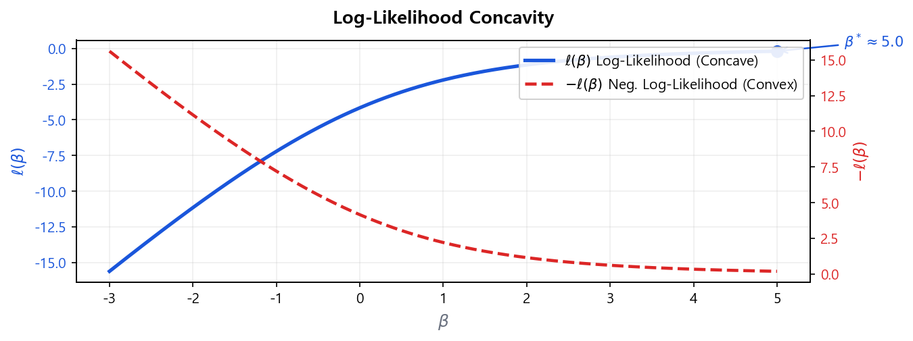

# MLE (최대우도추정)

## 3.1 개념

선형회귀는 잔차제곱합(RSS)을 최소화하는 OLS(최소자승법)를 사용하지만, 로지스틱 회귀는 **최대우도추정(MLE, Maximum Likelihood Estimation)**으로 계수를 추정한다.

> OLS는 \(\hat{\beta} = (X'X)^{-1}X'y\)라는 **해석적 해(closed-form solution)**가 존재하지만, 로지스틱 회귀의 목적함수는 비선형이라 닫힌 해가 없다. 따라서 반복적 수치 최적화가 **필수**다.

!!! tip "직관적 이해"
    MLE는 "실제로 관찰된 데이터가 나타날 확률을 최대로 만드는 파라미터는 무엇인가?"를 찾는 방법이다. 실제 Bad인 차주에게는 높은 \(\hat{p}\)를, 실제 Good인 차주에게는 낮은 \(\hat{p}\)를 부여하는 \(\beta\)를 찾는다.

## 3.2 Likelihood 정의

\(n\)개의 독립 관측치 \((y_i, \mathbf{x}_i)\)에 대해, 모형의 예측 확률 \(p_i = P(y_i = 1 \mid \mathbf{x}_i)\)를 이용하면 개별 관측치의 확률은 다음과 같다.

$$
P(y_i \mid \mathbf{x}_i) = p_i^{y_i}(1-p_i)^{1-y_i} \tag{6}
$$

식 (6)으로부터, 전체 데이터의 결합 우도(Likelihood)는:

$$
L(\boldsymbol{\beta}) = \prod_{i=1}^{n} p_i^{y_i}(1-p_i)^{1-y_i} \tag{7}
$$

| 고객 | 실제 \(y_i\) | 예측 \(\hat{p}_i\) | 평가 | 기여도 \(P(y_i \mid \mathbf{x}_i)\) |
|------|-------------|-------------------|------|----------------------------------|
| 고객 A | Bad (\(y=1\)) | 0.90 | ✅ 높은 \(\hat{p}\) → 올바름 | \(0.90^1 \cdot 0.10^0 = 0.90\) |
| 고객 B | Bad (\(y=1\)) | 0.05 | ❌ 낮은 \(\hat{p}\) → 틀림 | \(0.05^1 \cdot 0.95^0 = 0.05\) |
| 고객 C | Good (\(y=0\)) | 0.08 | ✅ 낮은 \(\hat{p}\) → 올바름 | \(0.08^0 \cdot 0.92^1 = 0.92\) |
| 고객 D | Good (\(y=0\)) | 0.85 | ❌ 높은 \(\hat{p}\) → 틀림 | \(0.85^0 \cdot 0.15^1 = 0.15\) |

## 3.3 Log-Likelihood와 최적화

식 (7)의 곱셈 형태 \(L(\boldsymbol{\beta})\)는 직접 최대화하기 어렵다. 로그를 취하면 합산 형태로 변환된다.

$$
\ell(\boldsymbol{\beta}) = \ln L(\boldsymbol{\beta}) = \sum_{i=1}^{n} \left[ y_i \ln p_i + (1-y_i)\ln(1-p_i) \right] \tag{8}
$$

!!! note "리마인드 — 여기서 \(p_i\)는:"
    $$p_i = P(y_i = 1 \mid \mathbf{x}_i) = \frac{1}{1+e^{-\eta_i}} = \frac{e^{\eta_i}}{1+e^{\eta_i}}, \quad \eta_i = \beta_0 + \boldsymbol{\beta}^\top \mathbf{x}_i$$

    즉, 단순한 숫자가 아니라 **\(\boldsymbol{\beta}\)의 함수**다. \(\ell(\boldsymbol{\beta})\)를 최대화하는 것은 곧 이 \(p_i\)들을 실제 \(y_i\)에 가장 근접하게 만드는 \(\boldsymbol{\beta}\)를 찾는 것이다.

### Gradient(Score 함수) 도출

\(\ell(\boldsymbol{\beta})\)를 \(\boldsymbol{\beta}\)로 편미분하면 최적화에 사용할 Gradient(Score 함수)를 얻는다.

**Step 1 — 체인 룰 적용:**

$$
\frac{\partial \ell}{\partial \beta_j} = \sum_{i=1}^{n} \frac{\partial}{\partial \beta_j}\left[ y_i \ln p_i + (1-y_i)\ln(1-p_i) \right]
$$

**Step 2 — 각 항을 \(p_i\)에 대해 미분한 뒤 \(p_i\)를 \(\beta_j\)로 미분:**

\(\frac{\partial \ln p_i}{\partial p_i} = \frac{1}{p_i}\), \(\frac{\partial \ln(1-p_i)}{\partial p_i} = \frac{-1}{1-p_i}\)이고, 시그모이드 함수의 미분 성질에 의해 \(\frac{\partial p_i}{\partial \eta_i} = p_i(1-p_i)\), \(\frac{\partial \eta_i}{\partial \beta_j} = x_{ij}\)이므로:

$$
\frac{\partial \ell}{\partial \beta_j} = \sum_{i=1}^{n}\left[\frac{y_i}{p_i} - \frac{1-y_i}{1-p_i}\right] \cdot p_i(1-p_i) \cdot x_{ij}
$$

**Step 3 — 정리:**

괄호 안을 통분하면 \(\frac{y_i(1-p_i) - (1-y_i)p_i}{p_i(1-p_i)} = \frac{y_i - p_i}{p_i(1-p_i)}\)이므로:

$$
\boxed{\frac{\partial \ell}{\partial \beta_j} = \sum_{i=1}^{n}(y_i - p_i)\, x_{ij}} \tag{9}
$$

벡터 형태로 쓰면 \(\nabla_{\boldsymbol{\beta}}\ell = \mathbf{X}^\top(\mathbf{y} - \mathbf{p})\). 이 결과의 직관적 의미: **실제값과 예측값의 차이(\(y_i - p_i\))를 입력 변수(\(x_{ij}\))로 가중 합산**한 것이다. 차이가 클수록 \(\beta\)를 더 크게 갱신한다.

### Binary Cross-Entropy와의 관계

식 (8)을 최대화하는 것은 **이진 교차 엔트로피(Binary Cross-Entropy, BCE) 손실을 최소화**하는 것과 동치이다.

$$
\text{BCE Loss} = -\frac{1}{n}\ell(\boldsymbol{\beta}) = -\frac{1}{n}\sum_{i=1}^{n}\left[y_i \ln \hat{p}_i + (1-y_i)\ln(1-\hat{p}_i)\right]
$$

즉 머신러닝에서 "BCE Loss를 최소화한다"와 통계학에서 "Log-Likelihood를 최대화한다"는 **동일한 최적화 문제의 서로 다른 표현**이다. 부호와 스케일링(\(1/n\))만 다를 뿐 최적해 \(\hat{\boldsymbol{\beta}}\)는 동일하다.

!!! success "볼록성(Convexity) 보장 — 전역 최적해의 존재"
    \(\ell(\boldsymbol{\beta})\)는 \(\boldsymbol{\beta}\)에 대해 **오목(concave)** 함수이므로, 음수를 취한 \(-\ell(\boldsymbol{\beta})\)는 **볼록(convex)** 함수다.

    - **전역 최적해가 유일하게 존재:** 로컬 최솟값(Local Minimum) 없이 전역 최솟값(Global Minimum)으로 반드시 수렴한다.
    - **수렴 보장:** 어떤 초기값 \(\boldsymbol{\beta}^{(0)}\)에서 시작해도 알고리즘이 동일한 해에 도달한다.
    - **OLS와의 차이:** 선형회귀 OLS는 해석적 해 \(\hat{\boldsymbol{\beta}} = (\mathbf{X}^\top\mathbf{X})^{-1}\mathbf{X}^\top\mathbf{y}\)가 존재하지만, 로지스틱 회귀는 볼록 함수이면서도 **닫힌 해가 없어 반드시 수치 최적화**가 필요하다.

!!! note "OLS vs MLE 비교"
    선형회귀의 OLS는 잔차제곱합(RSS)을 최소화하며, RSS가 \(\boldsymbol{\beta}\)에 대해 볼록(convex)하므로 전역 최적값이 보장된다. 로지스틱 회귀의 MLE는 음의 로그-우도 \(-\ell(\boldsymbol{\beta})\)를 최소화하며, 이 역시 볼록 함수이므로 전역 최적값이 보장된다. 두 방법 모두 볼록 최적화 문제이나, OLS는 닫힌 해가 존재하는 반면 MLE는 수치 최적화가 필요하다는 차이가 있다.

## 3.4 최적화 알고리즘

로그-우도 함수는 \(\boldsymbol{\beta}\)에 대한 해석적 해(Closed-form Solution)가 없으므로 수치 최적화를 사용한다.

| 알고리즘 | 원리 | 특징 |
|----------|------|------|
| **경사 하강법** (Gradient Descent) | \(\boldsymbol{\beta}^{(t+1)} = \boldsymbol{\beta}^{(t)} + \alpha \nabla\ell\) | 단순, 대용량 데이터에 적합. 학습률 \(\alpha\) 조정 필요 |
| **Newton-Raphson** | 헤시안(Hessian) 행렬 활용, 2차 수렴 | 빠른 수렴, 소용량에 효과적. 헤시안 계산 비용이 높음 |
| **IRLS** (반복 가중 최소자승) | 가중 선형회귀를 반복. Newton-Raphson과 동치 | R의 `glm()` 등 통계 소프트웨어 기본 구현. 수치적으로 안정 |
| **L-BFGS** (Limited-memory BFGS) | 헤시안을 직접 계산하지 않고 근사하여 메모리 절약 | sklearn `LogisticRegression`의 기본 solver. 대용량에서도 효율적, 실무에서 가장 빈번 |

!!! success "수렴 판단"
    반복 과정에서 \(\lvert\ell^{(t+1)} - \ell^{(t)}\rvert < \varepsilon\) (예: \(10^{-6}\)) 이면 수렴으로 판단한다. sklearn `LogisticRegression`의 기본 solver는 `lbfgs`이며, 기본 최대 반복 횟수는 100회이다.

