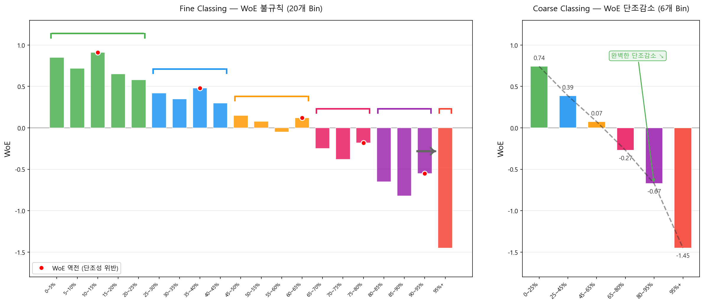

# Coarse Classing

## 3.1 개념과 목적

Coarse Classing은 Fine Classing의 세밀한 구간을 **통계적으로 유의하고 업무적으로 의미 있는 최종 구간**으로 합병하는 과정이다. 최종 Bin 수는 통상 **3~10개** 범위에서 결정되며, 실제 스코어카드 변수 1개당 평균 4~6개 수준으로 수렴하는 경우가 많다.

!!! note "Bin 수에 대한 실무 기준"
    주요 신용평가 문헌(Siddiqi, 2006; Altair Credit Scoring Guide)은 최대 10개 이내를 권고한다. 단, 샘플이 충분하고 변수 변별력이 높을 경우 7~8개, 샘플이 제한적이거나 변수 중요도가 낮을 경우 3~4개로 수렴하는 것이 일반적이다. **핵심은 Bin 개수 자체가 아니라, 각 Bin이 최소 샘플 기준(전체의 5%, Bad 10건 이상)을 충족하면서 WoE 단조성과 업무 논리를 동시에 만족하는가**에 있다.

!!! tip "왜 너무 적거나 너무 많으면 안 되는가"
    - **너무 적으면 (2개 이하):** 변수의 변별력을 충분히 활용하지 못함. 최소 3개 구간은 확보해야 비선형 패턴(U자형 등)을 표현할 수 있다.
    - **너무 많으면 (11개 이상):** 각 Bin의 샘플이 적어 WoE 불안정, Overfitting 위험, 스코어카드 해석 어려움.

### Coarse Classing 전·후 WoE 패턴 비교

Fine Classing(20개 Bin)의 불규칙한 WoE를 Coarse Classing(6개 Bin)으로 합병하면 단조성과 안정성이 확보된다. 아래 차트에서 **같은 색상의 Fine Bin들이 하나의 Coarse Bin으로 합병**되는 과정을 확인할 수 있다.



왼쪽 차트에서 빨간 점(●)으로 표시된 구간이 WoE 역전(단조성 위반)이 발생한 지점이다. 예를 들어 10~15% 구간의 WoE(0.91)가 5~10% 구간(0.72)보다 오히려 높은데, 이는 해당 구간의 샘플이 적어 WoE 추정이 불안정하기 때문이다. 이런 역전 구간을 인접 Bin과 합병하면 오른쪽 차트처럼 WoE가 0.74 → 0.39 → 0.07 → −0.27 → −0.67 → −1.45로 **깔끔하게 단조감소**한다.

!!! success "핵심 포인트"
    Coarse Classing의 목표는 WoE가 **단조적이면서** 각 Bin이 충분한 샘플을 보유하고, 인접 Bin 간 WoE 차이(Delta WoE)가 0.05 이상인 상태를 만드는 것이다. WoE가 깔끔하게 단조증가(또는 단조감소)하면 로지스틱 회귀에서 해당 변수의 계수가 안정적으로 추정된다.

---

## 3.2 합병 알고리즘

!!! note "실무 활용도"
    아래 알고리즘들은 모두 실무에서 사용되지만, 현재 Python 기반 작업 환경에서는 **optbinning**이 이 모든 알고리즘을 내부적으로 통합하여 자동화하므로, 원리를 이해한 후 optbinning으로 구현하는 방식이 효율적이다.

### (1) 단조성 기반 합병 (Monotonic Binning)

Bad Rate가 단조증가 또는 단조감소하도록 인접 Bin을 합병한다. 가장 기본적이고 직관적인 방법이다.

1. Fine Classing 결과에서 Bad Rate 단조성을 깨는 Bin 쌍 탐색
2. 위반하는 인접 Bin 중 **Delta WoE가 가장 작은 쌍**부터 합병
3. 합병 후 WoE 재계산
4. 단조성 유지 또는 목표 Bin 수 도달 시까지 반복

!!! note "Delta WoE란?"
    인접한 두 Bin i, i+1의 WoE 차이의 절댓값이다.

    $$\Delta WoE_i = |WoE_{i+1} - WoE_i|$$

    Delta WoE가 **클수록** 두 Bin 간 위험도 차이가 크므로 분리 유지 가치가 높다. 반대로 Delta WoE가 **작을수록** (통상 0.05 미만) 두 Bin을 구분하는 실질적 의미가 없어 합병 대상이 된다. 단조성을 깨는 Bin 쌍이 여러 개일 때 Delta WoE가 가장 작은 쌍부터 먼저 합병하는 것이 정보 손실을 최소화하는 탐욕 알고리즘(greedy)이다.

    *WoE의 세부 계산 방법과 해석 기준은 [WoE/IV](../woe_iv/woe.md)에서 다룬다.*

### (2) Chi-Square Merge (ChiMerge)

인접 Bin 간 Bad Rate 차이가 통계적으로 유의한지를 카이제곱 검정으로 판단하여 합병한다. Kerber(1992)가 제안한 알고리즘으로, 현재도 자동 binning 도구의 핵심 로직으로 사용된다.

$$\chi^2 = \sum_{j=1}^{2}\sum_{k=1}^{2} \frac{(O_{jk} - E_{jk})^2}{E_{jk}} \tag{1}$$

\(O\): 관측 Good/Bad 수, \(E\): 두 구간을 합쳤을 때 기대 Good/Bad 수

1. 인접한 모든 Bin 쌍에 대해 \(\chi^2\) 통계량 산출
2. \(\chi^2\) 가장 작은 쌍 = Bad Rate 차이가 가장 유의하지 않은 쌍
3. p-value > 0.05 인 쌍부터 합병
4. 모든 인접 쌍이 유의하거나 목표 Bin 수 도달 시까지 반복

!!! tip "ChiMerge 구체 예시 — 매출액 변수 (5개 초기 Fine Bin)"

    | Bin | 구간 | Good | Bad | Bad Rate |
    |-----|------|------|-----|---------|
    | A | 0~1억 | 180 | 20 | 10.0% |
    | B | 1~3억 | 350 | 30 | 7.9% |
    | C | 3~10억 | 480 | 20 | 4.0% |
    | D | 10~50억 | 250 | 10 | 3.8% |
    | E | 50억+ | 140 | 5 | 3.4% |

    **1단계: 모든 인접 쌍의 χ² 산출**

    - A-B: Bad Rate 차이 2.1%p → χ² = 1.24, p = 0.265
    - B-C: Bad Rate 차이 3.9%p → χ² = 8.72, p = 0.003
    - C-D: Bad Rate 차이 0.2%p → χ² = 0.02, p = 0.887 **(χ² 최소, 1순위 합병 후보)**
    - D-E: Bad Rate 차이 0.4%p → χ² = 0.12, p = 0.729

    **2단계:** C-D 쌍 먼저 합병 (χ² = 0.02로 최소) → Bin 수 5→4개

    **3단계:** A-B 합병 (χ² = 1.24, p > 0.05) → Bin 수 4→3개

    **최종 결과:** [0~3억] / [3억~50억] / [50억+] → 3개 Bin. 이후 업무 논리 검토로 경계 미세 조정.

### (3) optbinning — Python 실무 구현

optbinning은 Guillermo Navas-Palencia가 개발한 오픈소스 라이브러리로, 단조성 기반 합병과 ChiMerge를 수학적 최적화(혼합정수계획법, MIP)로 통합한 **Optimal Binning** 알고리즘을 구현한다. 저자의 벤치마크에 따르면 동일 데이터 기준 scorecardpy 대비 약 17배 빠르며, IV가 평균 12% 높게 산출되는 것으로 보고되었다.

<div class="source-ref">
출처: <a href="https://github.com/guillermo-navas-palencia/optbinning" target="_blank">optbinning GitHub · Benchmarks</a>
</div>

??? example "Python 코드 — 단일 변수 Binning → 다변량 처리 → 스코어카드"

    ```python
    from optbinning import OptimalBinning, BinningProcess
    from optbinning import Scorecard
    import pandas as pd

    # ── 1. 단일 변수 Binning ──
    optb = OptimalBinning(
        name="utilization_rate",       # 변수명
        dtype="numerical",              # 연속형
        solver="cp",                    # 제약 프로그래밍 (권장)
        monotonic_trend="descending",   # 단조 방향 지정 (auto도 가능)
        min_bin_size=0.05,              # Bin당 최소 5%
        max_n_bins=7,                   # 최대 Bin 수 제한
        max_pvalue=0.05,                # 인접 Bin 간 p-value 상한
    )
    optb.fit(X["utilization_rate"], y)

    # Binning 결과 테이블 확인
    binning_table = optb.binning_table.build()
    print(binning_table)

    # ── 2. 다변량 BinningProcess (전체 변수 일괄 처리) ──
    variable_names = ["utilization_rate", "profit_margin", "sales_amount"]
    binning_process = BinningProcess(
        variable_names=variable_names,
        binning_fit_params={
            v: {"monotonic_trend": "auto", "max_n_bins": 7, "max_pvalue": 0.05}
            for v in variable_names
        }
    )
    binning_process.fit(X, y)

    # ── 3. 스코어카드 완성 ──
    from sklearn.linear_model import LogisticRegression
    scorecard = Scorecard(
        binning_process=binning_process,
        estimator=LogisticRegression(),
        scaling_method="pdo_odds",
        scaling_method_params={"pdo": 20, "odds": 1/19, "scorecard_points": 600},
        rounding=True,
    )
    scorecard.fit(X, y)
    print(scorecard.table(style="summary"))
    ```

??? example "optbinning 실행 결과 예시"

    ```
      Bin                   Count   Count (%)  Non-event  Event  Event rate      WoE        IV
      (-inf, 20.0)          1,850      18.5%      1,550    300      16.2%    -0.712    0.1153
      [20.0, 40.0)          2,100      21.0%      1,820    280      13.3%    -0.385    0.0342
      [40.0, 60.0)          2,350      23.5%      2,150    200       8.5%     0.098    0.0023
      [60.0, 80.0)          2,200      22.0%      2,100    100       4.5%     0.743    0.1050
      [80.0, inf)           1,500      15.0%      1,480     20       1.3%     1.452    0.2147
      Special                   0       0.0%          0      0       0.0%        —         —
      Missing                   0       0.0%          0      0       0.0%        —         —
      Totals               10,000     100.0%      9,100    900       9.0%        —     0.4715
    ```

!!! note "결과 해석"
    - WoE가 −0.712 → −0.385 → +0.098 → +0.743 → +1.452로 **완전 단조 증가** → `monotonic_trend="ascending"` 제약이 충족됨
    - 모든 Bin의 Count(%) ≥ 15% → `min_bin_size=0.05` 기준 충족
    - 변수 전체 IV = 0.4715 → "강한 변별력"

!!! success "optbinning 핵심 파라미터 요약"
    - `monotonic_trend`: `"auto"` (자동 탐지), `"ascending"`, `"descending"`, `"peak"` (역U형), `"valley"` (U형), `"none"` (제약 없음)
    - `min_bin_size`: Bin당 최소 샘플 비율 (기본 0.05 = 5%)
    - `max_n_bins`: 최대 Bin 수 (미지정 시 자동 최적화)
    - `max_pvalue`: 인접 Bin 간 허용 최대 p-value → 0.05로 설정하면 ChiMerge와 동일한 통계 기준 적용
    - `special_codes`: Mass Point(0값 등) 별도 처리할 값 지정

    내부 최적화 엔진(MIP/CP) 동작 원리, WoE 변환, BinningProcess 다변량 처리, Scorecard 클래스 등 상세 활용법은 **[부록 A. optbinning 실무 가이드](../../appendix/optbinning/index.md)**를 참고한다.

---

### (4) 검정 통계량 심화 — Wald p-value vs. Chi-square test

!!! note "개요 수준 안내"
    이 섹션의 내용은 개요 수준으로만 다룬다. Wald 검정의 수식 유도, 표본 크기에 따른 검정력 비교, 그리고 단변량 로지스틱 회귀 단계에서 각 Bin 계수의 유의성을 실제로 해석하는 방법은 **[WoE/IV](../woe_iv/woe.md)**와 **[단변량 로지스틱 회귀](../univariate_lr/concept.md)**에서 차트와 수치 예시를 통해 자세히 다룬다.

<div markdown>

| 구분 | Wald 검정 | 카이제곱(χ²) 검정 |
|------|----------|-----------------|
| **사용 맥락** | 단변량 로지스틱 회귀 후, 개별 Bin의 계수(β) 유의성 | ChiMerge: 인접 두 Bin 간 Bad Rate 차이 유의성 |
| **검정 대상** | H₀: 해당 Bin의 β = 0 | H₀: 두 Bin 간 Good/Bad 분포 동일 |
| **계산 방식** | \(W = \left(\frac{\hat{\beta}}{SE(\hat{\beta})}\right)^2 \sim \chi^2(1)\) | \(\chi^2 = \sum \frac{(O-E)^2}{E}\) (자유도 1) |
| **동일 여부** | 다름: 둘 다 χ²(1) 분포를 따르지만, 검정 대상과 맥락이 다르다. | |
| **공통점** | 자유도 1인 카이제곱 분포를 따르며, p < 0.05 기준으로 유의성을 판단하는 점은 동일하다. | |
| **실무 활용** | Coarse Classing 후 단변량 로지스틱 회귀 단계에서 각 Bin의 계수 유의성 확인 | Coarse Classing 단계에서 합병 기준으로 활용 |

</div>

!!! warning "혼동 주의"
    합병 기준 표에서 "Wald p-value"는 단변량 로지스틱 회귀 이후에 확인하는 지표이고, ChiMerge의 p-value는 Coarse Classing 과정 중에 사용하는 지표다. 시점과 목적이 다르므로 혼용하지 않도록 주의한다.

!!! note "두 알고리즘(단조성 vs. ChiMerge) 비교"
    단조성 기반은 구현이 단순하고 해석이 용이하며 업무 논리와 자연스럽게 연결된다. ChiMerge는 통계적 근거가 명확하고 자동화에 적합하지만 결과가 업무 논리와 항상 일치하지 않아 후처리가 필요하다. **실무에서는 optbinning이 두 방식을 최적화 문제로 통합하여 자동 처리하며, 이후 업무 논리로 수동 후조정**하는 방식이 일반적이다.

---

## 3.3 합병 기준 5가지 (우선순위 순)

| 우선순위 | 기준 | 구체적 조건 |
|---------|------|-----------|
| **1 최우선** | 샘플 최소 기준 | Bin당 전체 샘플의 5% 이상, Bad 건수 10건 이상. 미달 시 무조건 합병. |
| **2 필수** | WoE 단조성 | Bad Rate(또는 WoE)가 단조증가 또는 단조감소. 위반 시 합병. |
| **3 권고** | Delta WoE | 인접 Bin 간 WoE 차이 > 0.05. 미달 시 구분 의미 없음 → 합병 고려. |
| **4 권고** | 단변량 LR 유의성 | Bin별 Wald p-value < 0.05. 미달 시 해당 Bin 재검토. |
| **5 고려** | 업무 논리 정합성 | 감독 기준, 여신 정책, 경제적 해석 가능성. 통계 기준 통과해도 업무 논리 위반 시 조정. |

## 3.4 후보안 생성과 최종 선택

!!! tip "실무 접근법"
    Coarse Classing은 단 하나의 정답이 존재하지 않는다. 합병 알고리즘과 기준을 달리 적용하여 **2~3개의 후보안**을 생성한 후, 단변량 로지스틱 회귀 결과(β 유의성, KS 기여도)를 비교하여 최종안을 선택한다.

| 평가 항목 | 후보안 A (5 Bin) | 후보안 B (7 Bin) | 후보안 C (6 Bin) |
|----------|----------------|----------------|----------------|
| WoE 단조성 | 완전 단조 | 완전 단조 | 1개 Bin 비단조 |
| 유의 Bin 비율 | 5/5 (100%) | 6/7 (86%) | 5/6 (83%) |
| 변수 KS | 28.3 | 31.7 | 29.4 |
| 업무 논리 | 자연스러움 | 자연스러움 | 일부 구간 설명 어려움 |
| **최종 선택** | | **선택** | |
