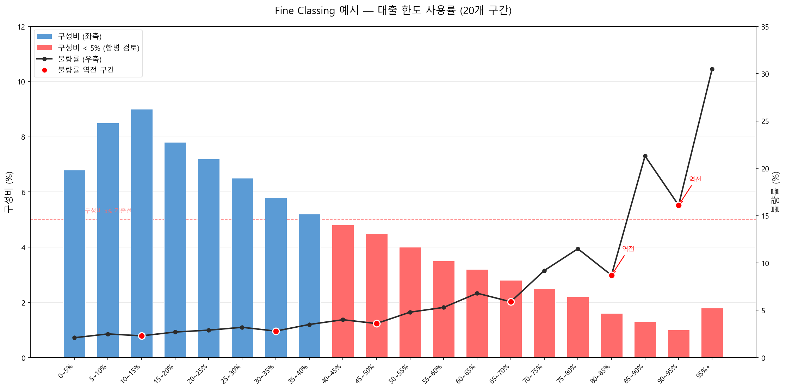

# Fine Classing

## 2.1 개념과 목적

Fine Classing은 변수의 분포와 Bad Rate 패턴을 **탐색**하기 위한 초기 세밀 구간화다. 이 단계의 목적은 최적 구간을 찾는 것이 아니라, **데이터가 어떤 패턴을 갖고 있는지 파악**하는 것이다.

!!! note "Fine Classing의 역할"
    Fine Classing 결과를 보고 "어디서 Bad Rate가 꺾이는가", "이상치 구간이 있는가", "결측값 비중이 어느 정도인가"를 파악한다. 이 탐색 없이 바로 Coarse Classing을 시도하면 중요한 패턴을 놓칠 수 있다.

## 2.2 실행 단계

Fine Classing은 다음 순서로 수행한다.

**Step 1 — 원시 데이터 분포 확인**

히스토그램으로 변수의 전체 분포를 먼저 확인한다. 이 단계에서 Mass Point(특정 값에 데이터 집중), 극단값, 분포의 편향(Skewness) 여부를 파악한다. 분포를 보지 않고 구간화를 시작하면 비합리적인 Bin이 생긴다.

**Step 2 — 특수값 사전 분리**

Mass Point, 결측, 이상치를 먼저 별도 Bin으로 분리한다. 나머지 데이터에 대해서만 구간화를 수행한다. 분리 기준은 아래 특수값 처리 섹션을 참고한다.

**Step 3 — 구간 수 결정 및 구간화 실행**

나머지 데이터를 20~50개 구간으로 분할한다. 구간화 방법(등빈도/등간격)은 아래 구간 수 결정 방법 섹션에서 선택한다.

**Step 4 — 구간별 통계량 산출**

각 Bin에 대해 다음을 산출한다.

| 산출 항목 | 산출식 | 용도 |
|-----------|--------|------|
| Good 건수, Bad 건수 | 직접 집계 | 모든 후속 계산의 기초 |
| Bad Rate | Bad / (Good + Bad) | 구간별 위험 수준 파악 |
| 구성비 | Bin 건수 / 전체 건수 | 샘플 충분성 확인 (≥ 5%) |
| WoE | \(\ln(\%Good_i / \%Bad_i)\) | 구간별 변별력 수치화 |

**Step 5 — 패턴 확인 및 Coarse Classing 방향 결정**

Bad Rate 꺾은선 + 구성비 막대 차트를 통해 패턴을 확인한다. 단조성이 꺾이는 지점, 급변하는 구간, 샘플 부족 구간을 식별하여 [Coarse Classing](coarse-classing.md)에서 합병할 후보를 결정한다.

## 2.3 구간 수 결정 방법

Fine Classing의 구간 수는 통상 **20~50개** 수준으로 설정한다. 너무 적으면 패턴 탐색이 불충분하고, 너무 많으면 각 Bin의 샘플이 부족해 Bad Rate가 불안정해진다.

| 방법 | 정의 | 특징 | 권장 상황 |
|------|------|------|----------|
| **분위수/등빈도** (Quantile / Equal Frequency) | 각 Bin에 동일한 관측치 수가 들어가도록 percentile 기반 분할 | Bin별 통계적 안정성 균일. 편향 분포·이상치에 강건 | **대부분의 상황에서 기본값** |
| **등간격** (Equal Width) | X 값의 범위를 균등 분할 | 직관적이나 편중 분포에 취약. 꼬리 구간에 빈 Bin 발생 | X가 균등 분포에 가까울 때 |

!!! tip "등빈도 vs 등간격 선택 기준"
    대부분의 재무 변수(매출액, 대출 잔액 등)는 **오른쪽으로 길게 꼬리가 늘어지는 편향 분포**를 보인다. 이런 변수에 등간격을 적용하면 상위 구간에 데이터가 거의 없는 빈 Bin이 다수 생긴다. 따라서 **등빈도가 기본값**이며, 등간격은 변수 분포가 균등에 가까운 경우에만 사용한다.

## 2.4 특수값 처리

| 특수값 유형 | 처리 방법 | 비고 |
|------------|----------|------|
| **결측 (Missing)** | 별도 Missing Bin 생성 | 결측 패턴 자체가 신용 신호일 수 있음. WoE 별도 산출. |
| **Mass Point (0값 등)** | 단독 Bin으로 분리 | "매출액 = 0"처럼 경제적 의미가 다른 값은 반드시 분리. |
| **이상치 (Outlier)** | 최상위·최하위 Bin에 병합 | Bin 경계로 자동 캡핑. WoE 왜곡 방지. |
| **음수값** | 업무 논리 검토 후 결정 | 음의 매출액 = 데이터 오류 가능성. 별도 Bin 또는 제거. |

!!! note "Mass Point 처리 — 0값 집중 변수"
    "연체일수", "연체금액" 같은 변수는 전체 관측치의 70~90%가 0인 경우가 흔하다. 이 0값을 일반 Bin에 포함시키면 등빈도 구간화가 작동하지 않는다(대부분의 Bin이 동일한 값 0을 갖게 됨). 반드시 **0값을 별도 Bin으로 먼저 분리**하고, 나머지 양수값에 대해서만 등빈도를 적용한다. 0값 Bin은 "연체 경험 없음"이라는 독립적인 신용 신호를 담고 있으므로 별도 WoE를 산출해야 한다.

## 2.5 Fine Classing 결과 해석: 무엇을 봐야 하는가

| 확인 항목 | 기준 | 의미 |
|----------|------|------|
| **Bad Rate 패턴** | 단조증가 또는 단조감소 여부 | 단조성이 깨지는 구간 → Coarse Classing에서 합병 고려 |
| **WoE 부호 전환점** | WoE가 음→양 또는 양→음으로 바뀌는 지점 | Coarse Classing의 자연스러운 Bin 경계 후보 |
| **Bin별 샘플 수** | 각 Bin ≥ 전체의 5%, Bad 건수 ≥ 10건 | 미달 시 WoE 불안정 → 인접 Bin 합병 필요 |
| **Delta WoE** | 인접 Bin 간 WoE 차이 > 0.05 | 차이가 작으면 두 Bin의 구분 의미가 없음 → 합병 고려 |

구성비(막대, 좌축)와 불량률(꺾은선, 우축)을 한 화면에서 동시에 확인할 수 있다. 현실에서는 위 그림처럼 구성비가 작은 구간(빨간 막대, 5% 미만)에서 Bad Rate가 역전되는 경우가 빈번하다. 샘플이 적으면 불량률 추정이 불안정해지기 때문이다. 이런 역전 구간은 Coarse Classing에서 인접 Bin과 합병하여 안정적인 패턴을 확보해야 한다.

## 2.6 Fine Classing 완료 판단

Fine Classing은 "완벽한 구간"을 만드는 단계가 아니므로, 다음 조건이 충족되면 [Coarse Classing](coarse-classing.md)으로 넘어간다.

- 특수값(결측, Mass Point, 이상치)이 별도 Bin으로 분리됨
- 대부분의 Bin에 Bad 건수 ≥ 10건 확보 (일부 미달은 Coarse 단계에서 합병)
- Bad Rate 차트에서 전반적인 추세(단조/U자/역U자)가 식별됨
- Coarse Classing에서 합병할 구간의 후보가 파악됨

!!! tip "완료 기준의 핵심"
    Fine Classing은 **탐색** 단계이므로, 완벽한 단조성이나 모든 Bin의 유의성을 이 단계에서 달성할 필요는 없다. "데이터 패턴을 이해했고, Coarse Classing 방향을 결정할 수 있다"면 충분하다.
