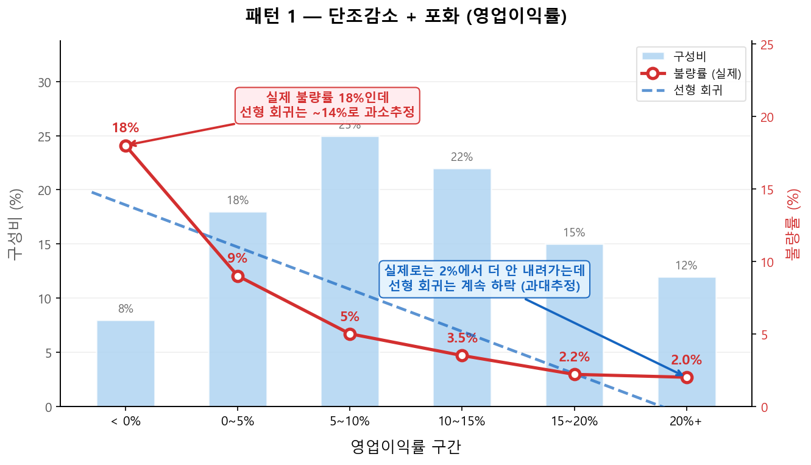
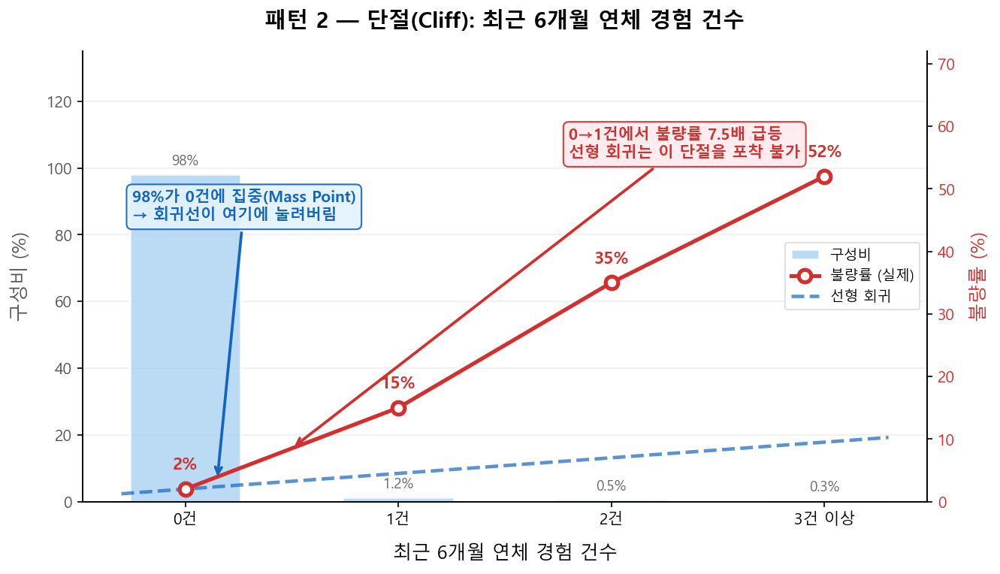
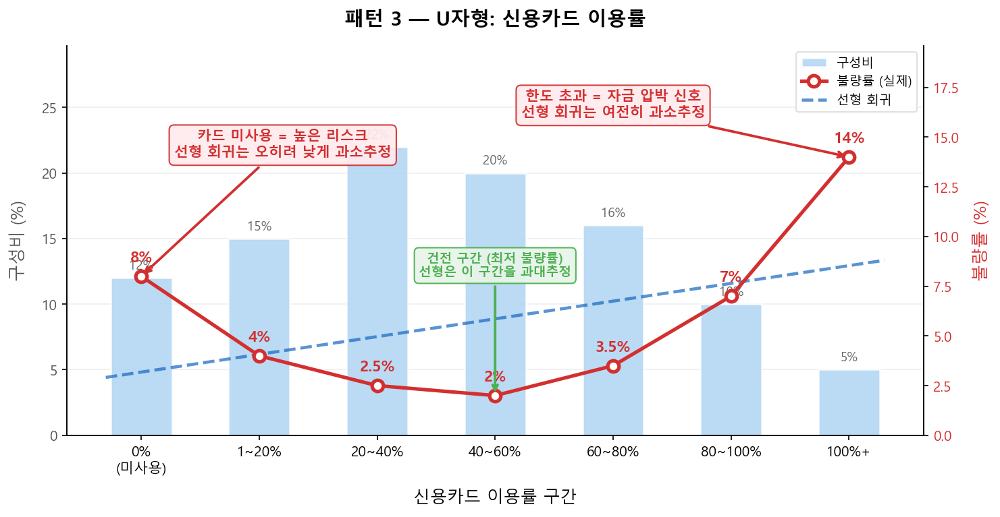

# 왜 Classing(구간화)인가

## 1.1 연속형 변수를 그대로 쓸 수 없는 이유

로지스틱 회귀는 \(\ln\!\left(\frac{p}{1-p}\right)\)와 \(x\) 사이의 **선형 관계**를 가정한다. 연속형 변수를 그대로 투입하면 이 선형 가정을 위반하게 되므로, Classing + WoE 변환은 로지스틱 회귀 기반 스코어카드에서 **필수적인 전처리**다.

그러나 Classing의 가치는 로지스틱 회귀에 국한되지 않는다. ML 모형(XGBoost, LightGBM 등)은 비선형을 자체적으로 포착하므로 Classing이 모형 적합의 필수 요건은 아니지만, 실무에서는 **변수 탐색·검증 도구**로서 모형 방법론과 무관하게 활용된다 — 구간별 구성비와 불량률 패턴 확인, 단변량 KS/AR/IV 산출, 시점별 PSI를 통한 안정성 검증이 그것이다.

신용 변수들은 불량률과의 관계가 단순 선형이 아닌 경우가 존재한다. 실무에서 자주 등장하는 비선형 패턴 세 가지를 살펴보자.

---

### 패턴 1 — 단조감소 + 포화 구간 (실무 최다 등장)

!!! tip "예시: 기업 영업이익률"

    - **영업이익률 < 0%** (적자): 불량률 매우 높음 (예: 18%)
    - **0% ~ 5%**: 불량률 급격히 감소 (예: 9%)
    - **5% ~ 15%**: 불량률 완만히 감소 (예: 4%)
    - **15% 이상**: 불량률 수렴·안정 (예: 2% 수준에서 plateau)

    **왜 Classing이 필요한가:** 연속형으로 쓰면 0%→5% 구간의 급격한 변화와 15% 이상의 포화(saturation) 구간을 선형 계수 하나로 표현할 수 없다. 구간화를 통해 각 구간에 독립적인 WoE가 부여되어 이 비선형 관계가 자연스럽게 흡수된다.

---

### 패턴 2 — 단절(Cliff): 임계값에서 불량률 급변

!!! tip "예시: 최근 6개월 연체 경험 건수"

    - **0건** (전체의 약 98%): 불량률 낮음 (예: 2%)
    - **1건** (약 1.2%): 불량률 급등 (예: 15%)
    - **2건 이상** (약 0.8%): 불량률 폭등 (예: 35%+)

    **왜 Classing이 필요한가:** 0건→1건 사이에서 불량률이 급등하는 단절은 선형 계수 하나로 표현할 수 없다. 또한 98%가 0건에 집중된 **Mass Point** 특성이 있어, 연속형 그대로 투입하면 소수의 연체 경험자 정보가 희석된다. 구간화를 통해 0건/1건/2건 이상을 분리하면 이 극단적 차이를 모형에 반영할 수 있다.

---

### 패턴 3 — U자형 (비단조, 양방향 위험)

!!! tip "예시: 신용카드 이용률 (한도 대비 사용 비율)"

    - **0%** (미사용): 신용 활동 없음 → 리스크 판단 어려움, 불량률 높음
    - **20~60%**: 건전한 신용 활동 → 불량률 가장 낮음
    - **90~100%+**: 자금 압박 징후 → 불량률 다시 상승

    연속형 \(x\)로는 이 U자형 패턴을 포착할 수 없다. Classing을 통해 구간별로 Bad Rate를 직접 측정해야 한다.

!!! warning "실무 주의"
    U자형 변수는 WoE 단조성 조건을 만족할 수 없어 추가 처리가 필요하다. 보통 0% 구간을 Mass Point Bin으로 분리한 후 나머지에 단조 binning을 적용한다. 모형 심의 시 추가 설명이 필요하므로, 패턴 1·2처럼 단조 처리 가능한 변수를 실무에서는 우선 활용하는 편이다.

---

## 1.2 Classing이 해결하는 4가지 문제

| 문제 | 연속형 X 직접 사용 | Classing + WoE 변환 |
|------|-------------------|---------------------|
| **비선형 관계** | 선형 가정 위반, 패턴 포착 불가 | 구간별 Bad Rate로 자연스럽게 흡수 |
| **이상치 (Outlier)** | 회귀계수 심각하게 왜곡 | 최상위·최하위 Bin으로 자동 캡핑 |
| **단위 이질성** | 변수 간 스케일 혼재 | WoE로 모두 log-odds 단위 통일 |
| **결측값** | 별도 imputation 필요 | Missing 전용 Bin으로 자연스럽게 처리 |

!!! example "CB사 실무: NICE 기업신용평가 — 재무비율 구간화"
    NICE평가정보의 기업신용등급 모형은 재무 평가 요소(안정성·수익성·활동성·성장성·규모·현금흐름)에 대해 구간화 변환하여 사용한다. 특히 영업이익률, 부채비율 등은 위 패턴 1(단조감소 + 포화)과 패턴 2(Cliff)가 전형적으로 나타나는 변수로, Classing 없이는 모형 적합이 어렵다.

    

    출처: <a href="https://www.niceinfo.co.kr/creditrating/bi_score_1_4.nice" target="_blank">NICE평가정보 · 기업신용등급 평가요소</a>
    

