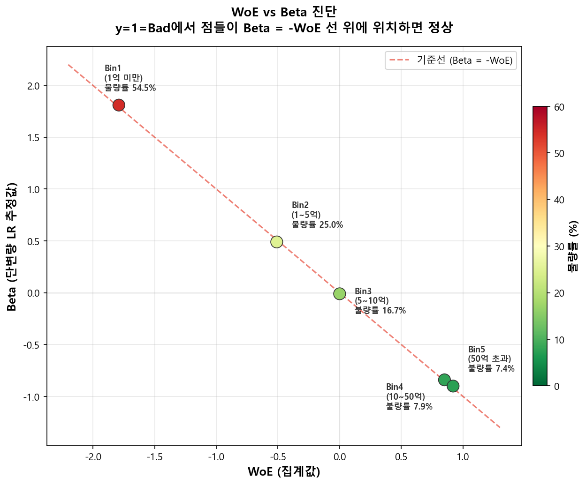

# β ≈ −WoE: 수학적 증명

## 3.1 증명

!!! note "No Intercept 로지스틱 회귀에서 \(\hat{\beta}_i \approx -\text{WoE}_i\)가 되는 이유"

    현재 Part 1~4에서는 **y = 1 = Bad(불량)**으로 정의하고 있으므로, 로지스틱 회귀의 log-odds는 Bad Odds \(\ln(P_B/P_G)\)이다. 반면 WoE는 업계 표준에 따라 \(\ln(\%\text{Good}/\%\text{Bad})\)로 정의한다. **두 지표의 방향이 반대**이므로 부호가 뒤집히는 것은 오류가 아니라 정의의 차이다.

> 식 (1)은 [WoE 정의](../woe_iv/woe.md)를 참조한다.

**Step 1 — 구간 \(i\)의 실제 Log-Odds (Bad Odds)**

$$
\text{(실제 log-odds)}_i = \ln\!\left(\frac{n_{B,i}/n_i}{n_{G,i}/n_i}\right) = \ln\!\left(\frac{n_{B,i}}{n_{G,i}}\right) \tag{2}
$$

**Step 2 — WoE 정의 전개**

$$
\text{WoE}_i = \ln\!\left(\frac{n_{G,i}/N_G}{n_{B,i}/N_B}\right) = \ln\!\left(\frac{n_{G,i}}{n_{B,i}}\right) + \ln\!\left(\frac{N_B}{N_G}\right) \tag{3}
$$

WoE의 핵심 항인 \(\ln(n_{G,i}/n_{B,i})\)는 Step 1의 log-odds \(\ln(n_{B,i}/n_{G,i})\)와 **부호가 반대**임에 주목하자:

$$
\ln\!\left(\frac{n_{G,i}}{n_{B,i}}\right) = -\ln\!\left(\frac{n_{B,i}}{n_{G,i}}\right)
$$

**Step 3 — \(\hat{\beta}_i\)에 대해 정리**

Step 2를 log-odds 기준으로 재배열하면:

$$
\ln\!\left(\frac{n_{B,i}}{n_{G,i}}\right) = -\text{WoE}_i + \ln\!\left(\frac{N_B}{N_G}\right)
$$

따라서:

$$
\hat{\beta}_i = \text{(실제 log-odds)}_i = -\text{WoE}_i + \ln\!\left(\frac{N_B}{N_G}\right) \tag{4}
$$

!!! success "결론"
    No Intercept 모형(y=1=Bad)에서 각 Bin의 회귀계수는 \(\hat{\beta}_i = -\text{WoE}_i + \ln(N_B/N_G)\)이다. 전체 모집단 log-odds \(\ln(N_B/N_G)\)는 상수이므로, **\(\hat{\beta}_i\)와 \(\text{WoE}_i\)는 부호가 반대이고 상수 차이만큼 평행 이동한 관계**다. 구간 간 상대적 크기와 순서(단조성)는 완전히 보존된다.

---

### 왜 β와 WoE의 실제 수치가 다른가?

!!! tip "부호 반전 + 상수항(모집단 로그 오즈) 때문"
    위 Step 3의 결론을 다시 보면:

    $$\hat{\beta}_i = -\text{WoE}_i + \underbrace{\ln\!\left(\frac{N_B}{N_G}\right)}_{\text{전체 모집단 Bad 로그 오즈 (상수)}}$$

    이 식은 두 가지를 보여준다:

    1. **부호가 반대다** — WoE는 Good 집중도(\(\ln(\%G/\%B)\)), β는 Bad log-odds(\(\ln(P_B/P_G)\))를 측정하므로 방향이 반대다.
    2. **상수 차이가 있다** — 데이터 전체의 Bad/Good 비율인 \(\ln(N_B/N_G)\)만큼 평행 이동한다.

    두 지표의 **기준점(Reference Point)**이 다르기 때문이다:

    - **\(\hat{\beta}_i\)의 기준점:** "불량과 우량이 1:1로 같은 상태 (로그 오즈 = 0)"
    - **WoE의 기준점:** "이 구간의 Good/Bad 비율이 전체 모집단 평균과 같은 상태 (WoE = 0)"

### 수치 예시로 확인

전체 모집단에서 \(N_B = 500\)건, \(N_G = 4500\)건이라 하면:

$$\ln\!\left(\frac{N_B}{N_G}\right) = \ln\!\left(\frac{500}{4500}\right) = \ln(0.111) \approx -2.20$$

그러면 \(\hat{\beta}_i = -\text{WoE}_i + (-2.20)\)이므로:

| Bin | \(\text{WoE}_i\) (집계값) | \(-\text{WoE}_i\) | 상수 \(\ln(N_B/N_G)\) | \(\hat{\beta}_i = -\text{WoE}_i + (-2.20)\) |
|-----|------|------|------|------|
| Bin 1 (고위험) | −1.80 | +1.80 | −2.20 | **−0.40** |
| Bin 3 (중간) | 0.00 | 0.00 | −2.20 | **−2.20** |
| Bin 5 (저위험) | +0.92 | −0.92 | −2.20 | **−3.12** |

- WoE가 **음수**(Bad 집중)인 Bin 1에서 β는 **0에 가장 가까운** 값(−0.40) → Bad odds가 가장 높음 ✓
- WoE가 **양수**(Good 집중)인 Bin 5에서 β는 **가장 큰 음수**(−3.12) → Bad odds가 가장 낮음 ✓
- 모든 구간에서 β와 WoE의 **순서(단조성)가 정확히 반대로 보존**됨을 확인할 수 있다.

!!! note "실무적 시사점"
    y=1=Bad 모형에서 \(\hat{\beta}\)와 WoE는 **부호가 반대**이고, 구간 간 **상대적 크기 차이의 절댓값이 동일**하다. 검증 시 확인할 점은: (1) β와 WoE의 부호가 반대인가, (2) 구간 간 β 차이가 WoE 차이와 비례하는가이다. 모형 피팅 후 두 값을 비교하여 Classing의 통계적 타당성을 검증하는 것이 단변량 로지스틱 회귀의 핵심 목적이다.

---

## 3.2 β̂ 와 WoE 비교 — 실제 산출 예시

!!! info "Balanced Sample에서의 비교 (y=1=Bad)"
    아래 예시는 **개발 샘플이 Bad/Good 1:1로 균형 조정(Balanced Sampling)된 경우**의 결과다. 균형 샘플에서는 \(\ln(N_B/N_G) \approx 0\)이므로 3.1절의 상수 이동량이 사실상 소멸하여 \(\hat{\beta}_i \approx -\text{WoE}_i\)가 성립한다. 실무에서는 Bad 비율이 낮은 원본 데이터(Unbalanced)를 사용할 경우 3.1절처럼 상수만큼 추가 차이가 발생하지만, 구간 간 **상대적 크기와 순서는 동일**하게 보존된다.

| Bin | 구간 | 불량률 | WoE (집계값) | \(\hat{\beta}\) (회귀 추정) | \(\hat{\beta} + \text{WoE}\) | 해석 |
|-----|------|--------|-----------|---------|------|------|
| 1 | 1억 미만 | 54.5% | −1.79 | +1.81 | +0.02 | 불량률 최고 → WoE 최저, β 최고 |
| 2 | 1억~5억 | 25.0% | −0.51 | +0.49 | −0.02 | 부호 반대, 크기 일치 |
| 3 | 5억~10억 | 16.7% | 0.00 | −0.01 | −0.01 | 불량률 ≈ 전체 평균 → WoE ≈ 0 |
| 4 | 10억~50억 | 7.9% | +0.85 | −0.84 | +0.01 | 부호 반대, 크기 일치 |
| 5 | 50억 초과 | 7.4% | +0.92 | −0.90 | +0.02 | 불량률 최저 → WoE 최고, β 최저 |

미세한 차이는 MLE 최적화 수렴 과정에서 발생하는 수치적 오차다. \(\hat{\beta}_i + \text{WoE}_i \approx 0\)이므로, 실질적으로 \(\hat{\beta}_i \approx -\text{WoE}_i\)가 성립함을 확인할 수 있다.

---

### WoE 치환 방식과의 관계

!!! tip "연속형 변수 X를 WoE로 치환하면 β → −1로 수렴하는 이유 (y=1=Bad)"
    연속형 변수 \(X\)를 각 구간의 WoE 값으로 치환한 새로운 변수 \(X_{\text{WoE}}\)를 만들어 **절편 포함(No Intercept 아님)** 로지스틱 회귀를 수행하면:

    $$\ln\!\left(\frac{P(\text{Bad})}{P(\text{Good})}\right) = \alpha + \beta \cdot X_{\text{WoE},i}$$

    이때 이론적으로 \(\hat{\beta} \to -1\)에 수렴하고, \(\hat{\alpha} \to \ln(N_B/N_G)\)가 된다.

    **이유:** WoE가 양수인 구간(Good 집중)에서는 Bad 확률이 낮아야 하므로 Bad log-odds가 감소해야 한다. 즉 WoE가 1 단위 증가하면 Bad log-odds는 1만큼 **감소**한다 → 기울기 \(\beta = -1\).

!!! info "Part 5 예고 — y=1=Good 전환 시 β → +1"
    [Part 5(스코어카드)](../../part5_scorecard/scorecard-and-rating.md)에서 y = 1 = Good으로 전환하면, log-odds가 \(\ln(P_G/P_B)\)로 바뀐다. 이때 WoE와 log-odds의 방향이 일치하므로 \(\hat{\beta} \to +1\)이 된다. 이것이 교과서에서 흔히 "WoE 치환 시 β → 1"이라고 설명하는 결과다.

!!! note "Two Approaches: 사실상 같은 말"
    아래 두 방법은 서로 다른 방식으로 수행되지만, WoE가 모형 내에서 어떻게 작동하는지를 검증한다는 동일한 본질을 갖는다.

    | 방법 | 설계 | 결과 (y=1=Bad) | 의미 |
    |------|------|------|------|
    | **1. One-Hot + No Intercept** | \(k\)개 더미, 절편 제거 | \(\hat{\beta}_j \approx -\text{WoE}_j\) (각 구간별) | 모형이 스스로 각 구간의 리스크를 탐색하여 WoE와 크기가 같고 부호가 반대인 값을 도출함을 확인 |
    | **2. WoE 치환 + Intercept 포함** | \(X_{\text{WoE}}\) 단일 변수, 절편 포함 | \(\hat{\beta} \to -1\) (전체 변수에 대해) | WoE로 집계된 구간별 리스크가 로지스틱 모형의 선형 가정과 정확히 일치함을 확인 |

    (1)은 "구간별 WoE가 통계적으로 유의한가"를 검증하고, (2)는 "WoE 구조 전체가 모형에서 비례적으로 작동하는가"를 검증한다. 둘 다 WoE의 타당성을 확인하는 작업이며, 두 결과가 모두 성립할 때 Classing이 통계적으로 건전하다고 판단할 수 있다.
