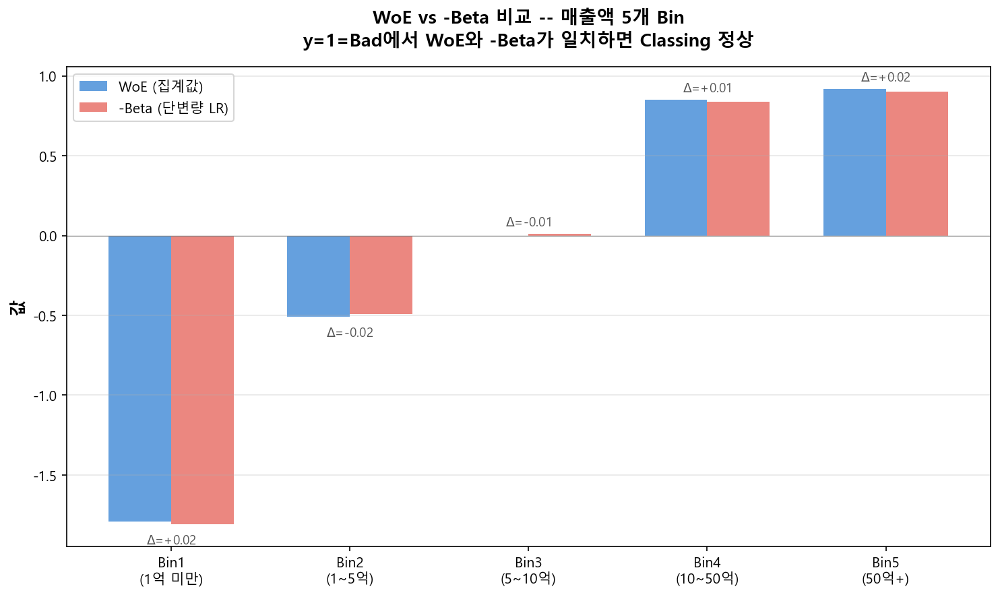

# Classing 피드백 루프

## 5.1 Bin 합병 의사결정 규칙

단변량 로지스틱 회귀 결과 비유의한 Bin이 발견되면, 아래 규칙에 따라 합병 여부를 결정한다.

  1
  Bad Rate가 더 비슷한 인접 Bin과 합병

비유의 Bin의 Bad Rate와 더 가까운 방향으로 합병. 합병 후 단조성 유지 여부 확인.

  2
  샘플 수가 더 적은 방향으로 합병

양쪽 Bad Rate가 비슷하다면, 더 작은 Bin과 합병하여 최소 샘플 기준 충족.

  3
  업무 논리 우선

통계적으로 양쪽이 동등하다면 업무적으로 의미 있는 경계를 유지하는 방향으로 합병.

!!! warning "단조성을 깨는 방향으로 합병 금지"
    합병 후 반드시 WoE 단조성을 재확인. 단조성이 깨지면 다른 방향으로 재시도.

---

## 5.2 최종 Classing 확정 의사결정 순서

| 순서 | 체크 항목 | Pass 기준 | Fail 시 조치 |
|------|----------|----------|-------------|
| 1 | Bin별 최소 샘플 | 전체 5% 이상, Bad 10건 이상 | 인접 Bin 합병 → 처음부터 재검토 |
| 2 | WoE 단조성 | 단조증가 또는 단조감소 | 위반 Bin 합병 → 1부터 재확인 |
| 3 | Bin별 Wald p-value | 모든 Bin p < 0.05 | 비유의 Bin 합병 → 1부터 재확인 |
| 4 | 변수 전체 LRT | p < 0.05 | 변수 제거 검토 또는 Classing 재설계 |
| 5 | IV 수준 | IV > 0.10 | Classing 재검토 또는 변수 제거 |
| 6 | 업무 논리 정합성 | 감독 기준·여신 정책 위반 없음 | 수동 조정 후 1부터 재확인 |
| 7 | \(\hat{\beta}\) vs WoE 확인 | 부호 반대, 크기 대응 (\(\hat{\beta} \approx -\text{WoE}\)) | 부호 방향 불일치 시 전면 재검토 |

!!! success "모든 기준 통과 시"
    해당 Coarse Classing 안으로 확정. 동일 과정을 모든 후보 변수에 적용 후 [정보영역별 변수 선정](../domain_selection/index.md) 단계로 이동한다. 단변량 LR에서 확정된 변수 목록이 정보영역별 Partial LR의 입력이 된다.
