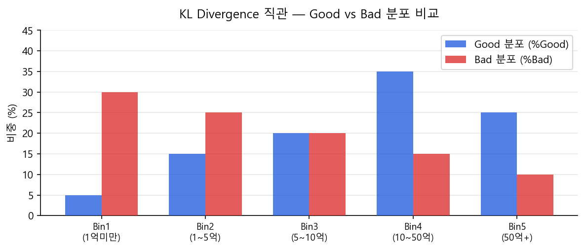
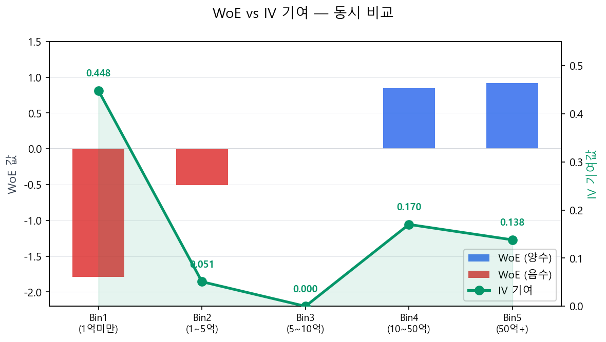

# IV: 정의·산출·변수 선택

## 3.1 IV의 본질

!!! tip "IV의 본질 — Good 분포와 Bad 분포 사이의 거리"
    WoE가 "구간 하나의 변별력"이라면, IV는 **"변수 전체의 변별력 총합"**이다. 수학적으로 Good→Bad 방향과 Bad→Good 방향의 KL Divergence를 합산한 형태와 동일하다. 두 분포가 완전히 같으면 \(\text{IV} = 0\), 차이가 클수록 \(\text{IV}\)가 커진다.

### 3.1-보충: KL Divergence란 무엇인가

!!! tip "비유: 두 도시의 인구 분포 차이"
    Good 고객 1,000명과 Bad 고객 200명이 5개 Bin에 각자의 비율로 흩어져 있다고 하자. **KL Divergence**는 "두 분포가 얼마나 다른가"를 측정하는 수치다. 분포가 똑같으면 0, 다를수록 커진다.

KL Divergence의 일반 정의:

$$
D_{\text{KL}}(P \| Q) = \sum_{i} P_i \ln\!\left(\frac{P_i}{Q_i}\right) \tag{2}
$$

신용평가 문맥에서 IV는 두 방향의 KL을 합친 **대칭 KL Divergence**다:

$$
\text{IV} = D_{\text{KL}}(\text{Good} \| \text{Bad}) + D_{\text{KL}}(\text{Bad} \| \text{Good})
$$

$$
= \sum_i \%\text{Good}_i \cdot \ln\!\frac{\%\text{Good}_i}{\%\text{Bad}_i} + \sum_i \%\text{Bad}_i \cdot \ln\!\frac{\%\text{Bad}_i}{\%\text{Good}_i}
$$

$$
= \sum_i (\%\text{Good}_i - \%\text{Bad}_i) \times \text{WoE}_i \tag{3}
$$

### KL Divergence 해석 카드

| 두 분포가 같을 때 | Good이 많이 몰릴 때 | Bad이 많이 몰릴 때 |
|:---:|:---:|:---:|
| %Good = %Bad | %Good > %Bad | %Bad > %Good |
| WoE = 0, KL = 0 | WoE > 0 (우량 구간) | WoE < 0 (불량 구간) |
| **IV 기여 = 0** | **IV 기여 증가** | **IV 기여 증가** |

!!! note "요약"
    KL Divergence는 "두 확률 분포 사이의 정보 거리"다. IV는 Good 분포와 Bad 분포가 Bin들에 얼마나 다르게 흩어져 있는지를 모든 Bin에 걸쳐 합산한 값이다. 두 분포가 구분되지 않으면(변별력 없으면) IV → 0이 되고, 선명하게 갈라질수록 IV가 커진다.

## 3.2 산출식

$$
\text{IV} = \sum_{i=1}^{k} (\%\text{Good}_i - \%\text{Bad}_i) \times \text{WoE}_i \tag{4}
$$

$$
= \sum_{i=1}^{k} \left(\frac{n_{G,i}}{N_G} - \frac{n_{B,i}}{N_B}\right) \times \ln\!\left(\frac{n_{G,i}/N_G}{n_{B,i}/N_B}\right)
$$

두 값(\(\%\text{Good}_i - \%\text{Bad}_i\)와 \(\text{WoE}_i\))의 부호는 항상 같으므로 각 항의 기여분은 항상 0 이상이다. 따라서 **IV는 항상 양수**다.

## 3.3 예시: 매출액 변수 IV 계산

| Bin | %Good | %Bad | 차이 | WoE | IV 기여 |
|-----|-------|------|------|-----|---------|
| 1 | 5.0% | 30.0% | −25.0% | −1.79 | \((-0.250) \times (-1.79) = 0.448\) |
| 2 | 15.0% | 25.0% | −10.0% | −0.51 | \((-0.100) \times (-0.51) = 0.051\) |
| 3 | 20.0% | 20.0% | 0.0% | 0.00 | \(0.000\) |
| 4 | 35.0% | 15.0% | +20.0% | +0.85 | \((+0.200) \times (+0.85) = 0.170\) |
| 5 | 25.0% | 10.0% | +15.0% | +0.92 | \((+0.150) \times (+0.92) = 0.138\) |
| | | | | **합계** | **IV = 0.807** |

!!! note "WoE와 IV 기여의 관계"
    Bin1은 WoE가 −1.79로 가장 낮은 우량도를 나타내지만, *그 낙폭이 크기 때문에* IV 기여(0.448)도 가장 크다. Bin3은 WoE = 0으로 Good/Bad 구분이 없어 IV 기여가 0이다. **WoE는 방향, IV 기여는 그 방향의 강도**라고 이해하면 된다.

## 3.4 IV 기준의 변수 선택

| IV 값 | 변별력 판단 | 실무 처리 |
|--------|------------|-----------|
| < 0.02 | 변별력 없음 (Useless) | 변수 제거 |
| 0.02 ~ 0.10 | 약한 변별력 (Weak) | 단독 투입 비권장. 다른 변수와 조합 시 고려 |
| 0.10 ~ 0.30 | 보통 변별력 (Medium) | 투입 검토. 단변량 LR 유의성 확인 필수 |
| 0.30 ~ 0.50 | 강한 변별력 (Strong) | 투입 권장 |
| > 0.50 | 매우 강함 (Very Strong) | 과적합·Data Leakage 반드시 확인 |

### IV 기준값은 절대적인가?

위 기준표(< 0.02, 0.02~0.10, …)는 Siddiqi(2006)가 제시한 이후 업계 표준처럼 쓰이고 있지만, **특정 Event Rate 범위에서 경험적으로 도출된 벤치마크**라는 점을 유의해야 한다. Event Rate가 달라지면 IV 값의 분포 자체가 달라지기 때문이다.

**Event Rate가 IV에 영향을 미치는 메커니즘:**

IV는 Good 분포와 Bad 분포의 차이를 합산한 값이다. Event Rate가 극단적이면 두 가지 문제가 발생한다.

- **Event Rate가 매우 낮을 때**(예: 기업 대출, 사기탐지) — Bad 건수 자체가 적으므로 각 구간의 Bad 비율 추정이 불안정해진다. 표본이 작은 구간에서 WoE가 극단적으로 산출되어 IV가 과대 또는 과소 추정될 수 있다. 같은 IV 값이라도 신뢰구간이 넓어 변별력 판단의 근거가 약해진다.

- **Event Rate가 매우 높을 때**(예: 마케팅 반응 모형) — Good과 Bad의 비율 차이가 줄어들면서 WoE 절댓값이 전반적으로 작아지고, 결과적으로 IV도 낮게 산출되는 경향이 있다. 이 경우 표준 기준표를 그대로 적용하면 대부분의 변수가 "변별력 없음"으로 분류될 수 있다.

따라서 표준 기준표는 **출발점**으로 활용하되, 자신의 데이터에서 IV 분포를 먼저 확인하고 기준을 조정해야 한다. Event Rate가 극단적인 도메인(사기탐지, 희귀 질환 예측 등)에서는 IV 단독으로 변수를 선별하기보다 Precision@k, AUROC 등 다른 지표를 병행하는 것이 바람직하다.

### 다변수 IV 우선순위 결정

IV가 비슷한 변수가 여러 개일 때 하나만 선택해야 하는 상황에서의 판단 기준:

| 판단 기준 | 설명 |
|-----------|------|
| **상관관계** | IV가 유사한 변수 A, B의 상관이 높으면(r > 0.7) 하나만 선택. 다변량 회귀에서 다중공선성 유발 |
| **안정성(PSI)** | IV가 같다면 PSI가 더 낮은(시간적으로 안정적인) 변수를 우선 |
| **비즈니스 해석력** | "신용조회 건수"와 "최근 3개월 대출 신청 건수"의 IV가 같다면, 심사역이 더 직관적으로 해석 가능한 변수를 우선 |
| **데이터 가용성** | 변수 수집 난이도, 결측률, 향후 운영 시 지속 수집 가능 여부 |

!!! tip "IV는 높지만 비즈니스 가치가 낮은 변수"
    예를 들어 "고객 등록 시각(새벽 vs 주간)"이 IV = 0.25로 보통 수준의 변별력을 보이더라도, 심사역에게 "새벽에 가입한 고객이 더 위험하다"는 논리를 설명하기 어렵다면 모형 수용성이 떨어진다. 이런 변수는 **전략 모형에서는 활용하되, 규제 모형에서는 제외**하는 것이 실무 관행이다.

!!! warning "IV 맹신 금지 — 업무 논리 동반 필수"
    - **① Data Leakage:** 성과 기간 이후 정보가 관찰 시점 변수에 유입된 경우. 날짜 기준을 엄격히 확인해야 한다.
    - **② Overfitting:** Coarse Classing 없이 Fine Classing 그대로 IV를 산출하면 실제보다 과대 측정된다.

    IV는 **변수 선택의 1차 필터**일 뿐이다. 항상 업무 논리와 단변량 로지스틱 회귀 결과를 함께 검토해야 한다.

!!! example "CB사 실무 — IV 기반 변수 선택 기준"
    국내 CB사(NICE, KCB)에서도 IV는 변수 선별의 핵심 지표로 활용된다. KCB 공시 자료에 따르면 개인신용평점 모형의 주요 평가부문(거래형태 38%, 부채수준 24%, 상환이력 21% 등)은 높은 IV를 가진 변수군으로 구성되어 있으며, 최종 모형의 K-S 통계량 ≥ 50, GINI ≥ 0.6 수준을 달성한다.

    
출처: KCB 올크레딧 — <a href="https://www.allcredit.co.kr/screen/sc1205209681">성능지표 공시</a>, <a href="https://www.allcredit.co.kr/screen/sc0682112929">주요평가부문</a>

