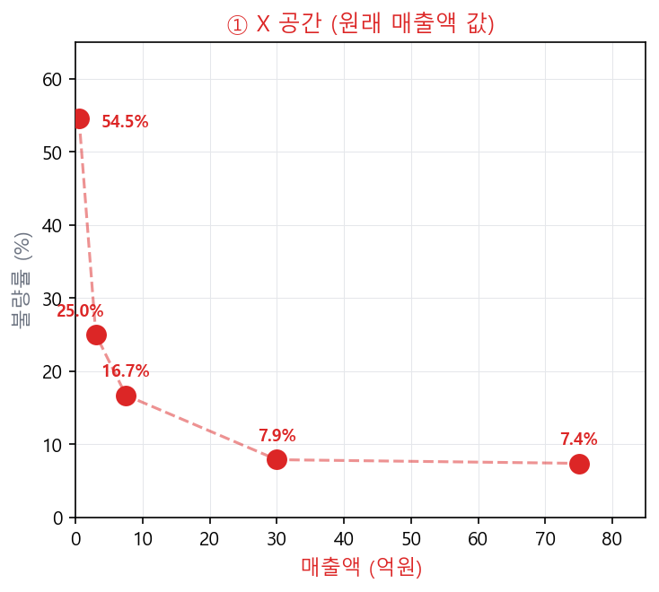
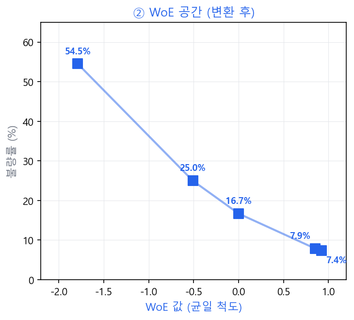

# X → WoE 공간 변환

## 2.1 두 공간의 차이

연속형 \(x\)(매출액, 억원)는 불균일하게 분포된 원래 공간에 있다. WoE 변환은 이 공간을 **log-odds 단위의 균일한 변별력 공간**으로 재배열한다.

> **X 공간: 불균일 간격** ⟶ **WoE 공간: 균일 변별력 간격**

!!! note "핵심 직관"
    X 공간에서 1억과 5억은 4억 차이지만 WoE 변화는 크고, 10억과 50억은 40억 차이지만 WoE 변화는 작다. WoE는 "실제 불량률 변화에 비례한 거리"로 공간을 재구성한다.

## 2.2 고객 네 명 추적: X → Bin → WoE → 회귀 투입

| 고객 | 매출액 | Bin | WoE | 리스크 수준 |
|------|--------|-----|-----|-----------|
| **고객 K** | 23억원 | Bin 4 (10~50억) | **+0.85** | 우량 |
| **고객 L** | 37억원 | Bin 4 (10~50억) | **+0.85** | 우량 (K와 동일 Bin → 동일 WoE) |
| **고객 M** | 7억원 | Bin 3 (5~10억) | **0.00** | 중간 (모집단 평균과 동일) |
| **고객 N** | 0.5억원 | Bin 1 (1억 미만) | **−1.79** | 최고위험 |

!!! note "정보 압축 효과"
    고객 K(23억)와 L(37억)은 원래 매출액이 다르지만 동일한 Bin 4에 속한다. WoE 변환은 Bin 내 개별 차이를 무시하고 **구간의 리스크 수준(+0.85)**으로 압축한다. 이것이 WoE 변환의 핵심 — "세부 수치보다 리스크 등급이 중요하다"는 신용평가의 철학을 반영한다.

### Dummy vs WoE 비교

| 비교 항목 | Dummy(One-Hot) 방식 | WoE 변환 방식 |
|-----------|---------------------|---------------|
| **고객 K (23억)** | `[0, 0, 0, 1, 0]` (Bin4만 1) | **+0.85** |
| **고객 L (37억)** | `[0, 0, 0, 1, 0]` (Bin4만 1) | **+0.85** |
| **고객 M (7억)** | `[0, 0, 1, 0, 0]` (Bin3만 1) | **0.00** |
| **고객 N (0.5억)** | `[1, 0, 0, 0, 0]` (Bin1만 1) | **−1.79** |
| **모형 입력 차원** | 5개 변수 (Bin 수만큼 증가) | 1개 변수 (단일 연속형) |
| **변수 간 순서 정보** | 없음 (Bin 간 관계 모름) | 있음 (WoE가 크면 더 우량) |
| **로지스틱 회귀 해석** | 각 Bin별 계수 5개 필요 | 계수 1개로 해석 가능 |

이 차원 차이는 다변수로 확장하면 더욱 극대화된다.

| 조건 | Dummy 인코딩 | WoE 변환 |
|------|-------------|---------|
| 변수 1개 × 5 Bin | 5차원 | 1차원 |
| 변수 10개 × 5 Bin 평균 | **50차원** | **10차원** |
| 변수 20개 × 5 Bin 평균 | **100차원** | **20차원** |

변수 수가 늘어날수록 Dummy 방식의 차원 폭발이 심화된다. 차원이 높으면 다중공선성 문제가 악화되고, 계수 추정이 불안정해진다.

!!! abstract "변환 과정 (4단계)"

    **1. X 값 확인**

    고객 K: 매출액 \(x = 23\)억원 | 고객 L: 매출액 \(x = 37\)억원

    ---

    **2. Bin 매핑**

    23억, 37억 모두 \([10\text{억}, 50\text{억})\) → **Bin 4**

    ---

    **3. WoE 조회 (Dummy와 비교)**

    - **Dummy:** Bin4=1, 나머지=0 → `[0, 0, 0, 1, 0]` (5차원 벡터)
    - **WoE:** Bin4의 WoE = \(+0.85\) → 단일 숫자 **0.85**

    ---

    **4. 로지스틱 회귀 투입**

    $$
    \ln\!\left(\frac{p}{1-p}\right) = \beta_0 + \underbrace{\beta_{\text{매출액}} \times \mathbf{0.85}}_{\text{WoE 단일 계수}} + \cdots
    $$

!!! success "결론"
    X → WoE 변환은 연속형 변수를 **"Bin의 변별력 크기"라는 하나의 숫자**로 표현한다. Dummy처럼 여러 열로 분해하지 않으며, Bin 간의 서열(위험도 순서)이 WoE 값의 크고 작음으로 자동 반영된다.

---

## 2.3 WoE 변환이 선형성 가정을 자동으로 충족시키는 이유

로지스틱 회귀는 **logit(p)과 독립변수 X 사이의 선형 관계**를 가정한다. 원래 매출액 같은 연속형 변수는 logit과의 관계가 비선형일 수 있어, 이 가정이 위반될 위험이 있다.

WoE 변환은 이 문제를 구조적으로 해결한다:

1. WoE 자체가 **log-odds 단위**(= logit과 동일한 스케일)로 정의되어 있다
2. WoE를 독립변수로 투입하면, logit과 독립변수가 **같은 척도**에 있으므로 선형 관계가 자동으로 성립
3. [β ≈ −WoE 증명](../univariate_lr/beta-woe-proof.md)에서 보듯이, y=1=Bad에서 WoE 치환 후 단일 변수 회귀를 수행하면 \(\hat{\beta} \to -1\)로 수렴 — WoE가 증가하면 Bad log-odds가 감소하는 1:1 역비례 관계임을 의미

!!! note "원래 X를 직접 투입하면?"
    매출액(원래 값)을 WoE 변환 없이 직접 로지스틱 회귀에 투입하면, 매출액 1억 → 2억의 logit 변화와 10억 → 20억의 logit 변화가 동일하다고 가정하게 된다. 이는 비현실적이다. WoE 변환은 이러한 **비선형적 리스크 구조를 선형 공간으로 재매핑**하는 역할을 한다.
