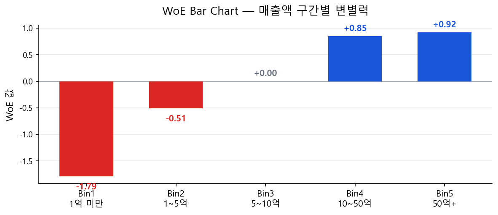

# WoE: 정의·산출·해석

## 1.1 WoE란 무엇인가

!!! tip "직관적 이해"
    WoE는 **"이 구간에 Good 고객이 얼마나 집중되어 있는가"**를 log-odds 단위로 표현한 밀집도 지수다.

    - **WoE 양수(+)** → Good 고객 집중 → 우량 구간 (신용 우수)
    - **WoE ≈ 0** → Good/Bad 분포 차이 없음 → 변별력 없음
    - **WoE 음수(−)** → Bad 고객 집중 → 불량 구간 (신용 위험)

## 1.2 산출식

$$
\text{WoE}_i = \ln\!\left(\frac{\%\text{Good}_i}{\%\text{Bad}_i}\right) = \ln\!\left(\frac{n_{G,i} / N_G}{n_{B,i} / N_B}\right) \tag{1}
$$

| 기호 | 정의 |
|------|------|
| \(n_{G,i}\) | Bin \(i\)에 속한 Good(정상) 건수 |
| \(n_{B,i}\) | Bin \(i\)에 속한 Bad(불량) 건수 |
| \(\%\text{Good}_i\) | \(n_{G,i}/N_G\) — 전체 Good 중 Bin \(i\) 비중 |
| \(\%\text{Bad}_i\) | \(n_{B,i}/N_B\) — 전체 Bad 중 Bin \(i\) 비중 |

!!! warning "WoE ≠ Bin 내 불량률"
    WoE는 Bin 내 불량률(\(n_{B,i}/n_i\))이 아니다. Bin 내 불량률은 해당 Bin의 표본 크기에 크게 영향을 받아 불안정하다. WoE는 "전체 Bad 집단 중 이 Bin의 비중 vs 전체 Good 집단 중 이 Bin의 비중"의 **상대적 분포 차이**를 비교함으로써 표본 크기 영향을 통제한다.

!!! warning "Divide by Zero 처리"
    특정 Bin에 Bad 또는 Good이 0건이면 WoE 산출 불가(\(\ln(0) = -\infty\)). Coarse Classing 시 각 Bin에 **Bad 최소 10건 이상**을 반드시 확보해야 한다. 불가피한 경우 0.5 보정(Smoothing)을 적용한다.

    $$
    \text{WoE}_i = \ln\!\left(\frac{(n_{G,i} + 0.5)/N_G}{(n_{B,i} + 0.5)/N_B}\right)
    $$

## 1.3 예시 계산 — 매출액 변수

전체 1,200건: Good 1,000건, Bad 200건 · 전체 불량률 = 200 / 1,200 = 16.7%

| Bin | 구간 | Good | Bad | 전체 | 구성비 | Bin 불량률 | %Good | %Bad | WoE |
|-----|------|------|-----|------|--------|-----------|-------|------|-----|
| 1 | 1억 미만 | 50 | 60 | 110 | 9.2% | 54.5% | 5.0% | 30.0% | **−1.79** |
| 2 | 1억~5억 | 150 | 50 | 200 | 16.7% | 25.0% | 15.0% | 25.0% | **−0.51** |
| 3 | 5억~10억 | 200 | 40 | 240 | 20.0% | 16.7% | 20.0% | 20.0% | 0.00 |
| 4 | 10억~50억 | 350 | 30 | 380 | 31.7% | 7.9% | 35.0% | 15.0% | **+0.85** |
| 5 | 50억 초과 | 250 | 20 | 270 | 22.5% | 7.4% | 25.0% | 10.0% | **+0.92** |
| | **합계** | **1,000** | **200** | **1,200** | 100% | 16.7% | 100% | 100% | — |

- **구성비**: 전체 샘플 중 해당 Bin 비중. 각 Bin의 통계적 안정성 판단에 사용.
- **Bin 불량률**: 해당 Bin 내 Bad 비율. 전체 불량률(16.7%) 대비 위험도 판단.
- **%Good / %Bad**: WoE 산출에 실제로 사용되는 값. Bin 내 비율이 아님에 주의.
- **WoE**: \(\ln(\%\text{Good}/\%\text{Bad})\). 이 값이 로지스틱 회귀의 독립변수로 투입됨.

## 1.4 WoE 크기 해석 가이드

WoE의 절대값이 클수록 해당 Bin의 Good/Bad 분리가 강하다.

| \(\lvert\text{WoE}\rvert\) 범위 | 분리 강도 | 실무 해석 |
|--------------------------------|----------|----------|
| < 0.10 | 매우 약함 | Good/Bad 분포 거의 동일. 이 Bin은 변별력이 없으며, 인접 Bin과의 합병(Delta WoE < 0.05)을 검토 |
| 0.10 ~ 0.50 | 보통 | 실무적으로 유의미한 분리. 대부분의 Bin이 이 범위에 분포 |
| 0.50 ~ 1.00 | 강함 | Good/Bad가 뚜렷하게 갈림. 해당 변수가 모형에 상당한 기여를 할 가능성 높음 |
| > 1.00 | 매우 강함 | 극단적 분리. **Tautology(동어반복)·Data Leakage 여부를 반드시 확인**. 정상적인 Bin에서 이 수준이면 우수한 변수 |

!!! tip "비즈니스 담당자에게 WoE 설명하기"
    "WoE가 +0.85인 구간은, 전체 Good 고객 중 이 구간에 속하는 비율이 전체 Bad 고객 중 이 구간에 속하는 비율보다 **약 2.3배(\(e^{0.85} \approx 2.34\))** 높다는 뜻입니다. 즉 이 구간에 속하면 우량 고객일 가능성이 높습니다."

    일반적으로 \(e^{\text{WoE}}\)를 계산하여 "Good이 Bad 대비 몇 배 집중되어 있는가"로 설명하면 비전문가도 이해하기 쉽다.

## 1.5 0.5 스무딩(Smoothing) 수치 예시

Bad = 0인 Bin이 발생한 경우의 처리 과정을 수치로 보인다.

**상황:** 매출액 "100억 초과" 구간에 Good 300건, Bad 0건이 관측됨. 전체 Good = 1,000건, Bad = 200건.

**스무딩 미적용 시:**

$$
\text{WoE} = \ln\!\left(\frac{300/1000}{0/200}\right) = \ln\!\left(\frac{0.300}{0}\right) = +\infty \quad \text{(계산 불가)}
$$

**0.5 스무딩 적용 시:**

$$
\text{WoE} = \ln\!\left(\frac{(300+0.5)/1000}{(0+0.5)/200}\right) = \ln\!\left(\frac{0.3005}{0.0025}\right) = \ln(120.2) \approx +4.79
$$

!!! warning "스무딩 적용 후에도 주의"
    WoE = +4.79는 비정상적으로 높은 값이다. Bad가 0인 Bin은 스무딩으로 WoE를 산출하더라도 **통계적 신뢰성이 낮다**. 이런 Bin은 인접 Bin과 합병하여 Bad 건수를 확보하는 것이 원칙이며, 합병이 불가능한 경우에만 스무딩을 최후 수단으로 사용한다.

## 1.6 동일 변수, 다른 Classing — WoE 비교

같은 매출액 변수라도 Classing 방법에 따라 WoE가 달라진다. 아래는 Bin 5개(Coarse) vs Bin 10개(Fine) 비교 예시다.

| 구간 | 5-Bin WoE | 10-Bin 해당 구간 | 10-Bin WoE |
|------|-----------|----------------|------------|
| 1억 미만 | −1.79 | 5천만 미만 / 5천만~1억 | −2.10 / −1.45 |
| 1억~5억 | −0.51 | 1~2억 / 2~5억 | −0.68 / −0.35 |
| 5억~10억 | 0.00 | 5~7억 / 7~10억 | −0.08 / +0.09 |

!!! note "시사점"
    Fine Classing(10-Bin)은 구간 내 패턴을 더 세밀하게 포착하지만, 각 Bin의 샘플이 줄어 WoE가 불안정해진다. Coarse Classing(5-Bin)은 안정성이 높지만 구간 내 이질성을 무시한다. **Coarse Classing의 목적은 안정적이면서 단조적인 WoE를 확보하는 것**이며, 이를 위해 Fine → Coarse 합병 과정을 거친다.

## 1.7 WoE 안정성의 핵심: Bin별 최소 Bad 건수

WoE는 \(\ln(\%\text{Good}_i / \%\text{Bad}_i)\)로 산출되므로, Bad 건수가 적은 Bin일수록 WoE 추정이 불안정해진다. 실무에서는 **각 Bin에 Bad 최소 10~30건**을 확보하는 것을 기본 규칙으로 적용한다.

| Bad 건수 | WoE 안정성 | 실무 판단 |
|---------|-----------|----------|
| **30건 이상** | 안정적 | 신뢰할 수 있는 WoE |
| **10~30건** | 주의 필요 | 인접 Bin 합병을 검토 |
| **10건 미만** | 불안정 | 반드시 인접 Bin과 합병 |
| **0건** | 산출 불가 | 합병 필수. 불가피 시 0.5 스무딩(1.5절 참고) |

!!! tip "왜 Bad 10건인가"
    Bad 건수가 적으면 관측 불량률 자체의 변동이 커서, WoE가 샘플에 따라 크게 흔들린다. 예를 들어 Bad 5건인 Bin에서 1건만 달라져도 불량률이 20% 변동하므로 WoE 차이가 크게 발생한다. 10건 이상이면 개별 관측치의 영향이 줄어들어 WoE가 안정화된다. 보수적인 기관에서는 30건을 기준으로 적용하기도 한다.
