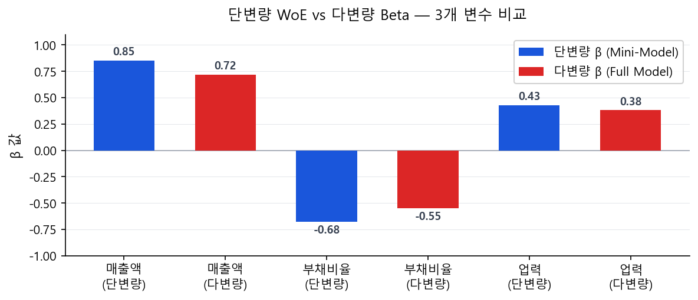

# 다변량 WoE 로지스틱 회귀 구성

## 2.1 Full Model 구성 원칙

[정보영역별 변수 선정](../part3_variable_selection/domain_selection/index.md)에서 각 영역의 대표 변수가 확정되었다. Full Model은 이 대표 변수들을 **모두 통합**하여 최종 다변량 로지스틱 회귀를 수행하는 단계다.

$$
\ln\!\left(\frac{p_i}{1-p_i}\right) = \beta_0 + \beta_1 \cdot \text{WoE}_{i,1} + \beta_2 \cdot \text{WoE}_{i,2} + \cdots + \beta_k \cdot \text{WoE}_{i,k}
$$

  1
  전체 영역 통합 다변량 회귀

모든 정보영역의 대표 변수를 한꺼번에 투입. 정보영역 간 상관관계까지 통제. VIF, β 부호, 유의성 재검토. Stepwise(Forward/Backward/Both) 또는 LRT 기반으로 최종 변수 확정.

  2
  최종 검토: 업무 논리 + 규제 부합성

통계 기준 외에 비즈니스 논리(변수가 신용도와 논리적으로 연관되는가), 금융당국 지침 부합 여부, 과거 심사 경험과의 일치성 종합 검토. 모형 문서(Model Documentation) 작성.

---

!!! note "Full Model은 절편을 포함한다"
    Simple LR(단변량)에서는 No Intercept로 \(\hat{\beta} \approx -\text{WoE}\)를 확인했다(y=1=Bad이므로 부호 반대). Full Model에서는 절편 \(\beta_0\)를 포함하며, 각 \(\beta_j\)는 다른 변수를 통제한 후의 순수한 기여도를 나타낸다. 절편 \(\beta_0\)는 모든 WoE = 0일 때(평균적인 구간에 속할 때)의 로짓 수준, 즉 포트폴리오 평균 PD를 반영한다.

!!! info "참고: 다운샘플링(Under-sampling)"
    불량률이 극단적으로 낮은(0.5% 미만) 소규모 포트폴리오에서 불량 절대 건수가 부족할 때, 정상 샘플을 줄여 비율을 조정하는 다운샘플링 기법을 고려할 수 있다. 다만 로지스틱 회귀의 MLE는 클래스 비율이 아닌 **불량의 절대 건수**에 의해 안정성이 결정되므로, 불량 건수가 수백 건 이상 확보된 포트폴리오에서는 원본 비율 그대로 적합해도 회귀계수(기울기)와 순위 변별력에 차이가 없다. 다운샘플링을 적용한 경우 절편 보정(Intercept Correction)이 필요하며, 적용하지 않으면 이 보정 자체가 불필요하다.

## 2.2 단변량 β vs 다변량 β — 왜 달라지는가?

Full Model을 구성하면 단변량 Simple LR에서 구한 β와 값이 달라진다. 이 현상을 이해하지 못하면 "변수가 이상한 것 아닌가?"라는 혼선이 생긴다. 변수 선택 및 VIF 검토 전에 이 원리를 먼저 파악해야 한다.

!!! info "단변량 Simple LR β"
    - 변수 \(X_j\) 단독으로 y를 설명할 때의 효과
    - 다른 변수의 영향이 혼재(Confounding)
    - \(\hat{\beta}_{\text{uni}} \approx -\text{WoE}_j\)
    - 다른 변수가 통제되지 않으므로 상관 변수의 정보를 흡수한 채 추정됨

!!! success "다변량 Full Model β"
    - 다른 변수 \(X_{-j}\)를 통제한 후 \(X_j\)의 순수 효과
    - 상관 변수가 이미 설명하는 부분만큼 β가 줄어듦
    - \(\hat{\beta}_{\text{multi}} \neq \hat{\beta}_{\text{uni}}\) — 일반적으로 절대값이 작아짐
    - 상관관계가 클수록 조정 폭도 커짐

!!! tip "β 변화 패턴 — 실무에서 자주 보는 케이스"
    - **β 절대값 감소 (가장 흔함):** 매출액 단변량 β=0.85 → 다변량 β=0.72. 총자산과 상관관계가 있어서 총자산이 일부 설명을 가져감.
    - **β 부호 역전 (위험 신호):** 단변량에서 양수였던 β가 다변량에서 음수로. 거의 대부분 다중공선성이 원인. 원칙적으로 제거 대상.
    - **β 거의 불변:** 다른 변수들과 상관이 낮은 독립적 변수. 모형에서 가장 안정적인 변수.

### 수치 예시: 5개 변수 다변량 회귀 결과

아래는 기업 CSS 개발에서 실제로 나타날 수 있는 결과 테이블 예시다.

| 변수 | 정보영역 | β (단변량) | β (다변량) | VIF | p-value | 판정 |
|------|---------|-----------|-----------|-----|---------|------|
| 매출액 | 재무 | 0.85 | 0.72 | 1.3 | <0.001 | ✅ 유지 |
| 부채비율 | 재무 | 0.91 | 0.68 | 2.1 | <0.001 | ✅ 유지 |
| 연체건수 | CB | 1.05 | 0.93 | 1.1 | <0.001 | ✅ 유지 (독립적 변수) |
| 총자산 | 재무 | 0.78 | **−0.12** | **6.7** | 0.35 | ❌ 제거 (부호 역전 + VIF 높음) |
| 업력 | 기본정보 | 0.45 | 0.38 | 1.4 | 0.002 | ✅ 유지 |

**총자산의 β 부호 역전 원인 분석:**

- 단변량에서 총자산은 β = +0.78로 "총자산 클수록 우량"이라는 합리적 방향
- 다변량에서 매출액(r = 0.82)과 함께 투입되자 총자산의 독자 기여가 소멸
- 매출액이 총자산의 정보를 대부분 흡수한 후, 잔여 효과가 음수로 뒤집힘
- VIF = 6.7로 다중공선성 확인 → **총자산 제거, 매출액 유지**가 합리적

!!! note "제거 후 재적합"
    총자산 제거 후 4개 변수로 재적합하면 매출액 β가 0.72 → 0.81로 소폭 증가한다. 이는 총자산이 가지고 있던 설명력의 일부가 매출액으로 복원된 것이다. 나머지 변수의 β·VIF·p-value도 재확인해야 한다.

## 2.3 다중공선성(VIF) 진단과 활용

변수 간 상관관계가 높으면 \(\hat{\beta}\)의 분산이 커져 불안정해진다. VIF(Variance Inflation Factor, 분산팽창인수)로 진단한다.

$$
\text{VIF}_j = \frac{1}{1 - R_j^2}
$$

\(R_j^2\)는 **"변수 j를 나머지 모든 변수들로 OLS 회귀했을 때의 결정계수"**다. 즉, 변수 j가 다른 변수들로 얼마나 설명되는지를 나타낸다.

### VIF와 상관관계(Corr)는 어떻게 다른가?

!!! info "단순 상관관계 (Correlation)"
    - **측정 대상:** 변수 A와 변수 B 두 개의 1:1 관계
    - **범위:** −1 ~ +1
    - **한계:** 다변량 맥락 무시. A-B 상관이 낮아도 A가 B+C+D의 선형결합으로 완벽히 설명될 수 있음
    - **적합:** 탐색적 분석, 쌍별(Pairwise) 관계 파악

!!! success "VIF"
    - **측정 대상:** 변수 j와 나머지 모든 변수들의 관계
    - **범위:** 1 ~ ∞ (1이면 독립, 클수록 공선성 심각)
    - **강점:** 3개 이상 변수 간 결합 공선성까지 포착
    - **적합:** 다변량 회귀에서 변수 선택 최종 판단

!!! tip "핵심 차이 예시 — 상관관계가 놓치는 것"
    매출액(A), 총자산(B), 영업이익(C) 세 변수가 있다.

    A-B 상관 = 0.6, A-C 상관 = 0.55, B-C 상관 = 0.5 → 쌍별 상관은 모두 < 0.7로 "괜찮아 보인다."

    그러나 VIF 계산: A를 B, C로 회귀 → R² = 0.85 → **VIF(A) = 1/(1-0.85) = 6.7**

    → 심각한 다중공선성! 상관관계만 봤다면 이 문제를 완전히 놓쳤을 것이다.

### VIF 실질 계산 절차

| 단계 | 내용 |
|------|------|
| ① 대상 변수 선택 | VIF를 구할 변수 \(X_j\) 지정 (예: 매출액\_WoE) |
| ② 보조 회귀(OLS) | \(X_j\)를 나머지 변수 \(X_1, \ldots, X_k\) (j 제외)로 OLS 회귀 |
| ③ R² 산출 | 보조 회귀의 결정계수 \(R_j^2\) 확인 |
| ④ VIF 계산 | \(\text{VIF}_j = 1 / (1 - R_j^2)\) |
| ⑤ 전체 변수 반복 | 모든 변수에 대해 ①~④ 반복. 소프트웨어(Python statsmodels, R car::vif)로 일괄 산출 가능 |
| ⑥ 판정 및 조치 | VIF가 높은 변수 중 IV가 낮은 쪽, 부호 이상 쪽, 커버리지 낮은 쪽을 제거 |

| VIF 값 | 판단 | 조치 |
|--------|------|------|
| 1 ~ 3 | 다중공선성 없음 | 유지 |
| 3 ~ 5 | 중간 수준 | 모니터링, 필요 시 제거 |
| 5 ~ 10 | 높음 | VIF 높은 쌍 중 IV·업무논리 약한 쪽 제거 검토 |
| > 10 | 심각한 다중공선성 | 반드시 하나 제거 또는 PCA 활용 |

!!! note "VIF 처리 원칙"
    VIF가 높다고 무조건 제거하지 않는다. 업무 논리상 반드시 포함해야 할 변수가 있다면, 그 변수와 상관된 상대방을 제거하는 방향으로 판단한다. VIF > 5인 변수 쌍에서는 IV가 더 낮은 쪽, 데이터 커버리지가 낮은 쪽, β 부호가 직관에 반하는 쪽을 우선 제거 후보로 본다.

## 2.4 다변량 회귀 계수 검토 — 실무·규제 관점

다변량 회귀 결과가 나왔다고 바로 스코어카드로 변환하지 않는다. 금융당국(금융감독원, Basel BCBS)과 은행 내부 리스크부서는 아래 항목들을 면밀히 검토한다.

  1
  β 부호(Sign) — 방향 점검

- **β 부호가 경제적 직관과 반대인 경우 → 즉시 원인 분석 필수.** 예: 매출액 높을수록 불량 확률이 증가한다는 β > 0이 나온다면 심각한 문제.
- 부호 역전의 주요 원인: ① 다중공선성(가장 흔함), ② 샘플 편향, ③ WoE 모노토닉성 위반, ④ 서프레서(Suppressor) 변수 효과.
- 부호 역전 변수는 원칙적으로 모형에서 제거한다. 명확한 이론적·업무 근거가 있는 예외적 경우에만 유지 가능하며, 반드시 모형 문서에 사유를 기재해야 한다.

  2
  β 크기(Magnitude) — 실무 안전 범위

- 단일 변수의 β가 절대값 기준으로 **|β| > 3.0을 초과**하면 해당 변수 단독 의존 위험 — 규제 검토 대상.
- 실무에서 일반적으로 안전하다고 보는 범위: **|β| ≤ 2.0**. |β| 1.0~2.0은 통상적인 강한 변수 범위로 수용 가능.
- β가 0에 가깝고(|β| < 0.1) 유의하지도 않다면(p > 0.1) 실질적 기여 없음 → 제거 검토.
- **WoE 스코어카드 특수성:** 입력값이 WoE(통상 −2~+2 범위)이므로, β × WoE의 곱이 ±4 이상이 되면 해당 변수 하나로 점수가 지나치게 좌우된다. 부분점수 기여 범위(β × WoE\_range)도 함께 확인해야 한다.

  3
  통계적 유의성 — p값과 신뢰구간

- Wald 검정 기준 **p < 0.05**를 통과하지 못한 변수는 원칙적으로 제거 대상.
- 업무적으로 반드시 포함해야 하는 변수(금융당국 권고 항목 등)는 p > 0.05여도 포함 가능하나 모형 문서에 사유 기재 필수.
- 95% 신뢰구간이 0을 포함하는 경우(p > 0.05와 동치)도 동일하게 취약 신호로 처리.

  4
  VIF — 다중공선성 최종 확인

- 개별 VIF > 5 이상 변수는 β 불안정 → 제거 또는 변수 재설계.
- 평균 VIF(Mean VIF) > 3.0 → 전체 모형의 다중공선성 수준이 높다는 경고 신호.

  5
  변수별 상대적 기여도 — 편중 점검

- 표준화 계수 또는 부분 로짓 기여 범위(β × WoE\_range)로 변수별 실질 기여도를 비교한다.
- 한두 개 변수에 기여도가 극단적으로 집중된 모형은 안정성이 낮다. 특정 변수의 데이터가 부재한 거래처에서 모형 적용성이 급감할 수 있다.

  6
  정보영역 균형 — 규제 관점

- Basel II/III IRB 기준(BCBS 128 문단 417~422: 등급 부여 기준의 무결성)에서는 특정 정보 원천에 과도하게 의존하지 않을 것을 권고.
- 예: 재무정보만 5개 변수 + 신용거래정보 0개 → 신규법인 등 재무정보 부재 거래처에서 모형 적용성 급감.
- 정보영역 커버리지 비율(해당 영역 변수의 유효 응답률)도 함께 보고해야 한다.

---

!!! warning "재검토 트리거 — 다음 중 하나라도 해당하면 모형 재구성 검토"
    - β 부호 역전이 2개 이상 발생 → 변수 구성 전면 재검토
    - 전체 변수 절반 이상이 p > 0.05 → 변수 풀(Pool) 재설계 또는 Stepwise 기준 완화 검토
    - 개발샘플 KS/AR이 기대치 대비 현저히 낮은데도 통계는 통과 → WoE·Binning 재검토
    - 개발샘플 vs OOT샘플 KS 괴리 > 10%p → Overfitting 또는 샘플 대표성 문제
