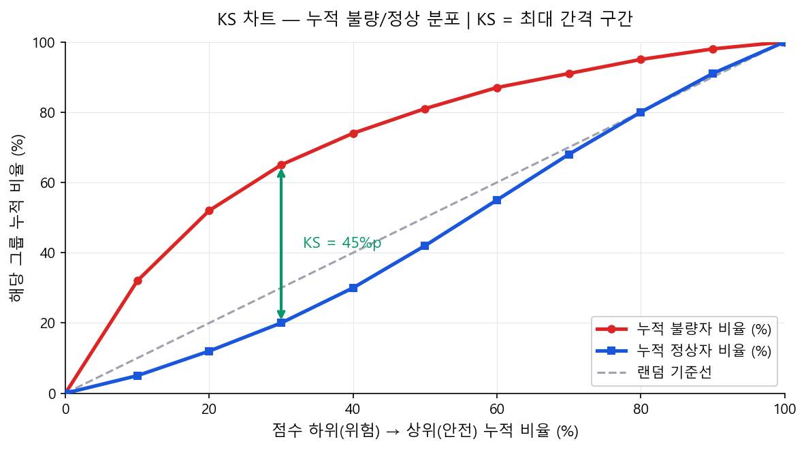
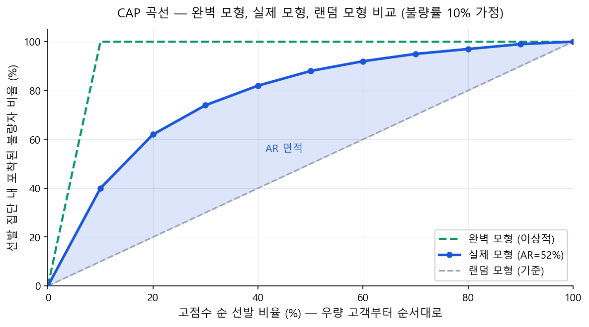

# 모형 성능 평가: KS · AR · Gini

36.7

KS 통계량 (예시)

Good/Bad 두 누적분포 함수 간 최대 거리. 높을수록 변별력 우수.

52.1

AR (Gini) (예시)

CAP 곡선 기반. 완벽 모형 대비 현재 모형의 면적 비율.

0.761

AUC (ROC) (예시)

임의로 고른 Bad가 Good보다 높은 점수를 받을 확률.

!!! note "상단 메트릭 카드"
    위 KS=36.7, AR=52.1, AUC=0.761은 **기업 CSS 개발 샘플(재무+CB 5개 변수 WoE 로지스틱 회귀)의 가상 예시**다. 실제 모형 성능은 변수 구성, 불량 정의, 데이터 품질에 따라 달라진다.

## 2.1 KS (Kolmogorov-Smirnov) 통계량

KS는 **"점수 기준으로 위험한 고객(저점수)부터 안전한 고객(고점수)까지 나열했을 때, 누적 불량자 비율과 누적 정상자 비율의 최대 차이"**다. 쉽게 말하면, **모형이 불량자를 저점수 구간에 얼마나 잘 집중시키는지의 최대 분리 정도**다.

$$
\text{KS} = \max_t \left| F_{\text{Bad}}(t) - F_{\text{Good}}(t) \right| \times 100
$$

### KS 차트의 x축 재해석

KS 차트의 x축 **"점수 하위 → 상위(%)"**는 전체 고객을 점수 기준으로 정렬했을 때 **위험한 고객 쪽(저점수)부터 안전한 고객 쪽(고점수)으로 누적 비율을 표시**한 것이다.

- x = 10%: "전체 고객 중 점수가 가장 낮은(가장 위험한) 10%"
- 불량자 누적 비율이 이 구간에서 빠르게 올라갈수록 → 모형이 불량자를 저점수에 잘 몰아두고 있다는 뜻
- 정상자 누적 비율은 천천히 올라가야 한다 (정상자는 주로 고점수에 몰려 있으므로)

### 완벽 모형과 랜덤 모형은 어떻게 산출되나?

!!! info "랜덤 모형 (Random Baseline)"
    점수가 신용도와 완전히 무관한 경우. 모든 구간에 불량자·정상자가 균등 분포.

    → 누적 불량비율 = 누적 정상비율 = x% (45도 대각선)

    → KS = 0, AR = 0

!!! success "완벽 모형 (Perfect Model)"
    모든 불량자를 가장 낮은 점수에 완벽히 배치한 이상적 모형.

    → x = 불량률(%) 구간만으로 불량자 100% 포착

    예: 불량률 10%이면 x=10%에서 이미 Bad 100% 포착. 이후 수평선.

### KS 계산 예시 — 표로 이해하기

아래 표는 전체 100명(불량 10명, 정상 90명)을 점수 하위(위험)부터 10분위로 나눈 예시다. KS는 누적 차이가 최대가 되는 구간에서 결정된다.

| 구간 (하위 기준) | 불량 수 | 정상 수 | 누적 불량비율(%) | 누적 정상비율(%) | 차이(%p) |
|-----------------|--------|--------|----------------|----------------|---------|
| 하위 10% (가장 위험) | 3명 | 7명 | 30.0 | 7.8 | 22.2 |
| 하위 20% | 2명 | 8명 | 50.0 | 16.7 | 33.3 |
| **하위 30%** | **2명** | **8명** | **70.0** | **25.6** | **44.4 ← KS 최대** |
| 하위 40% | 1명 | 9명 | 80.0 | 35.6 | 44.4 |
| 하위 50% | 1명 | 9명 | 90.0 | 45.6 | 44.4 |
| 하위 60% | 1명 | 9명 | 100.0 | 55.6 | 44.4 |
| 하위 70% | 0명 | 10명 | 100.0 | 66.7 | 33.3 |
| 하위 80% | 0명 | 10명 | 100.0 | 77.8 | 22.2 |
| 하위 90% | 0명 | 10명 | 100.0 | 88.9 | 11.1 |
| 하위 100% (전체) | 0명 | 10명 | 100.0 | 100.0 | 0 |

!!! note "KS 판독 방법"
    차이(%p) 열에서 최대값을 찾는다. 위 예시에서는 하위 30~60% 구간이 모두 44.4%p로 동일한데, 이는 해당 구간에 불량자가 없어 "평탄 구간"이 형성된 것이다. 실무에서는 최초로 최대값에 도달하는 구간(하위 30%)을 KS 발생 구간으로 보고하며, **KS = 44.4**가 이 모형의 KS 통계량이 된다.

| KS 값 | 성능 판단 | 실무 참고 |
|-------|---------|----------|
| < 20 | 불량 (Poor) | 모형 재개발 필요 |
| 20 ~ 30 | 보통 (Fair) | 개선 필요. 변수 추가 검토 |
| 30 ~ 40 | 양호 (Good) | 대부분의 실무 모형 범위 |
| 40 ~ 50 | 우수 (Very Good) | 고품질 모형 |
| > 50 | 추가 검증 권고 | 우수 모형 가능. OOT 안정성·Leakage 여부 확인 권고 |

!!! example "CB사 참고 — 국내 신용평가모형 성능 벤치마크"
    **NICE평가정보**의 개인 CSS(Credit Scoring System)는 CB 신용거래정보(연체·대출·카드 이용 등)를 주력 변수로 활용하여 **KS 50~65, AR 0.65~0.80** 수준의 변별력을 달성하는 것으로 알려져 있다. 기업 CSS의 경우 재무정보 + CB 거래정보 결합 모형에서 **KS 35~50** 수준이 일반적이다.

    **KCB(코리아크레딧뷰로)**의 개인 신용평점 모형 역시 유사한 성능 대역을 보이며, 특히 비금융 대안정보(통신비 납부, 공공요금 등)를 추가한 Thin-file 전용 모형은 기존 대비 KS 5~10%p 향상 효과가 보고된 바 있다.

    
출처: 금융위원회 '빅데이터·AI 기반 신용평가 혁신방안'(2021)

!!! warning "KS > 50 — 추가 검증 권고, 반드시 이상은 아니다"
    KS 50은 전통적 로지스틱 회귀 기반 모형에서의 경험적 상한선이다. **ML 모형(XGBoost, Random Forest 등)이나 CB 데이터를 활용한 고품질 로지스틱 모형에서는 KS 55~65 이상도 충분히 달성 가능하며, OOT 안정성이 확인되면 우수한 모형으로 인정된다.**

    다만 KS 50 초과 시 아래 항목을 추가로 검증하는 것이 좋다:

    - **OOT 안정성 확인:** OOT KS가 개발 KS 대비 5~10%p 이내면 정상. 급락한다면 Overfitting 또는 Leakage 의심.
    - **변수 관측 시점 재확인:** 불량 확정 이후에야 알 수 있는 정보가 변수에 포함됐는지 점검(Target Leakage).
    - **불량 정의 윈도우 점검:** 변수 관측 윈도우와 불량 판정 윈도우가 겹치는 구간은 없는지 확인.
    - **단일 변수 기여 점검:** 특정 한두 개 변수가 KS 대부분을 설명한다면 해당 변수의 정보 원천 재검토.

---

## 2.2 AR (Accuracy Ratio) / Gini 계수

AR은 **CAP 곡선(Cumulative Accuracy Profile)** 기반의 성능 지표다. KS가 "최대 분리 지점 하나"에 집중하는 반면, AR은 **전체 점수 범위에 걸친 누적 변별력**을 측정한다.

$$
\text{AR} = \frac{\text{실제 모형의 CAP 면적} - \text{랜덤 모형의 CAP 면적}}{\text{완벽 모형의 CAP 면적} - \text{랜덤 모형의 CAP 면적}}
$$

### CAP 곡선 축 재해석

- **x축 "전체 샘플 중 상위 점수 비율(%)":** 고점수(우량)부터 내림차순으로 N%를 선발했을 때
- **y축 "포착된 불량자 비율(%)":** 선발된 집단 안에 실제 불량자가 몇 % 포함되어 있는가
- 좋은 모형일수록 상위 소수를 선발해도 불량자를 많이 포착 → CAP 곡선이 왼쪽 위로 휘어짐

### CAP 곡선 데이터 예시 (불량률 10%, 100명 기준)

| 고점수 순 선발 비율 | 선발 인원 | 랜덤 모형 불량 포착 | 실제 모형 불량 포착 | 완벽 모형 불량 포착 |
|-------------------|----------|-------------------|-------------------|-------------------|
| 10% | 10명 | 1명 (10%) | 4명 (40%) | 10명 (100%) |
| 20% | 20명 | 2명 (20%) | 6명 (62%) | 10명 (100%) |
| 30% | 30명 | 3명 (30%) | 7명 (74%) | 10명 (100%) |
| 50% | 50명 | 5명 (50%) | 9명 (88%) | 10명 (100%) |
| 100% | 100명 | 10명 (100%) | 10명 (100%) | 10명 (100%) |

완벽 모형은 상위 10%만 선발해도 불량자 100% 포착(불량률=10%이므로). AR = 실제 모형이 랜덤 모형 위로 만드는 면적 / 완벽 모형이 랜덤 모형 위로 만드는 면적.

ROC 곡선의 AUC와 AR은 다음 관계를 가진다.

$$
\text{AR} = 2 \times \text{AUC} - 1 = \text{Gini 계수} \tag{4}
$$

| AR (Gini) | 성능 판단 | KS 대략 환산 |
|-----------|---------|-------------|
| < 0.20 | 불량 | KS < 15 |
| 0.20 ~ 0.40 | 보통 | KS 15~30 |
| 0.40 ~ 0.60 | 양호 | KS 30~45 |
| 0.60 ~ 0.80 | 우수 | KS 45~60 |
| > 0.80 | 추가 검증 권고 | 우수 모형 가능. OOT 안정성 확인 필수 |

!!! warning "AR > 0.80 — 추가 검증 권고, 반드시 이상은 아니다"
    AR 0.80은 전통적 로지스틱 스코어카드 기준에서의 경험적 상한선이다. **고품질 변수(특히 CB 신용거래정보)를 활용하거나 ML 모형을 사용할 경우, AR 0.80 이상도 실제로 달성 가능하며 OOT 안정성이 확인되면 우수한 모형이다.**

    다만 AR 0.80 초과 시 아래 항목을 추가 검증하는 것이 권고된다:

    - **OOT AR과 비교:** OOT에서도 유사한 AR이 유지된다면(괴리 <0.05) 실제 우수 모형. 0.80→0.45 이하로 급락하면 Leakage 또는 Overfitting 의심.
    - **Target Leakage 점검:** 불량 판정 이후 데이터(연체 후 계정 변동, 채권회수 진행 지표 등)가 변수에 섞인 경우 AR이 비정상적으로 높아짐.
    - **변수별 기여 분해:** 어느 한 변수가 AR의 대부분을 설명한다면 해당 변수의 정보 원천과 측정 시점을 집중 재검토.
    - **개발·OOT 데이터 중복 여부:** 두 샘플의 고객 또는 기간이 겹쳐 있는지 확인.

---

## 2.3 KS와 AR의 관계 — 수리적 특성과 실무 해석

!!! info "KS — 최대 분리 지점"
    - **측정 방식:** 특정 점수 구간 하나에서의 최대 분리값
    - **기반:** 두 분포(Bad CDF, Good CDF)의 최대 거리 — 분위수 기반
    - **강점:** 직관적, 단일 Cut-off 설정에 직접 활용
    - **약점:** KS 발생 구간 밖에서의 변별력을 전혀 반영하지 못함

!!! success "AR/Gini — 전체 범위 누적 변별력"
    - **측정 방식:** 전체 점수 범위에 걸친 누적 면적 비율
    - **기반:** CAP 곡선 면적 — 확률 기반
    - **강점:** 모형 전체 품질을 단일 숫자로 요약
    - **약점:** 특정 Cut-off에서의 성능을 직접 말해주지 않음

### 동일 모형에서 KS와 AR이 다르게 보이는 이유

KS와 AR은 같은 모형을 평가하지만 서로 다른 관점에서 측정하므로, 상황에 따라 방향이 다르게 나타날 수 있다.

!!! tip "불량자 분포 패턴에 따른 KS vs AR 차이"
    - **불량자가 최저 점수 구간에 극도로 집중:** KS는 매우 높게 나오지만, 중·상위 구간에서의 변별력이 없다면 AR은 상대적으로 낮을 수 있다.
    - **불량자가 전 점수 구간에 고르게 분산:** 어느 한 구간에서 KS 최대값이 높게 나오기 어렵다 → KS는 낮지만, 전체적으로 Good/Bad를 꾸준히 분리한다면 AR은 그리 낮지 않을 수 있다.
    - **실무 함의:** KS가 AR보다 "낙관적"으로 보이는 경우, 해당 모형이 특정 고위험 구간에서만 잘 작동하고 나머지 구간에서 변별력이 부족할 가능성을 의심해야 한다.

!!! tip "어떤 지표를 언제 써야 하는가?"
    - **KS:** 심사 자동화의 Cut-off 점수를 결정할 때. "이 점수 이하는 거절"처럼 단일 기준점이 필요할 때 가장 직접적.
    - **AR/Gini:** 복수 모형 간 전체 품질 비교. 규제 보고(Basel 검증 보고서 등)에서 모형 변별력의 공식 지표로 더 자주 요구됨.
    - **AUC:** 모형이 확률을 출력하는 경우(로지스틱 회귀, ML) 모형 간 직접 비교 시 권장. AR = 2×AUC−1이므로 수치만 변환됨.
    - **PSI:** 모형 개발 이후 운영 단계 정기 모니터링 전용. 변별력 지표가 아니라 분포 안정성 지표.

    **실무 권장:** KS + AR을 함께 보고. 두 지표가 크게 괴리된다면 불량자 분포 특성을 점검한다.

### 소매와 기업이 주로 보는 지표가 다른 이유

실무에서 **소매(Retail) 포트폴리오는 KS**, **기업(Wholesale) 포트폴리오는 AR**을 1차 지표로 관행적으로 사용한다. 같은 모형 성능 평가인데 왜 주력 지표가 갈리는 것일까?

| 구분 | 소매 → KS 선호 | 기업 → AR 선호 |
|------|----------------|----------------|
| **의사결정 방식** | 승인/거절 **단일 cutoff** — "몇 점 이상이면 자동 승인" | 신용등급(AAA~D) 부여 후 **등급별 금리·한도 차등** |
| **핵심 관심** | 최대 분리 **지점** — cutoff 설정에 직결 | 전체 구간의 **rank-ordering**(순서 변별력) |
| **데이터 규모** | 수십만~수백만 건 → 누적분포 안정, 단일 지점 신뢰도 충분 | 수백~수천 건, 부도 극소수 → 단일 지점 의존 시 표본 변동에 취약 |
| **규제 관행** | 내부 심사 자동화 기준 | Basel IRB 검증 보고서의 표준 지표 |

!!! tip "왜 이렇게 나뉘었는가?"
    소매는 **대량 자동 심사**가 핵심이므로, "어디에서 자르는가"를 직접 보여주는 KS가 운영 의사결정에 직관적이다. 반면 기업여신은 **등급 체계 전체의 서열 품질**이 중요하고, 소표본에서 특정 구간 하나에 의존하면 불안정하므로, 전체 면적을 요약하는 AR이 자연스러운 선택이 된다.

!!! warning "문서화 시 관례"
    소매든 기업이든, 모형 성능 보고서에는 **KS · AR(Gini) · AUC를 모두 산출하여 보고하는 것이 관례**다. 주력 지표가 하나라고 해서 나머지를 생략하지 않는다. 세 지표를 함께 제시해야 모형의 변별력을 다각도로 검증할 수 있고, 감독당국·내부 검증 부서의 요구사항도 충족된다.

---

## 2.4 실무 성능 기준

| 평가 항목 | 개발 샘플 | 검증 샘플 | 비고 |
|-----------|----------|----------|------|
| **KS** | 목표 KS 이상 | 개발 대비 ±5 이내 | 기관·자산별 상이. 통상 25~40 범위 |
| **AR (Gini)** | 0.40 이상 권장 | 개발 대비 ±0.05 이내 | Basel PD 모형의 경우 0.50 이상 요구 多 |
| **AUC** | 0.70 이상 | 개발 대비 ±0.03 이내 | 랜덤 모형 = 0.50 |
| **PSI** | — | < 0.10 (안정적) / 0.10~0.25 (모니터링) / > 0.25 (재개발 검토) | 점수 분포 안정성 지표. 분기별 모니터링. |

!!! warning "개발 vs 검증 샘플 분리"
    성능 평가는 반드시 개발 샘플(Training)과 검증 샘플(Validation/OOT)을 분리하여 수행해야 한다. OOT(Out-of-Time) 샘플 성능이 개발 샘플 대비 크게 저하되면 Overfitting 또는 샘플 대표성 문제를 의심한다.

---

## 2.5 PSI (Population Stability Index) — 점수 분포 안정성 지표

KS·AR·AUC가 모형의 **변별력(Discrimination)**을 측정하는 반면, PSI는 모형 운영 중 **점수 분포 자체가 얼마나 안정적으로 유지되는지**를 측정하는 모니터링 지표다. 기준 시점(개발 샘플)과 비교 시점(최근 운영 샘플) 간 점수 분포의 이동량을 수치화한다.

$$
\text{PSI} = \sum_{b=1}^{B} \left(A_b - E_b\right) \times \ln\!\left(\frac{A_b}{E_b}\right) \tag{5}
$$

여기서 \(E_b\)는 개발 샘플(Expected)의 등급 b 비율, \(A_b\)는 비교 샘플(Actual)의 등급 b 비율, B는 전체 등급(Bin) 수다.

!!! tip "PSI 계산 예시 — 5개 점수 구간, 개발 vs 최근 분기 비교"

    | 점수 구간 | 개발 비율 \(E_b\) | 최근 비율 \(A_b\) | A-E | ln(A/E) | (A-E)×ln(A/E) |
    |----------|-------------------|-------------------|-----|---------|---------------|
    | 700 이상 | 0.15 | 0.12 | −0.03 | −0.223 | 0.0067 |
    | 650~699 | 0.25 | 0.22 | −0.03 | −0.128 | 0.0038 |
    | 600~649 | 0.30 | 0.31 | +0.01 | +0.033 | 0.0003 |
    | 550~599 | 0.20 | 0.24 | +0.04 | +0.182 | 0.0073 |
    | 550 미만 | 0.10 | 0.11 | +0.01 | +0.095 | 0.0010 |
    | **합계** | **1.00** | **1.00** | — | — | **PSI = 0.019 (안정)** |

| PSI 값 | 판단 | 조치 |
|--------|------|------|
| < 0.10 | 안정적 (Stable) | 정기 모니터링 유지 |
| 0.10 ~ 0.25 | 소폭 이동 (Slight Shift) | 원인 분석, 심층 모니터링 강화 |
| > 0.25 | 유의미한 이동 (Major Shift) | 모형 재검증, 재보정 또는 재개발 검토 |

!!! warning "PSI 상승의 주요 원인"
    ① 포트폴리오 구성 변화(신규 채널·상품 출시), ② 경기 국면 전환(경기침체 시 저점수 고객 증가), ③ 심사 기준 변경(보수화 시 고점수 비율 증가), ④ 데이터 시스템 변경(변수 정의·산출 로직 변화). PSI가 0.25 초과하면 변별력 지표(KS·AR)도 함께 점검하여 모형 성능 저하 여부를 종합 판단한다.

---

!!! info "다음 단계"
    모형 성능 평가가 완료되면, **[OOT 검증](oot-validation.md)**을 통해 미래 데이터에서도 모형이 유효한지 확인해야 한다. OOT를 통과한 모형은 배포 후 [모니터링과 운영](monitoring-and-operations.md) 체계에 편입된다.
