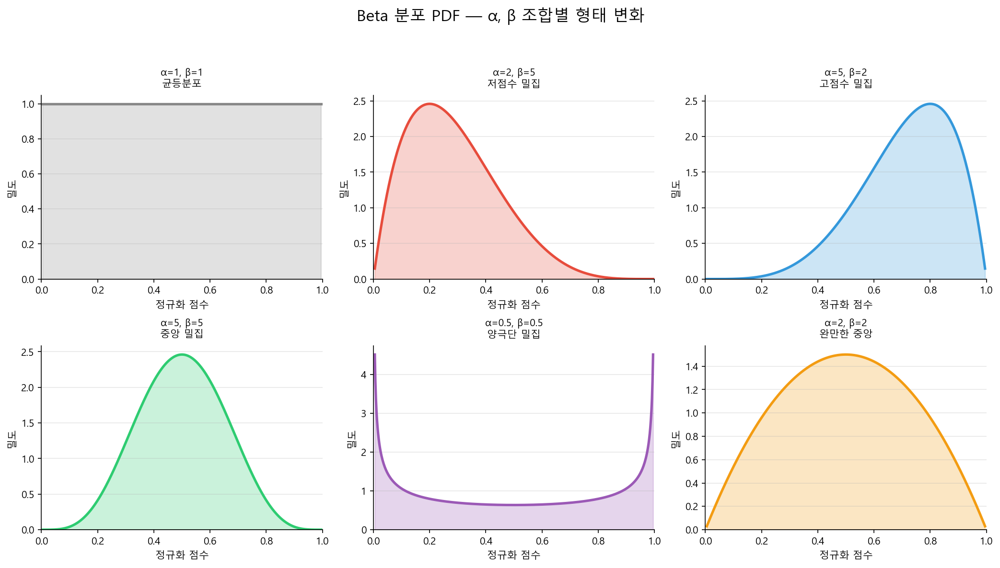
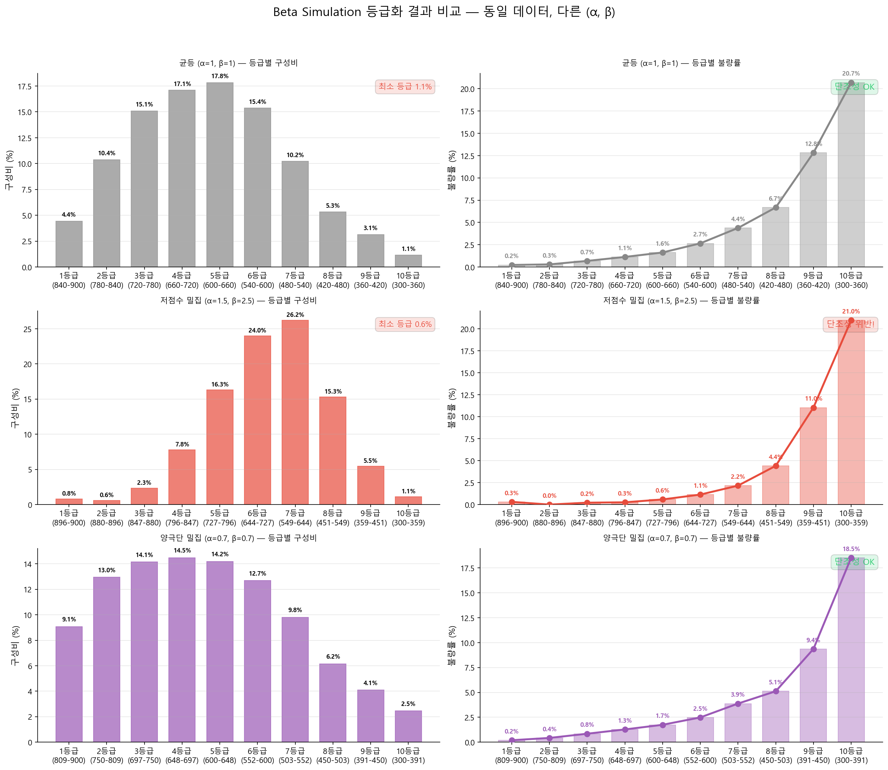

# 스코어카드 변환 & 등급화

## 1.1 스코어카드 변환: Anchor Score & PDO

WoE 로지스틱 회귀에서 최종 신용점수가 변수별 부분점수의 합으로 표현되는 이유는 로짓의 선형성 때문이다.

### 왜 Good Odds로 전환하는가?

!!! danger "Odds 방향 전환: Bad Odds → Good Odds"
    지금까지(개요~단변량 LR)는 **Bad Odds** \(p/(1-p)\)를 사용했다. 불량 확률 \(p\)가 높으면 Odds도 높아지므로 이론 설명에 직관적이었다.

    스코어카드 단계에서는 **Good Odds** \((1-p)/p\)로 전환한다. 이유는 다음과 같다.

| 이유 | 설명 |
|------|------|
| **점수 방향의 직관성** | "점수가 높으면 우량" — 심사역·고객·경영진 모두 자연스럽게 이해 |
| **WoE 부호와의 일관성** | Good Odds 기준에서 WoE 양수 = 우량 구간, 음수 = 불량 구간. 점수 기여 방향과 부호가 일치 |
| **실무 관행** | NICE·KCB 등 국내 CB사와 해외 주요 CB(FICO, Experian) 모두 "높을수록 우량" 체계 |

수식적으로 두 Odds는 역수 관계이므로, 로그를 취하면 **부호만 반전**된다:

$$
\ln\!\left(\frac{1-p}{p}\right) = -\ln\!\left(\frac{p}{1-p}\right)
$$

아래 점수 공식에서는 Good Odds의 로그를 직접 사용하여 이 전환을 반영한다.

### 수식의 원리 이해

Good Odds가 높을수록 우량하므로, 점수와 Good Odds는 **정비례** 관계로 설계된다.

$$
\text{Score}_i = A + B \times \ln\!\left(\frac{1-p_i}{p_i}\right)
$$

Good Odds가 클수록(우량할수록) 점수가 높아지는 직관적 구조다. Part 5에서는 y = 1 = Good으로 전환하였으므로, **Good Odds 로지스틱 회귀의 계수를 직접 사용**한다:

$$
\ln\!\left(\frac{1-p}{p}\right) = \beta_0 + \sum_{j=1}^{k} \beta_j \cdot \text{WoE}_{ij}
$$

여기서 \(\beta_0, \beta_j\)는 **Good Odds 모형**(y=1=Good)의 회귀계수다. WoE = ln(%Good/%Bad)와 log-odds 방향이 일치하므로 \(\beta_j > 0\)이 자연스럽게 성립한다(Part 1~4의 Bad Odds에서는 \(\beta \approx -\text{WoE}\)였지만, Good Odds 전환 후에는 \(\beta \approx +\text{WoE}\)가 된다).

따라서 점수 전개식은:

$$
\text{Score}_i = A + B \times \left[\beta_0 + \sum_{j=1}^{k} \beta_j \cdot \text{WoE}_{ij}\right]
$$

WoE가 양수(우량 구간)이면 점수가 올라가고, 음수(불량 구간)이면 내려간다 — **부호의 직관이 완벽하게 일치**한다.

!!! info "A — Anchor Score (기준점수)"
    특정 **기준 오즈(\(\theta_0\))에 대응하는 목표 점수**로, 점수 체계의 기준점(닻)을 설정한다.

    **예:** "Odds 1:1(Good:Bad, PD≈50%)일 때 600점" → \(\theta_0=1\), \(A_{\text{target}}=600\)

    실무에서 통상 500~700점 범위 내 중간값으로 설정. 기관별 점수 체계 정책에 따라 결정.

!!! info "B — PDO (Points to Double the Odds)"
    오즈(Good:Bad)가 **2배 증가할 때**(불량 확률이 절반으로 줄어들 때) 점수가 몇 점 상승하는지를 결정하는 스케일 파라미터.

    **예:** PDO=20이면 Odds가 2배마다 점수 +20점. PDO가 클수록 점수 분포가 넓어짐.

    실무에서 통상 10~25점 사이 설정. 점수 체계의 분해능(Granularity) 조절.

### 스케일링 상수 유도 — 정확한 수식

Score = \(A_{\text{const}} + B \times \ln(\text{Odds})\) 형태로 표현할 때, Anchor Score 조건과 PDO 정의로부터 \(A_{\text{const}}\)와 B를 역산한다.

**① PDO 정의에서 B 산출:**

Good Odds = \(\theta_0\)일 때 Score = \(A_{\text{target}}\), Good Odds = \(2\theta_0\)일 때 Score = \(A_{\text{target}} + \text{PDO}\)

$$
(A_{\text{const}} + B\ln 2\theta_0) - (A_{\text{const}} + B\ln\theta_0) = \text{PDO}
$$

$$
B(\ln 2\theta_0 - \ln\theta_0) = \text{PDO} \quad \Rightarrow \quad \boxed{B = \frac{\text{PDO}}{\ln 2}} \tag{1}
$$

**② Anchor Score 조건에서 \(A_{\text{const}}\) 산출:**

$$
A_{\text{target}} = A_{\text{const}} + B\ln\theta_0 \quad \Rightarrow \quad \boxed{A_{\text{const}} = A_{\text{target}} - B \times \ln\theta_0} \tag{2}
$$

!!! note "\(A_{\text{const}}\)와 \(A_{\text{target}}\)의 구분"
    \(A_{\text{target}}\)은 "기준 Odds에서의 목표 점수(예: 600점)"이고, \(A_{\text{const}}\)는 수식의 상수항이다. 기준 Odds \(\theta_0=1\)(\(\ln 1=0\))로 설정하면 \(A_{\text{const}} = A_{\text{target}}\)으로 동일해진다. 이것이 실무에서 "Anchor Score = 600, 기준 Odds = 1:1"로 설정하는 이유다. \(\theta_0 \neq 1\)이면 두 값이 달라지므로 혼동 주의.

**수치 예시:** PDO=20, \(A_{\text{target}}=600\), 기준 Odds=1(\(\ln 1=0\))이면:

$$
B = \frac{20}{\ln 2} \approx 28.85, \quad A_{\text{const}} = 600 - 28.85 \times 0 = 600
$$

### 스코어카드의 실제 구조 — 고정 부분점수 테이블

스코어카드에서 "부분점수"는 고객마다 매번 계산하는 값이 아니다. **각 변수의 구간(Bin)마다 미리 계산된 고정 정수값을 테이블로 만들어두고, 고객의 구간을 찾아 해당 점수를 합산하는 구조**다.

변수 j의 b번째 구간(Bin)에 대응하는 부분점수(Part Score)는:

$$
\text{PartScore}_{j,b} = B \times \beta_j \times \text{WoE}_{j,b} + \frac{B \times \beta_0}{k} \tag{3}
$$

여기서 \(\text{WoE}_{j,b}\)는 변수 j의 b번째 구간에 사전 계산된 고정값이며, 고객마다 달라지지 않는다. \(\beta_j\)는 **Good Odds** Full Model의 다변량 회귀계수, k는 모형에 포함된 변수 수, B는 PDO/ln2다. 절편 \(\beta_0\)는 k개 변수에 균등 배분된다.

!!! example "스코어카드 테이블 예시 — 매출액 변수"
    **모형 설정:** β₀ = +2.50 (Good Odds), β(매출액) = 0.72, B ≈ 28.85, k = 4개 변수

    절편 배분: \(B \times \beta_0 / k = 28.85 \times 2.50 / 4 \approx +18.0\)

    | 구간(Bin) | 매출액 범위 | WoE | B×β×WoE | 절편 배분 | 부분점수(정수) |
    |-----------|------------|-----|---------|----------|---------------|
    | Bin 1 | 500억 이상 | +1.20 | 28.85×0.72×1.20 = +24.9 | +18.0 | **+43점** |
    | Bin 2 | 100~500억 | +0.45 | 28.85×0.72×0.45 = +9.3 | +18.0 | **+27점** |
    | Bin 3 | 30~100억 | −0.10 | 28.85×0.72×(−0.10) = −2.1 | +18.0 | **+16점** |
    | Bin 4 | 30억 미만 | −0.95 | 28.85×0.72×(−0.95) = −19.7 | +18.0 | **−2점** |

    WoE가 양수(우량)인 구간일수록 부분점수가 높고, 음수(불량)인 구간일수록 낮다 — **부호의 직관이 완벽하게 일치**한다.

### n개 변수 합산 — 최종 점수 산출 과정

최종 점수는 모든 변수의 부분점수를 단순 합산한 것이다:

$$
\text{Score}_i = A_{\text{const}} + \sum_{j=1}^{k} \text{PartScore}_{j, b(i,j)} \tag{4}
$$

\(b(i,j)\)는 고객 \(i\)가 변수 \(j\)에서 해당하는 Bin 번호다.

!!! example "4개 변수 합산 예시 — 기업 A의 점수 산출"
    **모형:** 매출액, 업력, 부채비율, 신용조회건수 (k=4), \(A_{\text{const}}\) = 600

    | 변수 | 기업 A의 값 | 해당 구간 | 부분점수 |
    |------|-----------|----------|---------|
    | 매출액 | 200억 | Bin 2 (100~500억) | **+27점** |
    | 업력 | 12년 | Bin 1 (10년 초과) | **+35점** |
    | 부채비율 | 180% | Bin 3 (150~250%) | **+12점** |
    | 신용조회건수 | 3건 | Bin 2 (2~5건) | **+8점** |
    | | | **Σ 부분점수** | **+82점** |

    $$\text{Score}_A = 600 + 82 = \textbf{682점}$$

    기업 A는 682점으로 "일반 양호 거래처" 등급에 해당한다.

### Lookup 테이블 — 운영 시스템 구현

개발 단계에서 산출한 부분점수를 **고정 정수 테이블(Lookup Table)**로 전환하면, 운영 시스템에서는 회귀 계산 없이 **테이블 조회(lookup) + 합산**만으로 점수를 산출할 수 있다.

!!! example "Lookup Table 예시 (전체 변수)"

    | 변수 | Bin 1 | Bin 2 | Bin 3 | Bin 4 |
    |------|-------|-------|-------|-------|
    | **매출액** | +43 | +27 | +16 | −2 |
    | **업력** | +35 | +20 | +5 | −10 |
    | **부채비율** | +30 | +18 | +12 | −5 |
    | **신용조회건수** | +25 | +8 | −3 | −15 |

    **점수 산출 절차:**

    1. 고객의 각 변수 값을 확인
    2. 해당 Bin을 찾아 부분점수를 조회 (테이블 lookup)
    3. 모든 변수의 부분점수를 합산
    4. \(A_{\text{const}}\)(600)를 더하여 최종 점수 산출

    이 테이블은 모형 개발 시 **1회만 계산**하고, 이후 운영 시 수만~수십만 건의 고객 점수를 **단순 조회+합산**으로 처리한다. 로지스틱 회귀나 WoE 계산이 실시간으로 필요하지 않으므로, 레거시 전산 시스템에서도 즉시 구현 가능하다는 것이 전통적 스코어카드의 핵심 장점이다.

!!! success "가산성(Additivity)"
    최종 신용점수 = \(A_{\text{const}}\) + 각 변수 부분점수의 합. 이 구조 덕분에 심사역이 "왜 이 고객의 점수가 낮은가"를 변수별로 분해해서 설명할 수 있고, 전산 시스템에서도 단순 테이블 조회(lookup)로 빠르게 점수를 계산할 수 있다.

### 점수의 해석

스코어카드 점수는 **고객 신용도의 순위 척도**다. 점수가 높을수록 신용도가 높고(PD 낮음), 낮을수록 불량 위험이 높다. 단, 점수의 절대 수준은 Anchor Score와 PDO 설정에 따라 기관마다 달라지므로, 점수 자체보다 **등급별 실제 부도율 대응표(Rating Master Table)**가 더 중요하다.

### Score → Odds → 확률 역산 과정

점수가 주어졌을 때 불량 확률을 역산하는 절차다. Score = \(A_{\text{const}} + B \times \ln(\text{Odds})\) 공식을 역으로 풀면:

$$
\ln(\text{Odds}) = \frac{\text{Score} - A_{\text{const}}}{B}, \quad \text{Odds} = e^{(\text{Score} - A_{\text{const}})/B}, \quad p = \frac{1}{1 + \text{Odds}}
$$

**수치 예시** (A_const = 600, B = 28.85):

| Score | \(\ln(\text{Good Odds})\) | Good Odds | PD = 1/(1+Odds) |
|-------|--------------------------|-----------|-----------------|
| 700 | (700−600)/28.85 = +3.47 | 32.14 (≈ 32:1) | **3.0%** |
| 650 | (650−600)/28.85 = +1.73 | 5.64 (≈ 6:1) | **15.1%** |
| 600 | (600−600)/28.85 = 0.00 | 1.000 (1:1) | **50.0%** |
| 550 | (550−600)/28.85 = −1.73 | 0.177 (≈ 1:6) | **85.0%** |

!!! note "Anchor Score의 의미"
    600점 = Odds 1:1 = PD 50%가 되는 것은 Anchor Score를 Odds 1:1에 설정했기 때문이다. 실무에서는 Intercept Correction 후의 β₀를 사용하므로 실제 600점 고객의 PD는 50%보다 훨씬 낮다(예: 2~5%). 위 표는 **수식 구조를 이해하기 위한 이론적 역산**이며, 실제 PD는 Rating Master Table의 캘리브레이션 PD를 사용한다.

| 점수 구간 예시 | Odds(Good:Bad) 근사 | PD 근사 | 실무 의미 |
|--------------|--------------------|---------|---------|
| 700점 이상 | 수백:1 | 0.1% 미만 | 우량 거래처, 자동승인 대상 |
| 650~699점 | 수십:1 | 0.5~1% | 일반 양호 거래처 |
| 600~649점 | 10:1 내외 | 5~10% | 주의 필요, 추가 심사 검토 |
| 600점 미만 | 5:1 이하 | 15% 이상 | 고위험, 거절 또는 엄격한 조건부 승인 |

!!! note "정수형 보정"
    로지스틱 회귀 산출 부분점수는 소수를 포함한다. 실무 시스템 구현 시 반올림하여 정수화한다. 반올림 오차는 절편 부분점수로 흡수하거나 PDO를 미세 조정하여 처리한다. 정수 변환 후에도 등급별 Bad Rate 단조성이 유지되는지 재확인이 필요하다.

---

## 1.2 평점 등급화(Rating Grade) & PD 캘리브레이션

스코어카드 변환으로 연속형 점수가 산출되지만, 실무 심사·한도·금리 정책 적용을 위해서는 **점수를 이산(Discrete) 등급으로 변환**하는 과정이 필요하다. 동시에 각 등급에 실제 부도율(PD)을 대응시키는 캘리브레이션을 수행해야 Basel IRB 모형으로 활용 가능하다.

### 등급 구간 설계 원칙

| 설계 방식 | 내용 | 장단점 |
|-----------|------|--------|
| **동일 인원 구간** (Equal-frequency) | 각 등급에 동일한 수의 고객이 배치되도록 점수 경계 설정 | 각 등급의 통계적 안정성 확보 / 점수 구간 폭이 등급마다 달라짐 |
| **동일 점수 구간** (Equal-width) | 점수 범위를 균등하게 분할 (예: 10점 간격) | 직관적 이해 쉬움 / 고객 분포 쏠림 시 일부 등급 샘플 극소 |
| **업무 기준 구간** (Business-driven) | 기존 심사 정책, 금리 단계, 한도 구분과 연계하여 경계 설정 | 현업 적용 용이 / 통계적 최적과 괴리될 수 있음 |
| **PD 기반 구간** (PD-aligned) | 등급 내 PD 범위가 Basel 내부등급 요건에 부합하도록 설계 | IRB 부합성 우수 / 설계 복잡도 높음 |

!!! note "실무 권장"
    등급 수는 통상 10~15개. Basel IRB 최소 요건(BCBS 128 문단 404)은 비불량(Non-default) 7등급 이상 + 불량(Default) 1등급 이상이다. 등급 수가 너무 적으면 PD 차별화가 부족하고, 너무 많으면 등급별 샘플이 적어 통계적 불안정성이 커진다.

### Beta Distribution Simulation — 등급 구간 최적화

위 4가지 설계 방식은 어느 것이든 **분석가가 경계점을 직접 지정**해야 한다는 한계가 있다. 등급 수가 10개라면 9개의 경계점을 결정해야 하고, 이들의 조합 공간은 방대하다. Beta Distribution Simulation은 이 탐색 과정을 **체계적으로 자동화**하는 방법이다.

#### 핵심 아이디어

Beta 분포의 CDF(누적분포함수)를 이용해 점수 범위 위에 등급 경계점을 배치한다. Beta 분포의 두 파라미터 \(\alpha, \beta\)를 변경하면 경계점의 밀집 위치가 달라지므로, 다양한 등급 구조를 체계적으로 탐색할 수 있다.

K개 등급으로 나눌 때, k번째 경계점은:

$$
\text{Cutoff}_k = S_{\min} + (S_{\max} - S_{\min}) \times F_{\text{Beta}}\!\left(\frac{k}{K};\ \alpha,\ \beta\right) \tag{5}
$$

여기서 \(F_{\text{Beta}}\)는 Beta 분포의 CDF, \(S_{\min}, S_{\max}\)는 점수의 최솟값·최댓값이다.

#### α, β에 따른 경계점 분포 변화

| α, β 조합 | 경계점 분포 특성 | 적합한 상황 |
|-----------|----------------|------------|
| α = 1, β = 1 | **균등 배분** — Equal-width와 동일 | 점수 분포가 균일한 경우 |
| α > 1, β > 1 | **중간 점수대 밀집** — 양 극단은 넓게 | 중간 리스크 구간의 세밀한 구분이 필요할 때 |
| α < 1, β < 1 | **양 극단 밀집** — 중간은 넓게 | 우량/불량 경계를 정밀하게 나눠야 할 때 |
| α > 1, β < 1 | **저점수대(고위험) 밀집** | 불량 집중 구간의 세분화가 중요할 때 |
| α < 1, β > 1 | **고점수대(우량) 밀집** | 우량 고객의 세분화가 필요할 때 |

α, β 값을 바꾸면 분포의 형태가 완전히 달라진다. 이 형태가 곧 **경계점이 어디에 촘촘하게 배치되는지**를 결정한다.

!!! tip "직관적 이해"
    α, β가 모두 1이면 균등분포(직선)다. α를 키우면 경계점이 오른쪽(고점수)으로 쏠리고, β를 키우면 왼쪽(저점수)으로 쏠린다. 둘 다 키우면 중앙에 모이고, 둘 다 줄이면 양 끝에 퍼진다. 이 직관만 있으면 시뮬레이션 결과를 해석할 수 있다.

#### 시뮬레이션 절차

  1
  탐색 그리드 설정

\(\alpha, \beta\) 각각에 대해 탐색 범위를 설정한다. 예를 들어 \(\alpha \in [0.3,\ 5.0]\), \(\beta \in [0.3,\ 5.0]\)을 0.1 간격으로 나누면 약 2,200개의 조합이 생성된다. 등급 수 K도 10~15개 범위에서 함께 탐색할 수 있다.

  2
  각 (α, β) 조합별 등급 구간 생성

식 (5)로 K−1개의 경계점을 산출하고, 개발 데이터셋의 각 고객을 해당 등급에 배정한다.

  3
  평가 지표 산출

각 등급 구조에 대해 다음 지표를 동시에 평가한다:

| 평가 기준 | 지표 | 기준 |
|-----------|------|------|
| **변별력** | AR, KS, AUC | 높을수록 좋음 — 등급이 Good/Bad를 잘 분리하는가 |
| **안정성** | PSI (개발 vs 검증) | 낮을수록 좋음 — 등급 분포가 시간에 따라 안정적인가 |
| **서열화** | 등급별 Bad Rate 단조성 | 필수 — 등급이 올라갈수록 Bad Rate가 반드시 감소해야 함 |
| **집중도** | 등급별 인원 비율 | 극단적 쏠림 없이 적정 분포 |

!!! warning "단조성은 Hard Constraint"
    변별력·안정성은 최적화 대상(Objective)이지만, Bad Rate 단조성은 **위반 시 해당 조합을 즉시 제외**하는 필수 제약이다. 단조성이 깨진 등급 체계는 아무리 KS가 높아도 사용할 수 없다.

  4
  최적 (α, β) 선택

단조성을 만족하는 조합 중에서, 변별력·안정성·집중도를 종합 평가하여 최적의 \((\alpha^*, \beta^*)\)를 선택한다. 실무에서는 가중합 방식으로 단일 스코어를 만들기도 한다:

$$
\text{Score}(\alpha, \beta) = w_1 \times \text{AR} + w_2 \times (1 - \text{PSI}) + w_3 \times \text{균등도}
$$

가중치 \(w_1, w_2, w_3\)는 기관의 정책 우선순위에 따라 결정한다.

  5
  검증 및 확정

선정된 등급 구조를 OOT(Out-of-Time) 검증 데이터에 적용하여 동일한 지표를 재확인한다. 개발-검증 간 지표 괴리가 크면 과적합 가능성을 점검하고, 차선 조합을 검토한다.

#### 시뮬레이션 결과 예시

아래는 동일한 가상 데이터(4만 건, 점수 300~850)에 세 가지 \((\alpha, \beta)\) 조합을 적용한 결과다. 같은 데이터라도 파라미터에 따라 등급 구조가 완전히 달라진다.

| 시나리오 | 특징 | 판정 |
|----------|------|------|
| **균등 (α=1, β=1)** | 불량률 서열화(단조성) OK. 그러나 1등급(4.4%)·10등급(1.1%) 인원 과소 | 보통 — 양 극단 등급의 통계적 안정성 부족 |
| **저점수 밀집 (α=1.5, β=2.5)** | 1등급 0.3% → 2등급 0.0%로 **단조성 위반**. 1~2등급 인원 1% 미만 | **부적합** — 우량 등급 세분화 과도, 사실상 무의미 |
| **양극단 밀집 (α=0.7, β=0.7)** | 단조성 OK, 인원 분포 2.5%~14.5%로 가장 고름. 불량률 곡선 매끄러움 | **적합** — 균형 잡힌 등급 구조 |

이처럼 시뮬레이션을 통해 수천 개의 \((\alpha, \beta)\) 조합을 평가하고, 변별력·안정성·서열화·인원 분포를 모두 만족하는 최적 조합을 선택하는 것이 Beta Simulation 등급화의 핵심이다.

#### 왜 Beta 분포인가?

등급 경계점 배치에 Beta 분포를 사용하는 이유는 다음과 같다:

| 특성 | 설명 |
|------|------|
| **[0, 1] 정의역** | 점수를 [0, 1]로 정규화하면 CDF 값이 바로 경계점 비율이 됨 |
| **2개 파라미터로 다양한 형태** | 균등·좌편향·우편향·U자·종형 등 모든 분포 형태를 표현 가능 |
| **연속적 탐색** | α, β를 연속적으로 조절하여 경계점 이동을 매끄럽게 제어 |
| **해석 용이** | α, β 값만으로 경계점 밀집 방향을 직관적으로 이해 가능 |

!!! note "Equal-frequency와의 관계"
    Equal-frequency(동일 인원) 방식은 점수의 **경험적 CDF**를 사용한 것으로 볼 수 있다. Beta Simulation은 이를 **모수적(Parametric) CDF**로 일반화한 것이다. Equal-frequency가 데이터에 완전히 종속되는 반면, Beta Simulation은 파라미터를 통해 데이터 의존도를 조절할 수 있다.

### 등급별 단조성(Monotonicity) 검증

등급이 올라갈수록(점수 높을수록) Bad Rate가 반드시 감소해야 한다. 역전 구간이 발생하면 모형의 변별력에 문제가 있거나 등급 경계 설계가 잘못된 것이다.

!!! warning "단조성 위반 처리"
    ① 역전 구간의 등급을 인접 등급과 합병(Merge) → ② 재분할 후 재확인 → ③ 그래도 해결되지 않으면 Binning 재검토 또는 모형 재개발 검토. 단조성 위반은 금감원 검사 및 Basel 검증에서 주요 지적 사항이다.

### PD 캘리브레이션 전체 절차

  1
  개발 샘플 기반 등급별 실측 부도율 산출

등급별 불량자 수 / 해당 등급 전체 대상자 수 = 실측 부도율(Observed PD). 다운샘플링 모형의 경우 Intercept Correction 적용 후 PD 역산.

  2
  OOT(Out-of-Time) 샘플 검증

개발 샘플 밖의 기간 데이터에서 등급별 부도율을 재산출하여 개발 샘플과 비교. 괴리가 크면 Overfitting 또는 Concept Drift 의심.

  3
  장기평균 PD 조정 (Through-the-Cycle, TTC)

개발 시점 경기 국면 영향을 제거하고 경기 전반에 걸친 평균 부도율로 조정. 통상 10~15년 장기 데이터를 활용. 단기 데이터만 있을 경우 외부 벤치마크(CB 데이터, 금융당국 업종별 부도율 통계 등) 참조.

  4
  MoC (Margin of Conservatism) 가산

데이터 한계(관측 기간 짧음, 샘플 규모 부족, 모형 추정 불확실성 등)를 감안한 보수적 가산값. Basel IRB에서 MoC 산출 및 적용 문서화는 규제 필수 요건.

  5
  최종 Rating Master Table 완성

등급, 점수범위, 캘리브레이션 PD(TTC+MoC), 개발샘플 실측 부도율, OOT 실측 부도율, 샘플 수, 불량 수를 포함한 종합 테이블 작성.

---

### Rating Master Table 예시

| 등급 | 점수 범위 | 샘플 수 | 불량 수 | 실측 Bad Rate | TTC PD | MoC 가산 | 최종 PD |
|------|----------|--------|--------|-------------|--------|---------|---------|
| **1** | 750 이상 | 2,850 | 2 | 0.07% | 0.08% | 0.02% | **0.10%** |
| **2** | 720~749 | 3,120 | 5 | 0.16% | 0.18% | 0.04% | **0.22%** |
| **3** | 690~719 | 4,210 | 15 | 0.36% | 0.40% | 0.08% | **0.48%** |
| **4** | 660~689 | 5,480 | 38 | 0.69% | 0.75% | 0.13% | **0.88%** |
| **5** | 630~659 | 6,320 | 82 | 1.30% | 1.40% | 0.22% | **1.62%** |
| **6** | 600~629 | 5,910 | 142 | 2.40% | 2.60% | 0.38% | **2.98%** |
| **7** | 570~599 | 4,650 | 186 | 4.00% | 4.30% | 0.55% | **4.85%** |
| **8** | 540~569 | 3,280 | 197 | 6.00% | 6.40% | 0.75% | **7.15%** |
| **9** | 510~539 | 2,140 | 193 | 9.02% | 9.50% | 1.00% | **10.50%** |
| **10** | 510 미만 | 1,520 | 228 | 15.00% | 16.00% | 1.50% | **17.50%** |

!!! example "CB사 참고 — NICE·KCB 신용등급 체계"
    **NICE평가정보**는 개인 신용점수를 1~1,000점 범위로 산출하며 이를 1~10등급으로 매핑한다. 2021년 신용평가 체계 개편 이후 1~3등급(우량)에 전체 인구의 약 70%, 7~10등급(고위험)에 약 5% 이하가 분포하는 구조다. 기업 신용등급은 AAA~D까지 10단계 + 세분화(+/−) 체계로 운영된다.

    **KCB(코리아크레딧뷰로)** 역시 1~1,000점 체계를 사용하며, 등급 경계점(Cut-off)은 NICE와 상이하다. 양사 모두 등급별 PD 단조성을 유지하며, 최소 연 1회 이상 모형 성능 모니터링(KS·AR·PSI) 및 등급 재조정을 수행한다.

    
출처: NICE평가정보 '개인신용평가 방법론 공시'(2023), KCB '신용평가모형 운영기준 공시'(2023), 금융위원회 '신용정보법 시행령 개정안'(2020)

### Override와 Notching — 정성적 조정

정량 모형 평점이 모든 신용 판단을 완벽히 반영하지는 못한다. 심사역은 정량 평점을 기준으로 정성적 요소를 반영하여 등급을 상하향 조정(Notching)할 수 있다.

| 구분 | 내용 | 실무 기준 |
|------|------|-----------|
| **Override 상향** | 모형 평점보다 우수하다고 판단하여 등급 상향 | 통상 최대 +1~2등급. 사유 문서화 필수. |
| **Override 하향** | 모형 평점보다 위험하다고 판단하여 등급 하향 | 통상 최대 −2~3등급. 부정적 정성 정보 명기. |
| **Hard Floor** | 연체 이력, 소송 중, 특수관계인 등 특정 조건에 해당 시 모형 평점 무관하게 최저 등급 제한 | 금융당국 지침 또는 내부 심사 정책으로 설정. |
| **Override Rate 관리** | 전체 심사 건 중 Override 비율 관리. 과도한 Override는 모형 신뢰도 저하 신호. | 통상 Override Rate 20~30% 이하 권고. |

!!! warning "Basel IRB Override 요건 (BCBS 128 문단 426)"
    Override 발생 시 사유, 방향, 심사역 정보를 반드시 기록하고 주기적으로 Override 패턴을 분석해야 한다. Override Rate가 지속적으로 높다면 모형 자체의 재보정(Recalibration) 또는 재개발 필요성을 검토해야 한다.

### 등급별 여신 정책 연계

Rating Master Table이 완성되면 각 등급에 여신 정책(승인 기준, 한도, 금리 가산)을 연계한다.

| 등급 | 최종 PD | 여신 승인 정책 예시 | 금리 가산 예시 |
|------|---------|-------------------|--------------|
| 1~3등급 | 0.5% 이하 | 자동승인 또는 간이심사 | 기준금리 + 0.5~1.0% |
| 4~6등급 | 0.5~3% | 일반심사, 조건부 승인 검토 | 기준금리 + 1.0~2.5% |
| 7~8등급 | 3~8% | 심층심사, 담보·보증 요건 강화 | 기준금리 + 2.5~4.0% |
| 9~10등급 | 8% 이상 | 원칙적 거절, 예외승인 시 위원회 심의 | 적용 불가 또는 별도 협의 |
